## 1 系统登录

在您正在使用的浏览器的地址栏中输入 URL。按 Enter 键进入系统登录页面。

用户账号为工号+@client名 ，密码为client提前预设的，输入正确账号和密码，勾选【进行人机身份验证】，验证后选择【登录】，可以成功进入系统。

用户可以通过选择【记住密码】，浏览器会记住此次的帐号密码，方便下次登陆。  

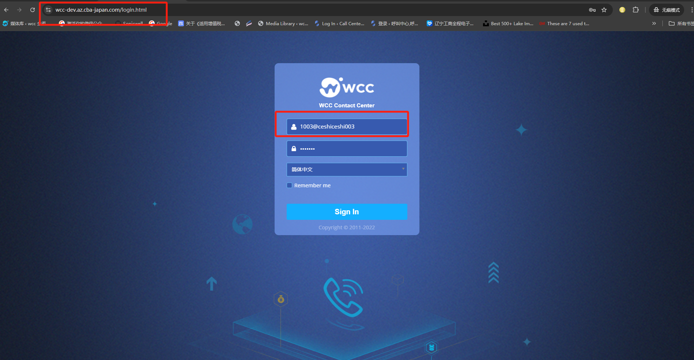

当用户进入系统时，选择左边的下拉选项【登出】，确认后，您将从系统中注销，页面将返回到用户登录页面。

## 2 界面介绍

WCC坐席界面窗口由3个主区域组成，他们分别是：①左侧菜单栏、②上方状态栏、③中间工作区

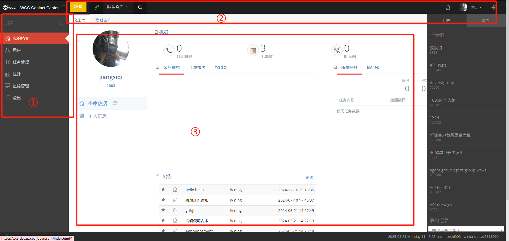 

### 2.1 菜单栏

没有分配角色且没有坐席组长的坐席只有个人统计页面可以查看。

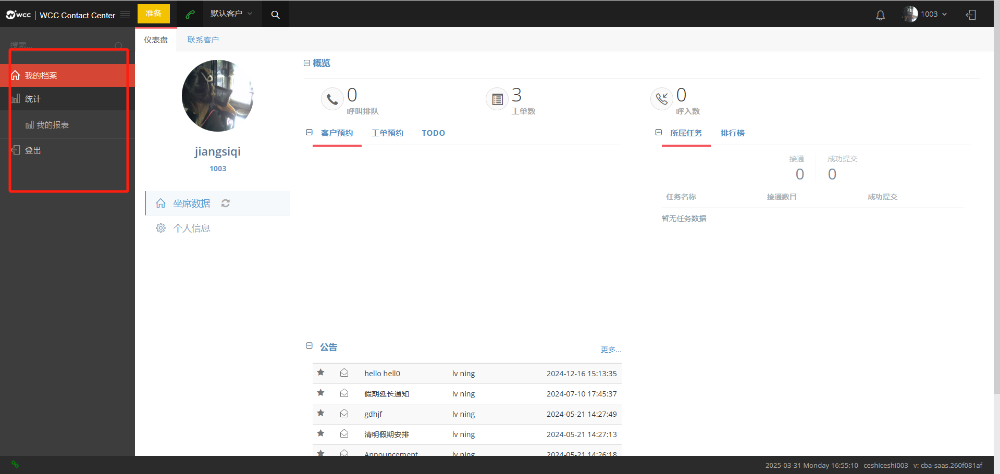 

有坐席组长权限的坐席，可以登录所任组长组中的坐席。

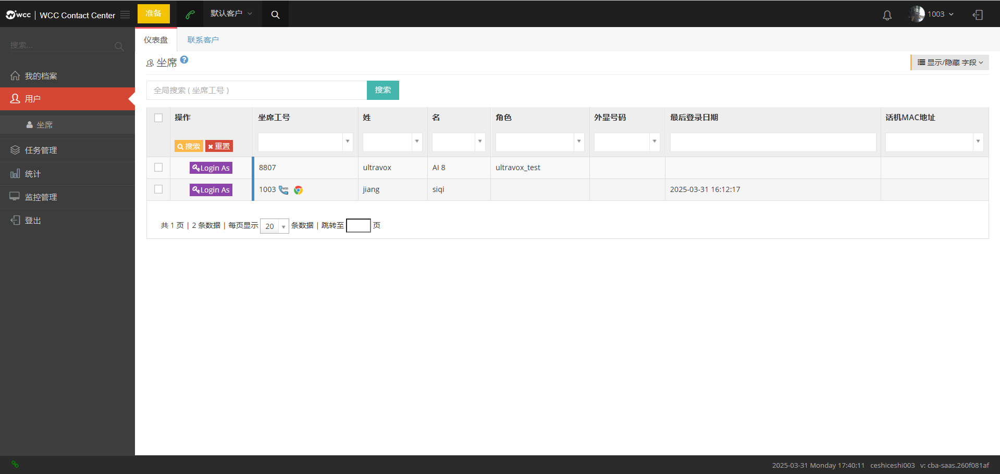

查看所任坐组长组内坐席汇总的统计报告

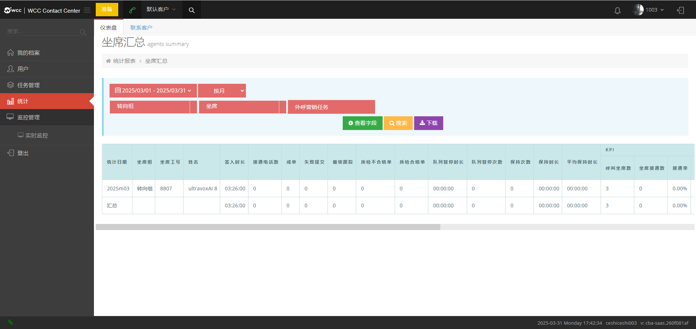   

查看所有坐席的实时监控页面

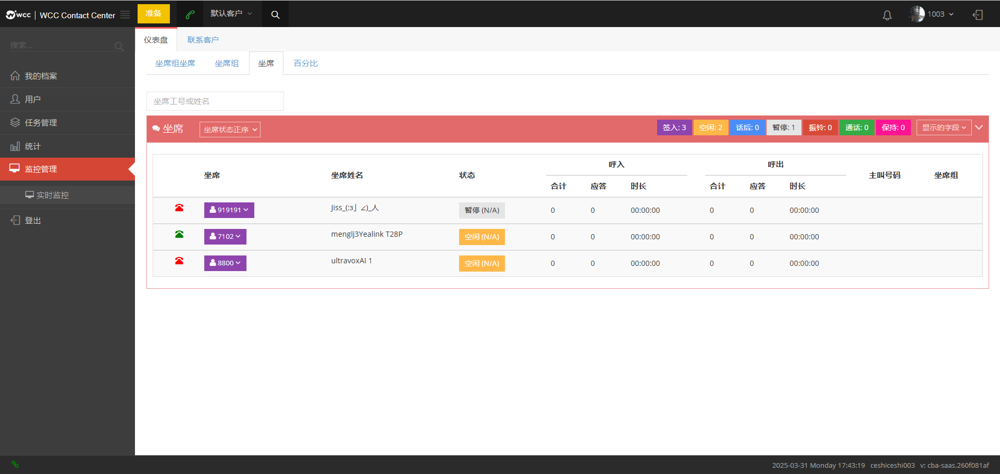

### 2.2 我的档案

用于平时仪表盘及联系客户。坐席登陆后默认显示内容。

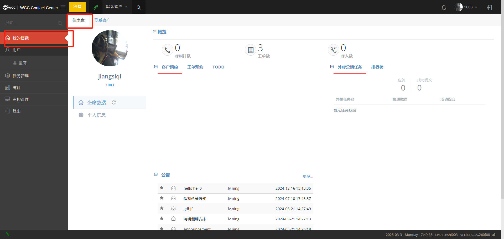

#### 2.2.1 仪表盘

仪表盘中分为坐席数据页面和个人信息页面。

坐席数据：
        
主要包括对通话及工单等的数据概览，客户预约，工单预约，TODO，当前任务以及坐席排行榜。

概览：

可以直观的显示当前坐席的呼叫排队，工单数和呼入数

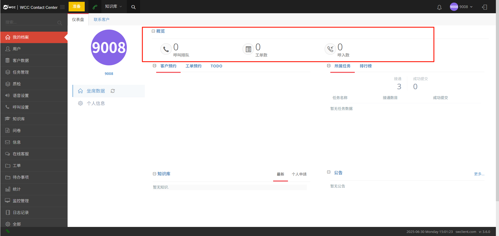

- **呼叫排队**：坐席所属坐席组的实时等待人数。

- **工单数**：显示没有选择处理结果的工单数量，一旦该工单选择了处理结果，代表这个工单已完成就会不显示。是根据工作需要提出的工作记录，工单可以由上级用户（client）建立也可以由坐席直接建立。

- **呼入数**：坐席所属坐席组的实时呼入电话总数

- **客户预约**：显示坐席的所有预约客户   

①②③三个快捷按钮方便坐席对预约客户的信息进行编辑和修改

①重新将此客户分配至新的坐席（只有坐席为坐席组长时显示）

②修改这项预约的日期

③查看客户详情，进入客户弹屏

- **工单预约**：显示预约的工单。坐席可以点击工单，设定一个预约时间，设定好预约时间的工单，则会在此显示。

当即将到达预约时间时系统会自动出现提示若客户页面关闭即将到达预约时间时页面会自动弹出，提示时间范围在【系统偏好】预约提醒时间中可以设置。

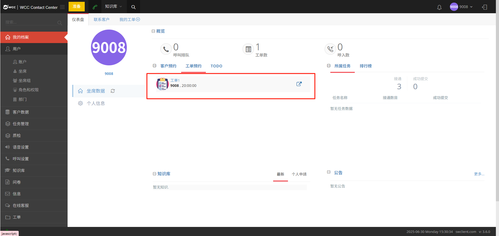

- **TODO**：由上级用户（client）设置的需要该坐席办理的事项发布；或坐席自己点击➕添加的待办事项。

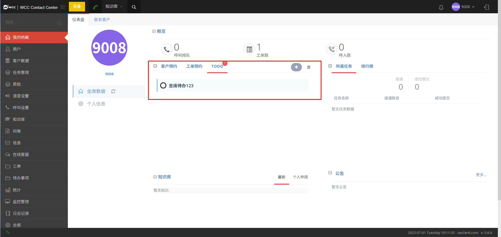

点击右侧箭头，可以对坐席待办事项标题以及坐席待办事项进行编辑和修改。

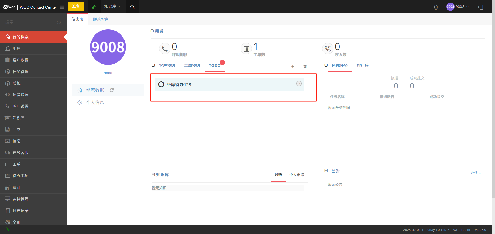

【编辑】页面（如下图）

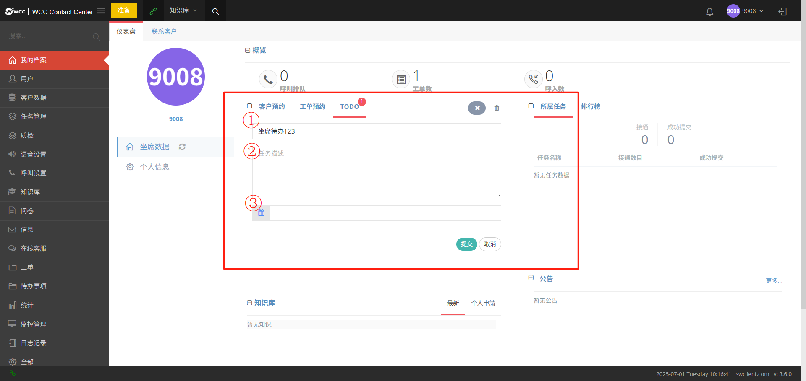

①**任务标题**：坐席待办事项标题。

②**任务描述**：该坐席待办需要特殊注意或说明的描述。

③**预约时间**：这个待办的预约时间，会在坐席的仪表盘页面显示。

坐席可以对该待办事项的状态进行更改  

坐席建立的待办，如果被坐席标记成完成，则在坐席待办页面中的状态也会被更改  

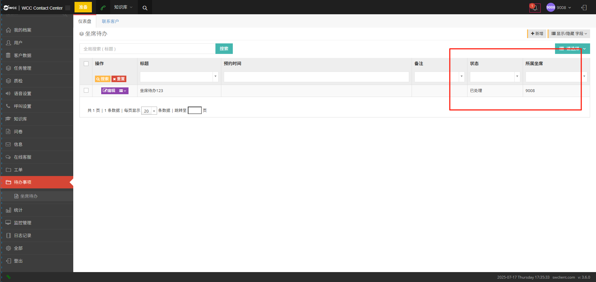

（上图此为client/有坐席代办角色权限的坐席，页面显示状态）

- **所属任务**：显示当前坐席当天所执行的所有任务名称，接通数目和成功提交数。

坐席在任务中进行呼叫或是呼入时绑定任务的通话才会显示在任务名称中。接通数目是当前座席与客户成功建立通话数不在任务中的通话也会被计入。成功提交数是座席不管是否成功通话，保存销售漏斗为成功的数量。

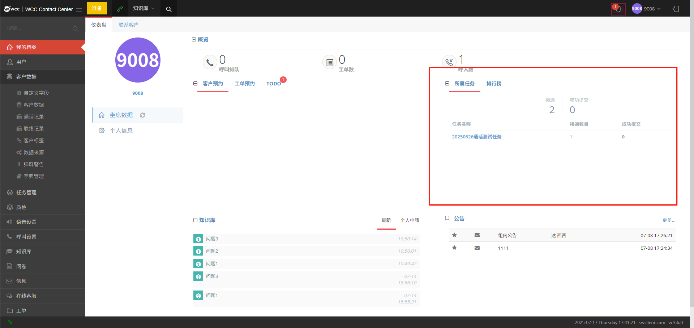

- **排行榜**：当前坐席所在任务的所属坐席组中，坐席成功提交的排行。坐席只要有过成功提交的动作就会计算，可以重复提交。（如下图）

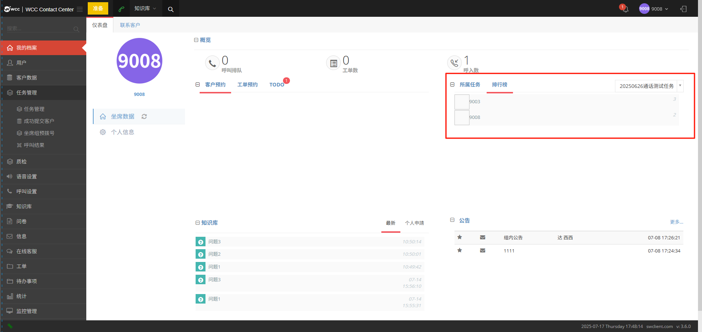

个人信息:

包括头像和坐席简介（如下图） 

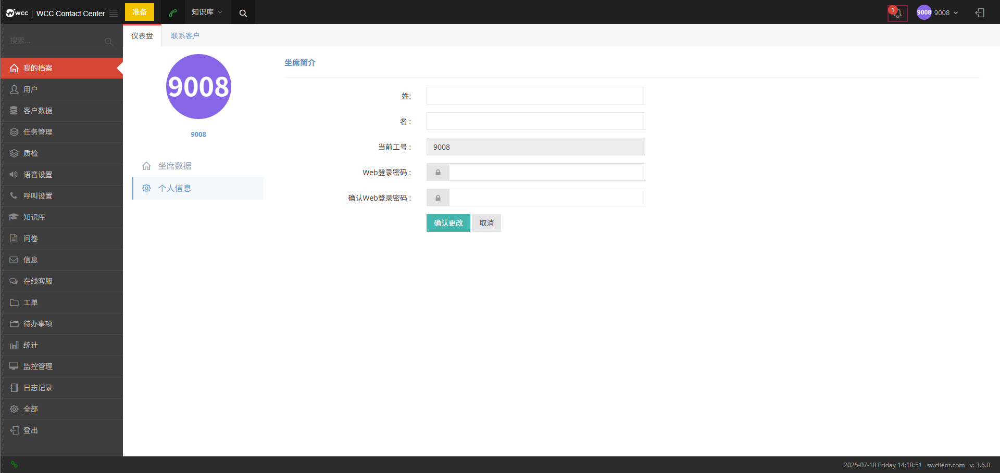

 **头像**：点击左上角头像位置进入设置头像界面 

从电脑中选择一张JPG格式的照片或将JPG格式的照片拖拽到照片上传位置(大小在 1mb 以内)，然后点击设置头像；  

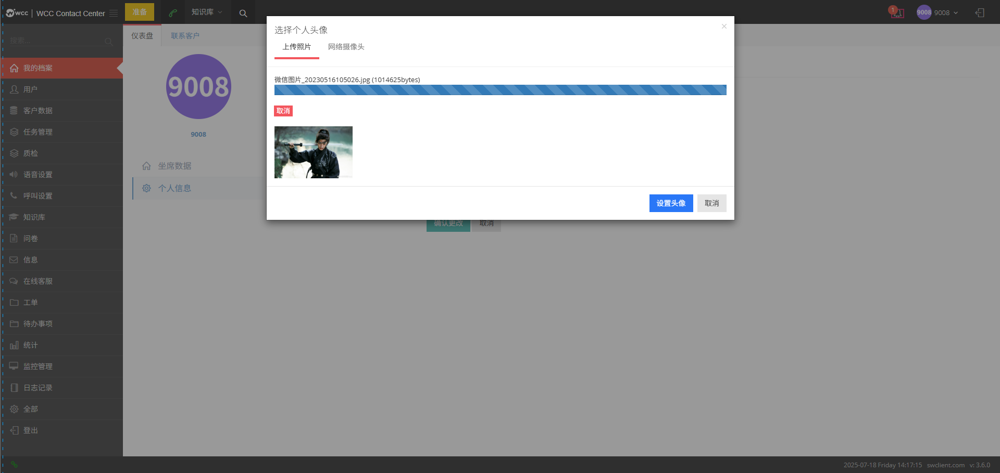

也可以点击网络摄像头，打开摄像头点击拍照，点击设置头像，头像设置完成。

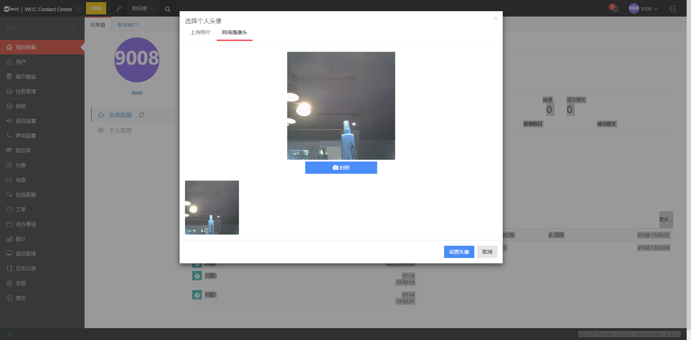

**坐席简介**：包括姓/名/当前工号/Web登录密码（登陆座席系统密码）/确认Web登录密码

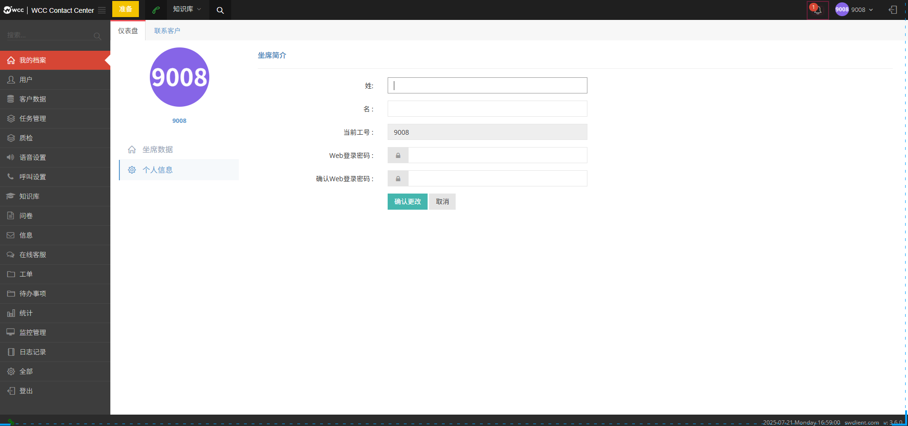

- **姓**：填写坐席姓氏

- **名**：填写坐席名字

- **当前工号**：当前页面坐席工号是唯一的，文本框为置灰状态为不可以修改

- **Web登录密码**：当座席需要通过网页登陆时，需要使用此密码，坐席也可自行修改设置该密码

- **确认Web登录密码**：再次输入密码，保证与【Web登录密码】一致

#### 联系客户 

在联系客户页面，通常会有三个选择分类如图所示

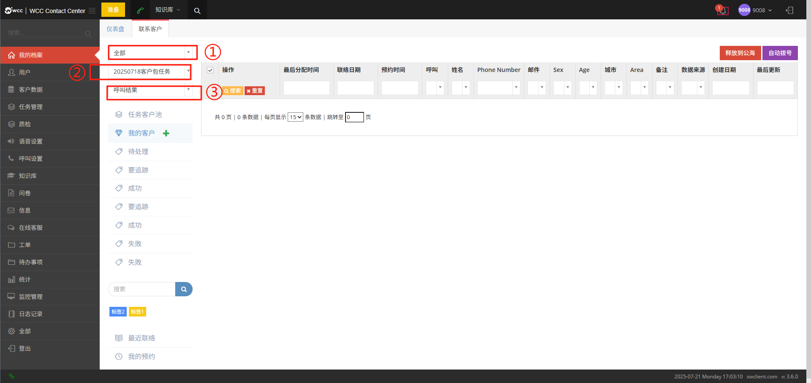

①---如果这个client中有多个客户包，①处可以选择一个客户包

②---选择客户包后，②里显示的是这个客户包下的任务

③---选择任务后，③中显示的是这任务下所绑定的呼叫结果

**呼叫结果**：

是座席呼叫客户联络记录选择的通话结果，用于通话结果的分类。（如下图）

方便坐席通过呼叫结果进行查找客户。呼叫结果类型选择由更高级别用户创建，坐席可根据可选结果酌情选择,此处显示的呼叫结果为全部呼叫结果。

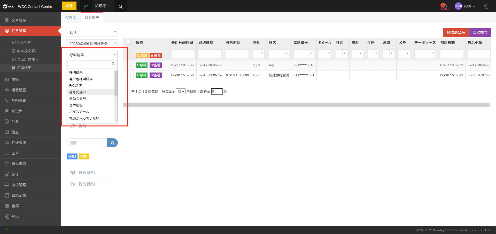

**任务客户池**：

显示坐席所选任务中的所有客户数据，坐席可以在任务中对客户数据进行处理。

选择【抢】或者【换一批】】可以把当前页的客户数据分配到自己的客户下。

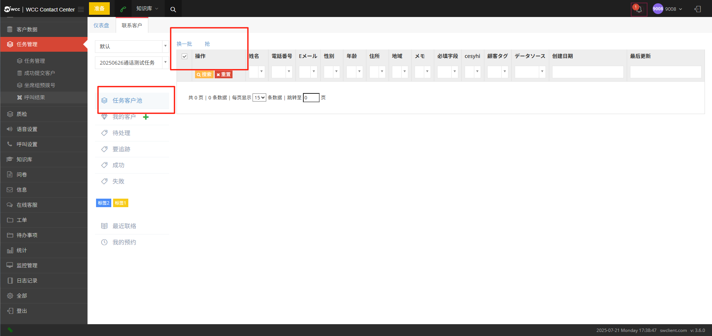

**我的客户**：

通过选择左上角的任务查看当前座席在【任务客户池】抢到的客户和自己额外添加的客户。

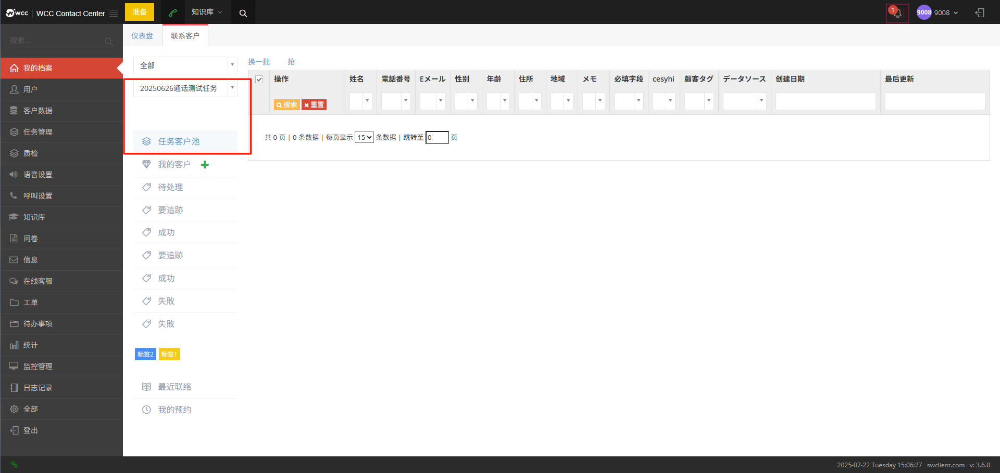

【客户的归属】

此时【我的客户➕】中的所有客户信息都属于当前坐席。
 
若客户C在坐席A列表中，坐席B拨打了客户C电话，并成功提交，客户C依然属于坐席A，转接同样适用。若客户C与坐席A在同一个项目时（前提坐席A先于客户C进入该项目），客户C始终属于坐席A。

若上级用户将客户C分配给新项目，而坐席A并没有参与新项目，那么客户C将会重新分配给其他坐席B，坐席A的客户列表里也不会出现客户C的信息，之后将坐席A重新添加到新项目，客户C依然属于坐席B。

【客户的归属改变包括两种】

a.客户从未分配状态分配到任务

b.客户由任务A分配到任务B

坐席可以通过点击【我的客户➕】的➕，自己额外添加客户

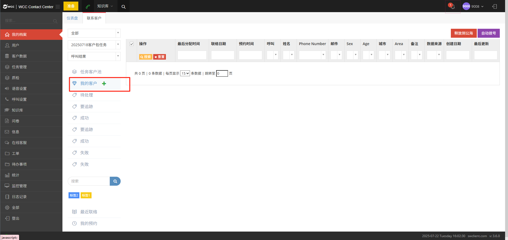

坐席对新增客户资料进行编辑，记录及预约

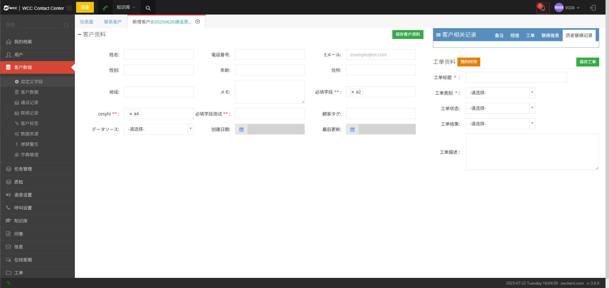

【客户资料】中的【取引先名】会在该客户的弹屏标签中显示；

客户的联系方式必须填写在【电话番号】中，坐席和坐席组长可以在【电话番号】的下拉列表中设置禁呼和加入黑名单，由client级别或是有授权的坐席组长进行审核。在审核过程中，该号码可以正常拨打，审核通过后，则该号码不能再拨打。

其中带有“✳”号项目为必填项目。编辑完成点击【保存客户资料】，完成对额外新增客户的添加。如下图

座席可以点击【我的客户】操作列下的【呼叫】进行呼叫

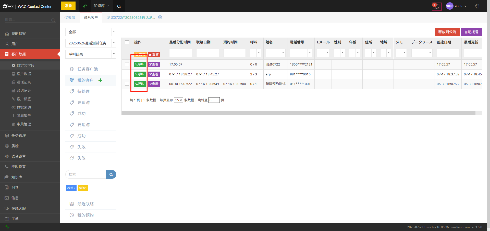

此时页面弹出弹屏标签：座席可以查看修改客户的详细资料、可以保存本次的联络信息、可以查看当前客户的历史联络记录、可以对客户进行预约.

【弹屏标签显示规则】未知@项目名，

① 默认为 新增客户

② 取客户第一个姓名字段对应的值

③ 如果没有 2，取客户第二个字段电话号码对应的值

若客户弹屏上 ①②③④ 都不满足，则显示未知@项目名

座席可以查看修改客户的详细资料；可以保存本次的联络信息，查看当前客户的历史联络记录；可以对客户进行预约，建立客户工单资料。

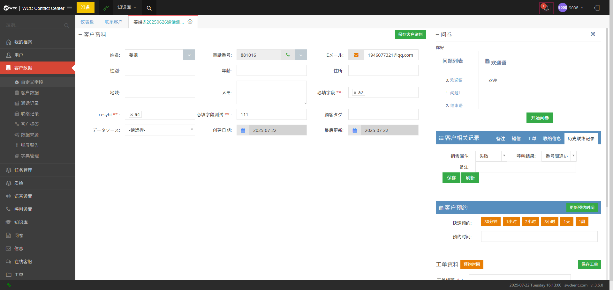

客户相关记录：包括备注、短信、工单、联络信息、历史联络记录。其中历史联络记录是坐席主要工作页面。

备注：坐席可以在此给客户进行备注，备注分为【普通】、【置顶】和【弹屏警告】（如下图）

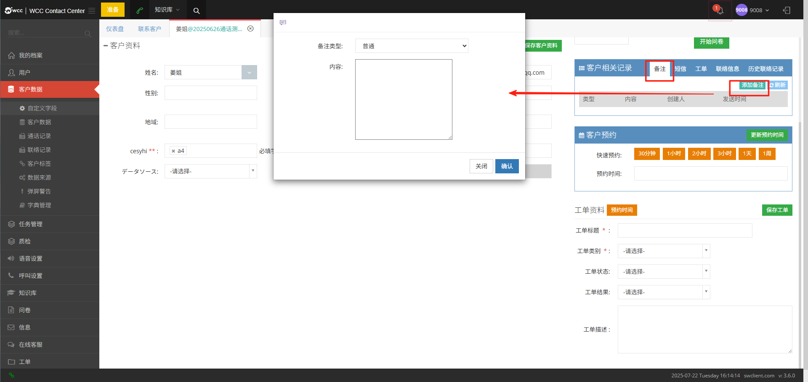

【普通】普通的备注

【置顶】置顶显示该条备注

【弹屏警告】设置弹屏警告，需要上级用户或有审核权限的坐席审核成功后才可以生效。生效后，坐席查看该客户资料，拨打该客户电话或者接听该客户电话时就会收到该条弹屏警告。（关于审核流程，到Client手册查看）如下图：

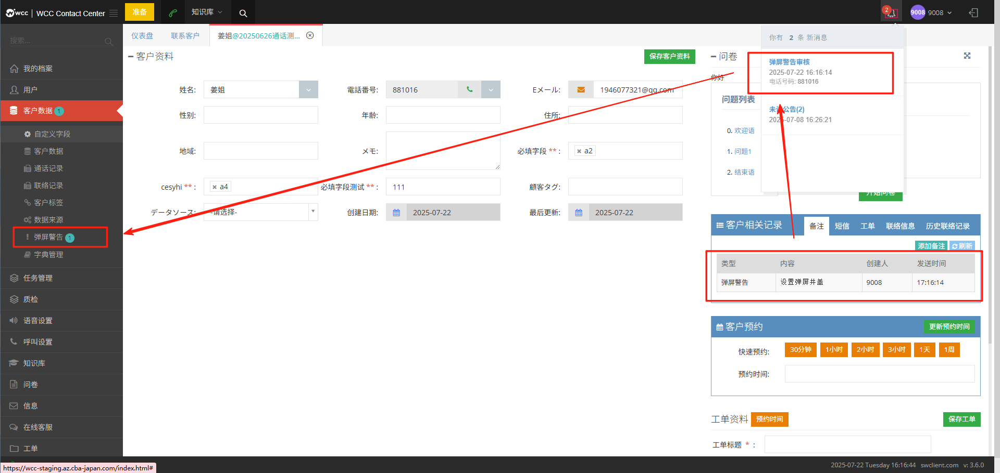

**短信**：显示发送给该客户短信的详细内容（如下图）

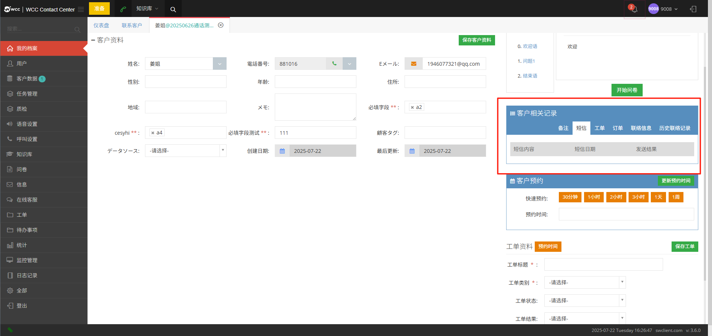

**工单**：对当前客户所建立过的工单进行查看（如下图）

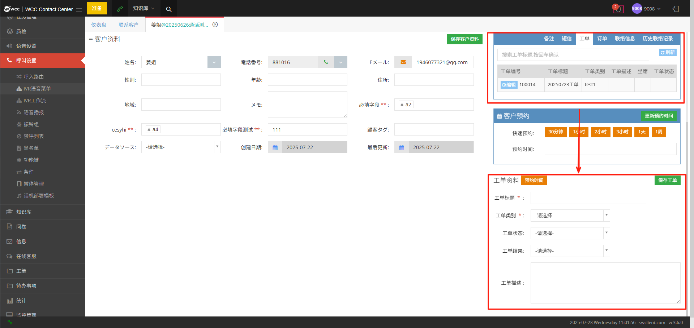

坐席建立工单的基本流程：  

①坐席在保存客户资料后会弹出工单资料的功能区  

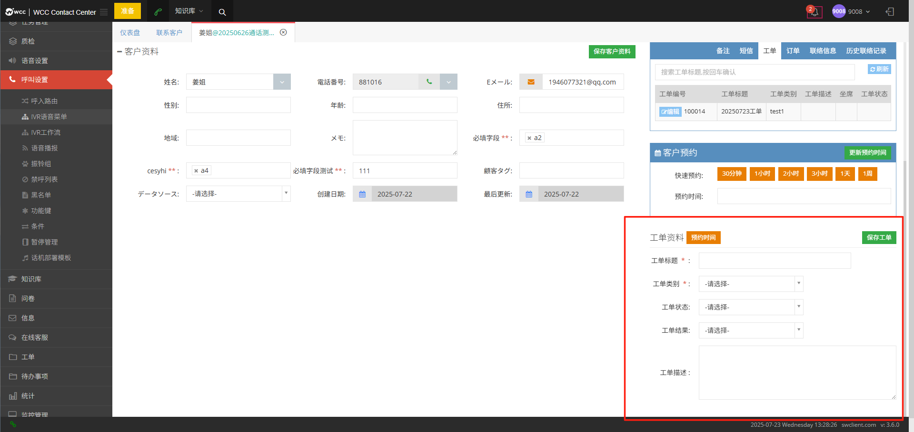  

②坐席在工单资料页面可以

填写工单标题-->选择工单类别-->选择工单状态-->选择工单结果-->填写工单描述-->保存工单

保存后的工单点击工单-->编辑可以查看

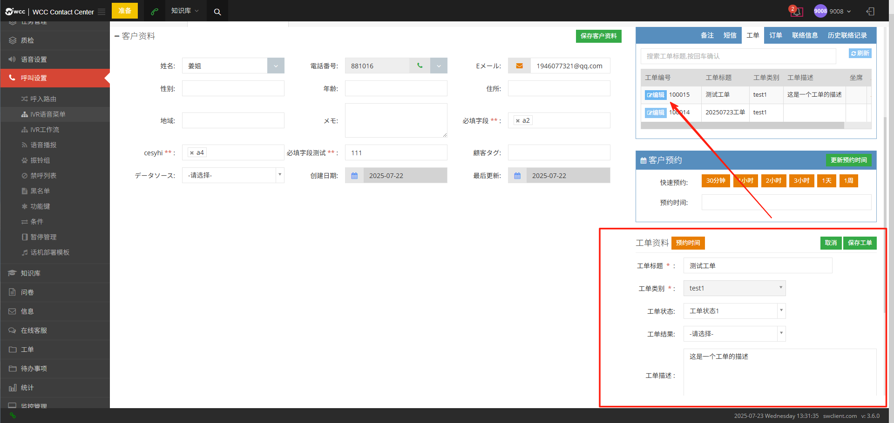

③查看工单时，可以点击【预约时间】对工单进行预约  

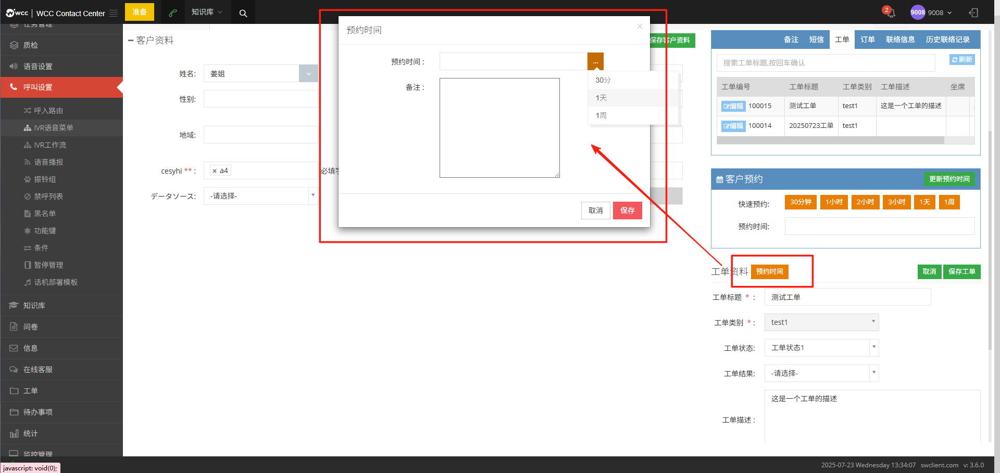

工单的预约可以有快速预约的时间选择(30分、1天、1周)，坐席也可以自定义工单的预约时间  

④保存预约后，工单预约会显示在仪表盘中，如图所示  

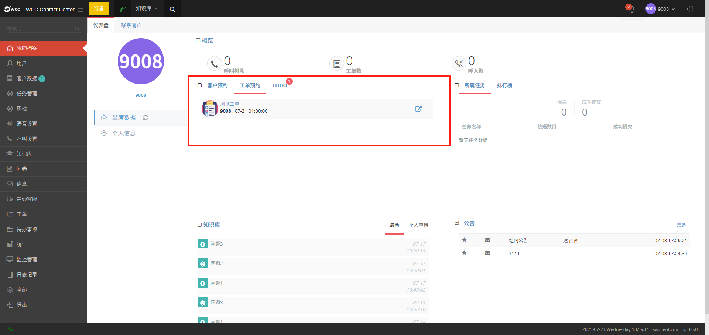          

⑤在客户弹屏的工单相关记录功能区中，可以查看工单的修改记录

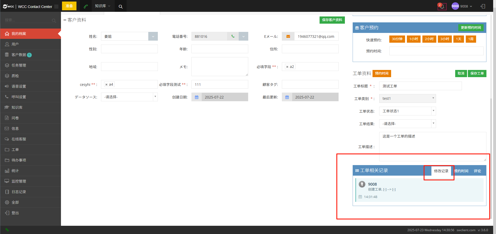 

在预约时间中，可以删除工单预约,在仪表盘页面不会显示  

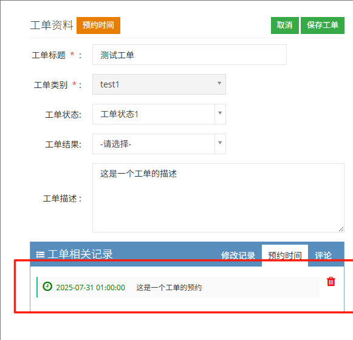 

坐席还可以对工单进行评论，所有坐席的评论会显示在工单的评论中  

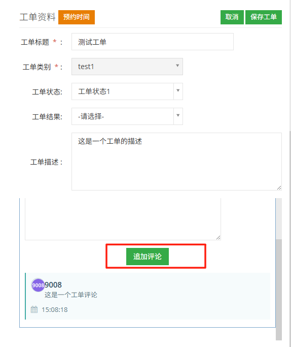 

**订单**：坐席可以在订单页面增加一个客户所属的订单

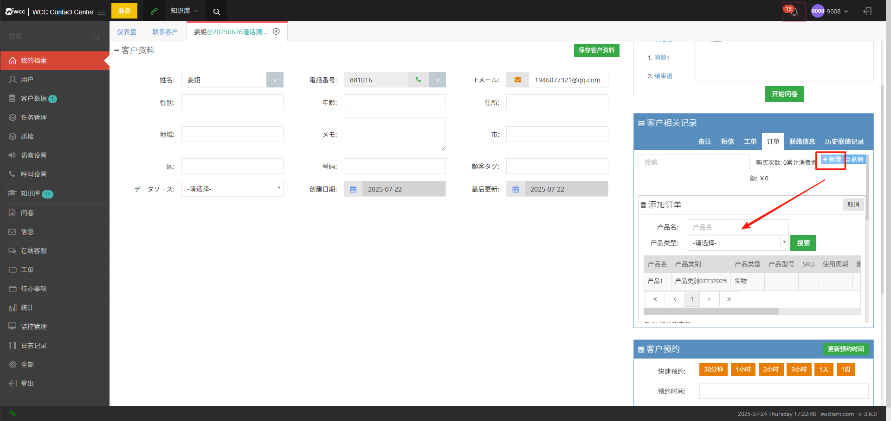

添加订单：

①添加产品名称，选择产品类型，选择订购

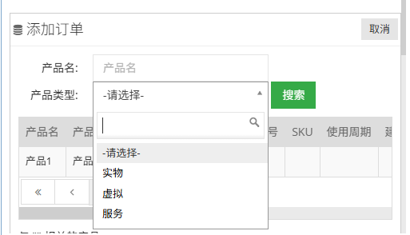 

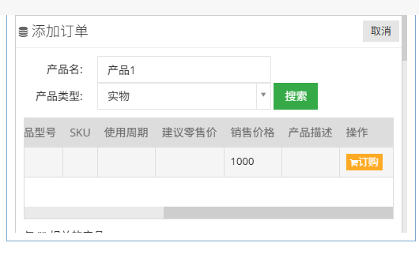 

②填写发货单号、快递单号、联络人、电话号码、地址等信息完善订单信息  

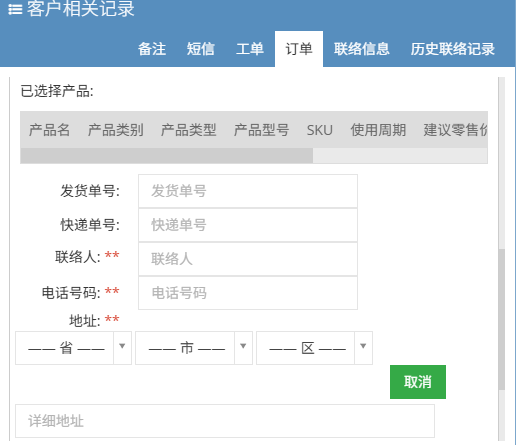

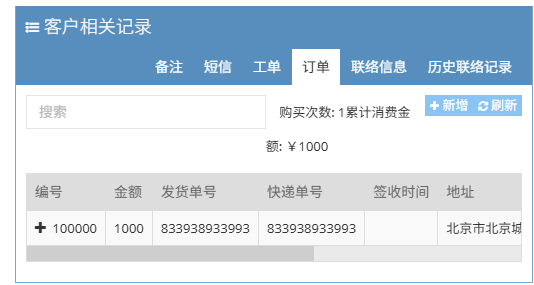

**联络信息**：相当于一个关联通讯录，可以添加客户的亲属信息（如下图）

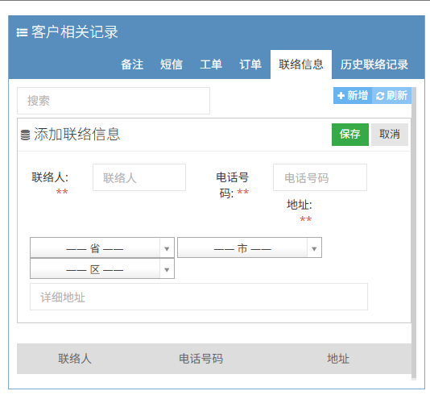

**历史联络记录**：主要包括销售漏斗、呼叫结果、备注，如果之前已经对客户进行过沟通，则会显示该客户以往保存的联络记录（如下图）

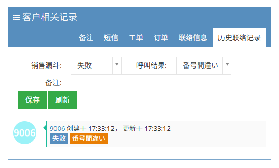
 
联络记录默认显示，可以由拥有任务管理权限的管理员进行修改。默认联络记录是自动加载，当选择手动时，需要点击刷新才能加载出历史联络记录。

预拨号/双呼接通时，会自动生成一条联络记录,其余通话需要坐席手动保存后生成新的联络记录

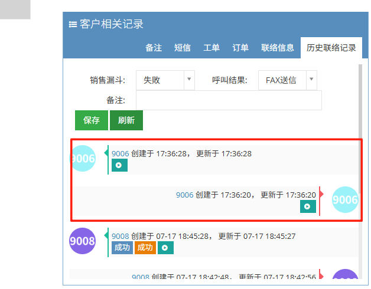

联络记录中的录音，可以点击播放

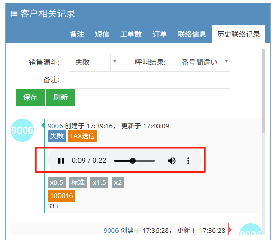

当坐席在保存联络记录时，在弹屏页面未关闭的情况下，还保存过一个工单，那么这个工单就会显示在该条提交中。

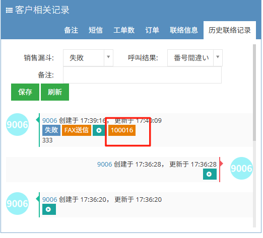

**销售漏斗**：用于标记座席记录客户的通话状态情况，销售漏斗页面如下图，销售漏斗默认有三种：成功/失败/跟踪

**呼叫结果**：是座席呼叫客户联络记录选择的通话结果，用于通话结果的分类。呼叫结果和销售漏斗互相绑定的关系。

设置呼叫结果的流程

在client级别新增呼叫结果页面新增，并绑定一个销售漏斗，选择一个呼叫结果的通话状态，通常分为三类，无/应答/未应答。无则为在通话状态中都会显示这个呼叫结果。

应答则是在应答状态下才会显示这个呼叫结果。未应答则是在通话被应答时不会出现这个呼叫结果。（注：坐席端有呼叫结果页面，但是不能将呼叫结果应用到任务。

**客户预约**：客户预约有快速预约和指定的时间预约两种方式

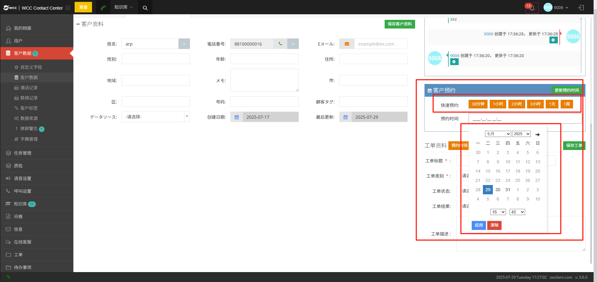

快速预约可以通过点击黄色快速预约的时间，预约时间会根据选择的快速预约时间自动更新保存。

当预约未到时间，坐席需要修改时间，修改时间即为重新预约，并不是时间累加。

指定时间预约通过选择预约时间的文本，下拉具体时间，然后根据需要选择指定的日期和时间点击【应用】，然后再选择【更新预约时间】即可成功保存。保存后可以在仪表盘页面查看。

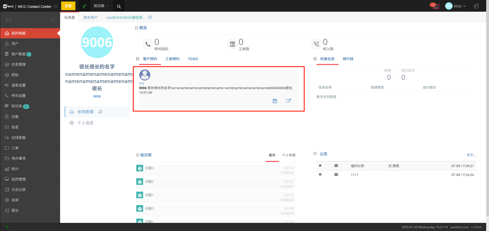

**工单资料**：

- 预约时间：给未处理的工单，设定一个完成时间。设定预约时间的工单，会在仪表盘的【工单预约】中显示。只有已存在的工单才能进行预约。

- 工单标题：给创建的工单命名

- 工单类别：选择一个工单类别

- 工单状态：选择一个工单状态

- 工单结果：选择一个工单结果

- 工单描述：对建立的工单进行详细描述


座席可以点击【我的客户➕】操作列下的【查看】，查看客户的详细信息。


**问卷**:问卷是坐席与客户通话时坐席根据问卷内容对客户进行问卷调查,问卷需要在任务管理---话术中进行设置。问卷的答案，可以由client用户在问卷答案中进行导出。


**待处理**：列表中的客户数据是【我的客户➕】数据中未保存过联络记录的客户数据


**要追跡/成功/失败**：选择客户包时会显示相应客户包所对应选择了这个销售漏斗的客户数据。不选择客户包，默认显示全部客户包的销售漏斗。


**客户标签**：
由上级用户建立，坐席可以通过点击标签，对客户进行快速筛选


**最近联络**：是坐席最近一个月联系的客户记录信息,包括客户名称、通话开始时间、通话结束时间、通话时长、挂断原因、所属任务等信息。


**我的预约**：包括今日预约和所有预约，默认显示今日预约，显示当天坐席预约的客户记录信息。点击所有预约可以查看当前坐席所有预约。


**释放到公海**：坐席可以在【我的客户➕】将自己选择的客户释放到任务客户池中


**自动拨号**：坐席可以对列表中的客户进行自动拨打。点击自动拨号会显示坐席需要自动拨号的客户所满足的条件：

拨号次数：坐席可以根据客户所拨号的次数的数值进行筛选所要拨打的客户号码。

上次联络信息：坐席可以根据客户上次联络的时间界定所要拨打的客户号码。

点击确定即进入按该条件执行的自动拨号：


当坐席使用自动拨号模式时有以下控制键可以对自动拨号进行控制：

 

- 倒计时：当坐席完成一个通话时，系统将开始倒计时 ，倒计时结束后系统将拨打下一个号码。

- 延迟：坐席可以点击延迟按钮获得更多的时间。

- 暂停：暂停自动拨号。

- 开始：是暂停的相反工作，表示继续自动拨号。

### 2.3 状态栏

#### 2.3.1 状态：

坐席默认登录时显示的状态都是【准备】，这个状态是坐席默认的空闲状态。

 

当坐席有事需要离开时，可以选择暂停，此时这个坐席的状态显示为【暂停】

 

当有队列通话呼入，坐席接通挂断后，如果任务中设置了进入话后，则坐席状态会变成【话后】状态。

 

#### 2.3.2 通话 ( webrtc ) ：

系统自带webrtc话机，在右上角打开webrtc按钮  


注册好的话机，在鼠标放置于通话按钮上时会弹出注册信息  


坐席使用webrtc的拨号盘进行拨号，拨号盘上有静音以及声音调节按钮  


表头图标可以切换页面，切换至通话记录页面，可以查看使用webrtc的最近通话记录  


也可以使用webrtc的自带联系人设置，添加联系人姓名  


在设置页面，可以设置自动应答，即当有通话呼入到该坐席，坐席使用的webrtc可以直接接通这个通话。

还可以设置挂机忙音，当坐席开启了挂机忙音，当坐席通话时对方挂断了通话，则会出现 " dududu " 的声音提示通话被挂断。  

  

当坐席输入号码进行拨号呼入对方未接通时，会显示振铃。

  

接通后状态中会显示通话的号码，保持，以及挂断键  

  

点击保持，坐席依然保持在通话状态，客户端会播放一段音乐，点击恢复，会回到通话状态  

  

在通话期间，如果在图示框中输入号码点击回车，或是点击绿色通话按钮，通话会被盲转至图示框中所输入的号码处。

  

#### 2.3.3 知识库/默认客户包 ：

在坐席登录页面，功能菜单处，还可以选择点击快捷搜索区，知识库或是客户包客户数据。

  

选择知识库时，坐席可以搜索知识，支持搜索文件名以及问题名。只有用鼠标点击的知识，才会在搜索记录冲出现  

  

点击【查看知识库主页】进入【知识库】主页

 

【添加知识】（如下图）


- 问题：输入需要解答的问题内容。

- 关键字：用户可以输入帮助坐席在使用知识库时搜索的关键字，可以添加多个，enter键输入。

- 分类至：用户可以将该知识库信息分类到多个知识库中。

- 回答：该问题的答案。

- 有效期至：创建者可以对该知识库的有效期限进行定义，超过有效期该知识不会被搜索到。

点击【提交】，由上级用户进行审核，坐席可以通过【我的提交】查看审核状态。


【知识列表】显示当前知识库的全部内容

【我的提交】显示坐席提交的所有内容及审核状态

选择搜索客户数据时，只支持坐席使用完整号码进行搜索  

  

#### 2.3.4 消息通知 ：

坐席右上角会显示一些审核内容提示通知，例如弹屏审核，dnd审核，以及知识库审核等。


坐席点击聊天按钮，可以进入聊天界面。进入聊天界面有【用户】和【联系】两个通讯录可以选择。

默认界面是【用户】界面。坐席在【用户】页面可以看到坐席所属坐席组的聊天组群，还可以在通讯记录中搜索聊天对象，或是查看聊天记录


点击进入坐席组聊天页面，坐席组长会在右上角有一个铃铛图标，点击这个图标，坐席组长可以发送组内推送消息。


推送消息分为两种：

- 固定信息：该信息会一直滚动出现，只有坐席组长选择推送消息中的清除，该固定消息被清除。


固定消息设置成功会在如图所示的位置显示，只有该组内坐席可以收到。


只有坐席组长可以在推送消息中，点击【清除】清除这个固定消息。


- 临时信息: 坐席组长还可以发送【临时消息】该消息默认持续时间为30秒，30秒后自动关闭。临时消息只有在线坐席可以接收到。


#### 2.3.5 坐席组签入 ：

- 坐席组：显示坐席用户所在的所有坐席组，可根据当前状况勾选☑是否【签入】到其中一个或多个坐席组，【签入】在坐席登录状态，默认显示。

下图为例:坐席【签入】坐席组。坐席签入一个坐席组则表示该坐席准备好从该坐席组中接收呼叫。


- 签出: 表示该坐席不再从签出的所有坐席组接收呼叫。


- 我的公告： 有【我的公告】权限的坐席或是client，可以向坐席发布公告，公告会显示在仪表盘的公告栏中，坐席也可以由弹窗中【我的公告】进入查看。


## 3 MicroSIP话机使用手册

### 3.1 登录

双击MiroSIP，打开话机，点击下拉按钮，选择【添加账户】，填写相关信息（如下图）：


- Sip服务器：填写系统登录的url网址+端口号（此地址与web登录地址一致，但若opensips和web不在一个服务器上时，此地址与web登录地址）

- Sip代理：填写系统登录的url网址+端口号

- 用户名：坐席工号

- 登录名：坐席工号

- 密码：系统中坐席编辑中SIP分机注册密码

点击保存,显示话机在线

### 3.2 拨号盘

包括拨号框，按键和功能键，话机登陆后，默认显示该页面


- 拨号框：显示拨打号码，点击右侧下拉按钮，查看以往拨号记录

- 按键区：直接输入客户号码，进行呼叫

- R：重播键，对上次播出的号码进行重播；使用按键拨号时，此键显示为【后退】，可以对拨号框内号码进行逐个删除

- ➕ ：代表国际长途接入码,代表地区跨地域拨打电话

- C：将拨号框的内容全部删除

- 视频通话键：输入号码后，自动亮起，点击给客户拨打视频电话；电话接通后，此键显示为保持状态，点击则暂停通话，客户会在系统中听等待音乐，坐席与客户保持通话状态

- 呼叫键：在输入号码后会由灰色变为绿色

- 呼叫记录：输入号码后，显示亮起，点击可以查看该号码的当前通话信息，对此通话用户进行备注；也可以在此页面进行【呼叫】和【视频呼叫】；【最后通话】查询最后通话详情；【关闭所有】则删除所有内容，重新拨号打开该页面，则没有以往记录。如下图：

 

- 听筒：直接点击图标，控制听筒的关闭和开启；右侧滑轨用来控制听筒的音量

- 话筒：直接点击图标，控制听筒的关闭和开启；右侧滑轨用来控制话筒的音量


- DND:请勿打扰，此时无法呼入电话，但可以呼出


- AA:自动应答，对于呼入的电话，进行自动接听


### 3.3 呼叫记录 

显示所有通话和通话状态，双击鼠标左键，可快速拨号；鼠标右键可以对客户进行重新呼叫、视频呼叫、信息、添加联系人、复制、删除、导出（如下图）


- 信息：唤出当前客户的呼叫记录

- 添加联系人：对要添加的客户信息进行编辑，点击【确认】保存，保存的客户信息在【联系人】中查看

- 复制：复制所选客户号码

- 删除：删除所选通话记录

- 导出：将所有通话记录以文件的形式保存到指定位置

- 搜索：快速查找通话记录

### 3.4 联系人

已添加的的联系人列表，双击鼠标左键，可快速拨号；右键可以对联系人进行呼叫、视频呼叫、信息、添加、编辑、复制、删除、导入、导出。如下图：

- 信息：唤出当前客户的呼叫记录

- 添加：重新添加客户信息，对客户进行加星编辑

- 编辑：对原有客户信息进行修改，对客户进行加星编辑（如下图）


- 复制：复制客户号码

- 删除：将客户信息从联系人列表删除

- 导入：将已有客户信息添加到联系人列表中

- 导出：将所有客户信息以文件的形式保存到指定位置

- 搜索：快速查找目标客户

### 3.5 关于转接

转接分为盲转和咨询转两种类型，坐席通过下拉列表设置中【通话模式（务会议功能）】进行设置。（如下图）


勾选【通话模式（无会议功能）】，转接功能为盲转状态:

当坐席A有呼入电话，需要转接到坐席B，要在应答之后，点击转接按钮，出现呼叫转移小键盘，输入坐席B的号码，点击确认，进行转接；

若刚好B坐席处于忙线状态则系统会直接挂断电话。（ 如下图 ）


取消勾选【通话模式（无会议功能）】，转接功能为咨询转状态:

当坐席A有呼入电话，需要转接到坐席B，应答后，在键盘中输入坐席B的号码，进行呼叫，客户会在系统中听等待音乐（如下图）


坐席B接通后，点击【转移】——【坐席呼转】，客户的通话被转接到1002坐席B，建立通话后，坐席A电话挂断（如下图）


坐席B为忙或无法接听而拒绝接听客户电话，坐席可将继续重复上述操作将通话转接至能够接听方，若转接不成功，该通话最终回到原坐席A处；

转接过程中，坐席A点击客户的通话界面，则通话回到原坐席A处。（如下图）


## 4 物理话机使用手册

### 4.1 注册

点击话机【菜单】进入主菜单（如下图）

选择【基础设置】（如下图）

选择【无线网络】，点击右键，将【无线网络 关闭】设置成【无线网络 开启】（如下图）

选择【可用Wi-Fi网络】，选择要连的网络，点击【连接】，输入密码后保存（如下图）

在主菜单页面选择【状态】，选择IPV4，查看IP（如下图）

打开浏览器输入IP：192.168.31.68进入话机注册页面

输入用户名，密码，点击登录（说明书默认账号，密码均为admin)如下图：


一台话机可以登录两个号码，登陆后选择【ToIP】，在【账号1】和【账号2】下填写注册内容（如下图）


将【基本设置】中的【账号使能】点击成【开启】


【用户信息】中【显示名称】可以随意设置

若注册号码为外线 ：


【认证名称】和【注册账号】均为要注册的外线号码

【密码】提前设定好的密码

【注册服务器】：freepbx14.cbacloud.net

【注册服务器端口】和【代理服务器端口】均为：5080

若注册号码为内线：


【认证名称】和【注册账号】均为坐席号码（如上图），【密码】对应sip分机注册密码（如下图）


【注册服务器】对应Client名；【代理服务器】为：wcc1-dev-rakuten.az.cba-japan.com；【注册服务器端口】和【代理服务器端口】均为：6060（如下图）


### 4.2 转接

#### 4.2.1 盲转

通话过程中，在话机上点击【转接】（如下图）

输入转接坐席B的坐席工号，再点击【盲转】，盲转成功，操作完成。（如下图）

#### 4.2.2 咨询转

通话过程中，在话机上点击【转接】（如下图）

坐席A和转接坐席B建立通话后，坐席A点击【转接】，咨询转成功，操作完成。（如下图）

#### 4.2.3 驻留

通话过程中，在话机上点击【转接】（如下图）

输入驻留号码（系统默认为“700”，可在功能键页面更改），点击【发送】，话机会有提示音，提示“驻留成功，取回号码为701”，其他坐席可直接输入驻留号码取回驻留的客户。（如下图）

## 5 rectel

### 5.1 注册

填写话机名和SIP注册密码（如下图）


点击登录页面的Login，在填写域名，点Next（如下图）


点skip（如下图）


运行完继续点Skip（如下图）


点击YES（如下图）


点击创建账户（如下图）


点击红框位置编辑这个账号（如下图）


勾选【Use outbound proxy】，填写服务器网址（如下图）


点击Register，在点yes（如下图）


注册成功（如下图）


### 5.2 转接操作

坐席可以在搜索框或软键盘中，直接输入号码，输入号码后点击电话图标或键盘上的Enter键，若用软键盘输入，也可点击【Dial]】，对客户进行呼叫（如下图）


Contacts:显示联系人列表，打开联系人列表，可以点击星号标将联系人添加到【Favorites】列表中，也可以对客户进行编辑。（如下图）\


Recent:显示最近联系记录（如下图）

## 6 agephone

### 6.1 登录

双击【agephone】软件，会进入到登录页面  

  
在【シリアル番号】中填入16位秘钥，点击【ok】  
  
    
  
在拨号盘页面点击【设置】，到注册信息页面
  
 

### 6.2 注册  

填写注册信息  
  
   
  
**Server Information**  
  
·SIP Domain：填写client域名。  
  
·SIP Proxy：填写代理服务器+端口号。  
  
·Registrar：填写client域名。  
  
【Backup Sever】填写与上述信息相同  
  
     
  
**Account Information**  
  
·User ID：填写坐席工号。  
  
·Display Name：可以填写坐席工号，也可以填写坐席姓名。  
  
·Auth ID：填写坐席工号。  
  
·Password：填写坐席SIP分机注册密码。  
  
**SIP Setting**  
  
·TransportType：这里可以切换UDP、TLS、TCP等模式  
  
    
  
点击【Global】进入到通用设置页面  
  
    
  
在该页面可以开启SRTP功能，设置好后点击【ok】，所有信息设置完毕后，点击【ok】完成话机的注册。  

### 6.3  添加多个电话 
  
该电话支持注册多个sip电话，可以点击【New】进行注册，填写格式为：坐席工号@clent域名。 
  
      
  
点击【ok】会切换到基础设置页面，可以按照上述（注册信息操作）进行注册。注册好的电话之间可以进行切换。  
  
 
    
### 6.4 转接操作  
  
坐席可以使用键盘或拨号盘，直接输入号码，输入号码后点击电话图标或键盘上的Enter键，对客户进行呼叫（如下图）  
  
   
  
可以调节振铃音，听筒音量和麦克风音量  
  
   
  
通话中可以点击【hold】按钮进行保持
  
  
  
可以设置快捷键，设置完成后，免去拨号，点击按钮自动拨打对应号码  
 
 
  
·Name：设置被叫号码名字  
  
·Number to dial：设置被叫号码