## 1 系统登录与退出

#### 一 登录流程

打开浏览器，在地址栏输入系统 URL（如：wcc-dev.az.cba-japan.com/login.html），按下 Enter 键进入登录页面。

账号格式为「工号 @client 名」（示例：1003@ceshiceshi003），密码由 client 提前预设。

输入正确的账号和密码后，勾选【进行人机身份验证】，完成验证后点击【登录】即可进入系统。

可选操作：勾选【记住密码】，浏览器将保存当前账号密码，方便下次快速登录。 

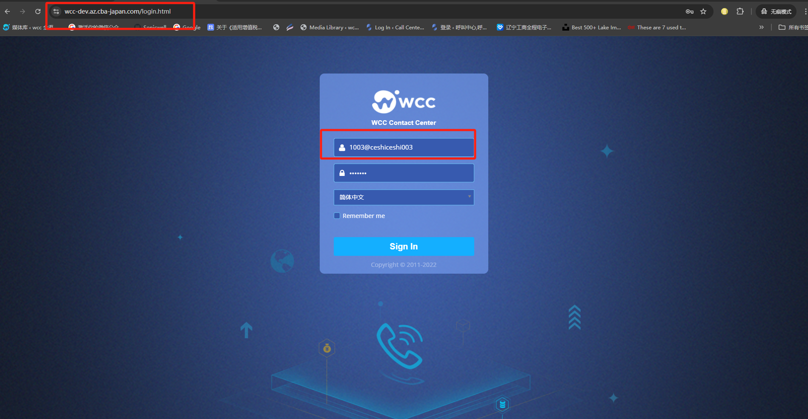

#### 二 登出流程

进入系统后，选择左侧下拉选项中的【登出】，确认后即可注销账号，页面将自动返回登录页面。

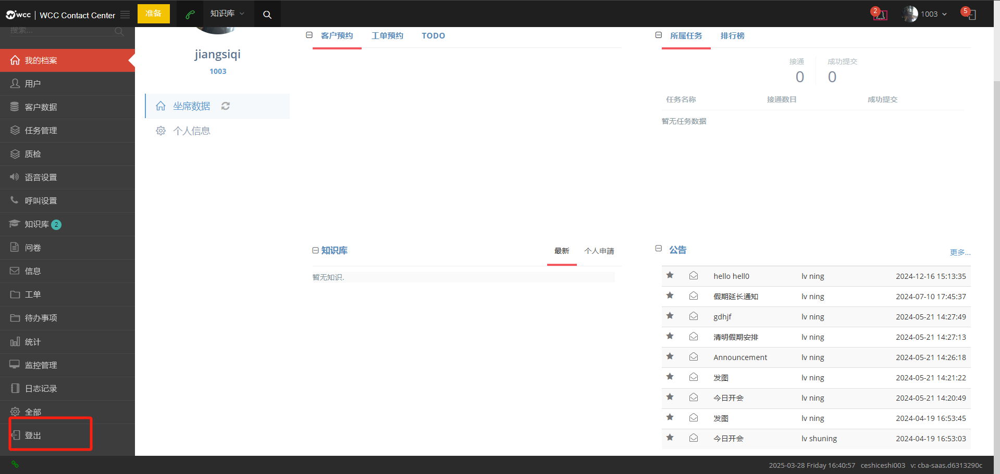

## 2 界面核心区域介绍

WCC 坐席系统界面由左侧菜单栏、上方状态栏、中间工作区三大核心区域组成，各区域功能独立且联动，支撑坐席日常全部操作流程。

1. 左侧菜单栏

- 无坐席组长权限且未分配角色的普通坐席，仅可查看个人统计页面；

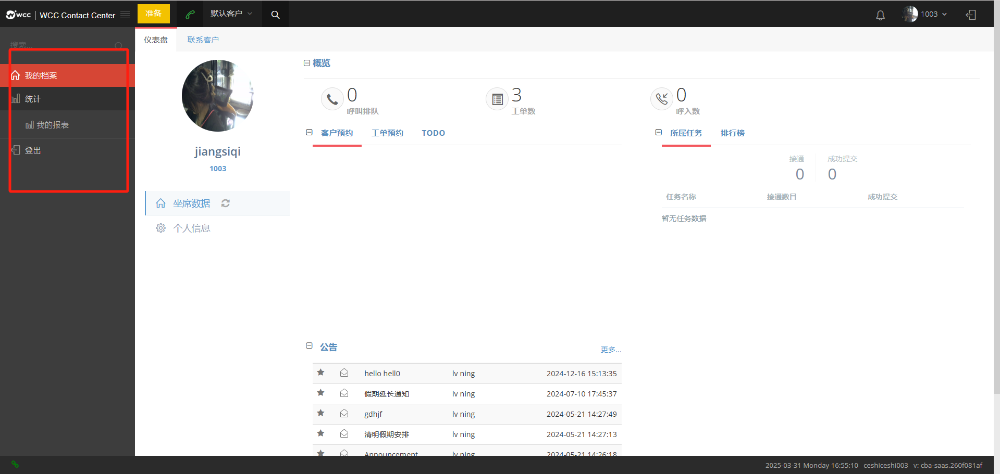 

- 拥有坐席组长权限的坐席，可登录所属组长组内其他坐席账号，同时可查看组内坐席汇总统计报告、所有坐席实时监控数据。

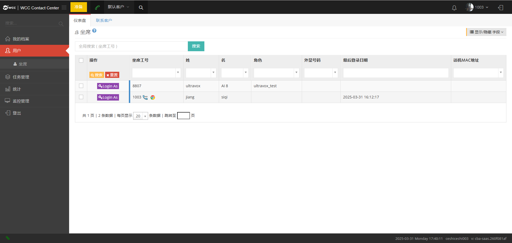

2. 上方状态栏：展示坐席实时状态、通话功能、消息通知、坐席组签入 / 签出等关键信息，集成 WebRTC 话机、知识库、客户包快捷搜索、聊天通知等功能，是坐席实时掌握工作状态、快速调用高频功能的核心区域。。

3. 中间工作区：核心操作执行区域，根据左侧菜单栏的模块选择，展示对应的操作页面（如客户资料、工单处理、数据统计、实时监控等），坐席的日常客户联络、工单创建、预约设置等操作均在此区域完成。 

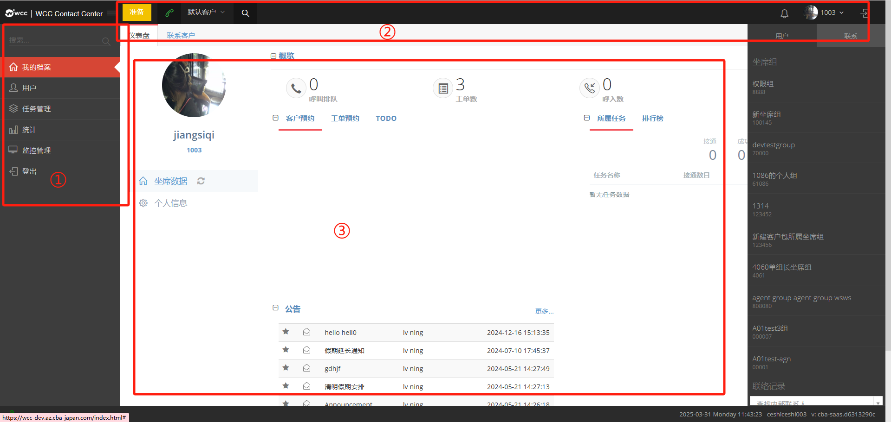 

查看所任坐组长组内坐席汇总的统计报告

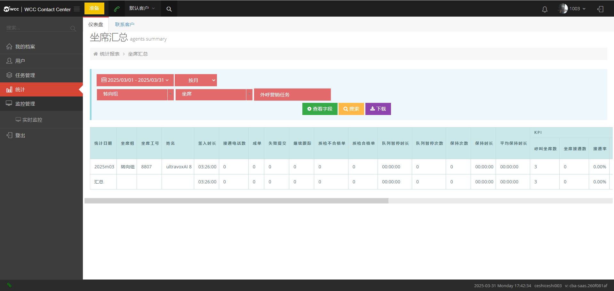   

查看所有坐席的实时监控页面

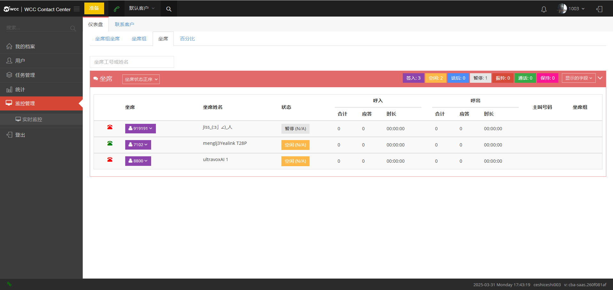

## 2 核心功能模块操作说明

#### 一 我的档案

坐席登录系统后默认展示的核心模块，包含仪表盘和个人信息两大子页面，支撑坐席日常工作数据查看和个人信息管理。

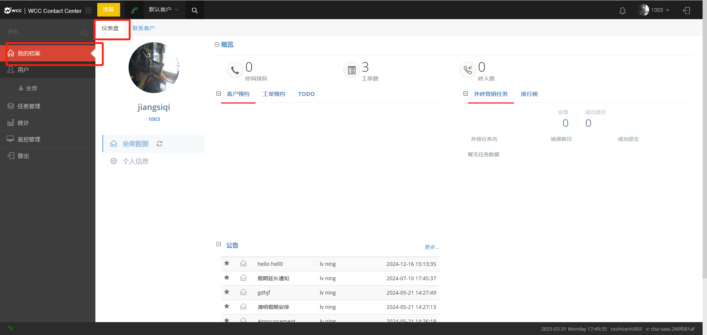

1. 仪表盘

仪表盘是坐席工作数据的总览中心，分为坐席数据和概览两大板块，实时展示工作核心数据，支持客户、工单、待办的预约管理：

- 坐席数据：涵盖通话及工单数据概览、客户预约、工单预约、TODO 待办、所属任务、坐席排行榜等内容，是坐席日常工作的核心数据看板。

- 概览：直观展示坐席所属坐席组的实时呼叫排队人数、未处理工单数、实时呼入电话数，为坐席掌握工作节奏提供数据参考。

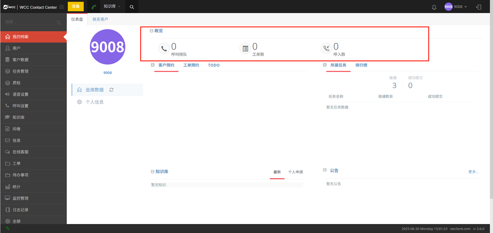

- **呼叫排队**：坐席所属坐席组的实时等待人数。

- **工单数**：统计内容-指所有尚未选择处理结果的工单总数；状态流转-一旦为某工单选定处理结果，即视为已完成，它将自动从该统计中移除；创建权限-工单可由上级用户（Client）或坐席直接创建，用于记录和推进工作任务。

- **呼入数**：坐席所属坐席组的实时呼入电话总数

- **客户预约**：展示坐席所有预约客户信息，支持重新分配客户（仅组长可见）、修改预约日期、查看客户详情三大快捷操作；

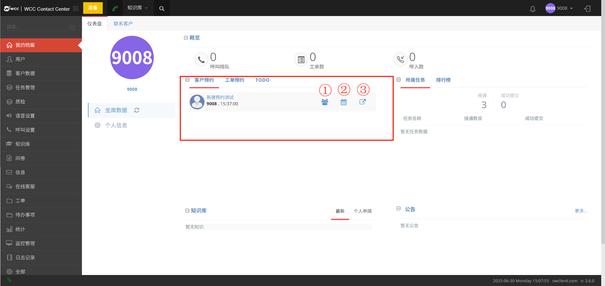

- **工单预约**：集中管理所有设为 “预约状态” 的工单，坐席可给任意工单设定预约时间，系统将按【系统偏好】中设置的提前提醒时长自动触发智能提醒（关闭客户页面仍会弹窗）；

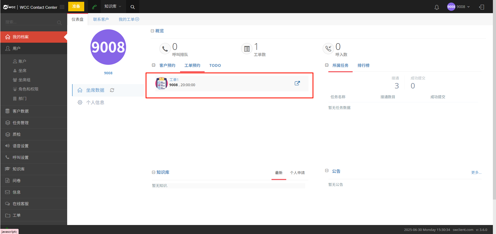

- **TODO**：可由上级（client）发布待办事项，也可由坐席自行添加，支持待办事项标题、描述、预约时间的编辑修改，坐席标记完成后，待办状态将同步更新；

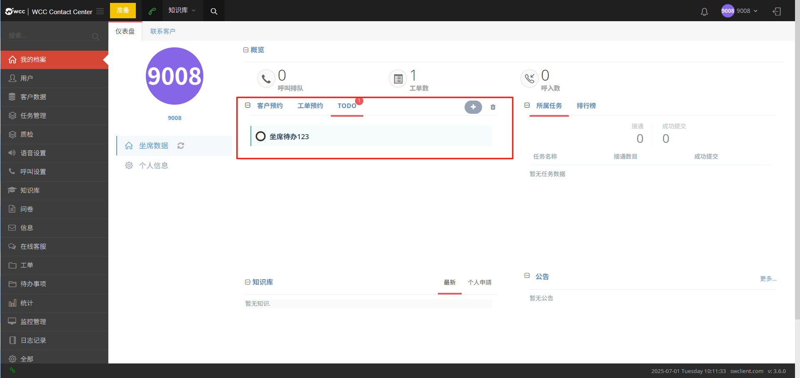

点击右侧箭头，可以对坐席待办事项标题以及坐席待办事项进行编辑和修改。

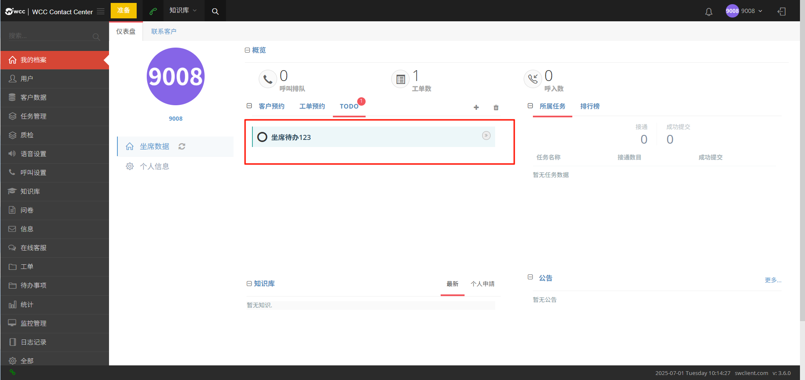

【编辑】页面（如下图）

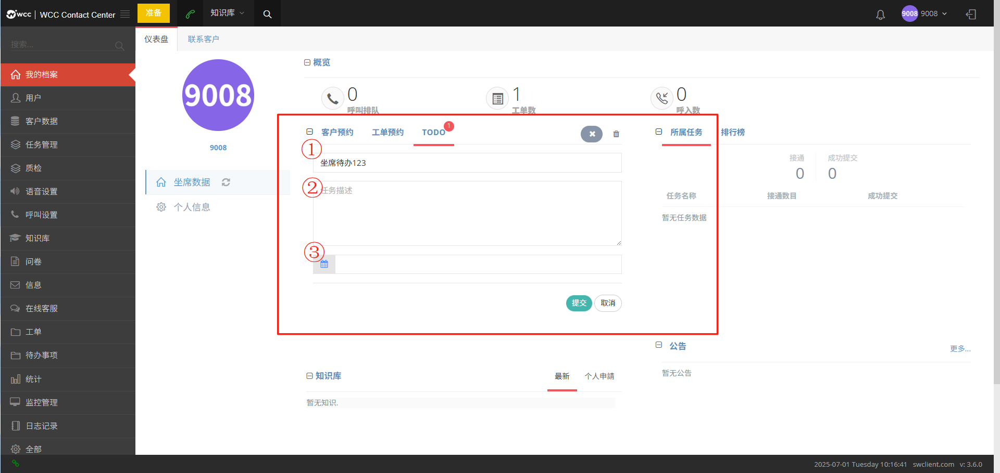

①**任务标题**：坐席待办事项标题。

②**任务描述**：该坐席待办需要特殊注意或说明的描述。

③**预约时间**：这个待办的预约时间，会在坐席的仪表盘页面显示。

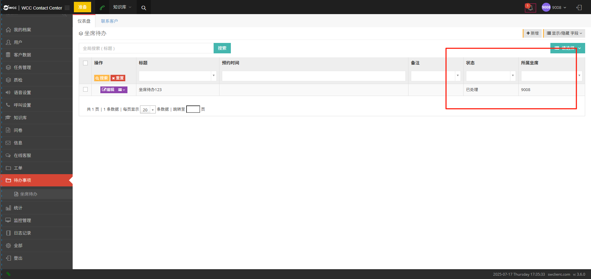

（上图此为client/有坐席代办角色权限的坐席，页面显示状态）

- **所属任务**：展示坐席当日执行的所有任务名称、通话接通数目、工单成功提交数（接通数含非任务内通话，成功提交数为销售漏斗标记为成功的数量）；

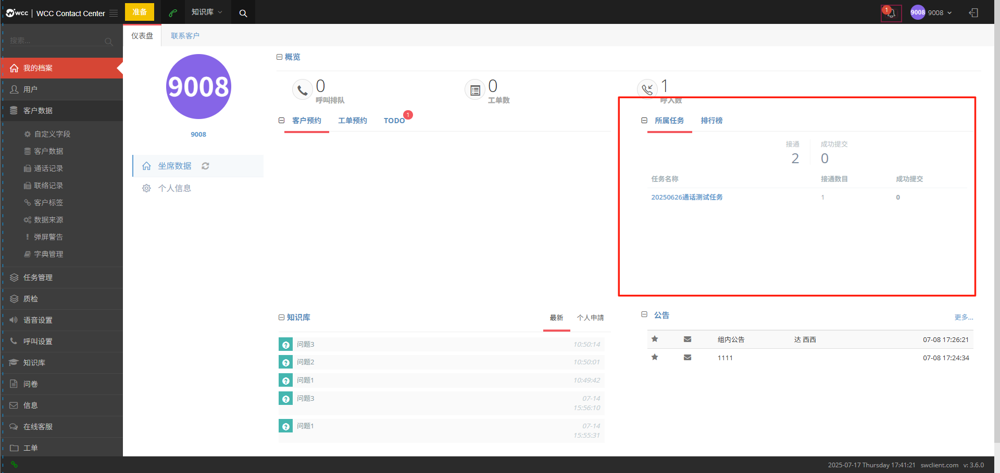

- **排行榜**：展示坐席所属任务组内，按成功提交数排序的坐席排名（成功提交动作可重复计算）。（如下图）

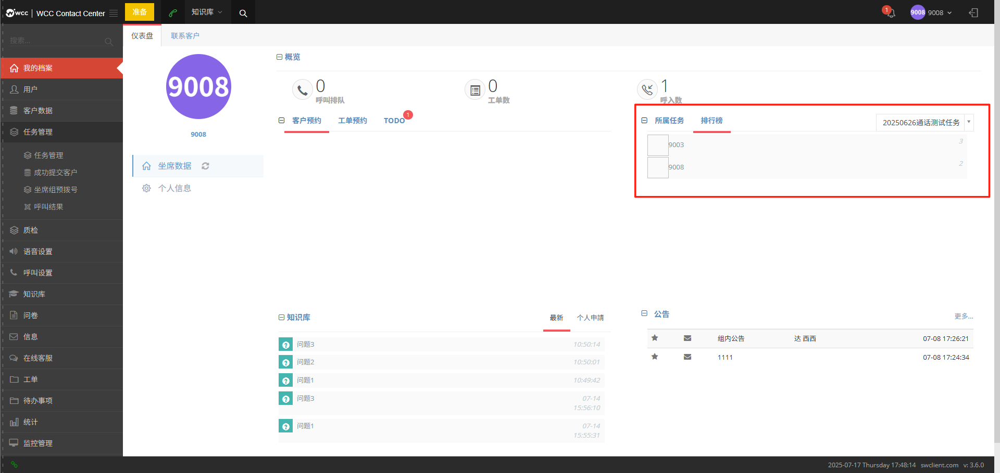

2. 个人信息:

支持坐席管理个人基础信息和登录设置，包含头像设置、坐席简介编辑两大功能： 

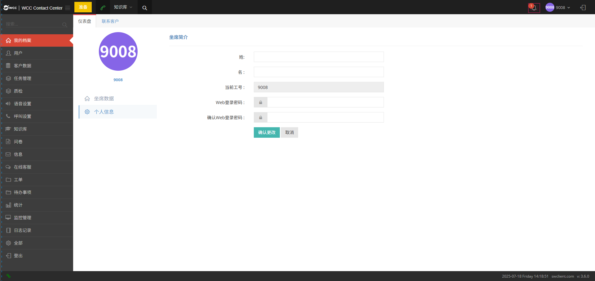

**头像设置**：点击左上角头像进入设置界面，可上传 1MB 以内的 JPG 格式图片（本地选择 / 拖拽均可），也可通过网络摄像头拍照后直接设置；  

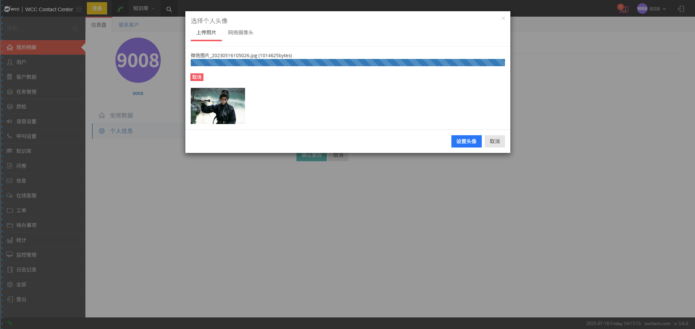

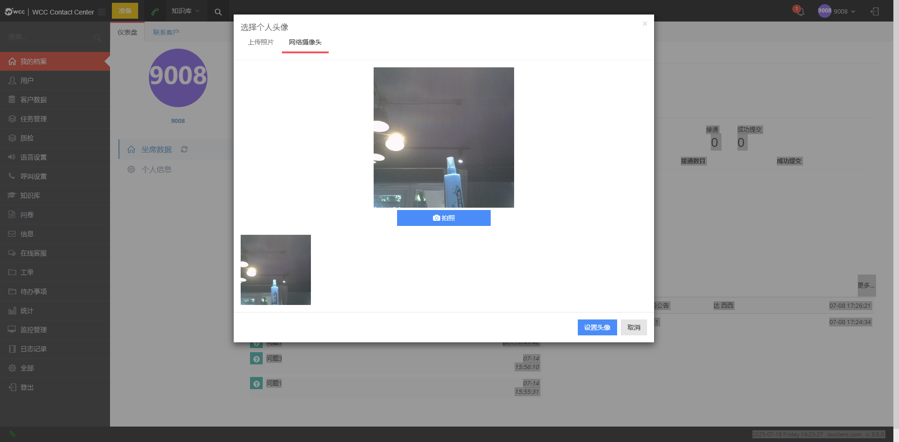

**坐席简介**：可编辑姓氏、名字，查看唯一不可修改的当前工号，同时支持自行修改 Web 登录密码（需重复输入确认密码，保证两次输入一致）.

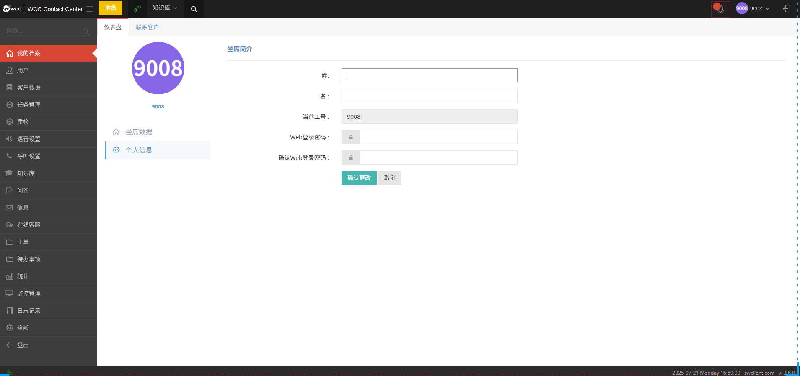

#### 二 联系客户 

坐席开展客户联络、客户资料管理、工单创建、订单添加的核心操作模块，涵盖任务客户池、我的客户、客户资料、客户相关记录等关键功能，支撑客户全生命周期管理。

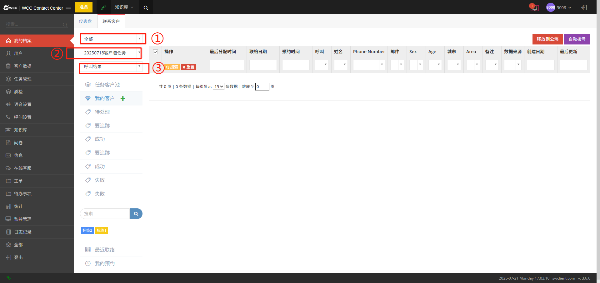

①---如果这个client中有多个客户包，①处可以选择一个客户包

②---选择客户包后，②里显示的是这个客户包下的任务

③---选择任务后，③中显示的是这任务下所绑定的呼叫结果

1. **客户池与客户归属**：

- 「任务客户池」：展示坐席所选任务中的所有客户数据，坐席可通过【抢】【换一批】将当前页客户分配至个人客户列表；

- 「我的客户」：展示坐席从任务客户池抢到的客户 + 自行添加的客户，坐席可点击【呼叫】【查看】对客户执行操作，所有客户信息专属当前坐席；

- 客户归属规则：客户一旦归属某坐席，即便其他坐席拨打 / 转接该客户并成功提交，归属权不变；若上级将客户分配至新任务，而原坐席未参与新任务，客户将重新分配，且后续原坐席加入新任务，归属权仍属于新坐席。

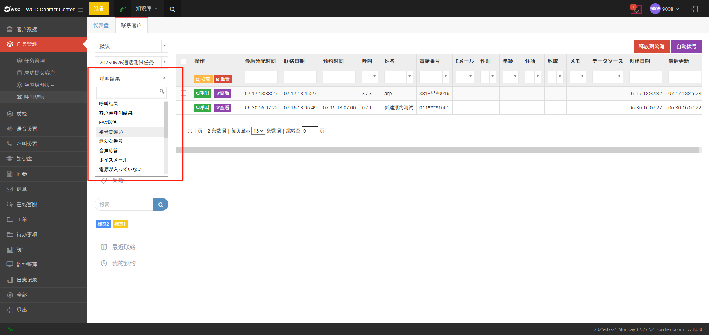

2. **新增客户**：

坐席点击【我的客户 +】可自行添加客户，需填写客户资料（带 * 为必填项），其中电话番号为客户联系方式必填项，坐席 / 组长可在此字段下拉列表设置禁呼 / 黑名单（由 client 或授权组长审核，审核中号码可正常拨打，审核通过后禁止拨打），填写完成后点击【保存客户资料】完成新增。

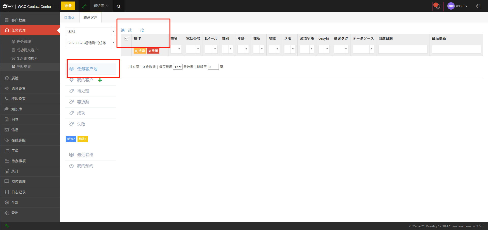

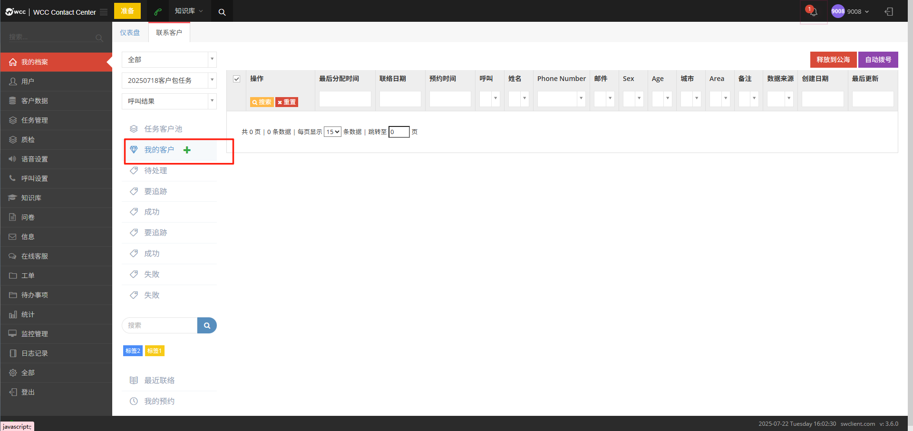

3. **我客户弹屏**：

坐席点击【查看】客户或拨打客户电话时，将弹出客户弹屏标签，弹屏名称按「新增客户→客户姓名→电话号码→未知 @项目名」的规则显示，弹屏内可完成：

- 查看 / 修改客户详细资料；

- 保存本次联络信息、查看历史联络记录；

- 对客户进行快速 / 指定时间预约；

- 创建客户工单、添加订单、填写问卷。

- 坐席对新增客户资料进行编辑，记录及预约

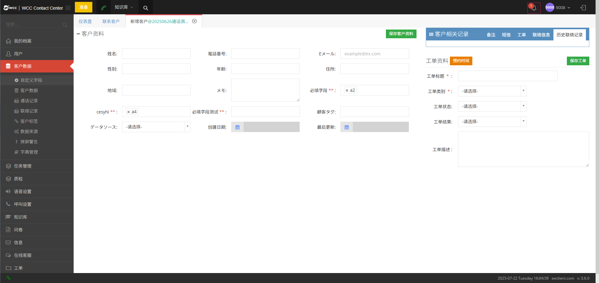

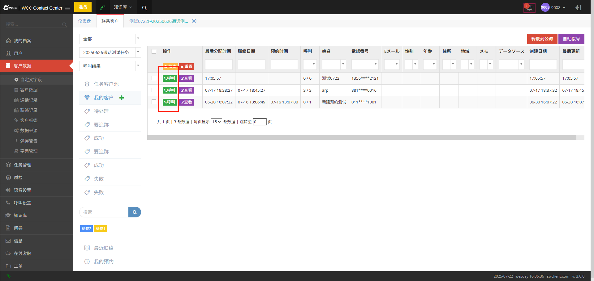

此时页面弹出弹屏标签：座席可以查看修改客户的详细资料、可以保存本次的联络信息、可以查看当前客户的历史联络记录、可以对客户进行预约.

【弹屏标签显示规则】未知@项目名，

① 默认为 新增客户

② 取客户第一个姓名字段对应的值

③ 如果没有 2，取客户第二个字段电话号码对应的值

若客户弹屏上 ①②③④ 都不满足，则显示未知@项目名

座席可以查看修改客户的详细资料；可以保存本次的联络信息，查看当前客户的历史联络记录；可以对客户进行预约，建立客户工单资料。

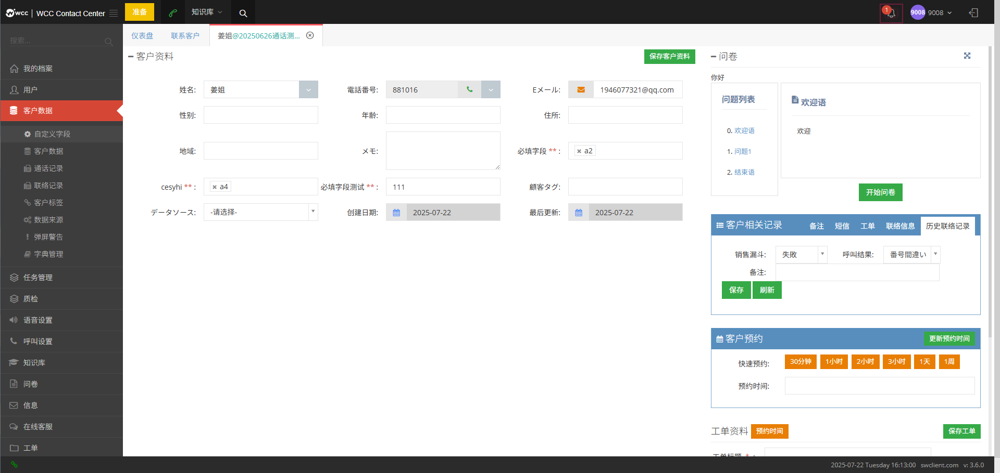

4. **客户相关记录** ：

包括备注、短信、工单、联络信息、历史联络记录。其中历史联络记录是坐席主要工作页面。

**备注**：支持添加【普通、置顶、弹屏警告】三类备注，弹屏警告需上级 / 授权组长审核生效，生效后查看 / 拨打该客户时将弹窗提醒；

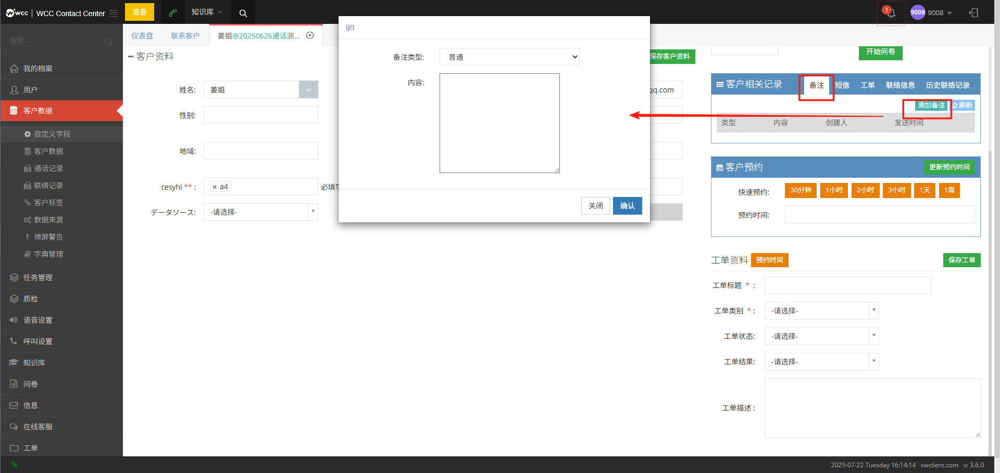

【普通】普通的备注

【置顶】置顶显示该条备注

【弹屏警告】设置弹屏警告，需要上级用户或有审核权限的坐席审核成功后才可以生效。生效后，坐席查看该客户资料，拨打该客户电话或者接听该客户电话时就会收到该条弹屏警告。（关于审核流程，到Client手册查看）如下图：

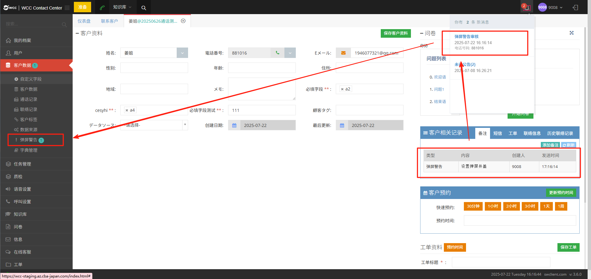

**短信**：显示发送给该客户短信的详细内容（如下图）

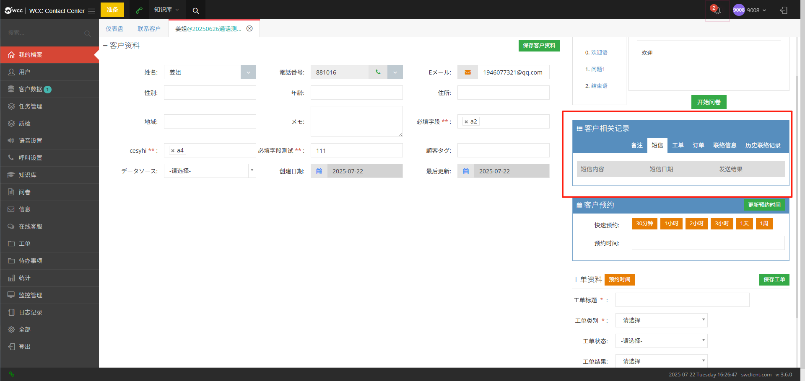

**工单**：对当前客户所建立过的工单进行查看（如下图）

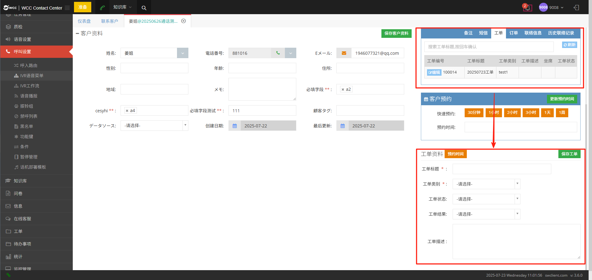

坐席建立工单的基本流程：  

①坐席在保存客户资料后会弹出工单资料的功能区  

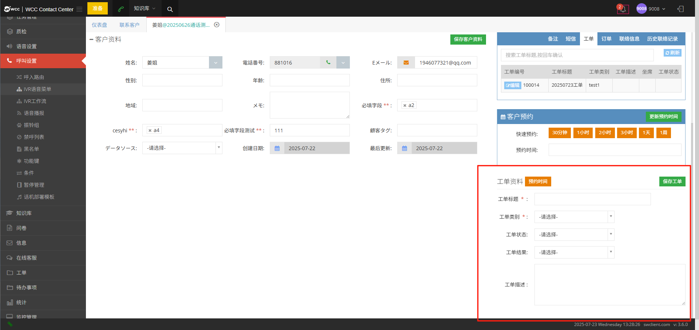  

②坐席在工单资料页面可以

填写工单标题-->选择工单类别-->选择工单状态-->选择工单结果-->填写工单描述-->保存工单

保存后的工单点击工单-->编辑可以查看

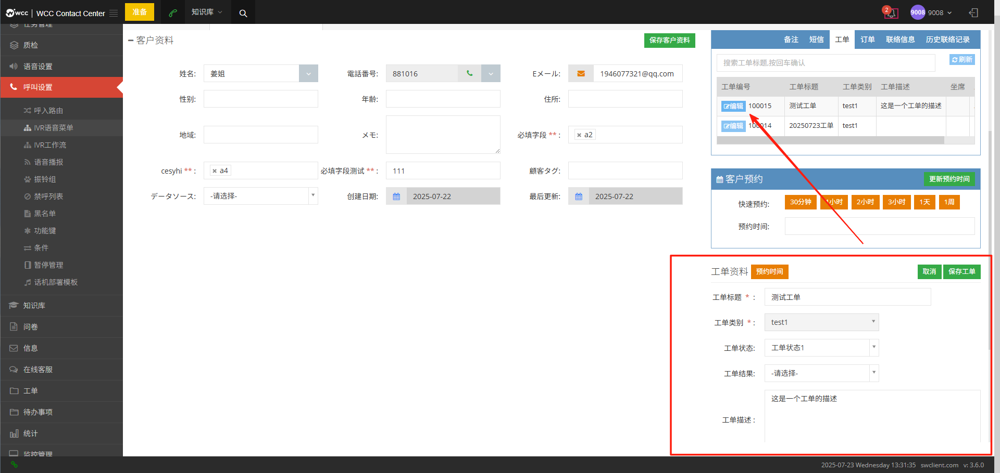

③查看工单时，可以点击【预约时间】对工单进行预约  

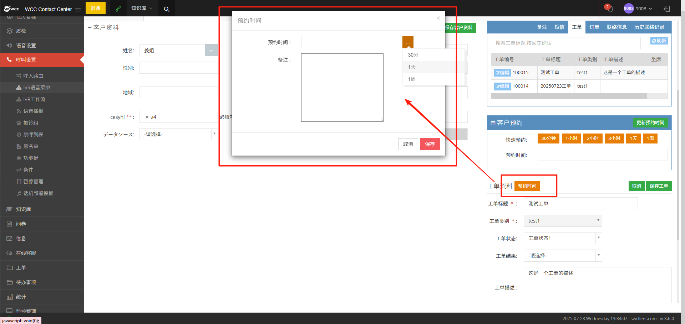

工单的预约可以有快速预约的时间选择(30分、1天、1周)，坐席也可以自定义工单的预约时间  

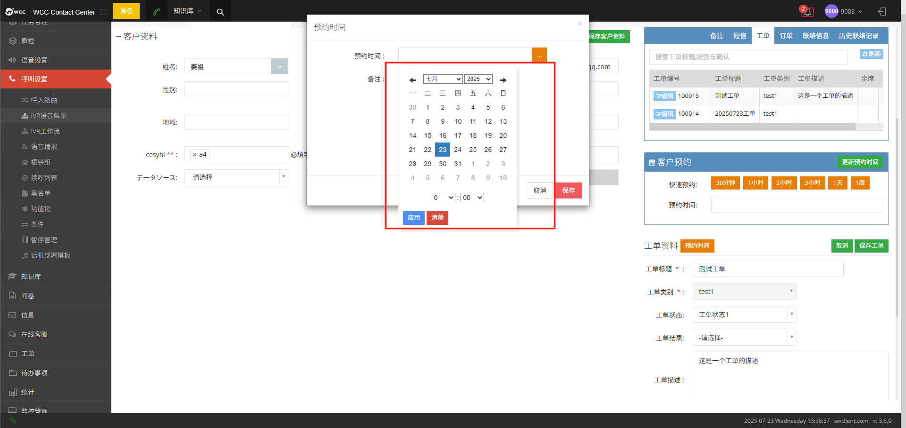

④保存预约后，工单预约会显示在仪表盘中，如图所示  

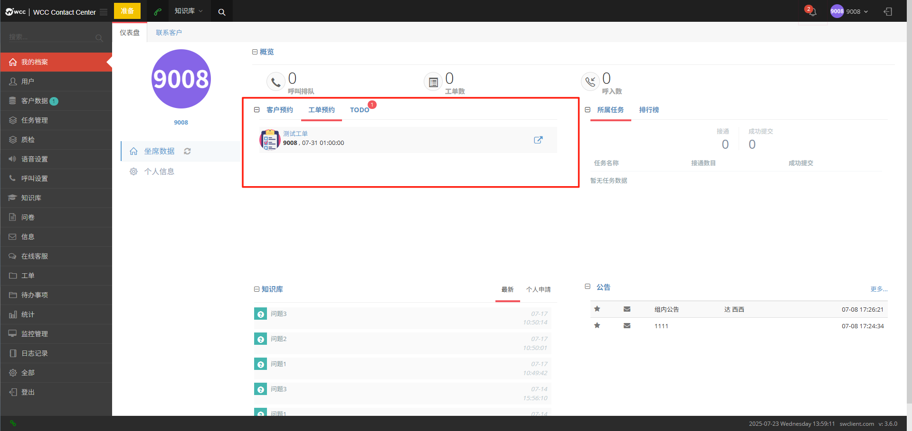          

⑤在客户弹屏的工单相关记录功能区中，可以查看工单的修改记录

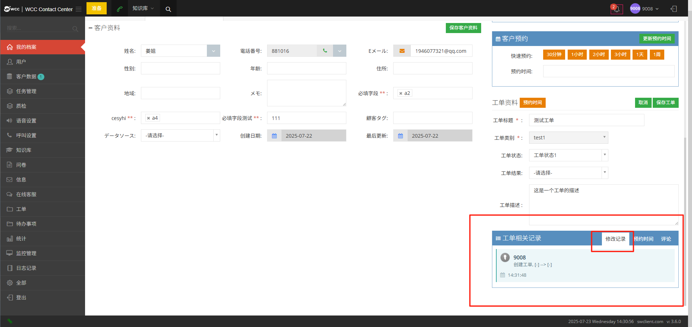 

在预约时间中，可以删除工单预约,在仪表盘页面不会显示  

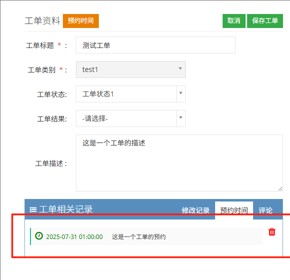 

坐席还可以对工单进行评论，所有坐席的评论会显示在工单的评论中  

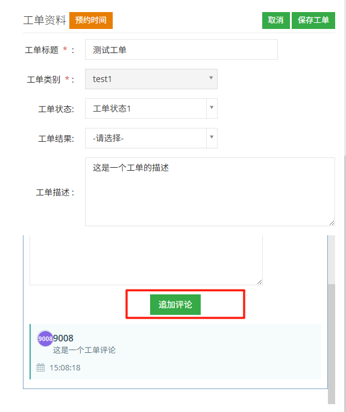 

**订单**：坐席可以在订单页面增加一个客户所属的订单

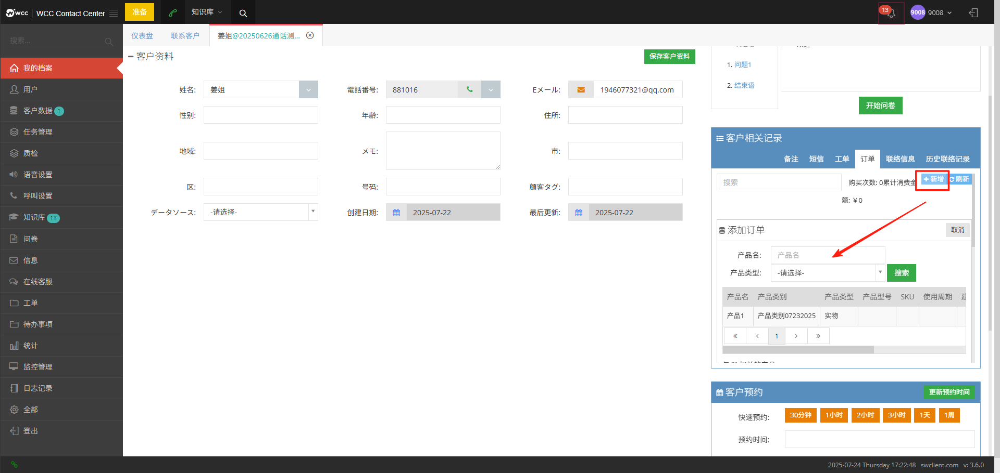

添加订单：

①添加产品名称，选择产品类型，选择订购

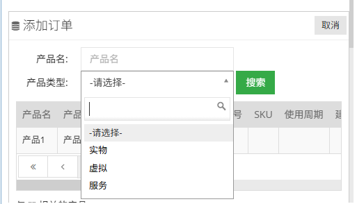 

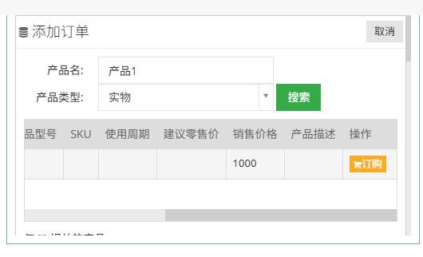 

②填写发货单号、快递单号、联络人、电话号码、地址等信息完善订单信息  

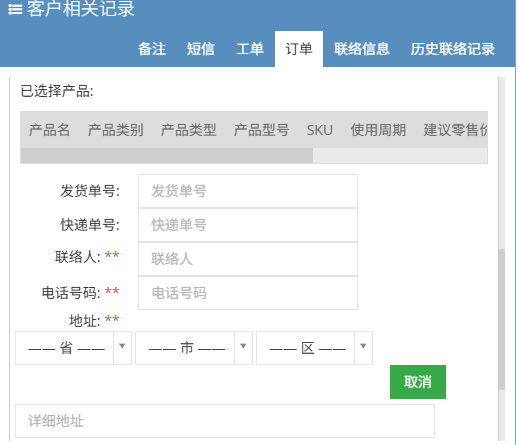

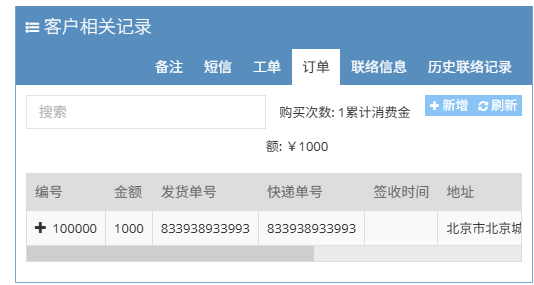

**联络信息**：关联通讯录，可添加客户亲属等关联联系人的姓名、电话、地址等信息；

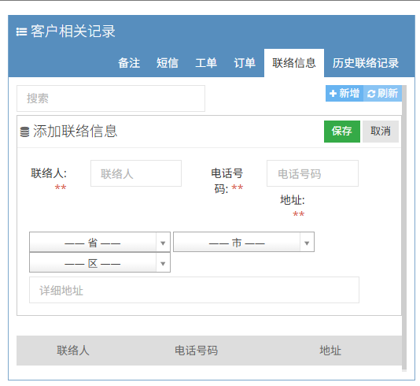

**历史联络记录**：坐席与客户的核心沟通记录，包含销售漏斗（成功 / 失败 / 跟踪）、呼叫结果、备注，预拨号 / 双呼接通将自动生成记录，其余通话需手动保存；记录内的通话录音可点击播放，若保存联络记录时同步创建了工单，工单信息将同步展示在记录中。

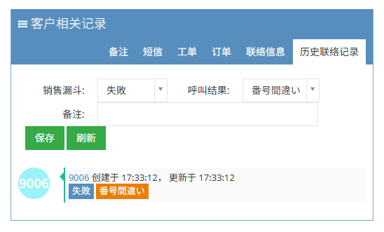
 
联络记录默认显示，可以由拥有任务管理权限的管理员进行修改。默认联络记录是自动加载，当选择手动时，需要点击刷新才能加载出历史联络记录。

预拨号/双呼接通时，会自动生成一条联络记录,其余通话需要坐席手动保存后生成新的联络记录

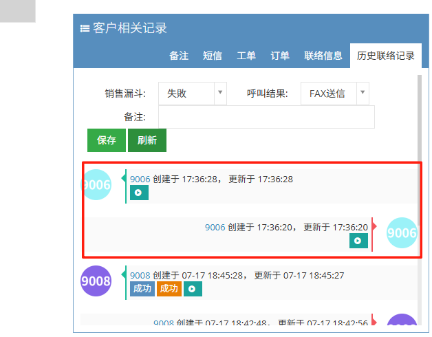

联络记录中的录音，可以点击播放

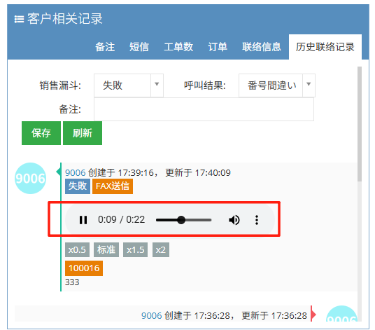

当坐席在保存联络记录时，在弹屏页面未关闭的情况下，还保存过一个工单，那么这个工单就会显示在该条提交中。

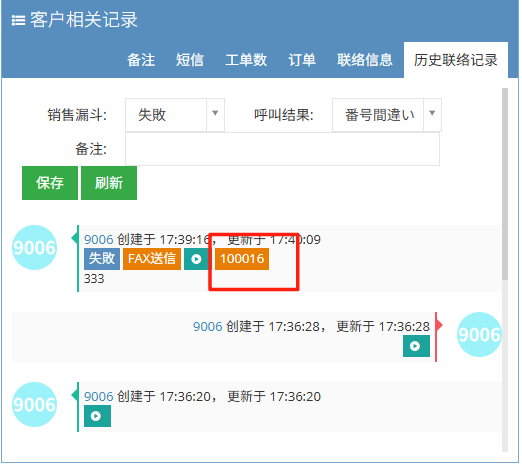

**销售漏斗**：用于标记座席记录客户的通话状态情况，销售漏斗页面如下图，销售漏斗默认有三种：成功/失败/跟踪

**呼叫结果**：是座席呼叫客户联络记录选择的通话结果，用于通话结果的分类。呼叫结果和销售漏斗互相绑定的关系。

设置呼叫结果的流程

在client级别新增呼叫结果页面新增，并绑定一个销售漏斗，选择一个呼叫结果的通话状态，通常分为三类，无/应答/未应答。无则为在通话状态中都会显示这个呼叫结果。

应答则是在应答状态下才会显示这个呼叫结果。未应答则是在通话被应答时不会出现这个呼叫结果。（注：坐席端有呼叫结果页面，但是不能将呼叫结果应用到任务。

5. **客户预约**：支持快速预约和指定时间预约两种方式


- 快速预约：点击 30 分钟 / 1 小时 / 2 小时 / 3 小时 / 1 天 / 1 周等快捷按钮，系统自动更新并保存预约时间；

- 预约修改：未到预约时间的客户，修改预约时间为重新预约，并非时间累加。

- 指定时间预约：点击预约时间文本，下拉选择具体年月日时分，点击【应用】后再选【更新预约时间】完成保存，预约信息将同步至仪表盘【客户预约】板块；


6. **工单资料**：

- 预约时间：给未处理的工单，设定一个完成时间。设定预约时间的工单，会在仪表盘的【工单预约】中显示。只有已存在的工单才能进行预约。

- 工单标题：给创建的工单命名

- 工单类别：选择一个工单类别

- 工单状态：选择一个工单状态

- 工单结果：选择一个工单结果

- 工单描述：对建立的工单进行详细描述


座席可以点击【我的客户➕】操作列下的【查看】，查看客户的详细信息。


7. **问卷**:

问卷是坐席与客户通话时坐席根据问卷内容对客户进行问卷调查,问卷需要在任务管理---话术中进行设置。问卷的答案，可以由client用户在问卷答案中进行导出。


8. **其他高频功能** 

**待处理**：列表中的客户数据是【我的客户➕】数据中未保存过联络记录的客户数据


**要追跡/成功/失败**：选择客户包时会显示相应客户包所对应选择了这个销售漏斗的客户数据。不选择客户包，默认显示全部客户包的销售漏斗。


**客户标签**：
由上级用户建立，坐席可以通过点击标签，对客户进行快速筛选


**最近联络**：是坐席最近一个月联系的客户记录信息,包括客户名称、通话开始时间、通话结束时间、通话时长、挂断原因、所属任务等信息。


**我的预约**：包括今日预约和所有预约，默认显示今日预约，显示当天坐席预约的客户记录信息。点击所有预约可以查看当前坐席所有预约。


**释放到公海**：坐席可以在【我的客户➕】将自己选择的客户释放到任务客户池中


**自动拨号**：坐席可以对列表中的客户进行自动拨打。点击自动拨号会显示坐席需要自动拨号的客户所满足的条件：

拨号次数：坐席可以根据客户所拨号的次数的数值进行筛选所要拨打的客户号码。

上次联络信息：坐席可以根据客户上次联络的时间界定所要拨打的客户号码。

点击确定即进入按该条件执行的自动拨号：


当坐席使用自动拨号模式时有以下控制键可以对自动拨号进行控制：

 

- 倒计时：当坐席完成一个通话时，系统将开始倒计时 ，倒计时结束后系统将拨打下一个号码。

- 延迟：坐席可以点击延迟按钮获得更多的时间。

- 暂停：暂停自动拨号。

- 开始：是暂停的相反工作，表示继续自动拨号。

## 3 上方状态栏高频功能操作

#### 1 坐席状态管理：

坐席登录后默认状态为【准备】（空闲状态），可根据工作情况切换：

 

【暂停】：坐席临时离开时选择，状态将切换为【暂停】，不再接收呼入；

 

【话后】：队列通话呼入并挂断后，若任务中设置 “进入话后”，坐席状态将自动切换为【话后】；

 

【签入 / 签出】：坐席可勾选所属坐席组完成【签入】，表示可接收该组呼入；【签出】后不再接收该组所有呼入，签入 / 签出状态默认在登录后展示。

#### 2 通话 ( webrtc ) ：

系统自带软电话功能，无需外接设备，在状态栏右上角打开【WebRTC】按钮即可使用：  


注册好的话机，在鼠标放置于通话按钮上时会弹出注册信息  


坐席使用webrtc的拨号盘进行拨号，拨号盘上有静音以及声音调节按钮  


表头图标可以切换页面，切换至通话记录页面，可以查看使用webrtc的最近通话记录  


也可以使用webrtc的自带联系人设置，添加联系人姓名  


在设置页面，可以设置自动应答，即当有通话呼入到该坐席，坐席使用的webrtc可以直接接通这个通话。

还可以设置挂机忙音，当坐席开启了挂机忙音，当坐席通话时对方挂断了通话，则会出现 " dududu " 的声音提示通话被挂断。  

  

当坐席输入号码进行拨号呼入对方未接通时，会显示振铃。

  

接通后状态中会显示通话的号码，保持，以及挂断键  

  

点击保持，坐席依然保持在通话状态，客户端会播放一段音乐，点击恢复，会回到通话状态  

  

在通话期间，如果在图示框中输入号码点击回车，或是点击绿色通话按钮，通话会被盲转至图示框中所输入的号码处。

  

#### 3 知识库/默认客户包 ：

在坐席登录页面，功能菜单处，还可以选择点击快捷搜索区，知识库或是客户包客户数据。

  

选择知识库时，坐席可以搜索知识，支持搜索文件名以及问题名。只有用鼠标点击的知识，才会在搜索记录冲出现  

  

点击【查看知识库主页】进入【知识库】主页

 

【添加知识】（如下图）


- 问题：输入需要解答的问题内容。

- 关键字：用户可以输入帮助坐席在使用知识库时搜索的关键字，可以添加多个，enter键输入。

- 分类至：用户可以将该知识库信息分类到多个知识库中。

- 回答：该问题的答案。

- 有效期至：创建者可以对该知识库的有效期限进行定义，超过有效期该知识不会被搜索到。

点击【提交】，由上级用户进行审核，坐席可以通过【我的提交】查看审核状态。


【知识列表】显示当前知识库的全部内容

【我的提交】显示坐席提交的所有内容及审核状态

选择搜索客户数据时，只支持坐席使用完整号码进行搜索  

  

#### 4 消息通知 ：

坐席右上角会显示一些审核内容提示通知，例如弹屏审核，dnd审核，以及知识库审核等。


坐席点击聊天按钮，可以进入聊天界面。进入聊天界面有【用户】和【联系】两个通讯录可以选择。

默认界面是【用户】界面。坐席在【用户】页面可以看到坐席所属坐席组的聊天组群，还可以在通讯记录中搜索聊天对象，或是查看聊天记录


点击进入坐席组聊天页面，坐席组长会在右上角有一个铃铛图标，点击这个图标，坐席组长可以发送组内推送消息。


推送消息分为两种：

- 固定信息：该信息会一直滚动出现，只有坐席组长选择推送消息中的清除，该固定消息被清除。


固定消息设置成功会在如图所示的位置显示，只有该组内坐席可以收到。


只有坐席组长可以在推送消息中，点击【清除】清除这个固定消息。


- 临时信息: 坐席组长还可以发送【临时消息】该消息默认持续时间为30秒，30秒后自动关闭。临时消息只有在线坐席可以接收到。


#### 5 坐席组签入 ：

- 坐席组：显示坐席用户所在的所有坐席组，可根据当前状况勾选☑是否【签入】到其中一个或多个坐席组，【签入】在坐席登录状态，默认显示。

下图为例:坐席【签入】坐席组。坐席签入一个坐席组则表示该坐席准备好从该坐席组中接收呼叫。


- 签出: 表示该坐席不再从签出的所有坐席组接收呼叫。


- 我的公告： 有【我的公告】权限的坐席或是client，可以向坐席发布公告，公告会显示在仪表盘的公告栏中，坐席也可以由弹窗中【我的公告】进入查看。


## 4 MicroSIP话机使用手册

#### 1 登录

双击MiroSIP，打开话机，点击下拉按钮，选择【添加账户】，填写相关信息（如下图）：


- Sip服务器：填写系统登录的url网址+端口号（此地址与web登录地址一致，但若opensips和web不在一个服务器上时，此地址与web登录地址）

- Sip代理：填写系统登录的url网址+端口号

- 用户名：坐席工号

- 登录名：坐席工号

- 密码：系统中坐席编辑中SIP分机注册密码

点击保存,显示话机在线

#### 2 拨号盘

包括拨号框，按键和功能键，话机登陆后，默认显示该页面


- 拨号框：显示拨打号码，点击右侧下拉按钮，查看以往拨号记录

- 按键区：直接输入客户号码，进行呼叫

- R：重播键，对上次播出的号码进行重播；使用按键拨号时，此键显示为【后退】，可以对拨号框内号码进行逐个删除

- ➕ ：代表国际长途接入码,代表地区跨地域拨打电话

- C：将拨号框的内容全部删除

- 视频通话键：输入号码后，自动亮起，点击给客户拨打视频电话；电话接通后，此键显示为保持状态，点击则暂停通话，客户会在系统中听等待音乐，坐席与客户保持通话状态

- 呼叫键：在输入号码后会由灰色变为绿色

- 呼叫记录：输入号码后，显示亮起，点击可以查看该号码的当前通话信息，对此通话用户进行备注；也可以在此页面进行【呼叫】和【视频呼叫】；【最后通话】查询最后通话详情；【关闭所有】则删除所有内容，重新拨号打开该页面，则没有以往记录。如下图：

 

- 听筒：直接点击图标，控制听筒的关闭和开启；右侧滑轨用来控制听筒的音量

- 话筒：直接点击图标，控制听筒的关闭和开启；右侧滑轨用来控制话筒的音量


- DND:请勿打扰，此时无法呼入电话，但可以呼出


- AA:自动应答，对于呼入的电话，进行自动接听


#### 3 呼叫记录 

显示所有通话和通话状态，双击鼠标左键，可快速拨号；鼠标右键可以对客户进行重新呼叫、视频呼叫、信息、添加联系人、复制、删除、导出（如下图）


- 信息：唤出当前客户的呼叫记录

- 添加联系人：对要添加的客户信息进行编辑，点击【确认】保存，保存的客户信息在【联系人】中查看

- 复制：复制所选客户号码

- 删除：删除所选通话记录

- 导出：将所有通话记录以文件的形式保存到指定位置

- 搜索：快速查找通话记录

#### 4 联系人

已添加的的联系人列表，双击鼠标左键，可快速拨号；右键可以对联系人进行呼叫、视频呼叫、信息、添加、编辑、复制、删除、导入、导出。如下图：

- 信息：唤出当前客户的呼叫记录

- 添加：重新添加客户信息，对客户进行加星编辑

- 编辑：对原有客户信息进行修改，对客户进行加星编辑（如下图）


- 复制：复制客户号码

- 删除：将客户信息从联系人列表删除

- 导入：将已有客户信息添加到联系人列表中

- 导出：将所有客户信息以文件的形式保存到指定位置

- 搜索：快速查找目标客户

#### 5 关于转接

转接分为盲转和咨询转两种类型，坐席通过下拉列表设置中【通话模式（务会议功能）】进行设置。（如下图）


勾选【通话模式（无会议功能）】，转接功能为盲转状态:

当坐席A有呼入电话，需要转接到坐席B，要在应答之后，点击转接按钮，出现呼叫转移小键盘，输入坐席B的号码，点击确认，进行转接；

若刚好B坐席处于忙线状态则系统会直接挂断电话。（ 如下图 ）


取消勾选【通话模式（无会议功能）】，转接功能为咨询转状态:

当坐席A有呼入电话，需要转接到坐席B，应答后，在键盘中输入坐席B的号码，进行呼叫，客户会在系统中听等待音乐（如下图）


坐席B接通后，点击【转移】——【坐席呼转】，客户的通话被转接到1002坐席B，建立通话后，坐席A电话挂断（如下图）


坐席B为忙或无法接听而拒绝接听客户电话，坐席可将继续重复上述操作将通话转接至能够接听方，若转接不成功，该通话最终回到原坐席A处；

转接过程中，坐席A点击客户的通话界面，则通话回到原坐席A处。（如下图）


## 5 物理话机使用手册

#### 1 注册

点击话机【菜单】进入主菜单（如下图）

选择【基础设置】（如下图）

选择【无线网络】，点击右键，将【无线网络 关闭】设置成【无线网络 开启】（如下图）

选择【可用Wi-Fi网络】，选择要连的网络，点击【连接】，输入密码后保存（如下图）

在主菜单页面选择【状态】，选择IPV4，查看IP（如下图）

打开浏览器输入IP：192.168.31.68进入话机注册页面

输入用户名，密码，点击登录（说明书默认账号，密码均为admin)如下图：


一台话机可以登录两个号码，登陆后选择【ToIP】，在【账号1】和【账号2】下填写注册内容（如下图）


将【基本设置】中的【账号使能】点击成【开启】


【用户信息】中【显示名称】可以随意设置

若注册号码为外线 ：


【认证名称】和【注册账号】均为要注册的外线号码

【密码】提前设定好的密码

【注册服务器】：freepbx14.cbacloud.net

【注册服务器端口】和【代理服务器端口】均为：5080

若注册号码为内线：


【认证名称】和【注册账号】均为坐席号码（如上图），【密码】对应sip分机注册密码（如下图）


【注册服务器】对应Client名；【代理服务器】为：wcc1-dev-rakuten.az.cba-japan.com；【注册服务器端口】和【代理服务器端口】均为：6060（如下图）


#### 2 转接

1. 盲转

通话过程中，在话机上点击【转接】（如下图）

输入转接坐席B的坐席工号，再点击【盲转】，盲转成功，操作完成。（如下图）

2. 咨询转

通话过程中，在话机上点击【转接】（如下图）

坐席A和转接坐席B建立通话后，坐席A点击【转接】，咨询转成功，操作完成。（如下图）

3. 驻留

通话过程中，在话机上点击【转接】（如下图）

输入驻留号码（系统默认为“700”，可在功能键页面更改），点击【发送】，话机会有提示音，提示“驻留成功，取回号码为701”，其他坐席可直接输入驻留号码取回驻留的客户。（如下图）

## 6 rectel

#### 1 注册

填写话机名和SIP注册密码（如下图）


点击登录页面的Login，在填写域名，点Next（如下图）


点skip（如下图）


运行完继续点Skip（如下图）


点击YES（如下图）


点击创建账户（如下图）


点击红框位置编辑这个账号（如下图）


勾选【Use outbound proxy】，填写服务器网址（如下图）


点击Register，在点yes（如下图）


注册成功（如下图）


#### 2 转接操作

坐席可以在搜索框或软键盘中，直接输入号码，输入号码后点击电话图标或键盘上的Enter键，若用软键盘输入，也可点击【Dial]】，对客户进行呼叫（如下图）


Contacts:显示联系人列表，打开联系人列表，可以点击星号标将联系人添加到【Favorites】列表中，也可以对客户进行编辑。（如下图）\


#### 3 TLS设置  
  
**在已注册坐席的基础上设置TLS**  
  
①在代理服务器哪里，端口号要改成**6061** （如下图）   
  
  
  
②点击**Advanced**，【Network relayed】-Transport下改成TLS（如下图）    
  
  
  
③【Encryption】-SRTP key negotiation下改成SDES（如下图）    
  

  
④点击Unregister（如下图）    
  
  
  
⑤点击Register，在点yes（如下图）  

  
  
⑥即可注册成功 （如下图）  
  
  

## 7 agephone

#### 1 登录

双击【agephone】软件，会进入到登录页面  

  
在【シリアル番号】中填入16位秘钥，点击【ok】  
  
    
  
在拨号盘页面点击【设置】，到注册信息页面
  
 

#### 2 注册  

填写注册信息  
  
   
  
**Server Information**  
  
·SIP Domain：填写client域名。  
  
·SIP Proxy：填写代理服务器+端口号。  
  
·Registrar：填写client域名。  
  
【Backup Sever】填写与上述信息相同  
  
     
  
**Account Information**  
  
·User ID：填写坐席工号。  
  
·Display Name：可以填写坐席工号，也可以填写坐席姓名。  
  
·Auth ID：填写坐席工号。  
  
·Password：填写坐席SIP分机注册密码。  
  
**SIP Setting**  
  
·TransportType：这里可以切换UDP、TLS、TCP等协议类型（设置TLS和LCP时端口号要改成6061）  
  
    
  
点击【Global】进入到通用设置页面  
  
    
  
在该页面可以开启SRTP功能，设置好后点击【ok】，所有信息设置完毕后，点击【ok】完成话机的注册。  

#### 3  添加多个电话 
  
该电话支持注册多个sip电话，可以点击【New】进行注册，填写格式为：坐席工号@clent域名。 
  
      
  
点击【ok】会切换到基础设置页面，可以按照上述（注册信息操作）进行注册。注册好的电话之间可以进行切换。  
  
 
    
#### 4 转接操作  
  
坐席可以使用键盘或拨号盘，直接输入号码，输入号码后点击电话图标或键盘上的Enter键，对客户进行呼叫（如下图）  
  
   
  
可以调节振铃音，听筒音量和麦克风音量  
  
   
  
通话中可以点击【hold】按钮进行保持
  
  
  
可以设置快捷键，设置完成后，免去拨号，点击按钮自动拨打对应号码  
 
 
  
·Name：设置被叫号码名字  
  
·Number to dial：设置被叫号码