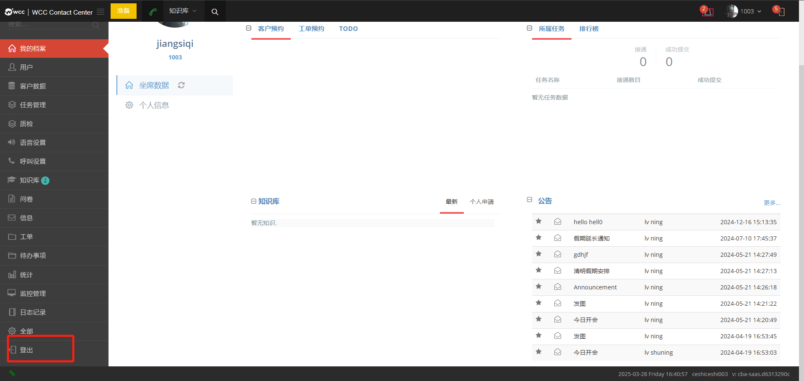

## 1 系统登录

在您正在使用的浏览器的地址栏中输入 URL。按 Enter 键进入系统登录页面。

用户账号为工号+@client名 ，密码为client提前预设的，输入正确账号和密码，勾选【进行人机身份验证】，验证后选择【登录】，可以成功进入系统。

用户可以通过选择【记住密码】，浏览器会记住此次的帐号密码，方便下次登陆。  

当用户进入系统时，选择左边的下拉选项【登出】，确认后，您将从系统中注销，页面将返回到用户登录页面。

## 2 界面介绍

WCC坐席界面窗口由3个主区域组成，他们分别是：①左侧菜单栏、②上方状态栏、③中间工作区

 

### 2.1 菜单栏

没有分配角色且没有坐席组长的坐席只有个人统计页面可以查看。

 

有坐席组长权限的坐席，可以登录所任组长组中的坐席。

查看所任坐组长组内坐席汇总的统计报告

   

查看所有坐席的实时监控页面

### 2.2 我的档案

用于平时仪表盘及联系客户。坐席登陆后默认显示内容。

#### 2.2.1 仪表盘

仪表盘中分为坐席数据页面和个人信息页面。

坐席数据：

主要包括对通话及工单等的数据概览，客户预约，工单预约，TODO，当前任务以及坐席排行榜。

概览：

可以直观的显示当前坐席的呼叫排队，工单数和呼入数

- **呼叫排队**：坐席所属坐席组的实时等待人数

- **工单数**：显示没有选择处理结果的工单数量，一旦该工单选择了处理结果，代表这个工单已完成就会不显示。是根据工作需要提出的工作记录，工单可以由上级用户（client）建立也可以由坐席直接建立。

- **呼入数**：坐席所属坐席组的实时呼入电话总数

- **客户预约**：显示坐席的所有预约客户。

①②③三个快捷按钮方便坐席对预约客户的信息进行编辑和修改

①重新将此客户分配至新的坐席（只有坐席为坐席组长时显示）

②修改这项预约的日期

③查看客户详情，进入客户弹屏

- **工单预约**：显示预约的工单。坐席可以点击工单，设定一个预约时间，设定好预约时间的工单，则会在此显示。

当即将到达预约时间时系统会自动出现提示若客户页面关闭即将到达预约时间时页面会自动弹出，提示时间范围在【系统偏好】预约提醒时间中可以设置。

- **TODO**：由上级用户（client）设置的需要该坐席办理的事项发布；或坐席自己点击➕添加的待办事项。

点击右侧箭头，可以对坐席待办事项标题以及坐席待办事项进行编辑和修改。

【编辑】页面（如下图）

①**任务标题**：坐席待办事项标题。

②**任务描述**：该坐席待办需要特殊注意或说明的描述。

③**预约时间**：这个待办的预约时间，会在坐席的仪表盘页面显示.

坐席可以对该待办事项的状态进行更改  

坐席建立的待办，如果被坐席标记成完成，则在坐席待办页面中的状态也会被更改  

【图片需替换】

【图片需替换】

（上图此为client/有坐席代办角色权限的坐席，页面显示状态）

- **所属任务**：显示当前坐席当天所执行的所有任务名称，接通数目和成功提交数。

所属任务由更高级别进行分配。接通数目是当前座席与客户成功建立通话数。成功提交数是座席不管是否成功通话，保存销售漏斗为成功的数量。（如下图）

【图片需替换】

- **排行榜**：当前座席所在座席组的座席成员的通话评分排行（如下图）

【图片需替换】

个人信息:

包括头像和坐席简介（如下图） 

【图片需替换】  

 **头像**：点击左上角头像位置进入设置头像界面 

从电脑中选择一张JPG格式的照片或将JPG格式的照片拖拽到①处(大小在 1mb 以内)，然后点击②设置头像；  

【图片需替换】

也可以点击网络摄像头，打开摄像头点击拍照，点击设置头像，头像设置完成。

【图片需替换】

**坐席简介**：包括姓/名/当前工号/Web登录密码（登陆座席系统密码）/确认Web登录密码

【图片需替换】

- **姓**：填写坐席姓氏

- **名**：填写坐席名字

- **当前工号**：当前页面坐席工号是唯一的，文本框为置灰状态为不可以修改（如下图）

【图片需替换】

- **Web登录密码**：当座席需要通过网页登陆时，需要使用此密码，坐席也可自行修改设置该密码

- **确认Web登录密码**：再次输入密码，保证与【Web登录密码】一致

#### 联系客户 

在联系客户页面，通常会有三个选择分类如图所示

【图片需替换】

①---如果这个client中有多个客户包，①处可以选择一个客户包

②---选择客户包后，②里显示的是这个客户包下的任务

③---选择任务后，③中显示的是这任务下所绑定的呼叫结果

**呼叫结果**：

是座席呼叫客户联络记录选择的通话结果，用于通话结果的分类。（如下图）

方便坐席通过呼叫结果进行查找客户。呼叫结果类型选择由更高级别用户创建，坐席可根据可选结果酌情选择。

【图片需替换】

**任务客户池**：

显示坐席所选任务中的所有客户数据，坐席可以在任务中对客户数据进行处理。

选择【抢】或者【换一批】】可以把当前页的客户数据分配到自己的客户下。

【图片需替换】

**我的客户**：

通过选择左上角的任务查看当前座席在【任务客户池】抢到的客户和自己额外添加的客户。

【图片需替换】

【客户的归属】

此时【我的客户➕】中的所有客户信息都属于当前坐席。

若客户C在坐席A列表中，坐席B拨打了客户C电话，并成功提交，客户C依然属于坐席A，转接同样适用。若客户C与坐席A在同一个项目时（前提坐席A先于客户C进入该项目），客户C始终属于坐席A。

若上级用户将客户C分配给新项目，而坐席A并没有参与新项目，那么客户C将会重新分配给其他坐席B，坐席A的客户列表里也不会出现客户C的信息，之后将坐席A重新添加到新项目，客户C依然属于坐席B。

【客户的归属改变包括两种】

a.客户从未分配状态分配到任务

b.客户由任务A分配到任务B

坐席可以通过点击【我的客户➕】的➕，自己额外添加客户

【图片需替换】

坐席对新增客户资料进行编辑，记录及预约

【图片需替换】

【客户资料】中的【取引先名】会在该客户的弹屏标签中显示；

客户的联系方式必须填写在【电话番号】中，坐席和坐席组长可以在【电话番号】的下拉列表中设置禁呼和加入黑名单，由client级别或是有授权的坐席组长进行审核。在审核过程中，该号码可以正常拨打，审核通过后，则该号码不能再拨打。

其中带有“✳”号项目为必填项目。编辑完成点击【保存客户资料】，完成对额外新增客户的添加。如下图

【图片需替换】

座席可以点击【我的客户】操作列下的【呼叫】进行呼叫

【图片需替换】

此时页面弹出弹屏标签：座席可以查看修改客户的详细资料、可以保存本次的联络信息、可以查看当前客户的历史联络记录、可以对客户进行预约.

【弹屏标签显示规则】未知@项目名，

① 默认为 未知

② 取客户第一个字段对应的值

③ 如果没有 2，取客户第二个字段对应的值

④ 如果有 取引先名 ，默认用这个

若客户弹屏上 ①②③④ 都不满足，则显示未知@项目名

座席可以查看修改客户的详细资料；可以保存本次的联络信息，查看当前客户的历史联络记录；可以对客户进行预约，建立客户工单资料。

【图片需替换】

客户相关记录：包括备注、短信、工单、联络信息、历史联络记录。其中历史联络记录是坐席主要工作页面。

备注：坐席可以在此给客户进行备注，备注分为【普通】、【置顶】和【弹屏警告】（如下图）

【图片需替换】

【普通】正常显示备注

【置顶】置顶显示该条备注

【弹屏警告】设置弹屏警告，需要上级用户或有审核权限的坐席审核成功后才可以生效。生效后，坐席查看该客户资料，拨打该客户电话或者接听该客户电话时就会收到该条弹屏警告。（关于审核流程，到Client手册查看）如下图：

【图片需替换】

**短信**：显示发送给该客户短信的详细内容（如下图）

【图片需替换】

**工单**：对当前客户所建立过的工单进行查看（如下图）

【图片需替换】

**联络信息**：相当于一个关联通讯录，可以添加客户的亲属信息（如下图）

【图片需替换】

**历史联络记录**：主要包括销售漏斗、呼叫结果、备注，如果之前已经对客户进行过沟通，则会显示该客户以往保存的联络记录（如下图）

【图片需替换】
 
联络记录默认显示，可以由拥有任务管理权限的管理员进行修改。

预拨号/双呼接通时，会自动生成一条联络记录

【图片需替换】

【图片需替换】

其余通话需要坐席手动保存后生成新的联络记录

【图片需替换】

**销售漏斗**：用于标记座席记录客户的通话状态情况，销售漏斗页面如下图，销售漏斗默认有三种：成功/失败/跟踪

【图片需替换】

当客户归属发生改变时，客户状态（销售漏斗）也会随之清空，可以在客户数据中查询。若客户信息已经成功提交，并带有质检状态，那么质检状态也会被清空。  

【图片需替换】

销售漏斗的分值代表座席的通话联络分值，最终可以根据坐席成功提交的人数进行打分排行，可以在座席数据页面的【排行榜】中查看。（如下图）

【图片需替换】

####呼叫结果：

是座席呼叫客户联络记录选择的通话结果，用于通话结果的分类。呼叫结果和销售漏斗互喂绑定的关系。

设置呼叫结果的流程（如下图）

在client级别新增呼叫结果页面新增，并绑定一个销售漏斗，选择一个呼叫结果的通话状态，通常分为三类，无/应答/未应答。无则为在通话状态中都会显示这个呼叫结果。

应答则是在应答状态下才会显示这个呼叫结果。未应答则是在通话被应答时不会出现这个呼叫结果。（注：坐席端有呼叫结果页面，但是不能将呼叫结果应用到任务。