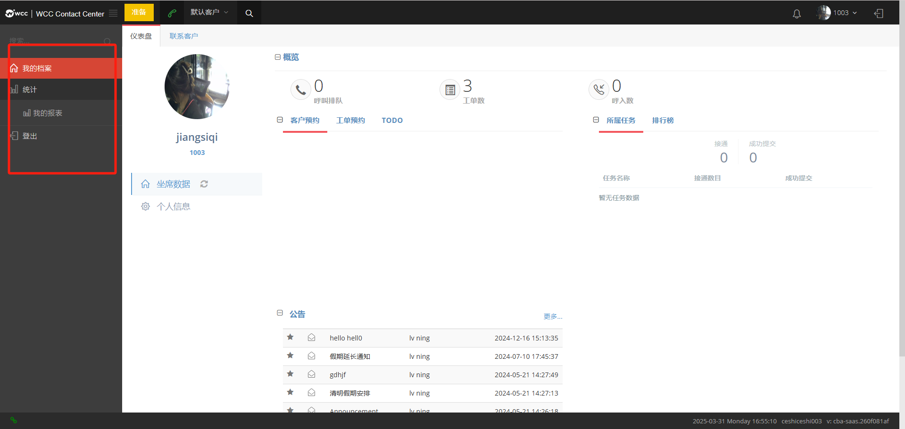
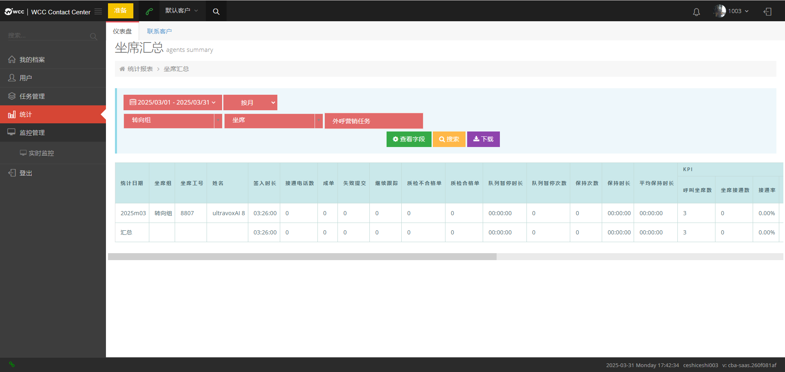

## 1 系统登录

在您正在使用的浏览器的地址栏中输入 URL。按 Enter 键进入系统登录页面。

用户账号为工号+@client名 ，密码为client提前预设的，输入正确账号和密码，勾选【进行人机身份验证】，验证后选择【登录】，可以成功进入系统。

用户可以通过选择【记住密码】，浏览器会记住此次的帐号密码，方便下次登陆。  

当用户进入系统时，选择左边的下拉选项【登出】，确认后，您将从系统中注销，页面将返回到用户登录页面。

## 2 界面介绍

WCC坐席界面窗口由3个主区域组成，他们分别是：①左侧菜单栏、②上方状态栏、③中间工作区

 

### 2.1 菜单栏

没有分配角色且没有坐席组长的坐席只有个人统计页面可以查看。

 

有坐席组长权限的坐席，可以登录所任组长组中的坐席。

查看所任坐组长组内坐席汇总的统计报告

   

查看所有坐席的实时监控页面

### 2.2 我的档案

用于平时仪表盘及联系客户。坐席登陆后默认显示内容。

#### 2.2.1 仪表盘

仪表盘中分为坐席数据页面和个人信息页面。

坐席数据：

主要包括对通话及工单等的数据概览，客户预约，工单预约，TODO，当前任务以及坐席排行榜。

概览：

可以直观的显示当前坐席的呼叫排队，工单数和呼入数

