## 2 工具栏

登录Client页面后，您可以在顶部的快捷菜单栏中使用一些快捷功能。

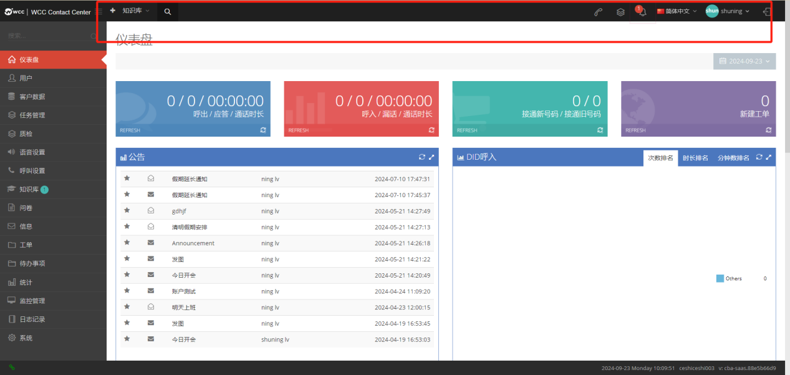

【折叠菜单】当您单击此按钮时，页面菜单不显示文本，仅显示图标。

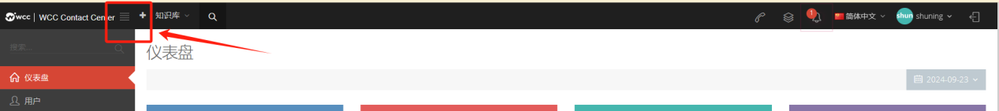

↓↓↓

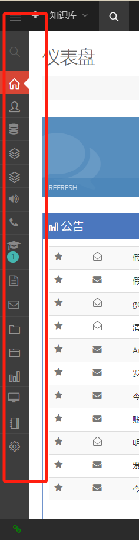

在这里，您可以选择功能的快捷方式。选中后，将显示这些快捷方式↓↓↓

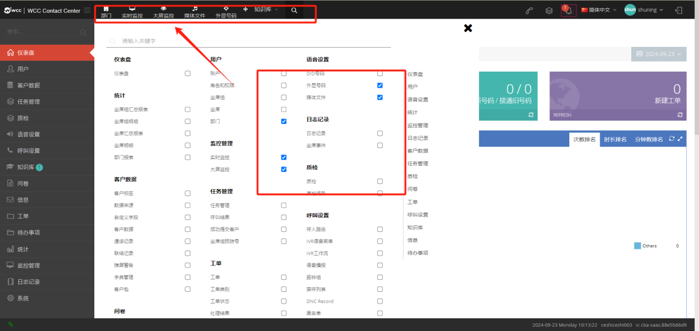

【快速搜索】按钮，可直接在知识库中搜索知识。

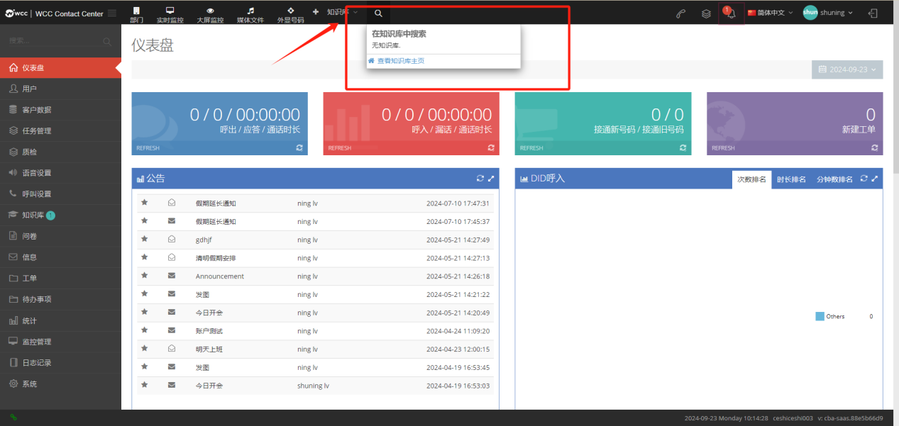

【呼叫】点击呼叫按钮，填写主叫号码和被叫号码，选择一个 外显号码 ，点击呼叫 ，即可在客户端级别进行指定呼叫。

主叫号码填写坐席号码，被叫号码填写外呼号码。

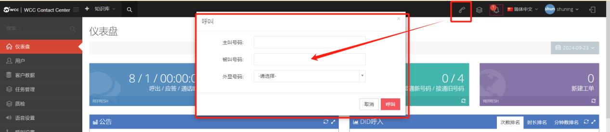

【任务】有导入或导出任务时，此处显示任务进度。

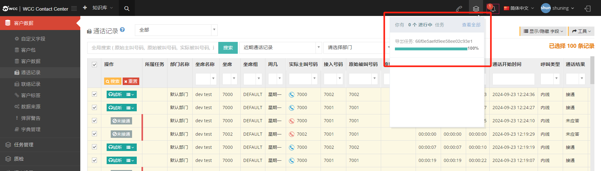

【消息提示】如果有系统通知消息，如公告、审核等，会展示在这里，点击查看消息。

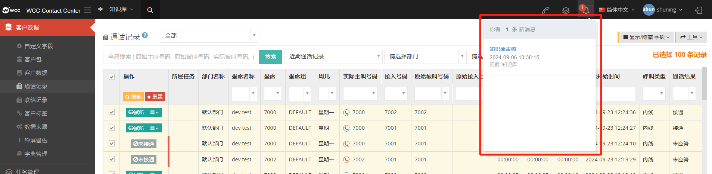

【语言】可以在这里切换系统语言，切换后刷新页面，当坐席在当前语言中登录时，坐席会遵循client的当前语言。

【client】单击此处查看客户的个人资料、公告和登录足迹（如果您是从高级登录者登录）

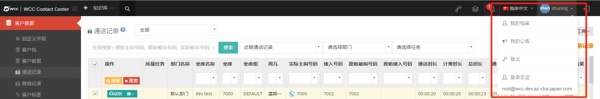

【我的档案】客户可以在此处修改他们的账户信息，包括用户名。

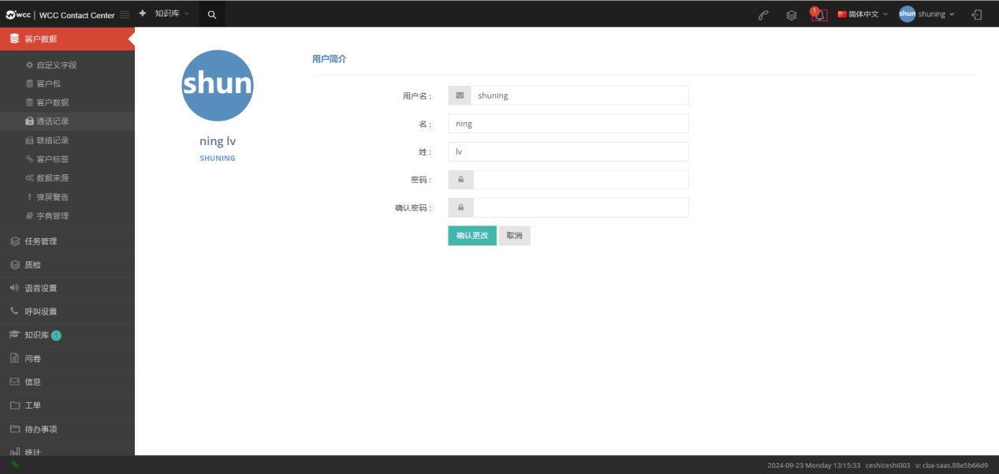

【聊天页面】client可以搜索坐席并与坐席聊天，有聊天记录的坐席可以直接显示在对话框栏中。

【用户】

1.  显示最近的联系人的姓名。

2.  Client在输入框中输入要发送的文本消息。

3.  单击获取消息历史记录 以查看以前与坐席的聊天。

4.  Client在输入框中输入短信发送。

5.  点击图【片发送】发送图片，图片格式目前支持JPG、PNG、JPEG。图片大小不得超过 2MB。

    点击【返回】，返回对话列表。

    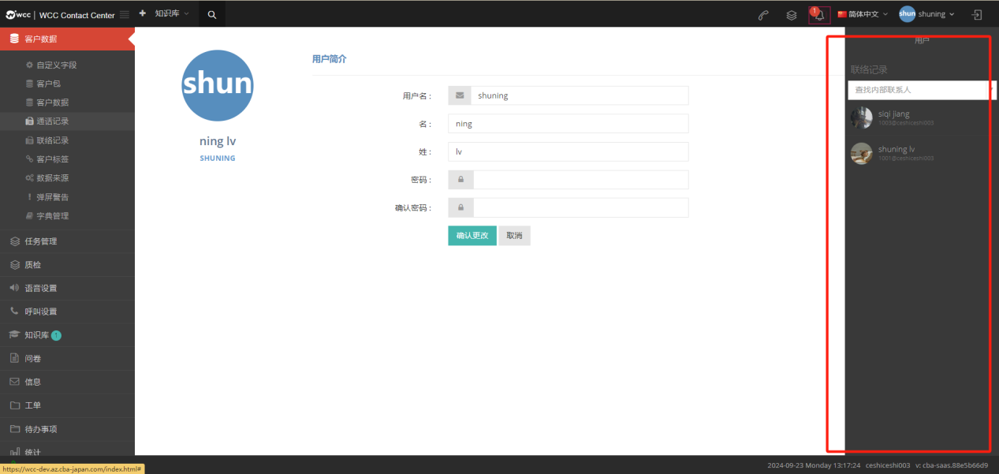

    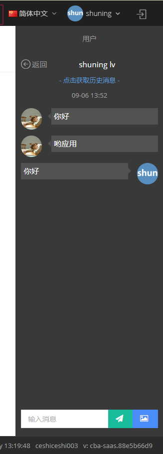
    
    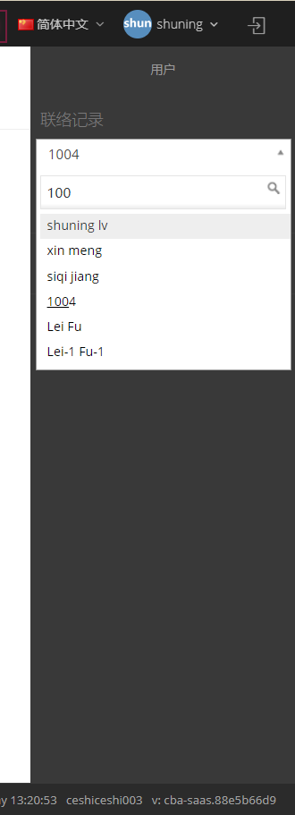

    【仪表盘】

仪表板显示代理呼叫的传入和传出统计信息。

Client用户可以在控制面板上查看统计信息; 呼出 / 接通 / 通话时长; 呼入 / 漏话 / 通话时长; 

接通新号码 /接通旧号码; 新建工单; 公告; DID 呼入; 主叫地区; 被叫地区; 设置参数 。

### 2.1 呼出 /接通/通话时长

**呼出**:该client当天呼出的电话总数。

**接通**:此client当天呼出通话的接通次数。

**通话时长:** client当天呼出接通的时间长度。

### 2.2呼入/ 漏话 /通话时长

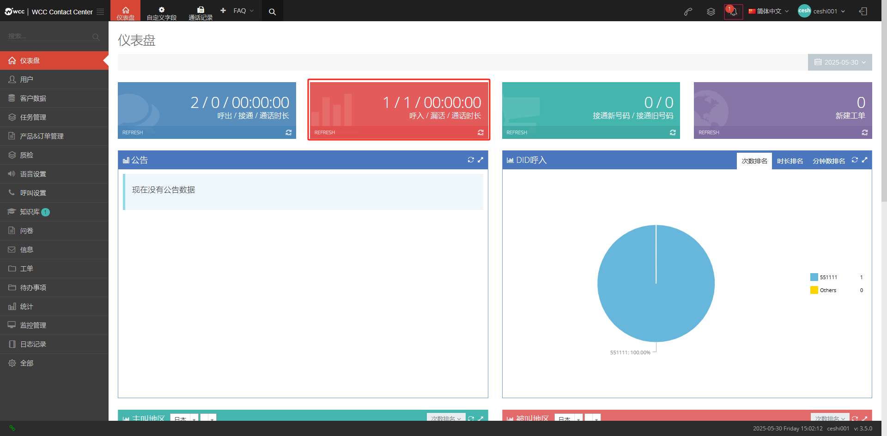

**呼入**:该client当日呼入通话的次数。

**漏话**:当日呼入到该client的通话，但是没有被接通。

**通话时长**: 当日呼入到该client的接通通话时长。

### 2.3接通新号码/ 接通旧号码

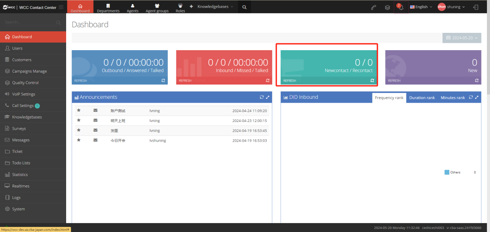

**接通新号码**:首次呼入该client并被接通的号码。

**接通旧号码**:系统已保存或删除的号码将在拨打并接通后显示为旧号码。

### 2.4 新建工单

同一天创建的所有工单，包括在客户端级工单页面上创建的工单和在客户配置文件页面上创建的工单。只有当天的记录将在第二天重置。

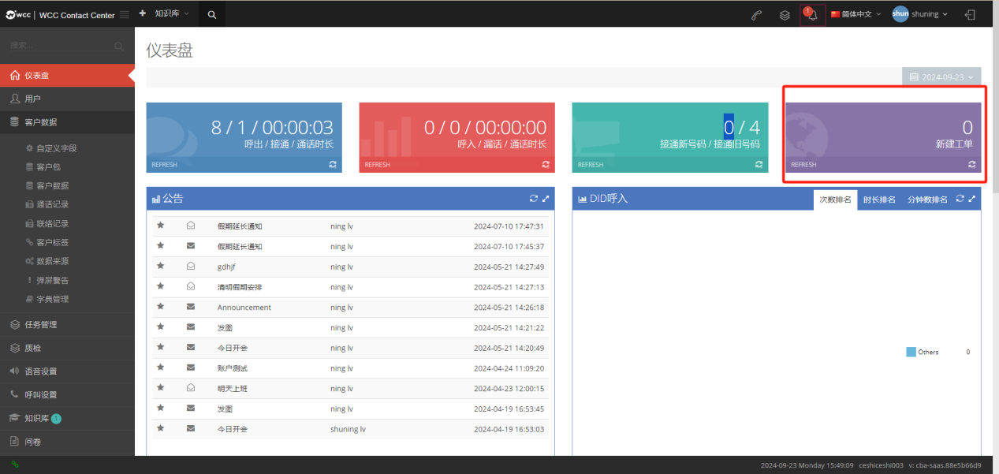

### 2.5 公告 

Client及其坐席创建的所有公告将累积显示。

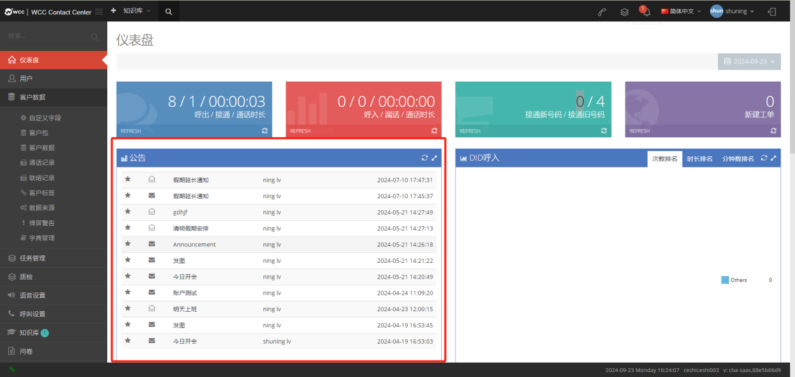

### 2.6 did 呼入

did呼入次数所占百分比的饼状图。  

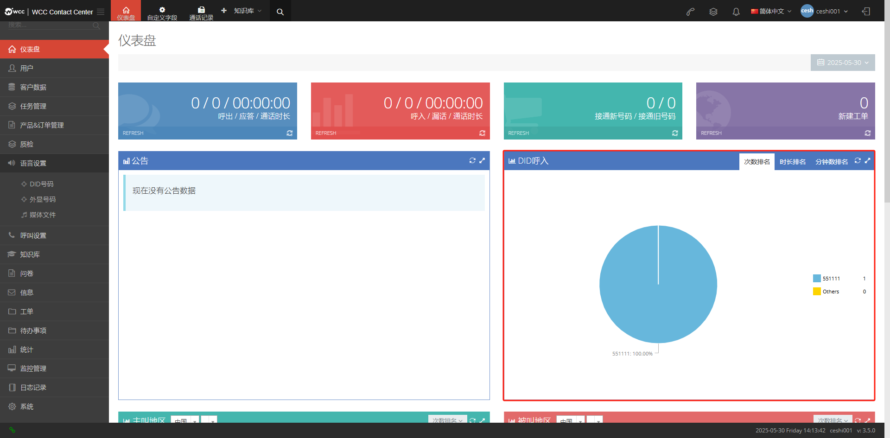

次数、时长、分钟数的饼状图会先显示 DID 名称，没有名字则显示数字。

1.频率排名：统计 DID 号码的来电次数，所有打到 DID 的号码都会被统计（来电接通/未接通），每个来电在 DID 号码后 +1。  

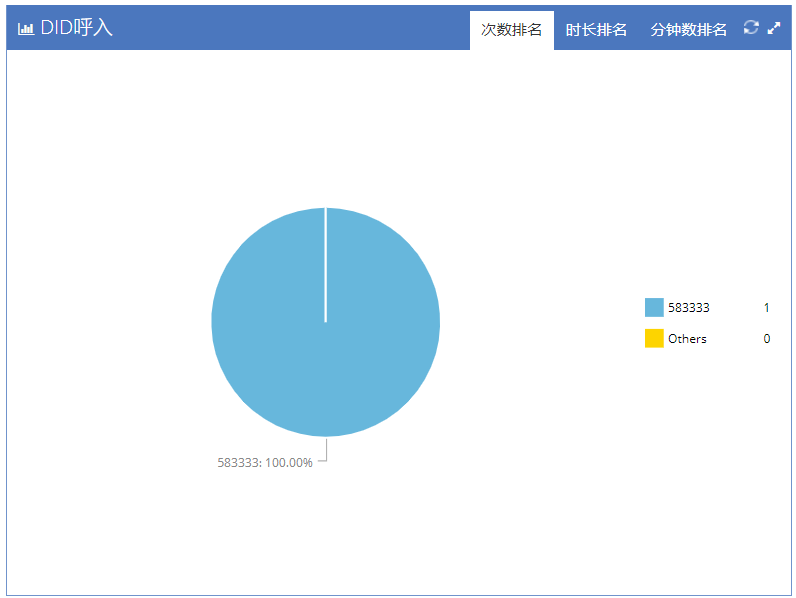

2.时长排名：计算 DID 号码来电的通话时长，以分钟为单位显示，计数范围如下：

1）**DID 转IVR，按钮转接给坐席**：呼入时间将计入总通话时长，无论是否点击按钮转接，也无论坐席是否接通。

2）**DID 转语音播报，再转给坐席**：呼入时间将计入总通话时长，无论坐席是否接通，总通话时长都计算在内。

3）**DID 转接坐席组**：呼入时间将计入总通话时长，无论坐席是否接通，总通话时长都计算在内。

4）**DID 转振铃组**：只有坐席接通后，才会计算通话时长。

5）**DID 转条件，再转接给坐席**:只有坐席接通后，才会计算通话时长。

6）**DID 转接坐席**:只有坐席接通后，才会计算通话时长。

7）**DID 转外号码**：只有外线号码接通时，才会计算通话时长。

8）**DID 转挂断**：不计算在内。 

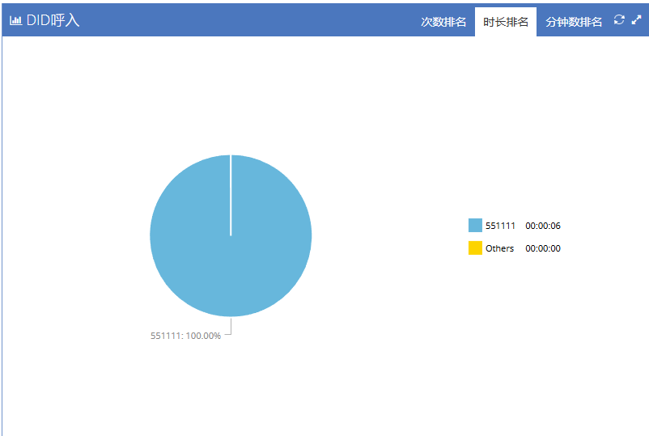

3.分钟数排名：计算呼入到该did号码下的呼入应答数，每呼入并接通一通电话就会在该did号码后+1，呼入到坐席组、语音播报和ivr语音菜单，呼入不接通也会计数。

1）**DID 转接 IVR，按键转接给坐席**：呼入会 +1。

2）**DID 转到语音播报，然后转接给坐席**：呼入会 +1。

3）**DID 转接到坐席组**：呼入会 +1。

4）**DID转接到振铃组**：坐席接通+1，未接通不会计算。

5）**DID转条件后转给坐席**：坐席接通+1，未接通不会计算。

6）**DID转坐席**：坐席接通+1，未接通不会计算。

7）**DID转外线号码**：坐席接通+1，未接通不会计算。

8）**DID转向挂断**:不计算在内。

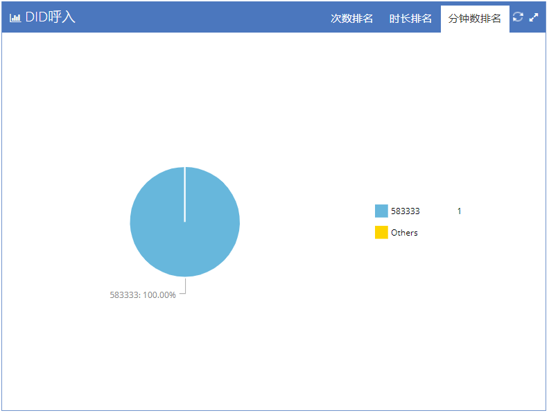
