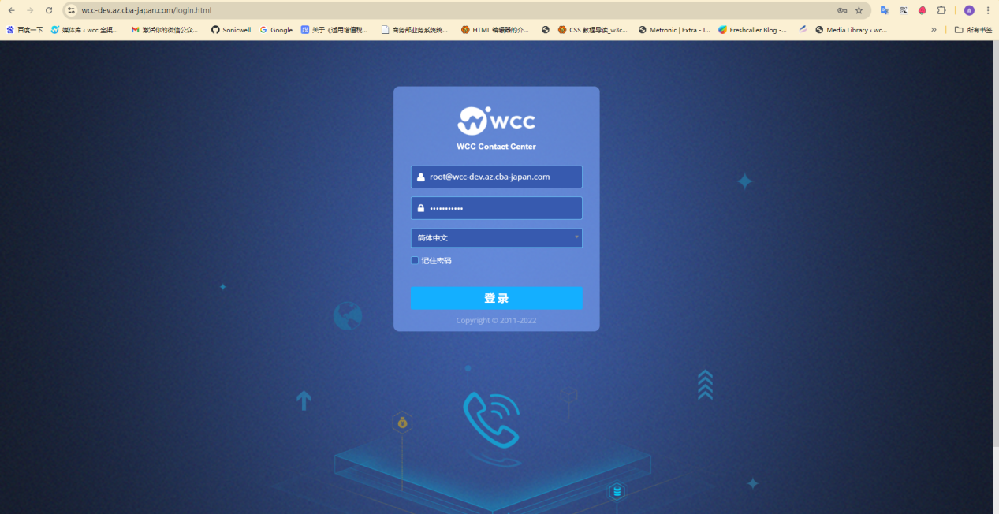
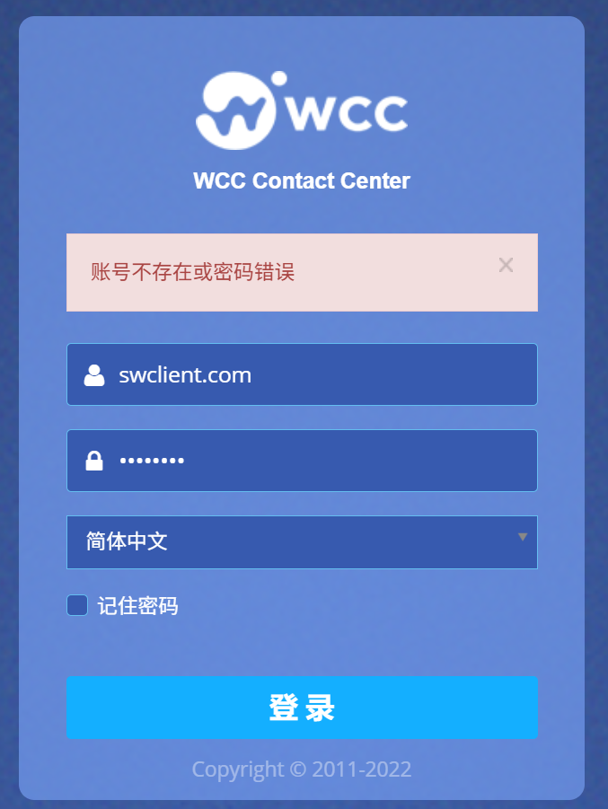
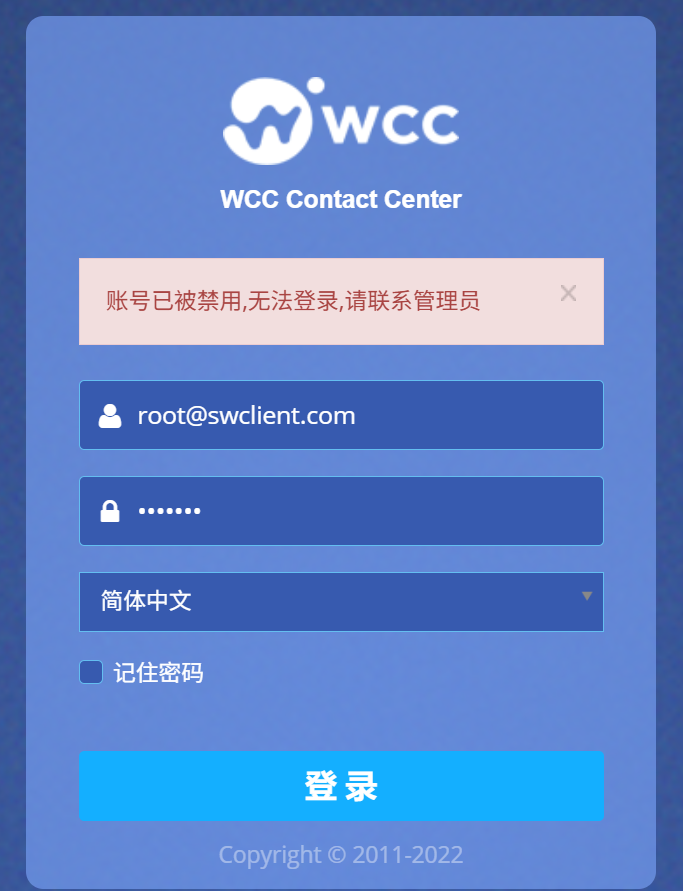
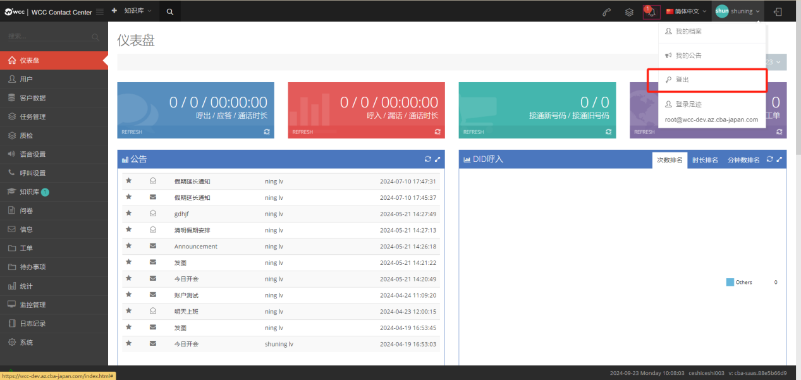

## 1 登录

1. 进入登录页面

打开任意常用浏览器（如 Chrome、 Firefox 等），在浏览器顶部的地址栏中，准确输入系统 URL。输入完成后，按下键盘上的 Enter 键，即可跳转至 WCC 客户端系统登录页面。

2. 账号密码填写

账号说明：登录账号为您的【client名称】，请确保账号输入准确（区分大小写，无多余空格）。 

密码说明：初始密码将由管理员分配，您可登录后通过【代理商】→【通用】→【密码】路径修改个人密码，建议定期更换密码以保障账号安全。

填写要求：在登录页面对应的 “账号”“密码” 输入框中，分别输入正确的账号和密码，输入过程中可核对避免拼写错误。

3. 便捷登录设置

若您使用个人专属设备（非公共设备）登录，可勾选登录页面的【记住密码】选项。勾选后，浏览器将自动保存您的账号和密码信息，下次访问登录页面时无需重复输入，提升登录效率。

注意：公共设备（如网吧、共享办公电脑等）请勿勾选此选项，防止账号信息泄露。

4. 完成登录

确认账号、密码输入无误后，点击登录页面的【登录】按钮，即可成功进入 WCC 客户端系统。

5. 登录异常提示及处理

| 异常内容提示     | 可能原因     | 处理方式   |
| ----------- | ----------- |-------|
| 账号不存在或密码错误 | 1. 账号输入错误（如拼写错误、大小写错误）；2.密码输入错误（如忘记密码、大小写 / 特殊字符未正确输入）| 1. 核对账号信息，确认无误后重新输入；若忘记密码，联系管理员重置密码，重置后及时修改个人密码| 
| 账号已被禁用，无法登录，请联系管理员 | 账号因违规操作、权限调整等原因被管理员禁用 | 直接联系系统管理员，咨询账号禁用原因，待管理员处理后再尝试登录 |

  

6. 成功登录系统后，点击页面右上角的用户相关下拉菜单（通常显示用户名或 “我的档案” 入口）。

7. 在下拉选项中找到【登出】按钮，点击该按钮。

8. 系统将弹出确认登出的提示窗口，点击【确认】后，即可退出当前账号登录状态，页面自动跳转回系统登录页面。  

