## 3 菜单功能

### 菜单功能描述

登录 WCC 客户端后，左侧菜单栏聚合了系统核心功能模块，涵盖用户管理、客户数据、任务管理、质检、语音设置、呼叫设置等核心操作入口。各模块功能独立且互联互通，可满足账户配置、客户管理、呼叫运营、数据统计等全流程需求，操作逻辑清晰，便于快速上手。

### 核心功能模块说明

#### 3.1 用户管理

聚焦账户、坐席、坐席组、角色权限及部门的配置与管理，是系统权限与人员架构搭建的核心模块。

##### 3.1.1 账户管理

1. 核心作用：创建和管理系统账户，分配权限角色，实现不同账户的功能权限隔离。

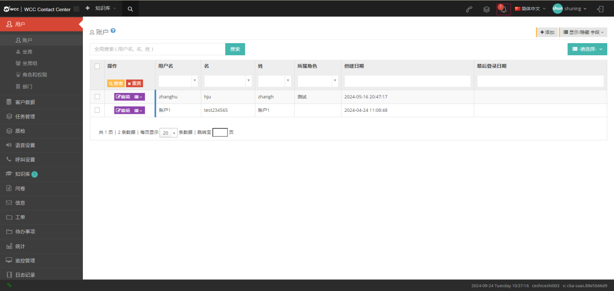

2. 关键操作：

    【搜索】支持通过用户名、名、姓进行全局搜索，快速定位账户。

    【添加】点击【添加】，填写用户名（不可重复）、姓、名、密码等必填信息，选择所属角色，高级设置中可添加备注，保存后完成创建。

    【显示/隐藏字段】显示或隐藏该页面的字段。

    【请选择】按条件删除。

    【编辑】编辑该账户的信息。

    【下拉菜单】以该账户登录或删除该账户。

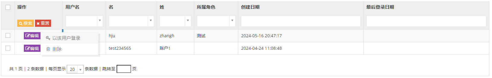

3. 添加账户的具体步骤

①点击【添加】进入添加账户常规设置页面：

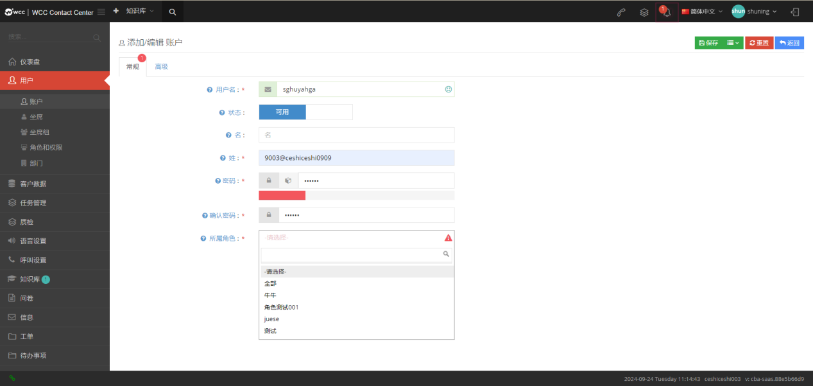

- **用户名**：用户将用此用户名进行系统登录,用户名填写不可重复。

- **状态**：您可以选择此帐户为禁用，禁用后，您无法使用该帐户的名称和密码登录，页面提示“该帐户不存在或密码不正确”。

- **姓**：请输入用户姓氏，姓氏是必填字段。

- **名**：请输入用户名字，用户的名字最长不超过四十个中文字符，且该字段为必填字段。

- **密码**:输入一个密码或是自动生成一个密码。

- **确认密码**:请再次输入密码，确保两次密码相同。

- **角色**:角色是用于设置这个账户可以访问的页面以及这个账户在这个页面上所拥有的权限，角色是建立用户的必填字段。

②点击【高级】设置此账户的备注：

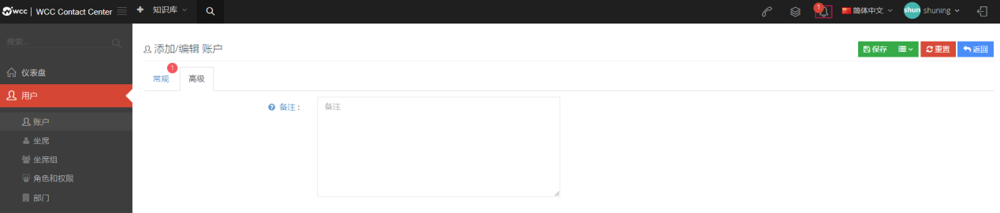

③保存后，账户创建成功。

④创建成功后账户页面显示创建成功的系统账户，点击编辑可对其账户信息进行重新编辑修改，编辑用户时可以看到账户的创建日期和最后更新这个账户的更新日期。

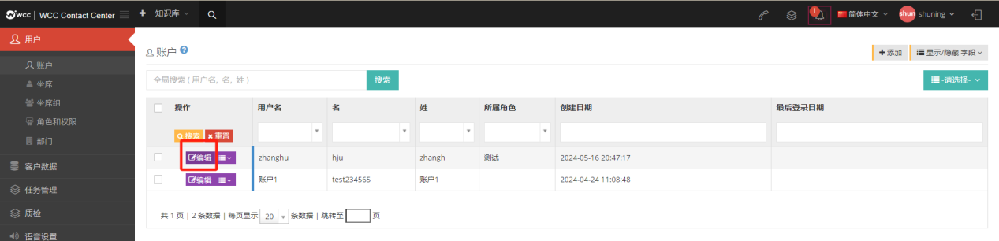

⑤点击下拉菜单，即可以该用户登录或删除该用户

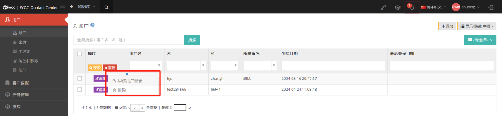

#### 3.1.2 坐席管理

1. 核心作用：创建坐席并配置相关参数，坐席是系统的基本工作单位，可通过 SIP 设备或绑定电话号码发起 / 接收呼叫。

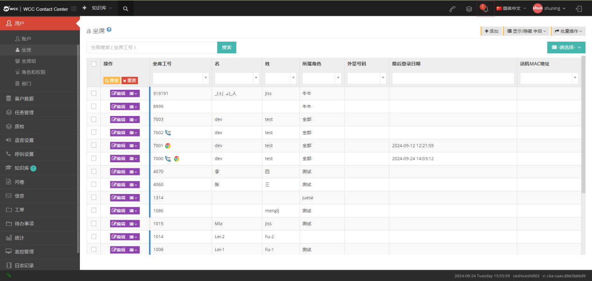

2. 关键操作

    【搜索】仅支持通过坐席工号进行全局搜索。

    【添加】逐个添加新的坐席。

    【显示/隐藏字段】选择在坐席页面需要显示或是需要隐藏的字段。

    【批量操作】对坐席进行-批量添加-批量编辑。

    【请选择】按条件删除。

3. 添加新坐席的具体步骤

添加坐席有两种方式：逐个添加或批量添加。

①点击添加进入添加/编辑坐席的常规页面：

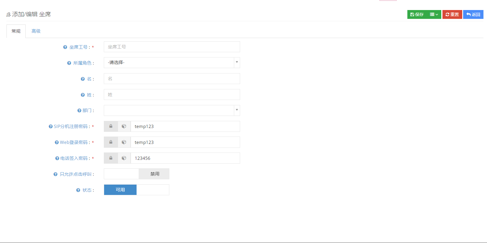

- **坐席工号**:坐席工号应该是唯一的，它是注册sip电话机时的用户名。用途包括-通过浏览器登录系统，通过电话签入坐席组，内部拨号使用等。坐席工号是长度为2-6的数字组成，且首位非零，如01001不可设置，坐席工号设定后不可更改。

- **角色**:为这个坐席分配权限角色。

- **名**：为这个坐席填写名字。

- **姓**：填写坐席姓氏。

- **部门**:设置这个坐席所在的部门。

- **sip分机注册密码**:当坐席需要注册sip设备时，需要使用这个密码。

- **web登录密码**:浏览器的登录密码。

- **电话签入密码**:当坐席需要通过电话使用功能键签入系统时，需要使用此密码。

- **只允许点击呼叫**:当该功能启动时，坐席不能用通话话机直接按键拨号至客户，只允许坐席在浏览器上对客户点击呼叫。

- **状态**:当坐席被禁用时，坐席无法进行拨号操作，例如接打电话，登录系统。登录系统时会被提示，账号已被禁用，无法登录，请联系管理员。

②点击【高级】进入添加/编辑坐席的高级页面：

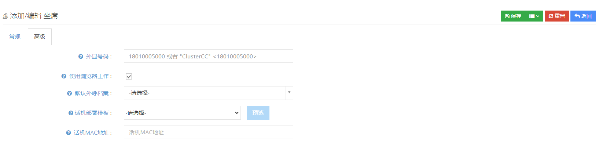

- **外显号码**: 定义坐席外呼时显示的主叫号码，通常会在通话记录的实际主叫号码中显示。坐席级设置＞任务级设置＞系统偏好设置，坐席设置的外显号码优先级最高。

- **使用浏览器工作**:  

      如果勾选（使用浏览器工作）：

      1.坐席需先登录Web坐席台，才能成功用话机签入坐席组。

      2.一旦关闭浏览器，并在设定的时间（秒）后，系统会自动将该坐席从组内签出。

      如果不勾选（不使用浏览器工作）：

      1.坐席无需操作浏览器，可直接使用话机签入坐席组。

      2.系统不会因其关闭浏览器而执行自动签出。

- **默认外呼档案**:你可以为此坐席组设置一个默认外呼档案，签入此坐席的坐席都会根据此外呼规则通话。可以设置外呼档案的地方有：坐席、部门、任务、系统，当坐席两端呼时，使用外呼档案的有优先级是：任务&gt;坐席&gt;部门&gt;系统

- **话机部署模版**:请选择您需要的模版名称，选择代理商建立的话机部署模版，选择后进行保存，再次点击查看可以进行预览。

- **话机MAC地址**:请填写你的话机响应的MAC地址（请在话机中查看）。

4. 批量建立新坐席

①单击“批量操作”-“批量添加”，进入“批量添加”页面：

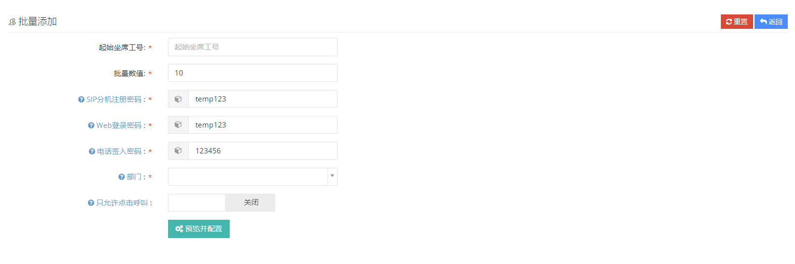

- **起始坐席工号**：添加坐席的首个开头工号。

- **批量数值**：批量添加的坐席个数。

- **sip分机注册密码**：当坐席需要注册sip设备时，需要使用这个密码。

- **web登录密码**：浏览器的登录密码。

- **电话签入密码**：当坐席需要通过电话功能键签入系统时，需要使用此密码，该密码没有长度限制默认密码为123456。

- **部门**：请设置这些坐席所在的部门。

- **只允许点击呼叫**：当该功能启动时，坐席不能用通话话机直接按键拨号至客户，只允许坐席在联系客户页面的客户弹屏中对客户点击呼叫。

    <u>注意：如果从起始号码开始到批量数值结束的坐席号码中存在重复的坐席号码，坐席建立时会自动跳过这些已经存在的坐席，右上角会有系统提示。</u>
 
②点击【预览并配置】出现批量导入表单，可以进行细致的设置：

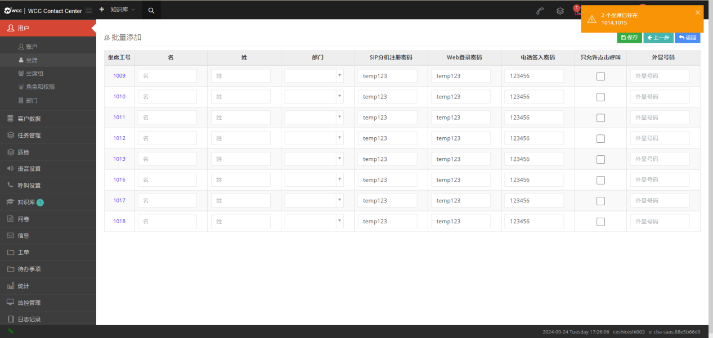

③对已经建立好的坐席，用户也可以选择需要的坐席，点击工具中的【批量编辑】，对坐席进行批量的快速编辑:

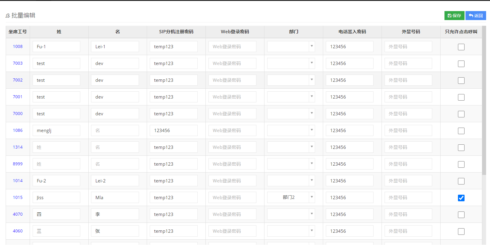

#### 3.1.3坐席组

1. 核心作用：对坐席进行分组管理，坐席需签入坐席组开展工作，支持呼入呼出路由分配、报表统计等功能。

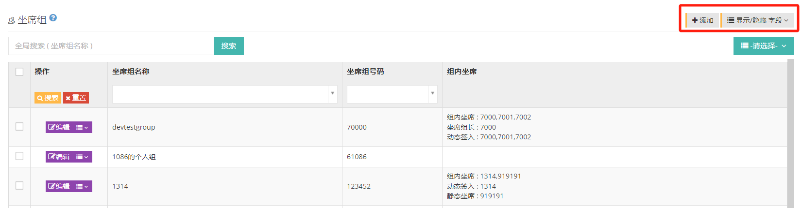

2. 主要操作

     【搜索】通过坐席组名称进行全局搜索。

     【添加】填写坐席组名称、唯一号码（不可修改），添加组内坐席和坐席组长（可设置多个，拥有监控、监听等额外权限）。

     【显示/隐藏字段】选择在坐席组页面需要显示或是需要隐藏的字段。

     【请选择】按条件删除。

     【编辑】编辑该坐席组。

     【下拉菜单】删除该坐席组。

3. 添加一个新的坐席组

①点击【添加】，进入添加 坐席组的通用页面：   
  

- **坐席组名称**：坐席组名称用于在系统中识别该坐席组，你可以在任何时候修改该名称。

- **坐席组号码**：坐席组号码只能使用数字，不同的坐席组必须使用不同的号码，一旦设定好便不能修改。

- **组内坐席**：添加坐席到此坐席组，添加的坐席默认是动态坐席，你可以添加多个坐席到该坐席组。

- **坐席组长**：坐席组可以设定多个坐席组长。坐席组长除了普通坐席功能外，还有监控、监听、密语、强插等功能。

②点击【高级】进入添加坐席组高级设置页面：

- **自动退出话后**：设置坐席进入话后状态，多少秒之后自动结束话后。（当设置选择零时，即为不退出话后状态。没有最大数值限制）

- **话后处理**：通话结束后，系统将让坐席进入“话后”状态，使其能处理后续工作而不被新来电打断。
       
       ① 禁用：关闭此功能，坐席通话结束后不会进入话后状态。

       ② 应答话后：坐席接通一个来电（无论是呼入坐席组还是预拨号外呼）后，进入话后状态。

       ③ 振铃话后：坐席电话一旦振铃（无论是否接听该来电），即进入话后状态。

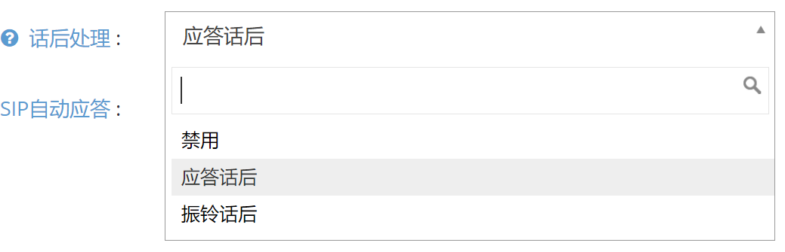

- **SIP自动应答**：大部分的IP话机支持一个特殊的SIP头消息，当呼叫请求中包含此消息时，话机会自动应答。

- **队列**：呼入到队列的时候，坐席的话机处于可用状态，当坐席签入队列并空闲，呼到坐席自动会被接通。

- **预拨号**：在预拨号呼出时，坐席签入队列并空闲，外线接通电话后，呼到坐席时话机会被自动接通。

- **点击拨号**：坐席在【我的客户】页面点击电话符号，即可发起呼叫。系统提供两种外呼模式；

      ① 双呼模式（默认/自动应答）：系统将自动接通坐席话机，并同时向外呼出，无需坐席手动操作。

      ② 手动应答模式（未启用自动应答）：点击后，坐席的话机将率先振铃，坐席必须先接听话机，系统才会继续向外拨号。

③点击【队列】进入添加坐席组的队列设置页面:

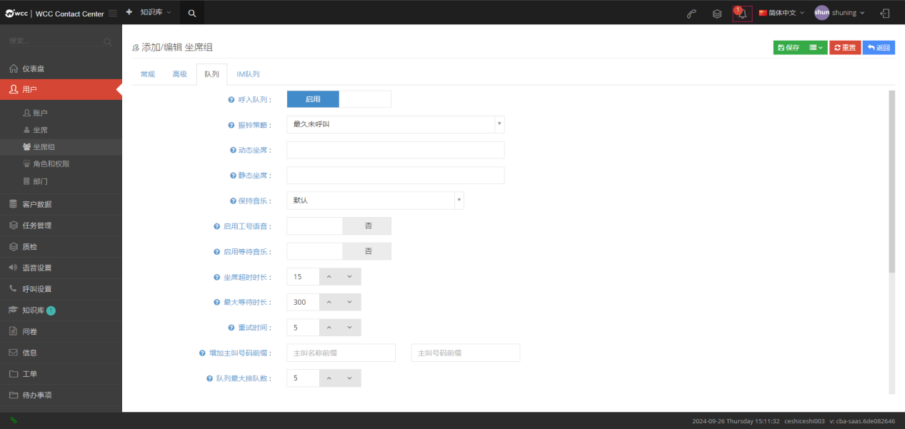

- **呼入队列**：如果你想使用该坐席组处理呼入通话或者预拨号，你需要开启并配置队列功能。

- **振铃策略**：

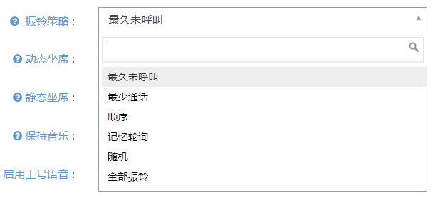

     ① 最久未呼叫：
     - 释义：优先呼叫当日处于 空闲 状态时间最长的坐席。
     - 主逻辑：计算组内每位坐席自上次通话结束后的空闲时长，选择时长最长者。
     - 平局处理：若多坐席时长相同，则按坐席组管理页面的列表顺序，从上至下依次呼叫。

     ② 最少通话: 
     - 释义：优先呼叫当日成功接通量最少的坐席。
     - 主逻辑：统计组内坐席的当日接通量，选择数量最少者。
     - 平局处理：若多坐席接通量相同，则按坐席组管理页面的列表顺序，从上至下依次呼叫。

     ③ 顺序：
     - 释义：严格按照坐席组列表中显示的顺序进行呼叫。
     - 逻辑：每一次呼叫都从坐席组管理页面的列表顶部开始，依次向下轮询，循环往复。

     ④ 记忆轮询: 
     - 释义：在顺序轮询的基础上，记忆上次的接续点，能均衡分配来电，避免总从固定位置开始。
     - 初始/重置：当策略被保存或重新应用时，从列表顶部开始。
     - 持续轮询：每次呼叫成功后，下一次呼叫将从上次接通坐席的下一位开始。

     ⑤ 随机: 
     - 释义：在就绪坐席中完全随机选择，无任何顺序。
     - 逻辑：每次呼叫时，系统在所有“空闲”状态的组内坐席中随机抽取一位。

     ⑥ 全部振铃: 
     - 释义：让所有空闲坐席同时振铃。
     - 逻辑：来电时，坐席组内所有处于“就绪”状态的坐席话机将同时开始振铃，任一坐席接听则其他坐席停止振铃。
     - 建议：为保证接听体验与系统性能，建议单个坐席组的并发振铃坐席数不超过30个。

- **动态坐席**：动态坐席表示这些坐席可以自由的从该坐席组签入签出。

- **静态坐席**：静态坐席将一直签入在此坐席组中，静态坐席不允许在坐席页面被删除。

- **保持音乐**：选择一段音乐，以便在队列呼叫处于保持状态时播放，如果未选择，则默认播放系统保持音乐，系统保持音乐可以在系统设置中进行选择。

- **启用工号语音**：若此队列需要播报工号，你可以通过设定工号通告来实现，系统默认提供了“工号前语音”和“工号后语音。如果选择【是】，则会出现工号前语音和工号后语音。

- **工号前语音**：在选择启用工号语音后，可以选择一个语音文件，该文件在播报工号前播放。

- **工号后语音**：在选择启用工号语音后，可以选择一个语音文件，该文件在播报工号后播放。

- **启用等待音乐**：客户在队列中等待时，是否播放等待音乐。若选择【是】，则会出现等待音乐选项。

- **等待音乐**：如果选择了启用保持音，请选择一个等待音乐，以便坐席呼入时播放音乐。

- **坐席超时时长**：坐席最多几秒不接电话的时长就是超时时长，到达该时间后队列将呼叫下一个优先级的坐席。

- **最大等待时长**：允许客户在队列中等待的最长时间，0表示无限制。

- **重试时间**：在重新拨打下一个可用坐席前的等待时间（单位：秒）。

- **增加主叫号码前缀**：通过该队列呼入或是呼出的通话，可以添加一个可以区分的主叫名称。   主叫号码前缀：通过该队列呼入或是呼出的通话，可以添加一个可以区分的主叫号码前缀。  

- **队列最大排队数**：队列中的排队人数到达此限制后，则不允许新的客户进入队列。

- **允许进入空队列**：是否允许客户进入一个没有任何坐席签入的队列。当选择是时，即该队列中没有任何坐席，客户仍然可以在队列中等待，否则当此项设定为否时，队列中没有任何坐席签入时，主叫方将进入失败转向。

- **自动退出空队列**：当队列中有客户排队，此时最后一个坐席签出，剩下的客户是否会被移出队列。

- **自动暂停**：启用自动暂停后，如果呼叫当前座席组中的座席，未应答或挂断，则该座席将被自动暂停。

- **启用队列通告**：队列通告是刚一进入队列要播放给客户的语音。如果系统启用队列通告，客户将在队列中首先听到通告语音。若选择【是】，则会出现队列通告。

    **队列通告**：队列通告是刚一进入队列要播放给客户的语音。如果系统启用队列通告，客户将在队列中首先听到通告语音。

- **启用坐席通告**：坐席在接听队列来电时,与主叫通话前播放语音通告。若选择【是】，则会出现坐席通告语音。

    **坐席通告语音**：坐席通告语音是通话被分配到坐席要播放的语音。如果系统启用坐席通告，客户将在与坐席通话前先听到通告语音。

- **周期性公告**：系统是否允许你向队列中排队的客户周期性播放信息。若选择【是】，则会出现播放周期和周期语言。

    **播放周期**：选择周期性播放后会出现播放周期，可以设置公告循环时间，即多少秒循环一次该公告。

- **周期语音**：选择周期性公告后会出现周期语音，周期语音是指可以选择循环公告的语音。

- **坐席位置通告**：是否启用座席所在位置的通告语音。若选择【是】，则会出现通告周期。

- **溢出转向**：当呼叫列队无空位时，有其他例如IVR语音菜单、振铃组、条件、语音播报、坐席组、坐席、外显号码等可供转向选择选择.

④单击【IM 队列】可进入添加坐席组的 IM队列设置页面：

- **技能别名**：坐席组能够被分配到在线咨询服务中。技能别名是这个坐席组能够对外提供的服务名称，用于展示给客户。

- **分配方式**：当在线咨询服务产生请求时，坐席能够通过哪种方式获得这个请求。

- **同时接待数量**：坐席组能够同时处理的请求数量最大值。

#### 3.1.4角色和权限

1. 核心作用：定义系统功能的访问权限，可灵活分配给账户或坐席，实现精细化权限控制。

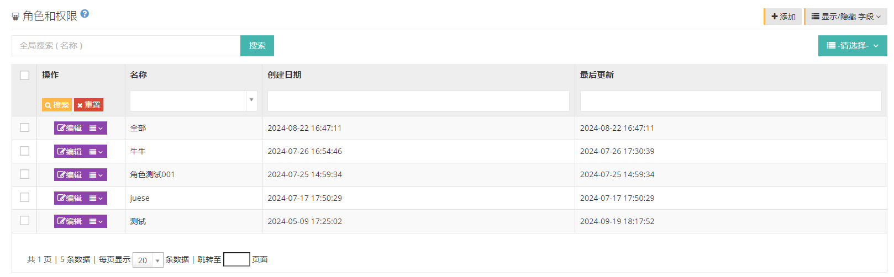

2. 关键操作： 

     【搜索】仅支持以角色名称进行全域搜索。

     【添加】添加一个新的角色。

     【显示/隐藏字段】显示或隐藏该页面的字段。

     【请选择】按条件删除。

     【编辑】编辑该角色。

     【下拉菜单】克隆或删除该角色。

3. 添加新角色

①点击添加进入添加/编辑角色权限【常规】界面：

- 名称：请为这个权限的角色命名。

②点击高级进入添加/编辑角色和权限的高级页面：

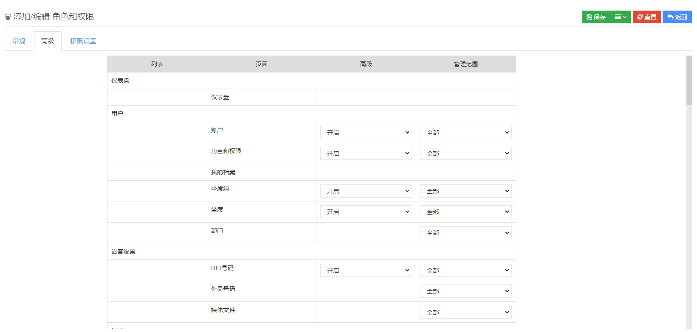

- 功能描述：在角色权限的“高级页面”模块中，管理员可精确控制表格字段的显示与隐藏。

- 权限效果：若禁用某个角色“查看坐席组高级页面”的权限，则拥有该角色的所有坐席或账户，将无法访问且无法编辑坐席组的高级页面。

      例如：通话记录中，若角色设置范围为仅自己，那么拥有这个角色的坐席只能查看本人产生的通话记录；若选择的是所在坐席组，那么坐席可以产看所在坐席组内所有成员的通话记录；若选择的是全部，那么坐席可以查看该client下所有坐席的通话记录。

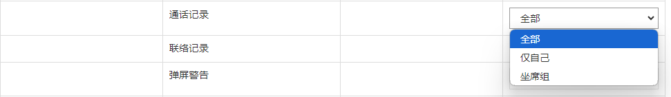

③点击权限设置进入添加/编辑角色和权限的权限设置页面：

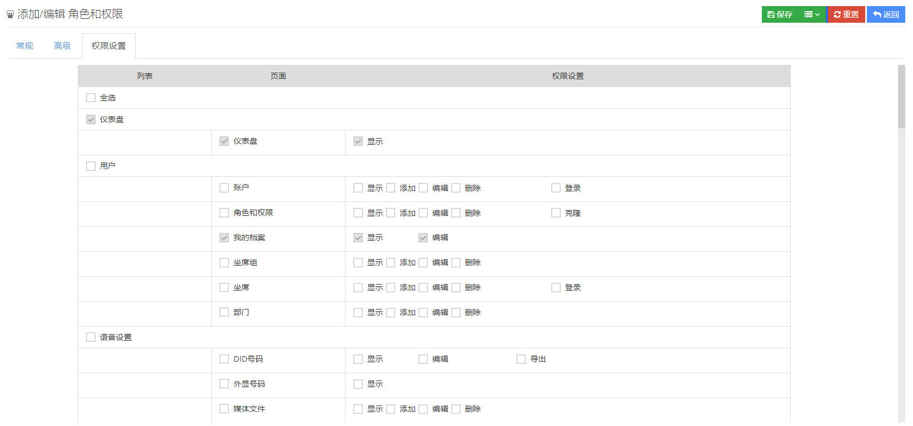

管理员在此为角色配置可使用的系统功能权限。系统默认权限（灰色不可选项）已自动赋予。自定义权限（如“添加坐席”）一旦禁用，则所有拥有该角色的用户将立即失去此项操作权限。

④完成以上步骤后点击保存即可保存该角色权限。

#### 3.1.5部门

1. 核心作用：标记坐席所属部门，便于管理分类，同部门坐席可实现通话抢接功能。

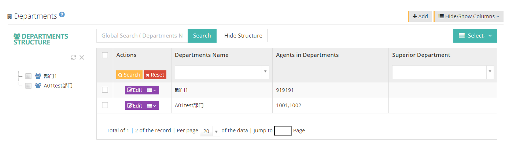

2. 关键操作

     【搜索】全局搜索仅支持部门名称搜索。

     【隐藏（显示）结构】选择是否显示部门结构。

     【添加】添加一个新的部门

     【显示/隐藏字段】选择在部门页面需要显示或是需要隐藏的字段。

     【请选择】用户可以按条件进行删除操作。

3. 添加一个新的部门

①点击添加进入添加/编辑部门的常规页面：

- **部门名称**：请填写这个部门名称。

- **坐席**：当前Client用户已创建的坐席，添加在该部门的坐席成员，可以选择多个坐席到此部门，但一个坐席只能在一个部门中。

- **外呼档案**：任务的外呼档案，设置后此任务外呼或预拨号时都会根据此外呼规则通话。（此处在呼叫设置中有详细讲解）

- **上级部门**：请选择上级部门，上下级部门依旧属于不同部门。

- **管理员**：请填写管理人员。

②点击保存即可保存该部门。

### 3.2客户数据

#### 3.2.1自定义字段

1. 核心作用：扩展客户资料的字段类型，满足个性化数据记录需求，支持字段权限控制和排序调整。

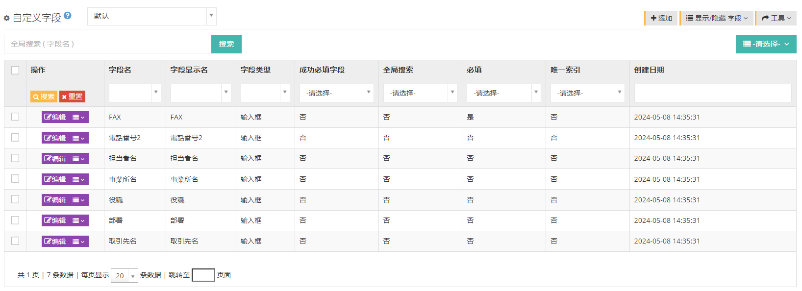

上图中的【默认】是客户包的选择，【默认】为默认客户包，也可选择具体客户包进行自定义字段的添加编辑或搜索，如果这个client没有被开启客户包的功能，不会出现客户包相关显示。

2. 关键操作

     【搜索】通过字段名进行全局搜索，可选择特定客户包进行字段管理。

     【添加】添加一条自定义字段。

     【请选择】按条件删除。

     【编辑】或【下拉菜单】可以对新建成功的自定义字段编辑或删除。

     【工具】可以进行字段修复、字段权限设置和字段显示顺序。

3. 字段设置工具

***字段修复***-在自定义字段不显示或显示不完全有错误时可以进行字段修复。

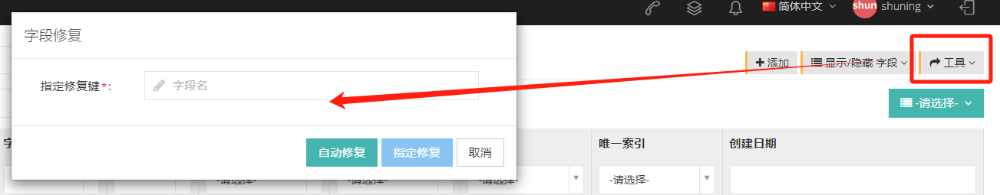

- **指定修复键**:客户数据页面缺失自定义字段的功能，缺失附件上传功能，包括客户弹屏界面，附件上传流程异常。   **自动修复**:在可能存在自定义字段错误，但无法确定具体字段时，直接点击自动修复即为将全部字段进行修复。

- **指定修复**：在存在自定义字段错误，确定具体字段时，点击指定修复将具体字段进行修复。

***字段权限设置***- 用户可以根据角色对字段进行查看和编辑的权限。不选择任何角色时，查看和编辑功能不可更改；角色字段只能更改是否可以编辑的权限，不能更改是否查看的权限。
    
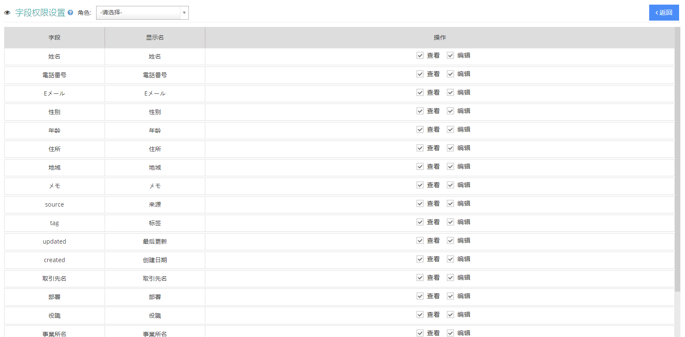

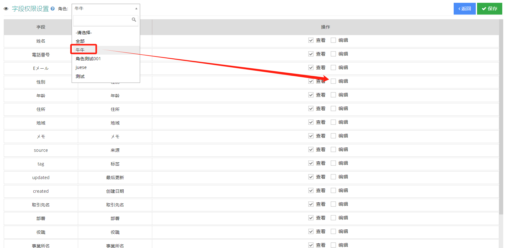

***字段显示顺序***- 用户可以在字段顺序设置中拖动字段，更该字段的排列顺序，姓名字段默认在第一位不可更改。字段可按标签A和标签B两个标签区分显示，标签B区背景颜色为高亮。在字段操作中，可以对字段是否必填，自定义字段是否在客户资料弹屏的自定义通话记录中进行编辑，字段和字段中填写内容的宽度可根据需要进行设置。

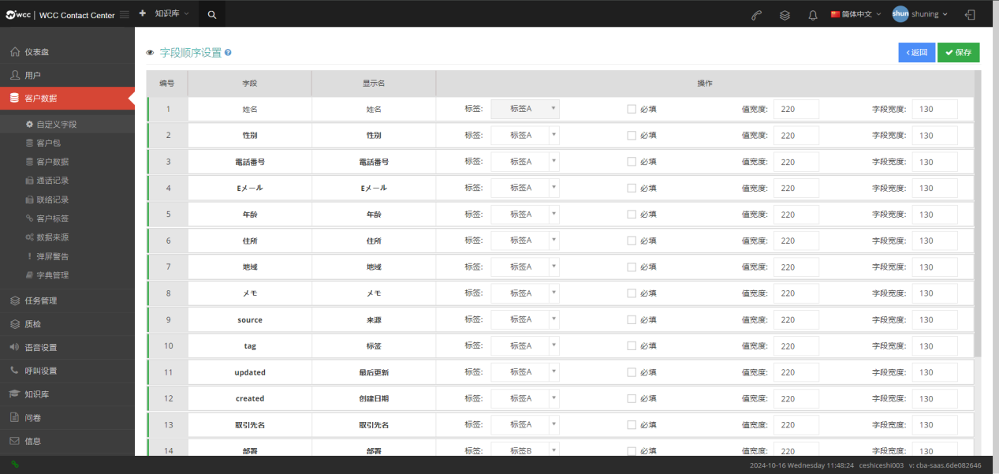

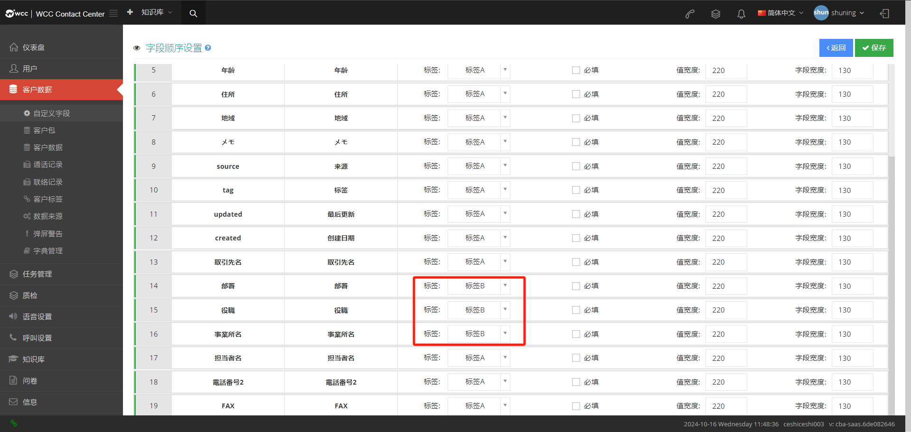

如果标签设置为 B，坐席登录后，客户数据弹出屏幕将在显示为高亮。

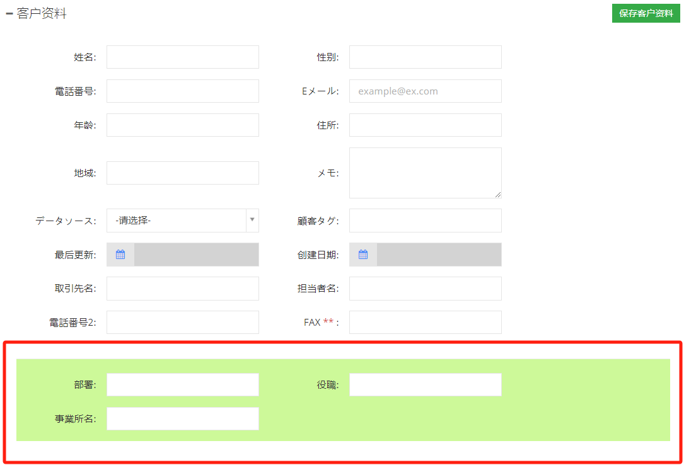

4. 添加新字段

①点击添加进入添加/编辑自定义字段常规页面：

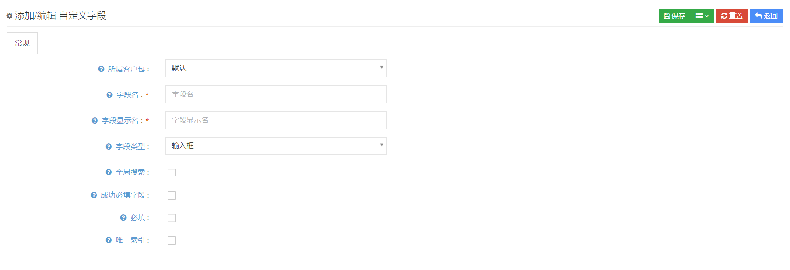

- **所属客户包**:设置的字段所在的客户包，仅在该客户包下的客户能够查看这个自定义字段。

- **字段名**:在数据库中自定义字段的定义名称。

- **字段名显示**:定义展示到页面上的自定义字段的显示名称。

- **字段类型**:定义自定义字段的类型，包括：

> ***输入框***-用户可输入单行文本数据（不支持换行）；  
>  
> ***电话号码***-用于填写电话号码。仅允许输入数字，长度范围为2-15位；
>
> ***文本框***-用户可输入多行文本数据（支持换行）；
>
> ***邮件***-用于填写电子邮件地址。需符合标准邮箱格式（如 example@example.com）；
>
> ***日期***-用户通过日期选择器选择日期（仅支持选择，不支持手动输入）；
>
> ***链接***-用于添加超链接。用户可对链接的打开方式（如新窗口）进行设置；
>
> ***附件***-支持用户上传一个文件作为附件；  
>  
> ***地址***-用户可从预设的默认地址列表中选择一项；
>
> ***自定义***-支持自定义配置为单选、多选或可输入的类型；
>
> ***关联字段***-用于建立字段间的级联关系。例如，选择“省份”后，下一级字段自动出现对应的“城市”选项。
>
> ***数值***-自定义一个仅允许输入数字的字段。

- **全局搜索**：开启后，系统将对该字段建立搜索索引，使其能被全局搜索功能检索到。启用此选项可显著加快对该字段内容的搜索速度。

- **成功必填字段**：当联络记录的“销售漏斗”状态值大于0（即标记为“成功”状态）时，该字段将成为必填项，必须填写后才能提交记录。  
  
- **必填**：开启后，该字段在任何情况下都为必填项，用户必须填写才能保存或提交表单。

- **唯一索引**：开启后，系统将强制要求该字段的值在整个客户数据表中保持唯一性，不允许出现重复值。

②点击保存即可保存新的自定义字段。

#### 3.2.2客户包

1. 核心作用：对客户数据进行分组隔离，不同客户包数据互不干预，坐席可同时处理多个客户包的客户。

2. 关键操作

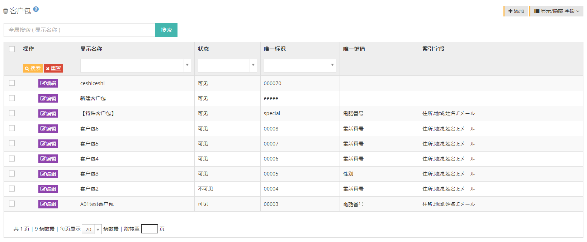

     【全局搜索】通过客户包显示名称进行全局搜索。

     【添加】添加一个新的客户包。

     【显示隐藏字段】选择该页面需要显示或是隐藏的字段。

     【编辑】用户可以对已经添加好的客户包进行编辑。

3. 新建一个客户包

①点击添加进入添加/编辑客户包的常规页面：

- **显示名称**：该客户包在系统中向用户展示的名称。

- **唯一标识**：客户包在系统内的唯一识别码。仅允许使用英文字母和数字，长度不限。

- **状态**：当客户包被关闭时，用户可以选择隐藏特定的模块页面（如自定义字段、客户、通话记录、联系日志、活动、调查答案、质检记录、销售漏斗等），使其不可见。关闭客户包后，所有关联的营销活动将自动转为隐藏状态。即使重新打开客户包，这些活动也不会自动启用，需由用户手动重新激活。

- **全局唯一**：启用后，将强制检查客户包下所有客户的电话号码字段是否重复。即使同一客户拥有多个相同类型的号码字段，系统也会对重复号码进行提示。

- **唯一键值**：允许设置一个或多个字段的组合作为唯一性校验规则。启用后，在该客户包内，这些字段组合的值将不允许重复。。

- **索引字段**：允许用户将查询频率较高的字段设置为数据库索引。这能显著优化系统在数据库中检索该字段数据的速度，提升查询效率。

②点击保存即可保存新的客户包。

#### 3.3.3客户数据
 
1. 核心作用：对客户数据进行分组隔离，不同客户包数据互不干预，坐席可同时处理多个客户包的客户。 

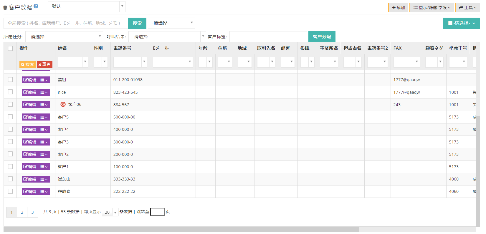

2. 关键操作

【默认】客户包选择，默认状态就是默认客户包即全部客户数据，也可以选择具体客户包，关于客户包的创建及编辑会在客户包中详细说明。

【搜索】全局搜索范围包括姓名、电话号码、电子邮件、城区、区域、备注。

【搜索】后面的【请选择】为销售漏斗，显示该客户包下的所有销售漏斗，根据坐席提交的销售漏斗，用户可以搜索销售漏斗里的客户数据。.

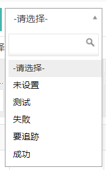

【所属任务】】用户可以根据所属任务搜索客户数据，分配了任务的客户数据可以被分配到指定坐席。

【呼叫结果】根据坐席提交的呼叫结果，用户可以搜索呼叫结果中的客户数据。

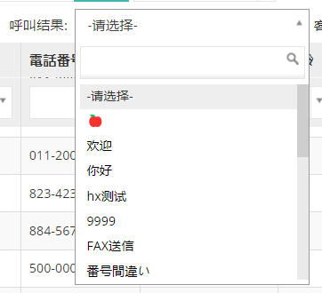

【客户标签】根据用户设置的客户标签搜索客户数据。

【客户分配】用于将筛选出的客户数据进行重新分配。用户可根据上方设置的搜索条件与销售漏斗（如“成功”状态）对客户进行分配，支持分配至客户表、任务等模块。

客户数据可以从以下三种形式进行分配:

     ① 释放客户到-客户表：将已分配至坐席或任务中的客户释放到客户公海，使其成为无归属的客户，可供重新分配。

     ② 分配到任务-选择一个任务：选择客户数据，将其分配至某一任务，坐席可在客户池中领取并跟进该任务。
       特殊情况：若客户已归属于某坐席，且该坐席同时属于原任务与目标任务，则重新分配后客户仍归属于该坐席。
       例如：客户A原属任务1，坐席a负责任务1与任务2。将客户A分配至任务2后，客户A的归属为：坐席a，任务2。若坐席a不属于目标任务，则客户A在分配后将暂时无归属坐席。
    
     ③ 直接分配到坐席：在已选择某一任务的前提下，可将客户数据直接分配至该任务下的指定坐席。

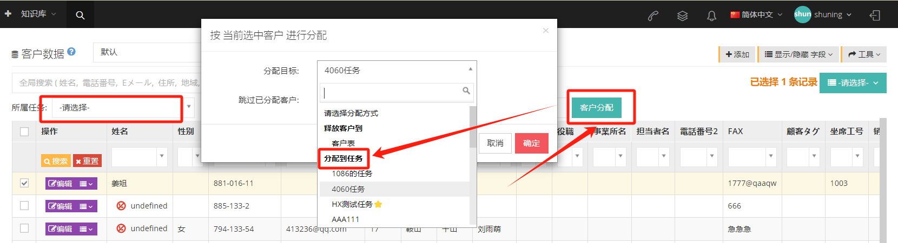

↓↓↓直接分配给坐席

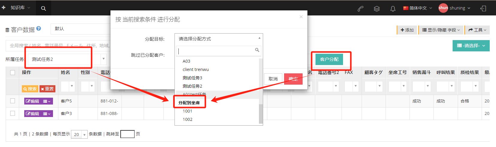

【工具】

***导出CSV文件***-将数据以CSV格式导出;

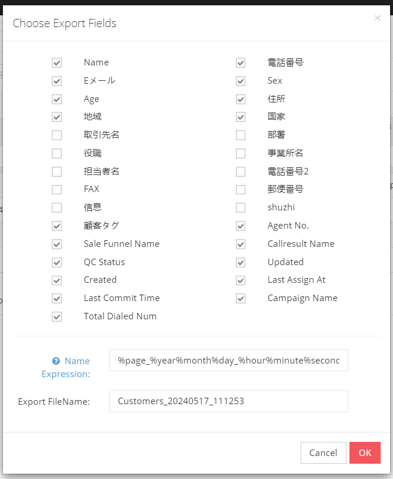

***数据导入***-将CSV格式的数据批量导入; (导入的客户数据文件不能超过20 MB)  

***添加至禁呼列表***-将选中的客户数据添加到禁呼列表，在此处添加至禁呼列表是指将这个客户名下的所有号码禁呼，而不是禁呼这个号码，所以不会在号码禁呼列表中显示;

***从禁呼列表移除***-将客户数据从禁呼列表移出。

【编辑】或【下拉菜单】可以对新建成功的客户数据进行编辑。

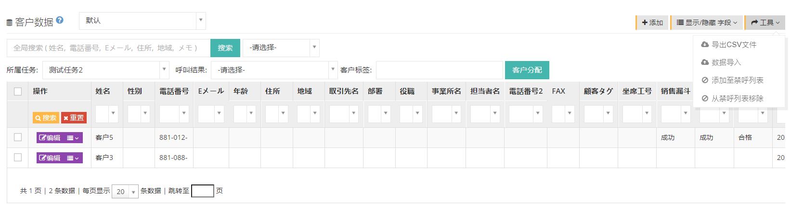

3. 新增客户数据

- 单条数据创建

① 点击添加进入添加/编辑客户数据的常规页面:

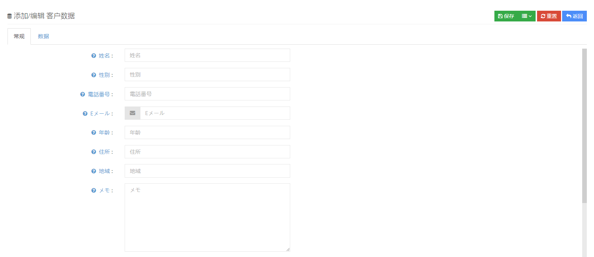

- **姓名**：客户名称。当客户来电时弹出屏幕时，当客户弹出时显示的名称。

- **電話番号**：客户的电话号码，在默认客户包中，客户的电话号码具有唯一性，不能重复添加。

- **Eメール**: 客户的邮箱地址。 
  
- **性别**：客户的性别

- **年龄**: 客户的年龄。  
  
- **住所**：客户的住址。

- **地域**: 客户的地址。

- **メモ**: 备注填写。

如果在自定义字段中增添了新的字段，可以在新增/编辑客户数据页面中编辑新字段的内容。

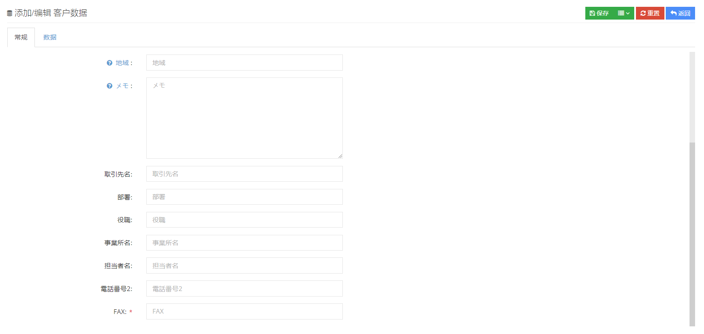

② 点击数据进入添加/编辑客户数据的数据页面:

- **数据来源**：用于对客户数据进行来源分类。用户可以在“数据来源”页面编辑分类选项。

- **客户标签**：用于标记和分组客户。用户可以在“客户标签”页面创建和管理标签。。

- **所属任务**：可将该客户直接分配至某一任务。若此处未选择，后续也可在“客户数据 > 分配数据”中操作。

- **坐席工号**:标识负责此客户的专属坐席。

- **最后分配时间**：记录该客户数据最后一次被分配给坐席的时间。

③ 点击保存即可保存新的客户数据。

- 批量数据导入

① 如果需要导入一批客户数据，可以直接在客户数据页面点击 工具 - 数据导入。选择 以 CSV 格式导入客户数据列表。导入的 CSV 文件需要编码为UTF-8，否则可能会出现乱码。

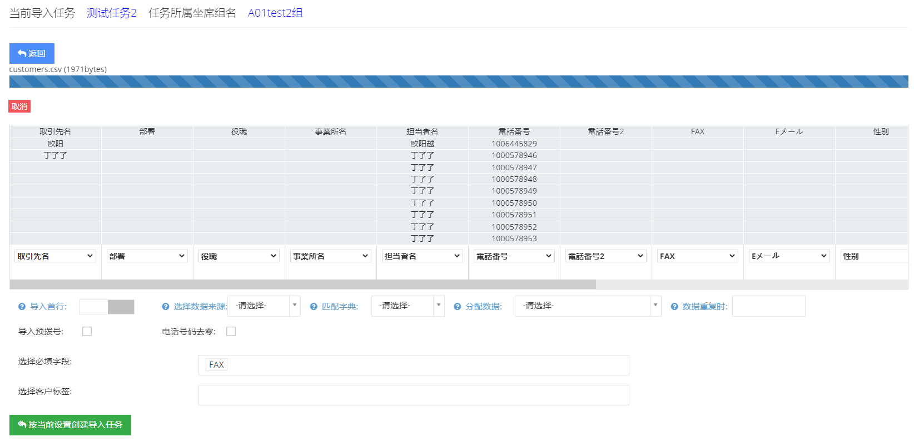

导入数据后，系统会自动匹配和数据相同的字段，系统没有的字段需要用户点击请选择的下拉菜单进行新建：请选择——新建字段——输入框（输入新字段）。

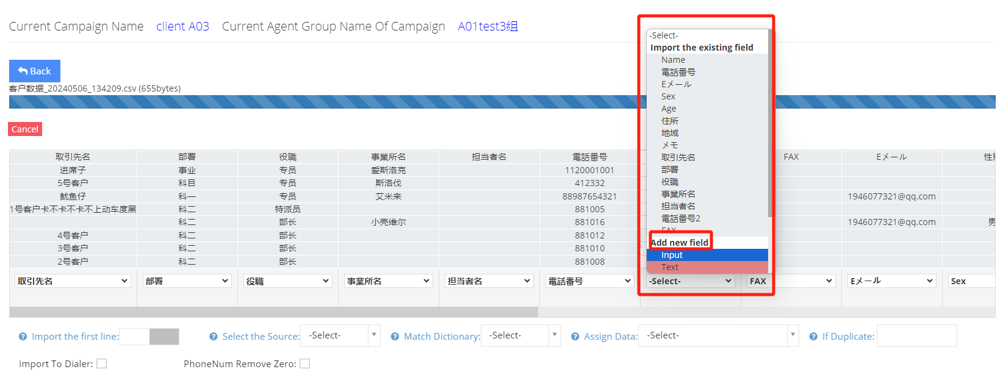

【导入首行】选择是否导入文件中的第一行数据。通常首行为标题行，建议跳过导入。

【选择数据来源】用于标记客户数据的获取渠道。用户可以在“客户数据 > 数据来源”中添加分类，若无特殊设置，系统将默认以时间及颜色进行标记。

【匹配字典】导入时，系统将依据“客户数据 > 字典管理”中预设的规则进行数据匹配与映射。

【分配数据】用户可在此将客户数据手动分配至指定坐席。若导入数据本身包含 ##AgentNo## 字段，系统将自动匹配对应坐席，无需手动操作。

【数据重复时】当导入的客户数据与系统中已有记录重复时，可选择以下任一方式处理：

      ①将重复数据仅添加至预拨号任务列表；
      
      ②用当前导入的数据覆盖系统中原有的客户信息。

      注：关于重复数据与预拨号导入的组合说明：

      1.数据重复时导入预拨号+导入预拨号=全部数据导入至预拨号列表

      2.数据重复时导入预拨号+不导入预拨号=重复数据在预拨号列表中

      3.数据重复时不导入预拨号+导入预拨号=除重复数据外其他新数据在预拨号列表中。

【导入预拨号】将本次导入的客户数据添加至预拨号任务列表。如存在重复数据，具体行为请参照上方“数据重复处理”说明。

【电话号码去零】系统将自动去除电话号码首位的数字“0”（例如 0139… 将转为 139…）。

【选择必填字段】指定本次导入中必须填写的数据字段，未填写则无法完成导入。

【选择客户标签】为本次导入的客户数据批量添加标签，便于后续分类与筛选。

②点击【按当前设置创建导入任务】完成数据的批量上传，页面右上角会实时显示数据上传状态，上传成功后点击【返回】返回客户数据页面。

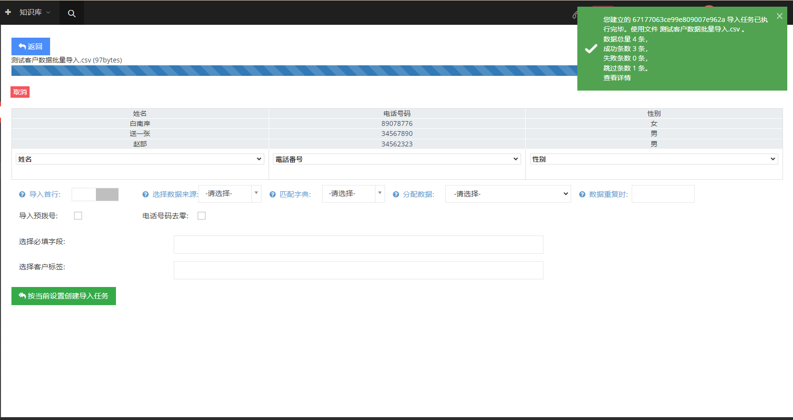

- 添加至禁呼列表

在将客户添加至禁呼列表时，您可选择是否启用“高亮”选项，两者区别如下：

       选择高亮：系统将把该客户（含其名下所有电话号码）整体加入禁呼范围。

      - 客户数据页面：该客户记录旁将显示“无呼叫”标志。

      - 禁呼列表：该客户下的具体号码不会单独列在列表中。

      不选择“高亮” ：仅将当前选中的单个号码加入禁呼。

      - 客户数据页面：该客户记录旁不会显示“无呼叫”标志。

      - 禁呼列表：该被禁呼的号码会单独显示在列表中。

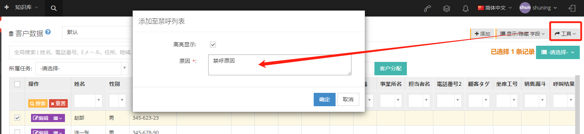

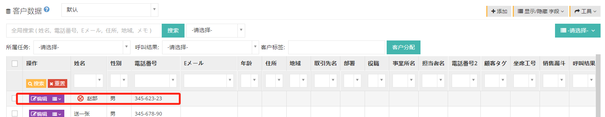

坐席登录后可以看到这个客户的弹屏被标记为高亮，且高亮客户不能拨打电话。

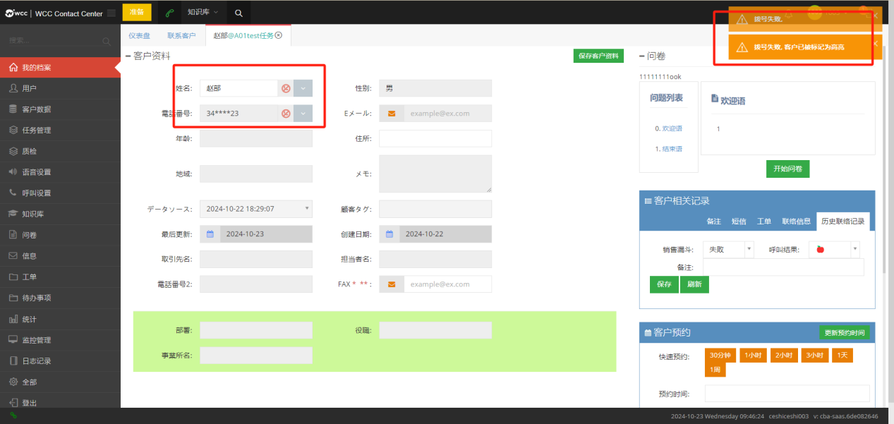

- 从禁呼列表移除

用户还可以通过删除高亮或将客户从DNC列表中移除。

【移除高亮】将客户数据的高亮移除。

【移除DNC】 将号码从禁呼列表中移除。

如果一个客户被标记为高亮，并且该客户的一个号码被设置在禁呼列表中，则如果只删除了一种类型的禁呼，另一种禁呼仍将生效。您需要同时取消这两项操作。

#### 3.3.4通话记录

1. 核心作用：记录系统所有呼叫记录，支持筛选、试听录音、导出等功能。

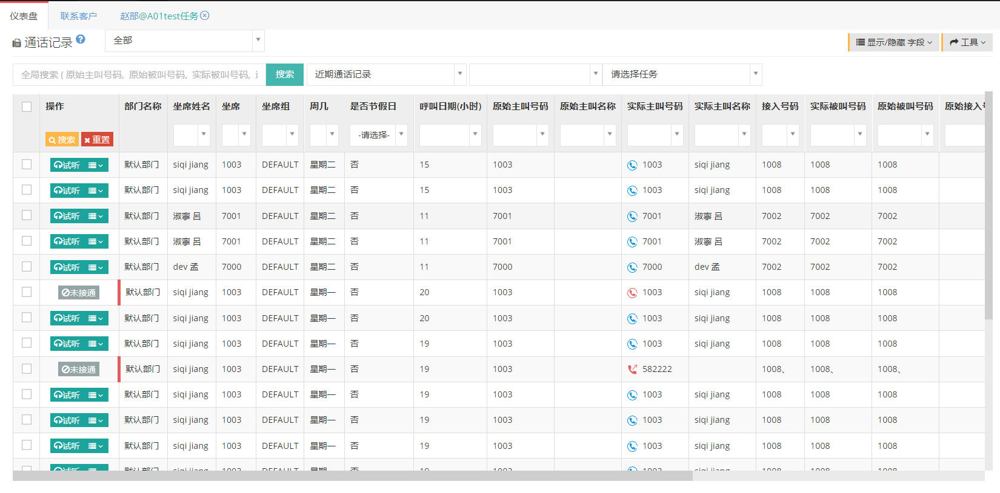

上图中的【全部】可将通话记录按照全部、默认客户包和客户包进行筛选。

2. 关键操作

【搜索】可根据原始主叫号码、原始被叫号码等条件，筛选查询通话记录。

【近期通话记录】支持查询最近六个月内的通话记录。

【请选择部门】筛选指定部门下的通话记录。  
  
【请选择任务】筛选特定任务相关的通话记录。

【显示/隐藏字段】自定义当前页面需要显示或隐藏的信息字段。

【工具】将当前通话记录导出为CSV文件。

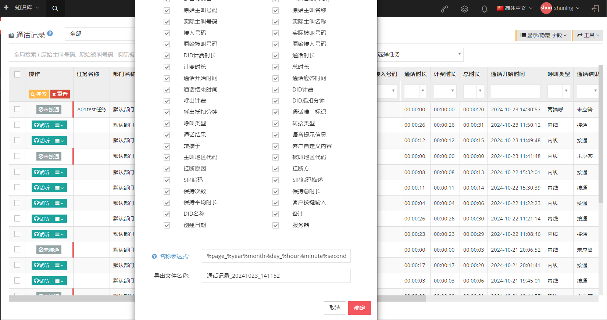

【试听】点击可在线播放通话录音。播放器将显示在通话记录上方，支持调整语速（加快/减慢）。

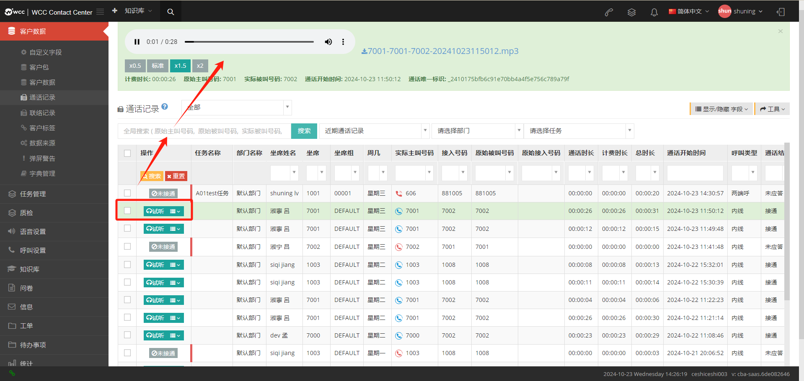

【下拉菜单】通过下拉菜单选择并下载通话录音文件。

3. 字段释义

- 任务名称：该通话关联的任务名称。

- 部门名称：该通话所属部门。

- 坐席姓名：负责该通话的坐席姓名。

- 坐席：负责该通话的坐席工号。

- 坐席组：该通话所属的坐席组编号。

- 周几：通话发生的星期几。

- 是否节假日：通话日期是否为节假日。

- 呼叫日期(小时）：通话发起的小时段（例如：18:20拨打则显示为“18点”）。

- 原始主叫号码：外呼时未添加任何前缀的主叫号码。

- 原始主叫名称：外呼时未添加任何前缀的主叫名称。

- 实际主叫号码：外呼最终在被叫端显示的号码。

- 实际主叫名称：外呼最终在被叫端显示的名称。

- 接入号码：客户呼入时未添加前缀的接入号码。

- 实际被叫号码：最终接听呼入的号码。

- 原始被叫号码：原始呼入接听号码。

- 原始接入号码：未作任何配置的原始接入号码。

- DID计费时长：DID号码对应的计费时长。

- 通话时长：通话被应答的实际通话时长。

- 计费时长:用于计费的通话时长。

- 总时长：本次通话的总时长（从开始到结束）。

- 通话开始时间：通话实际开始的时刻。

- 通话应答时间：通话被接听的时刻。

- 通话结束时间：通话挂断的时刻。

- DID计费：本次通话DID号码产生的通话费用。

- 呼出计费：本次呼出通话产生的费用。

- DID抵扣分钟：本次通话DID号码抵扣的时长。

- 呼出抵扣分钟：本次呼出通话抵扣的时长。

- 通话唯一标识：通话开始时生成的唯一ID。

- 呼叫类型：通话的呼叫类型（如呼入、呼出）。

- 转接类型：通话的转接类型。

- 通话结果：通话接通、未应答或失败的结果状态。

- 语音提示信息：语音转文字生成的提示内容。

- 转接于：显示通话从何处转接而来。

- 客户自定义内容：客户自定义的相关信息。

- 主叫地区代码：系统在root级别设置的主叫地区代码，匹配后显示主叫地区名称。

- 被叫地区代码：系统在root级别设置的被叫地区代码，匹配后显示被叫地区名称。

- 挂断原因：通话结束的原因。

- 挂断方：挂断通话的一方（主叫/被叫）。

- SIP编码：用于判断通话状态的编码（如200为正常，L415为外呼档案未匹配）。

- SIP编码描述：对应SIP编码的说明。

- 保持次数：通话过程中使用“保持”功能的次数。

- 保持总时长：通话中保持状态的总时长。

- 保持平均时长：通话中保持状态的平均时长。

- 客户按键输入：客户根据语音提示输入的按键（如IVR菜单选择）。

- DID名称：系统中设置的DID号码名称。

- 备注：该通话的备注信息。

- 创建日期：该通话记录的创建日期。

- 服务器：该通话所在的服务器。

    注： client登录时使用loginas的方式从高级别登录，在登录时如果选择“是”通话记录中还会有【接入号码别名】【接入号码别名地区】【中继名称】这三个字段。如果选择“否”则不会出现这三个字段。

4. 呼叫类型/挂断原因

**呼叫类型**

- 呼入：由客户主动发起并接入系统的电话或通讯请求，适用于咨询、办理、投诉、反馈等场景。系统通过IVR、坐席组分配等规则将来电转接至相应坐席，完成客户与服务对接。

- 呼出：由坐席手动拨号主动向客户发起的电话或通讯联系。此类流程通常用于客户回访、业务推广、信息通知或调研访谈等场景。

- 两端呼：坐席可在客户联络页面一键发起外呼，通话计入外呼任务统计。支持手动点击与自动批量呼叫，提升外拨效率与操作流畅度。

- 预拨号：坐席进入空闲状态时，系统依据预设任务与拨号策略（如预测式、预览式外呼）自动尝试呼叫客户，提高外拨资源利用率。

- 内线：坐席与内部工号/分机之间的免费通话，不占用外线资源，适用于业务协作、内部沟通等场景，便于团队高效协作。

- 语音通知：由系统自动发起的全自动语音外呼，用于传递通知或服务信息，无需人工介入。典型场景包括活动通知、紧急提醒等。

- 放音收号：客户接听后，系统播放预设语音并引导按键输入。输入内容将保存至通话记录，并可根据设定规则执行流程跳转；未配置规则则默认挂断。

- 强插：管理员可强制介入当前通话，形成三方通话。通常用于紧急投诉或纠纷场景，便于管理层直接接管处理。

- 密语：管理员可在通话中实时加入并对坐席进行单向语音指导，客户无法听见。适用于新员工培训、实时话术辅助等场景。

- 监听：管理员可对坐席通话进行无感知实时监听，用于服务质量检查与运营合规监控，支持业务抽检与实时风控。

- 抢接：坐席可代为接听本部门内其他振铃无人接听的分机来电，适用于协作接听、忙线辅助等场景，提升团队响应效率。

- 驻留：支持将通话临时挂起于系统，坐席可稍后自行取回或由他人接续处理。适用于需临时离席查询资料、跨岗沟通等场景。

**挂断原因**

- 通话被正常接听。

- 未应答:呼入时坐席不在线，未能接听。

- 呼叫失败:呼出号码错误，无法匹配到有效的外呼档案。

- 黑名单:该号码已被设置在系统黑名单中。

- 呼叫次数限制:该号码已达到系统设定的单日呼叫上限。

- 被叫忙:被叫方正在通话中或拒接来电。

- 被叫拒绝:被叫设备（如特定型号的SIP话机）主动拒绝通话连接。

- 主叫提前挂机:主叫方在接通前主动挂断。通常因拨打错误号码但仍能匹配外呼档案导致，部分旧数据可能残留“已取消”状态，现已统一归入此项。

- 呼叫超时:呼叫（呼入/呼出）对方在线，但直至超时仍未接听。

- 队列等待退出: 呼入队列的通话数超过坐席组设置的最大排队数，通话被挂断。

- 队列超时：呼入队列后，客户等待时间超过队列设定的超时时长，系统自动挂断。

- 空队列禁入: 队列设置为无坐席签入时禁止呼入。

- 空队列溢出: 队列允许呼入空队列，并在无坐席时允许自动退出。

- 队列排队溢出:当呼入队列通话超过坐席组设置的最大排队数时，通话被挂断。

- 识别错误:对运营商返回的语音的中国特定识别（目前不可用）。

- 关机:对运营商返回的语音的中国特定识别（目前不可用）。

- 停机:对运营商返回的语音的中国特定识别（目前不可用）。

- 其他:对运营商返回的语音的中国特定识别（目前不可用）。

- 呼叫错误:对运营商返回的语音的中国特定识别（目前不可用）。

- 转接:对运营商返回的语音的中国特定识别（目前不可用）。  
  
- 队列无可用坐席退出：队列开启“无可用坐席溢出”功能时，因无坐席可用而被系统挂断。

#### 3.3.5联络记录

1. 核心作用：记录坐席与客户通话后的反馈信息，包括呼叫结果、销售漏斗状态等。

2. 关键操作

联络记录系统默认自动保存坐席与客户之间的通话记录。每次坐席成功接通客户来电，系统即生成一条默认记录。如果坐席在通话后手动设置了销售漏斗阶段或呼叫结果，系统将额外生成一条记录，其中将明确展示坐席姓名、呼叫结果、通话状态、负责坐席及数据来源等信息。

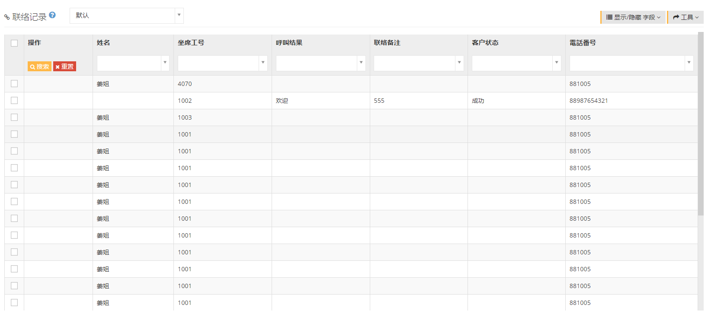

上图中的【默认】可将联络记录按照默认和客户包进行筛选。

【显示/隐藏字段】选择这个页面所要显示或隐藏的字段。

【工具】导出CSV格式的文件。

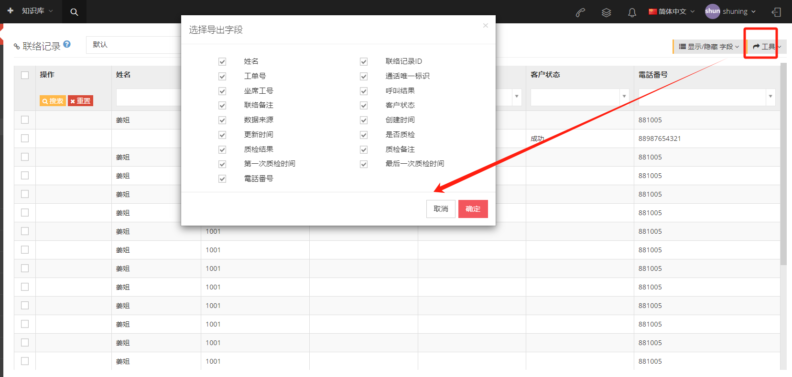

#### 3.3.6客户标签

1. 核心作用：给客户打标签（如 “高意向”“老客户”），便于分类筛选；

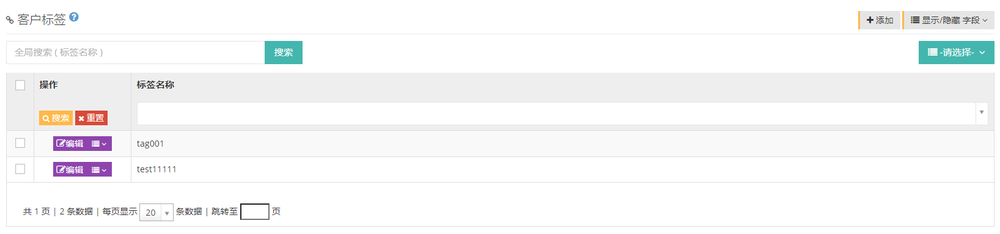

【搜索】全局搜索仅支持使用标签名称进行搜索。

【添加】添加一个新的标签名称。

【显示/隐藏字段】选择这个页面需要显示或隐藏的字段。

【请选择】按条件删除所选数据。

【编辑】对已有客户标签进行编辑。

【下拉菜单】可以删除该客户标签.

2. 添加一个新的标签

①点击添加进入添加新客户标签常规界面

②点击高级进入添加新客户标签高级界面：

③保存新的客户标签后，可以在客户数据的【添加/编辑客户数据】的数据页面中选择客户标签。

#### 3.3.7 数据来源 

1. 核心作用：导入一次客户数据就会增加一次数据来源，用时间和颜色标记。客户数据上传时会自动产生一个数据来源。

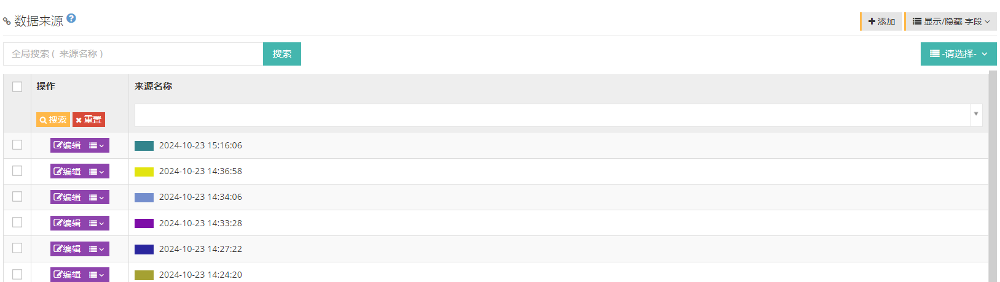

【搜索】全局搜索仅支持来源名称搜索。

【添加】添加一个新的来源名称。

【显示/隐藏字】选择该页面想要添加或隐藏的字段。

【请选择】按条件删除

【编辑】对已经建立的数据来源可以进行编辑。

【下拉菜单】可以删除该数据来源。

2. 添加一个新的数据来源

①点击添加进入添加/编辑数据来源的常规页面:

**来源名称**:请输入数据来源的名称。

**来源颜色**:请选择客户数据来源的颜色。

②点击高级进入添加/编辑数据来源的高级页面:

③点击保存即可保存新的数据来源

#### 3.3.8 弹屏警告

1. 核心作用：给特殊客户设置弹屏提醒（如 “高投诉客户”），坐席查看或拨打时触发警告；

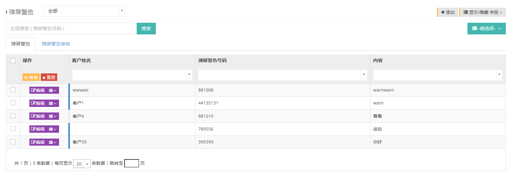

上图中【全部】可点击选择默认和客户包的弹屏警告。

【搜索】全局搜索仅能以弹屏警告号码搜索。

【添加】添加一个新的弹屏警告。

【显示/隐藏字段】选择这个页面想要显示或隐藏的字段。

【请选择】按条件删除。

【弹屏警告】有弹屏警告的号码列表。

【弹屏警告审核】坐席提交需要审核的弹屏警告号码列表。

2. 添加一个弹屏警告

- client用户添加一个新的弹屏警告

①点击添加进入添加/编辑弹屏警告常规页面:

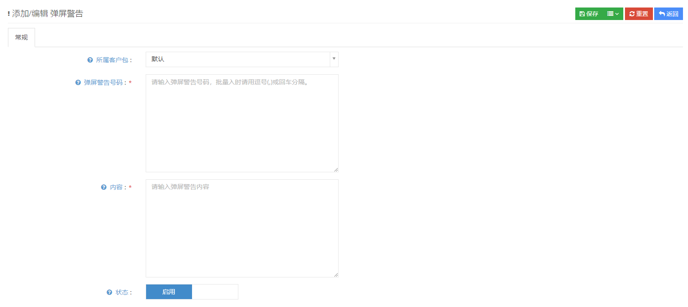

- **所属客户包**：当前所属客户包，不可见的客户包不会在此处显示。

- **弹屏警告号码**：输入弹屏警告号码，批量输入时需要用英文逗号或回车分隔。

- **内容**：请输入弹屏警告内容。

- **状态**：选择弹屏警告的使用状态，如果关闭这个弹屏警告，该警告不会生效。

②点击保存即可添加一个新的弹屏警告。

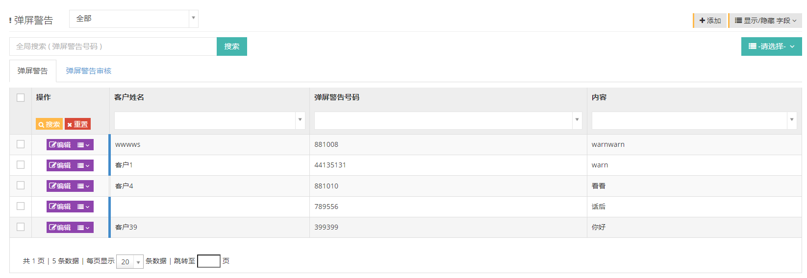

- 坐席添加一个新的弹屏警告

如果client用户没有给坐席角色设置弹屏警告的审核权限，那么坐席页面添加弹屏警告需要由client审核成功后才可以生效。我们这里大概说明一下坐席添加弹屏警告即client的审核流程。

①坐席在客户资料页面——客户相关记录——备注——添加备注——备注类型选择弹屏警告，添加好弹屏内容——确认。

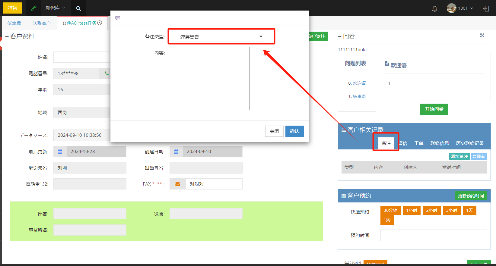

②坐席在客户备注页面会查看到自己设置的备注弹屏警告，此时弹屏警告未生效。

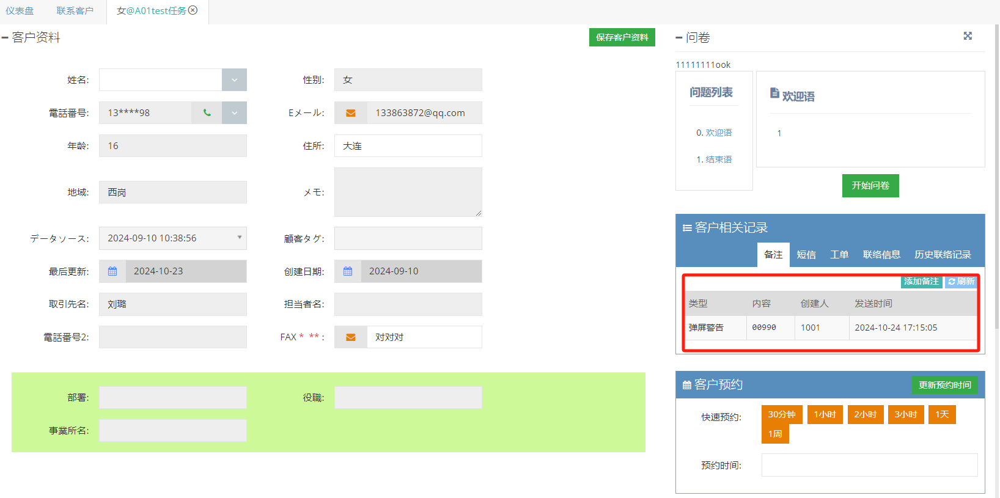

③client用户收到坐席的弹屏警告审核通知。

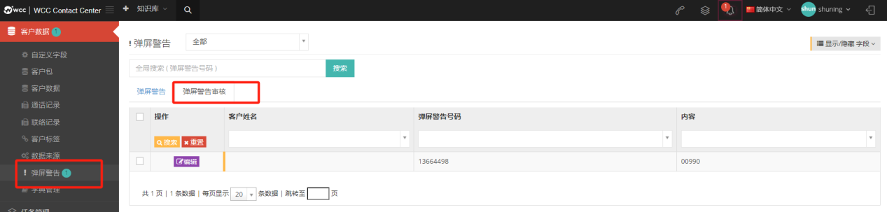

④client用户点击编辑进入添加/编辑弹屏警告的常规页面，将状态由待审核改为启用后保存，坐席提交的弹屏审核就通过了。

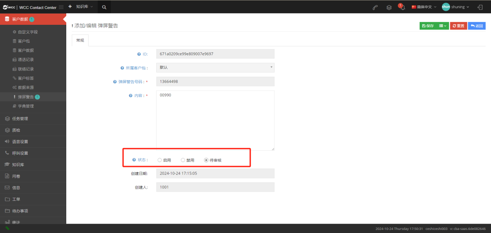

⑤弹屏警告设置成功后，坐席查看该客户资料，拨打该客户电话或者接听该客户电话时就会收到该条弹屏警告。

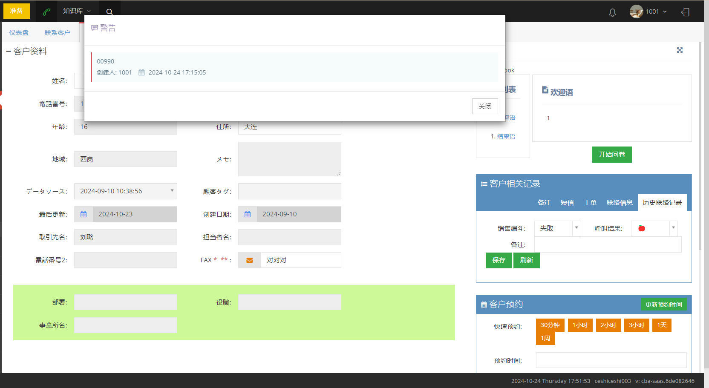

#### 3.3.9 字典管理

1. 核心作用：预设数据填充模板（如城市 - 区域映射），批量导入客户时自动填充缺失字段。

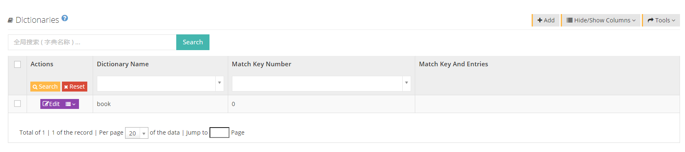

【搜索】全局搜搜仅支持搜索字典名称。

【添加】添加一个新的字典。

【显示/隐藏字段】选择该页面上显示或隐藏的字段。

【工具】导入一个CSV格式的字典内容。

【请选择】按条件删除。

【编辑】或【下拉菜单】编辑或删除当前字典。

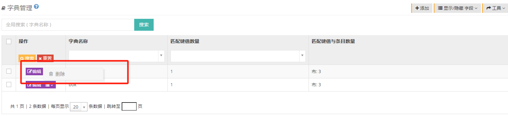

2. 字典的使用方法

简单说，字典功能就好像一个信息不完全自动填充模板。

例如字典示例：

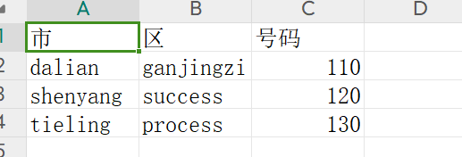

原始导入客户数据示例：

最终导入数据：

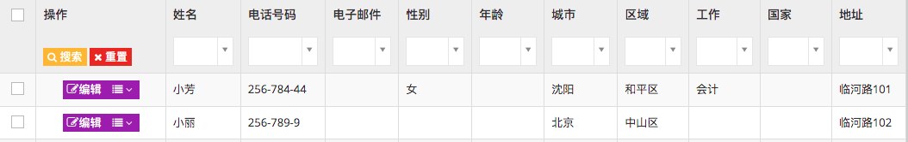

3. 字典使用的流程

①用户在客户数据——字典管理中点击添加，添加一个新的字典名称。

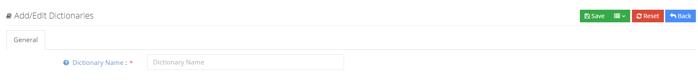

②在字典管理页面选择工具——导入字典：

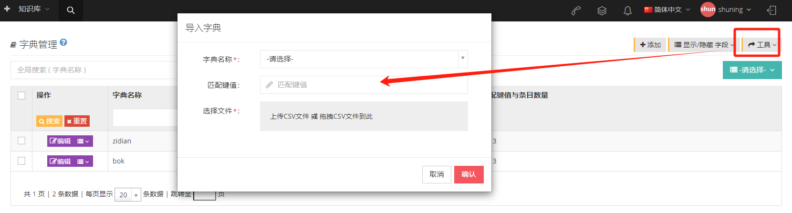

- **字典名称**：选择需要导入数据的字典。

- **匹配键值**：填写需要匹配的数据名称，每次只能填写一个，若不填写系统则默认匹配导入文件首行首列的数据。

- **选择文件**：选择需要导入的字典文件.（所选词典文件应为 CSV文件格式，编码设置为 UTF-8 文件）

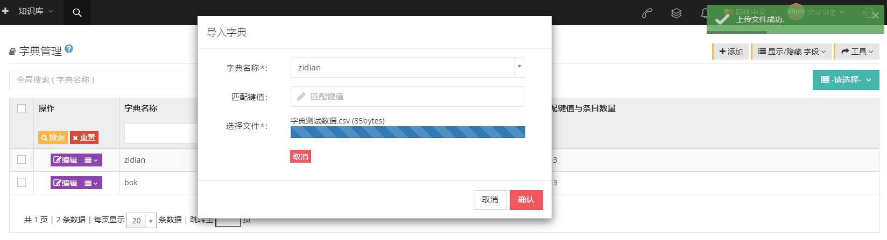

③字典建立完成在批量导入数据时，选择需要的字典内容，即可完成需要的数据填充。

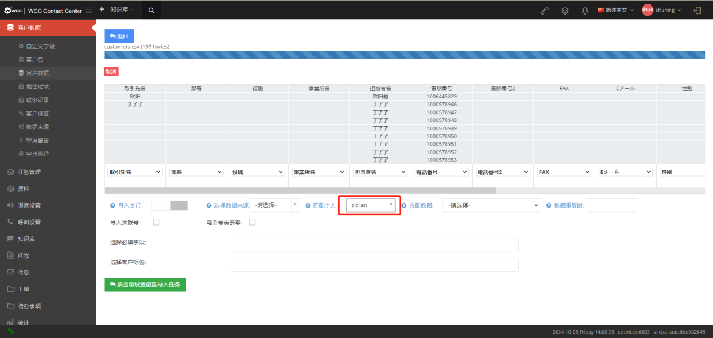

### 3.3任务管理

#### 3.3.1任务管理

1. 核心作用：创建外呼任务，分配客户数据给坐席组，配置任务规则（如外显号码、工作时间）。

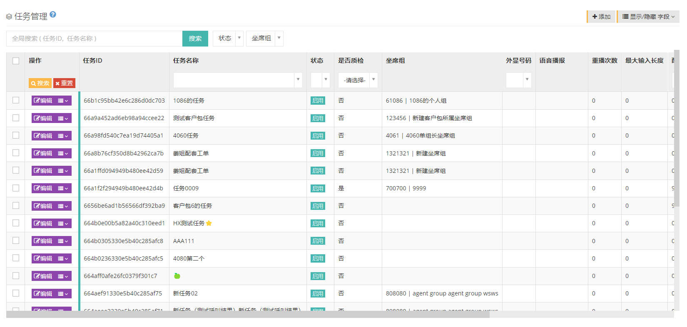

2. 核心操作

【搜索】全局搜索仅支持对任务名称进行搜索。

【添加】添加一个新的任务。

【显示/隐藏字段】选择该页面的任务需要显示或隐藏的字段。

【状态】为用户可以选择任务的状态，例如启用、隐藏、关闭来查看任务。

【坐席组】根据坐席组选择需要查看的任务。

【下拉菜单】在任务的编辑下拉菜单中：

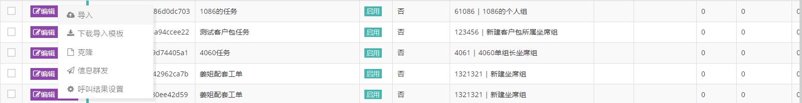

**导入**：客户数据的导入，用户可以直接将客户数据导入到这个任务中或是下载该任务的客户数据模版。具体导入方法详见客户数据的导入

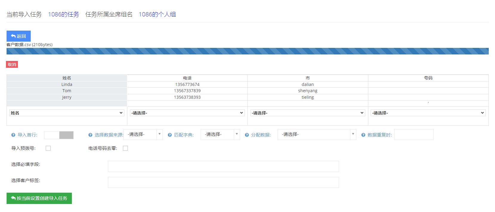

**下载导入模版**：下载 CSV 格式模板，以便在此推广活动下上传客户数据。

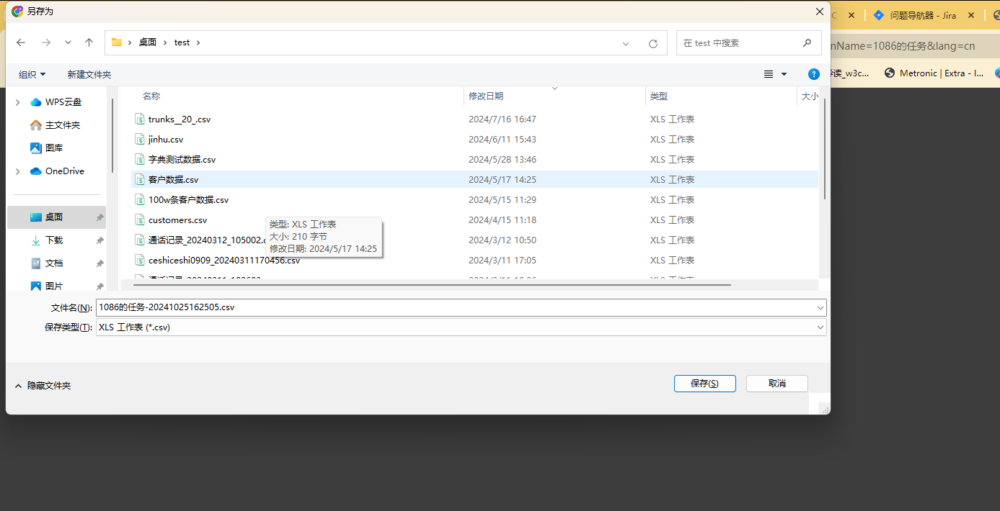

**克隆**：点击克隆，用户可以复制一个相同设置的任务，并对复制任务进行命名，但复制内容不包括被复制任务中的客户数据。

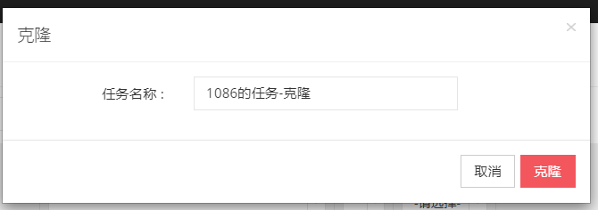

**信息群发**：对该任务中的客户进行信息群发。

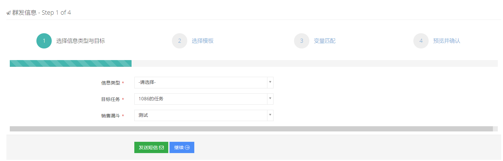

**呼叫结果设置**：用户可以选择该任务中需要设置的呼叫结果。

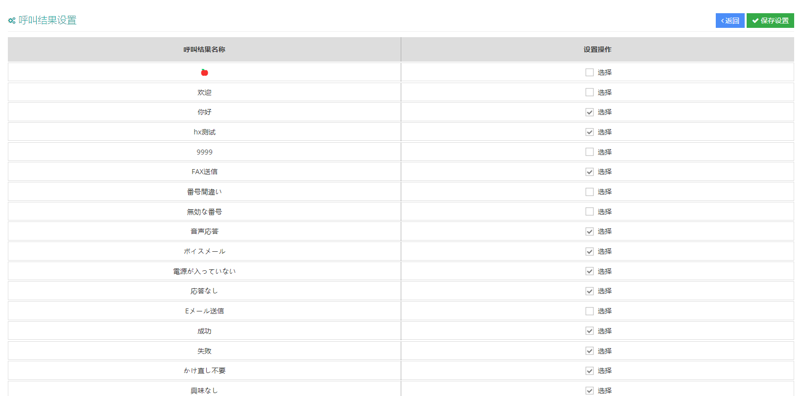

3. 添加一个新的任务

任务管理是创建或是分配任务的过程，只有客户数据被分配在任务中，坐席才能够进行拨打。

①点击添加进如添加/编辑任务管理的常规页面：

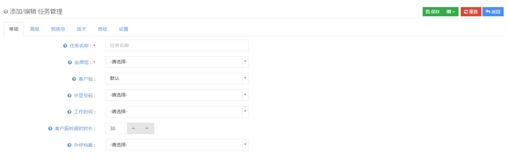

-**任务名称**：输入任务名称，用于识别该任务。

- **坐席组**：选择执行此任务的坐席组。注意：保存后不可修改。

- **客户包**：选择任务关联的客户包。注意：选定后不可修改。

- **外显号码**：选择本任务使用的外显号码。若上级未向该客户分配外显号码，则此处无法选择。

- **工作时间**：设定任务的有效工作时间。具体条件可在条件页面设置。非工作时间内，坐席无法拨打或接听该任务中的客户电话。

- **客户振铃超时时长**：设定呼叫客户时的最长振铃时间，超时后通话将自动挂断。

- **外呼档案**：为本任务设置外呼规则，所有从该任务发起的呼叫均遵循此规则。如不设置，则默认使用系统外呼档案规则。

②点击高级进入添加/编辑任务管理的高级页面：

- **是否质检**：若开启质检，当坐席保存联络记录并选择销售漏斗分值大于0时，该客户数据将进入质检状态，此后不可再拨打或修改记录。只有质检规则中允许回拨时，该记录方可继续操作。

- **优先级**：决定该任务在坐席任务切换列表中的显示顺序，数值越高，排序越靠前。

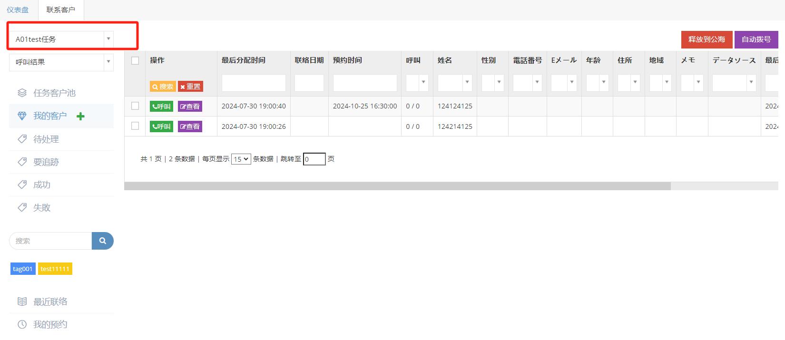

- **状态**：用户可以选择该任务的状态，包括：启用、隐藏、关闭。

    ***启用***-任务正常显示并可用。

    ***隐藏***-任务仅在“任务管理”页面可见，其他操作界面不显示。

    ***关闭***-任务停止使用。

- **坐席权限**：

    ***获取客户***-控制坐席是否可从任务池中自动获取客户。若关闭，则需手动分配客户数据（预拨号模式除外）。

    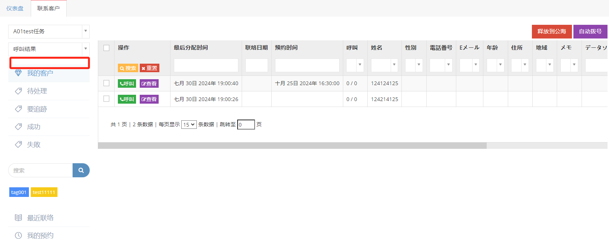

    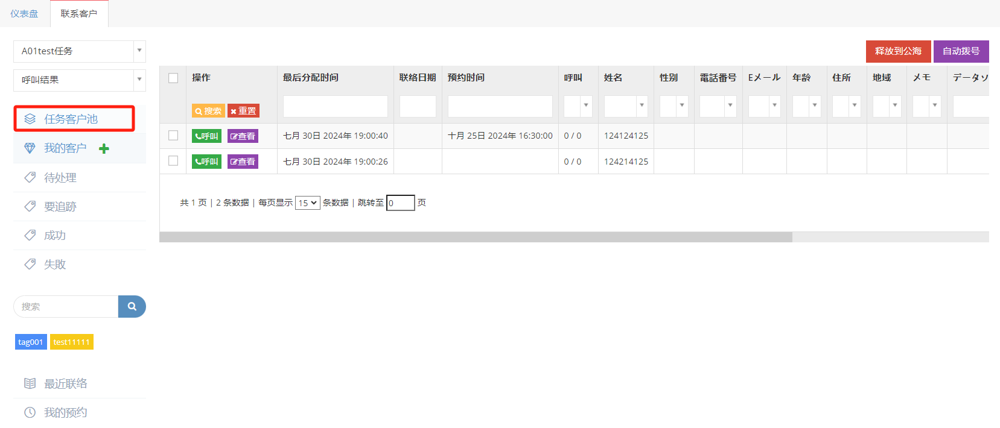

    ***添加客户***-是允许或禁止坐席手动向任务中添加新客户。

    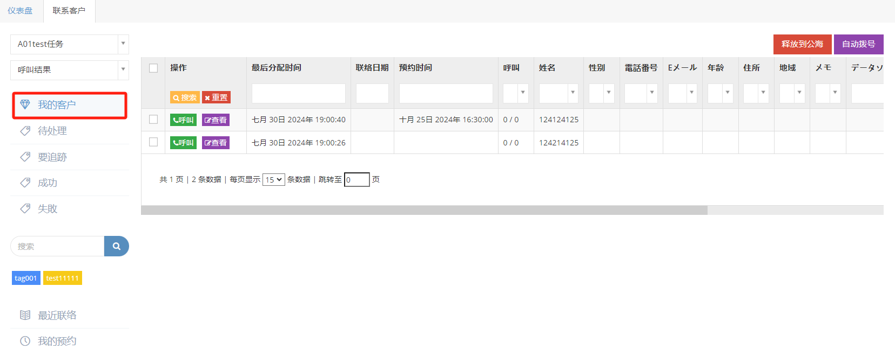

    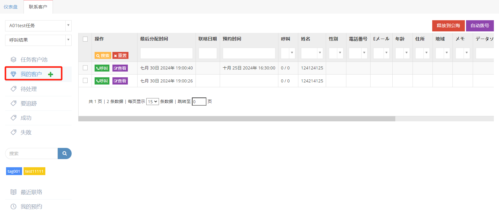

- **提交后动作**：控制在保存联络记录后系统的自动行为：

    ***退出话后***-保存后退出话后工作状态。

    ***挂机***-若在通话中保存记录，则自动挂断电话。

    ***删除预约呼叫***-保存后自动删除该客户的所有预约呼叫（包括本次）。

    ***关闭客户标签***-保存后自动关闭客户信息弹窗。

- **加载联络记录**：是否允许坐席查看客户联络记录：

    ***自动***-打开客户资料时自动加载历史记录。

    ***禁用***-禁止坐席查看客户历史联络记录。

    ***手动***-坐席需手动点击才能加载历史记录。

- **默认客户状态**：坐席打开客户时，系统预设的销售漏斗状态。

- **自动拨号选项**：当坐席使用自动拨号模式时：

    ***倒计时***-通话结束后，倒计时结束自动拨打下一通。

    ***延时***-坐席可点击“延迟”按钮以获得整理时间。

-   **快速预约**:预设时间间隔（如10m、1h），供坐席快速设定回拨时间。

    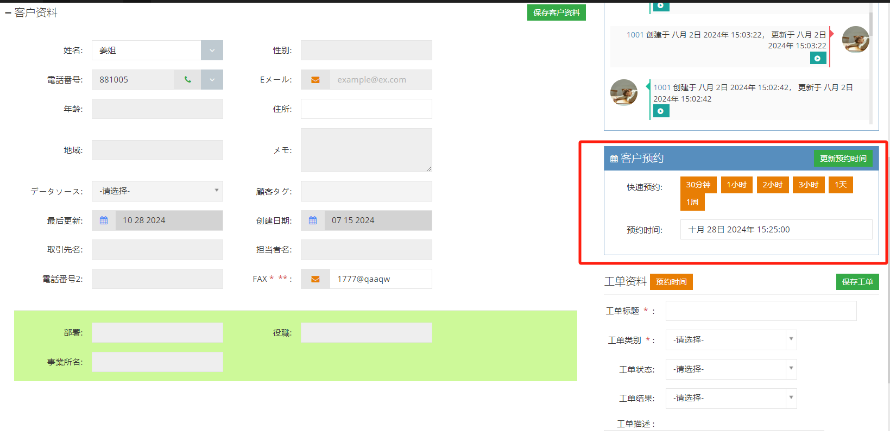

- **最大客户样本数量**：坐席单次从任务池中获取客户的最大数量。

- **隐藏联系方式**：

    ***隐藏***-可选择隐藏客户号码中间四位（号码≥7位时生效）。

    ***不隐藏***-坐席可以直接看到客户数据的联系方式。

③点击预拨号进入添加/编辑任务管理的预拨号页面：

- **预拨号重播间隔**：当启用预拨号时，下一次拨打呼叫失败的客户号码的间隔时间，支持的格式是“数字 + \[m,h,d,w,M\]”，例"1m,2h..."，其中，m为分钟，h为小时，d为天，w为周，M为月。

- **预拨号类型**：

    ***坐席组***-客户接听后转接给坐席组中的坐席。

    ***通知***-播放语音通知后电话挂断。

   语音播报：选择提示语音。

   重播次数：语音重复播放次数（0为播放一次）。

    ***放音收号***-播放语音菜单，客户按键输入，信息记录在通话记录中。

    ***语音播报***-选择提示语音。

    

    **重播次数**-语音重复播放次数（0为播放一次）。

    **最大输入长度**-限制客户输入的数字位数（不支持负数）。

     

④点击话术进入添加/编辑任务管理的话术页面:

- **问卷**：在此页面绑定问卷，坐席与客户沟通时将依据设定问题开展调查。绑定后，打开客户弹屏将显示对应问卷内容。

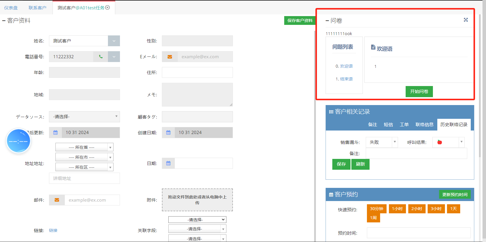

⑤点击质检进入添加/编辑任务管理的质检页面：

- **质检比**：设定该任务需要被质检的比例，用于提示与统计质检工作量。

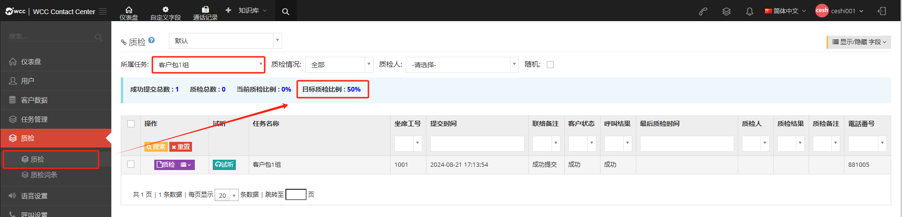

⑥点击设置进入添加/编辑任务管理的设置页面:

- **发送统计的CSV到指定地址**：预拨号任务完成后，系统可将结果统计报表（CSV格式）发送至指定邮箱地址（地址需联系供应商或管理员配置）。

#### 3.3.2成功提交客户

1. 核心作用：展示销售漏斗状态为 “成功”（分值＞0）的客户数据，便于统计转化成果。

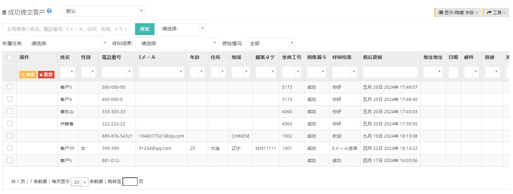

上图中的【默认】用户可以选择默认客户包或客户包查看成功提交客户数据。

2. 关键操作：

【搜索】全局搜索支持用户对客户姓名、电话号码、电子邮件、城市、区域、备注等进行搜索。

【搜索】后的【请选择】选择销售漏斗进行查看。

【所属任务】选择成功提交客户所属的任务。

【呼叫结果】选择成功提交客户的呼叫结果。（显示绑定销售漏斗>0和未绑定任务的呼叫结果）

【质检情况】选择成功提交客户的质检情况。

【显示/隐藏字段】选择该页面想要显示或隐藏的字段。

【工具菜单中】

导出CSV文件：用户可以根据需要对成功提交数据进行导出，不选择任何数据默认是导出全部数据.

#### 3.3.3预拨号

1. 核心作用：预测拨号节省时间，按坐席组工作效率自动计算拨号数量，提升外呼效率。

2. 关键操作：

在操作下拉菜单中选择【高级设置】。系统提供两种基础拨号策略，启用“高级设置”后，参数将影响策略的执行精度：

① 按最大并发

- 机制：系统严格遵循设定的“每次拨号最大并发数”和“拨号间隔”进行外呼。

- 适用场景：适用于对并发控制有严格、固定要求的场景。

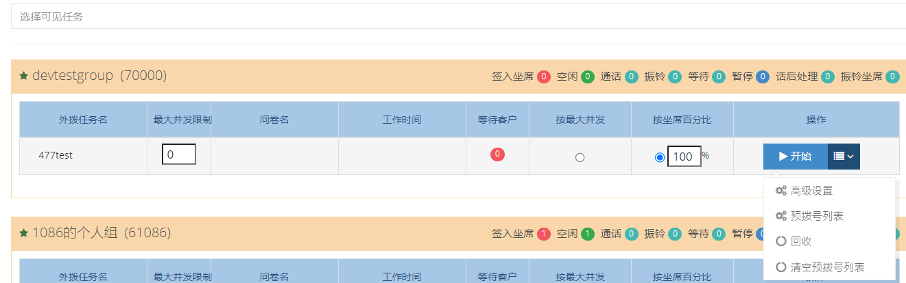

② 按坐席百分比

- 机制：系统将综合“接听率”、“平均通话时长”等效率指标进行智能计算，动态调整外呼节奏。

- 适用场景：适用于追求坐席工作效率与客户接听体验平衡的场景。启用高级设置可使计算更精确。

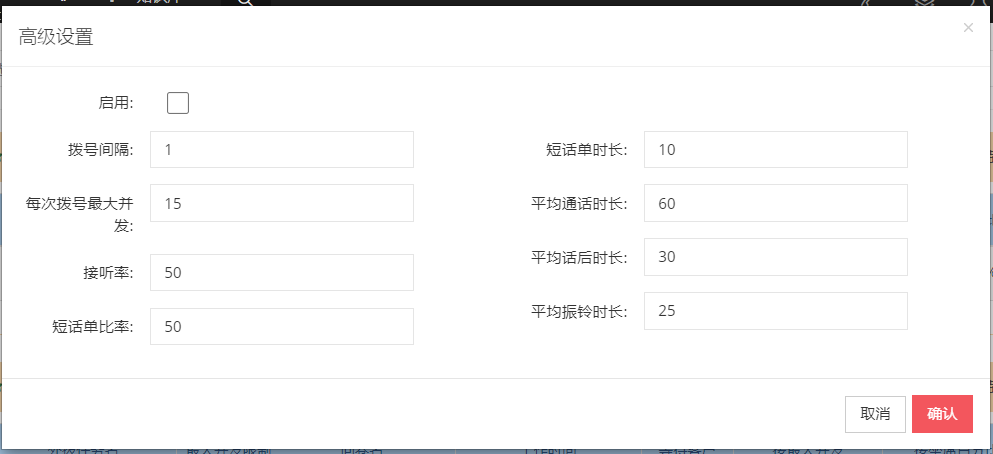

- 启用：开启或关闭高级设置功能。

- 拨号间隔：预拨号工作时，两次拨号动作之间的等待时间。（单位：秒）

- 每次拨号最大并发：允许该坐席组同时发起的最大呼叫数量。（单位：个）

- 接听率：坐席组内坐席能够及时接听电话的成功比率。(单位：百分比)

- 短话单比率：短话单在总通话量中所占的比率。（单位：百分比）

- 短话单通话时长：用于界定“短话单”的时长阈值，通话时长小于此值的记录计为短话单。（单位：秒）

- 平均通话时长：该坐席组每次通话的平均持续时间。（秒）

- 平均话后时长：该坐席组每次通话结束后，进行后续操作（如记录）所需的平均时间。（秒

- 平均振铃时长：该坐席组外呼时，电话振铃直到被接听或挂断的平均时间。（秒）

③ 为获得最佳的预拨号效果，建议管理员在配置前充分了解坐席组的历史工作效率数据。

*列举情况说明*：  

*坐席在线总数10*

*坐席1：通话时长20s*

*坐席2：通话时长120s（大于平均通话时长60s【talkend】）*

*坐席3：通话时长4s（小于短话单时长10s短话单比率50%=5s【shorttalk】）*

*坐席4：话后时长60s（大于平均话后时长30s单小于平均话后时长90S【acwend】）*

*坐席5：话后时长30s*

*其他坐席为空闲坐席【idleagent】*

*客户1：振铃，振铃15S，已经接通，但是没有坐席接通*

*客户2：振铃20s被接通（小于平均振铃时长25s【ringing】）*

*可用坐席 = idleAgent + talkEnd + acwEnd + shortTalk - waiting*

*预测下次可用坐席数量=空闲坐席5个+坐席2（此时系统判断这个通话即将要被挂断了）+坐席4（大于平均话后时长系统预测这个坐席即将离开话后）+坐席3（短话单即将结束）-客户1=5+1+1+1-1=7*

*拨号数 =（可用坐席 × 坐席百分比）/应答率 - ringing*

*拨号数量=（7*150%）/50%-1=20*

*系统会在每次轮预拨号开始前预测计算下一次拨号的数量，大概就是以上的步骤。*

*可用坐席都是指坐席的数量，高级里的设置，是作为下一次预拨号判断的依据*。

②设置好预拨号的高级选项后，就可以进入开启预拨号的流程。如果等待客户数不为0，则需要先清空预拨号列表：

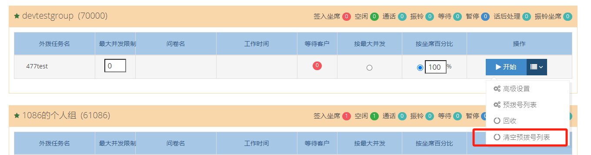

③点击【回收】，对任务中的客户数据进行回收。在【请选择】中有两种回收的方式：

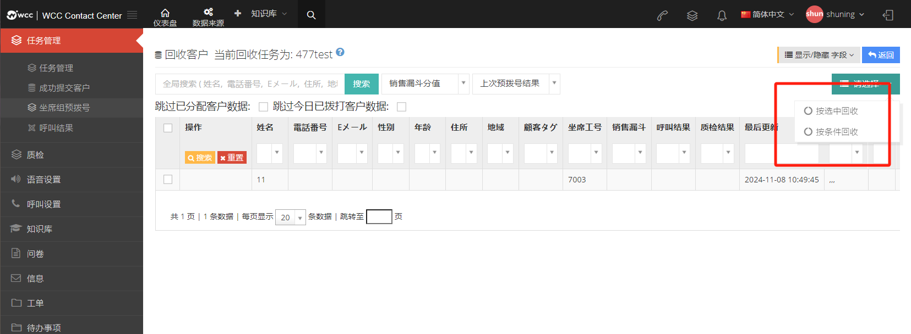

- **按选中回收**：选中需要回收的客户数据，点击确定即可进行回收。

- **按条件回收**：用户选择回收数据的条件，比如跳过已分配客户数据、跳过今日拨打客户数，或是某一销售漏斗数据，选择该条件后直接点击按条件回收数据，该条件下的数据可被回收。

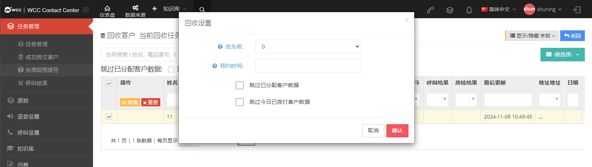

- **优先级**：在预拨号拨号时被分配数值越小的客户数据，拨打顺序越靠前，优先级可以从1-9数字中选择。

- **预约时间**：在预拨号拨号时按照预约的时间进行拨号。

- **跳过已分配客户数据**：跳过已经分配给指定坐席的客户数据。

此时回到坐席组预拨号页面点击开始，开启预拨号。在预拨号拨打过程中，用户可以在预拨号列表中点击预拨号列表查看当前拨号列表。

注：在整个回收过程中预拨号是在停止的状态下进行。

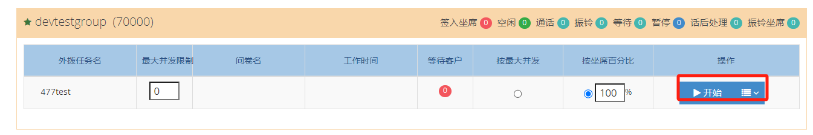

在预拨号期间你可以点击查看【预拨号列表】，列表中显示了当前正在被预拨号的号码。

【搜索】全局搜索 ( 姓名,  電話番号,  Eメール,  住所,  地域,  メモ ) ...

【销售漏斗分值】以销售漏斗作为筛选查看客户的条件。

【上次预拨号结果】查看预拨号列表中，上次预拨号结果条件下的客户。

【显示隐藏字段】选择想要查看的字段。

【请选择】按条件从列表中删除或选择数据。

**预拨号时状态的显示**：

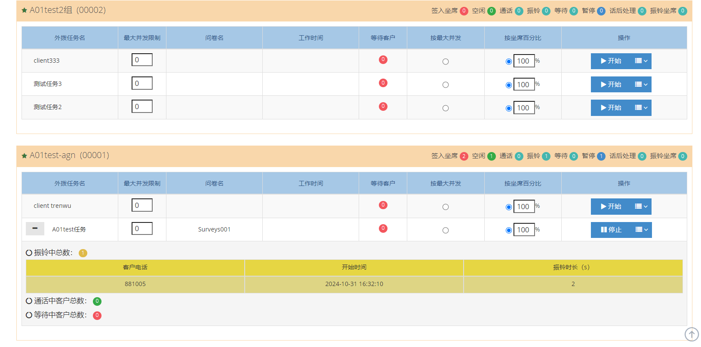

**客户电话**：振铃客户的电话号码。

**开始时间**：客户开始振铃的时间。

**振铃时长**：客户振铃的时长。

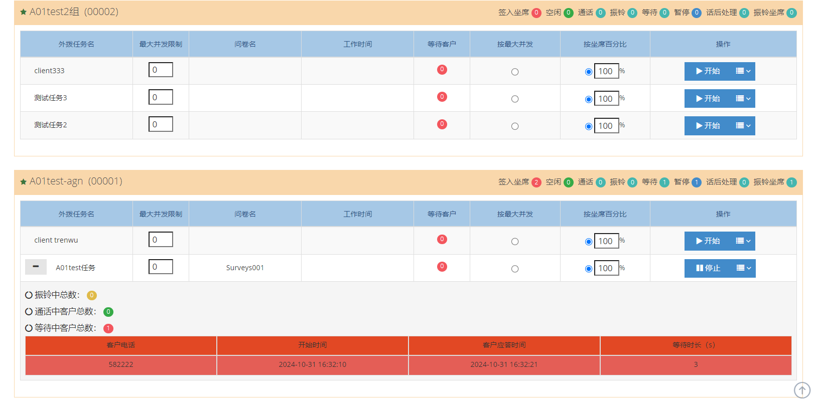

**客户电话**：接通客户的电话号码。

**开始时间**：客户开始振铃的时间。

**客户应答时间**：客户应答这个通话的时间。

**等待时长**：客户应答这个通话开始计算的等待时长。

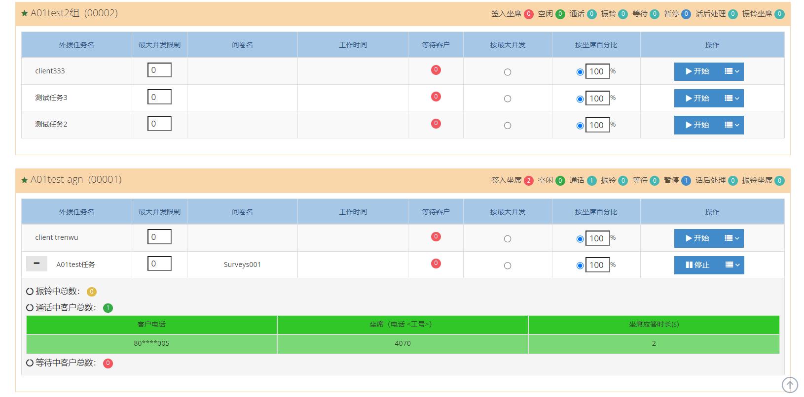

**客户电话**：坐席应答这个客户的电话号码。

**坐席（电话-工号）**：接通这个客户电话的坐席工号。

**坐席应答时间**：坐席接通这个客户电话的时间。

#### 3.3.4 呼叫结果

1. 核心作用：分类标记通话结果（如 “成功”“失败”“要追迹”），便于统计与跟进。

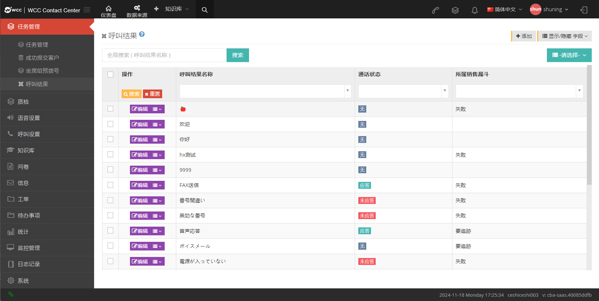

2. 关键操作

【搜索】全局搜索仅可以使用呼叫结果名称来搜索。

【添加】添加一个新的呼叫结果。

【显示/隐藏字段】选择该页面需要显示或是隐藏的字段。

【请选择】按条件删除。

【编辑】对已建立的呼叫结果可以编辑。每个新建的呼叫结果都有一个唯一ID，以及创建时间。

【下拉菜单】删除这个呼叫结果。

3. 新增一个呼叫结果

①在呼叫结果页面中点击添加进入添加/编辑呼叫结果页面：

- **呼叫结果名称**：自定义此结果的名称（如“已下单”、“需回访”等），用于坐席在结束通话时选择。

- **通话状态**：定义此结果可被使用的通话前提条件。

***应答***-仅当通话被客户接听后可选。

***未应答***-仅当通话未被接听（如无人接听、忙线）时可选。

***无***-在任何通话状态下均可选择（通用结果）。

- **所属销售漏斗**：指定此结果关联的销售阶段。设置后，该结果仅当客户处于此销售阶段时才会在坐席界面显示。

- **应用到任务**：设定此结果的应用范围。可指定到单个、多个或全部外呼任务，未被选择的任务中将不会显示此呼叫结果。

- **强制预约**：启用后，坐席必须为该客户建立一个预约时间，否则无法保存当前联络记录。

坐席登录后，可在 客户弹屏页面 → 客户相关记录 → 历史联络记录 中，为当次通话选择或查看已记录的呼叫结果。

### 3.4 质检

#### 3.4.1 质检

1. 核心作用：质检用于抽查坐席通话，评估服务表现并确保记录准确。

- 抽查评估：质检人员可听录音、核记录，并对沟通技巧与服务规范进行评分。

- 申诉机制：坐席对结果有异议可提出申诉。

- 任务锁定：任务开启质检后，客户一旦被提交记录即被锁定，无法再次拨打。

- 回拨控制：仅当质检结果标记为“可回拨”后，该客户才可重新被拨打。

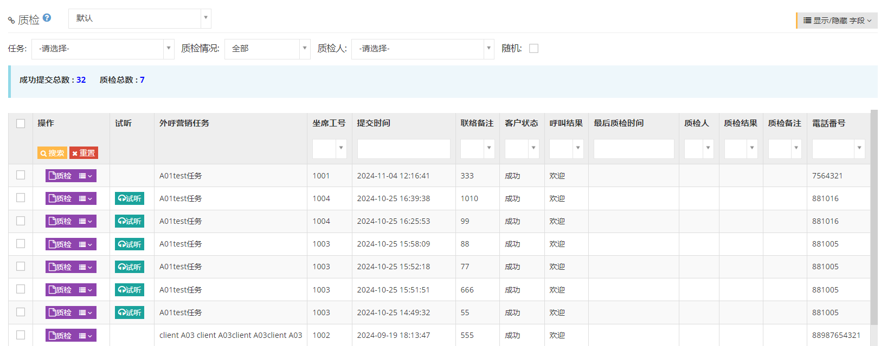

2. 关键操作

【默认】选择需要质检的客户包。

【显示/隐藏字段】选择该页面需要显示或是隐藏的字段。

【所属任务】需要质检的呼叫任务。

【质检情况】根绝选择的质检情况查看质检数据。（抽检合格包含 质检成功、话术不规范、未质检；可回拨属于质检不合格中。）

【质检人】根据选择的质检人查看质检数据。

【随机】随机查看需要质检的数据。

【试听】

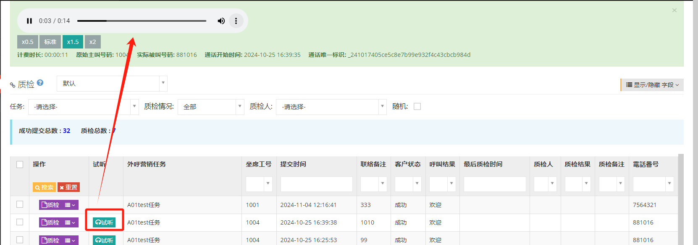

【质检】点击质检进入质检页面。

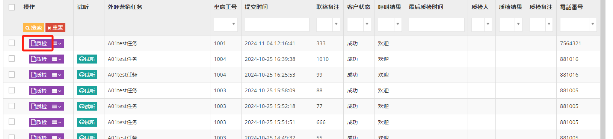

【下拉菜单】选择质量检查的结果可以对成功提交的数据进行快速质量检查。

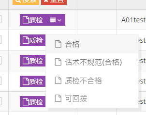

3. 质检流程

点击【质检】进入质检流程主页面，该页面包含四个核心功能模块：质检、相关记录、客户资料和上次质检结果。

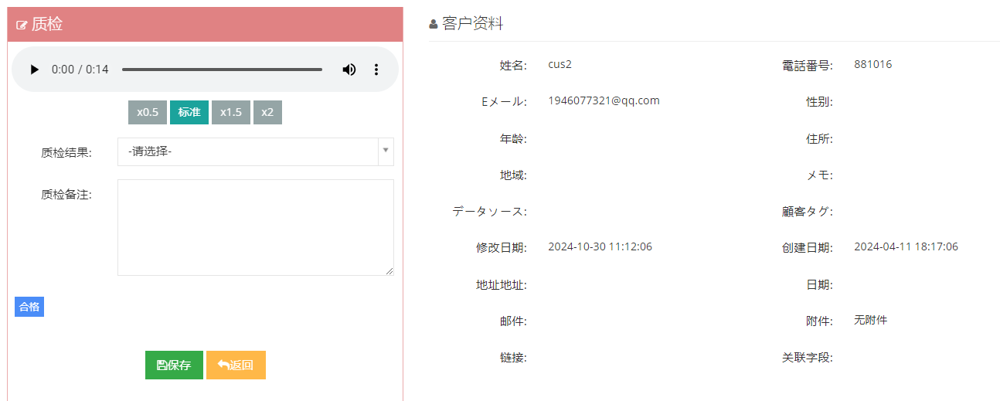

【质检】

- 核心操作：质检员可对坐席已提交的通话进行抽查。

- 录音控制：支持调整录音播放速度或将录音下载至本地。

- 评定结果：需为每通录音选定质检结果，选项包括：合格、话术不规范（合格）、失败、可回拨。

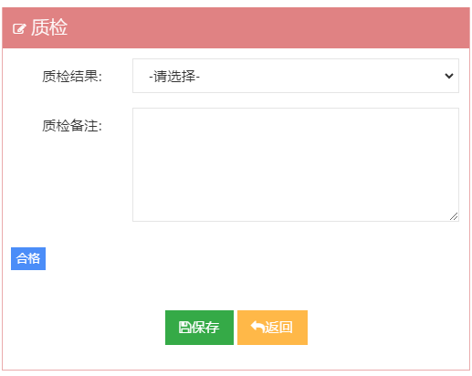

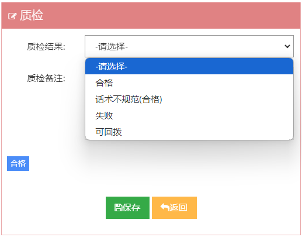

若选择“不规范”、“失败”或“可回拨”，必须填写质检备注（质检备注的快速选择入口可在质检词条中设置）。

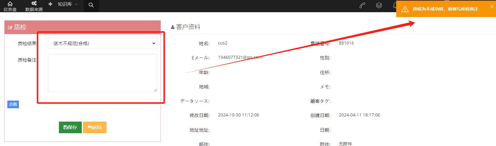

【相关记录】

- 功能说明：展示该客户与坐席的所有历史联络记录。

- 操作支持：质检员可查看每条记录详情，并听取对应的历史通话录音。

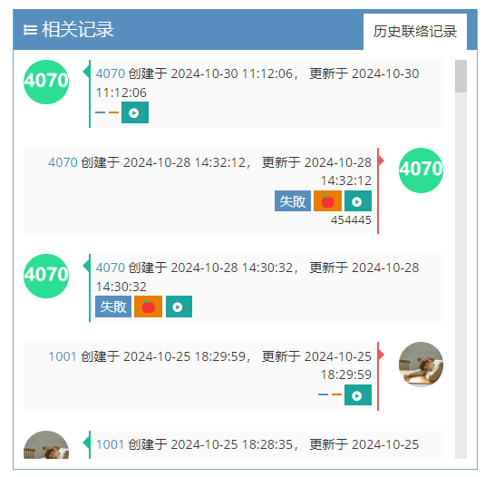

【客户资料】

- 功能说明：在质检过程中，供质检员随时查看当前客户的基本资料信息。

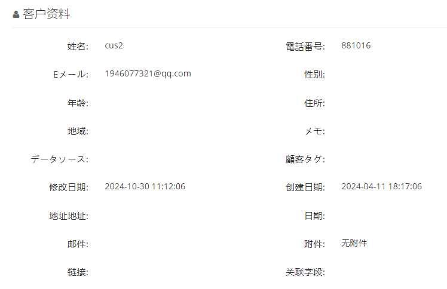

【上次质检结果】

- 触发条件：仅当客户上一次的质检结果为“可回拨”，且坐席再次提交其新的联络记录后，此模块才会出现

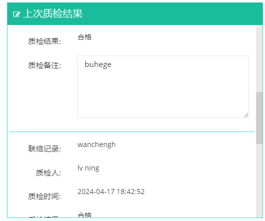

- 显示内容：集中展示上一次质检的关键信息，方便质检员对照参考，内容包含：

联络记录：上次提交时坐席填写的备注。

质检人：执行上次质检的人员。

质检时间：上次质检完成的时间。

质检结果：上次的质检评定结果。

质检备注：上次质检时填写的备注信息。

#### 3.4.2 质检词条

1. 核心作用：预设常用质检备注（如 “话术不规范”“客户信息记录完整”），质检时一键选择，提升效率。

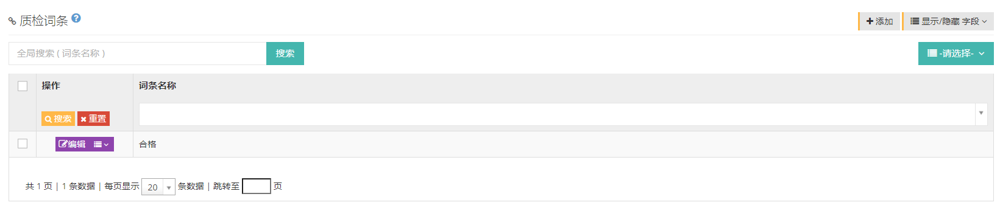

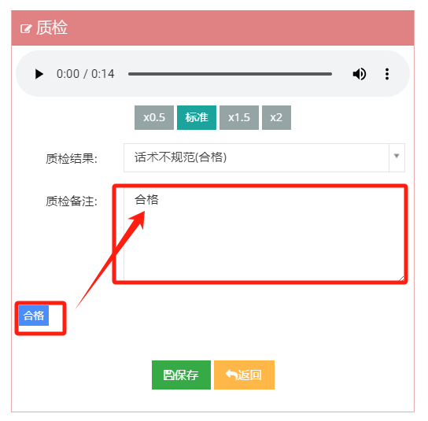

2. 关键操作

【搜索】全局搜索仅可以使用质检词条名称来搜索。

【添加】添加一个新的质检词条（上限为40个字符）。

【显示/隐藏字段】选择该页面需要显示或是隐藏的字段。

【请选择】请按条件删除。

【编辑】对已建立的质检词条可以编辑。每个新建的呼叫结果都有一个唯一ID。

【下拉菜单】删除该质检词条.

### 3.5 语音设置

#### 3.5.1 did号码

1.  核心操作：运营商提供的呼入号码（客户拨打的号码），可设置呼入路由（如转接 IVR、坐席组）。

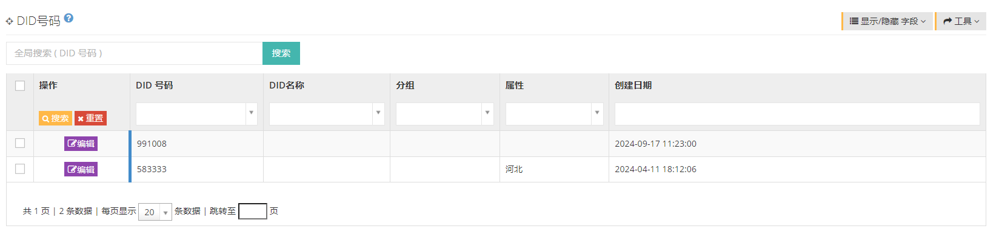

2. 关键操作

【搜索】全局搜索支持did号码、client以及域名进行搜索。

【显示/隐藏字段】选择该页面需要显示或隐藏的字段。

【工具】批量编辑-导出CSV文件

【编辑】编辑可以对did号码的转向、名称、分组和主叫号码的前缀进行设置。

3. 编辑DID号码

① 点击【编辑】进入添加/编辑DID号码的常规界面:

权限说明：Client用户仅可编辑已分配的DID号码，无法自行添加。如需新增DID号码，请联系您的代理商或运营商进行申请和分配。

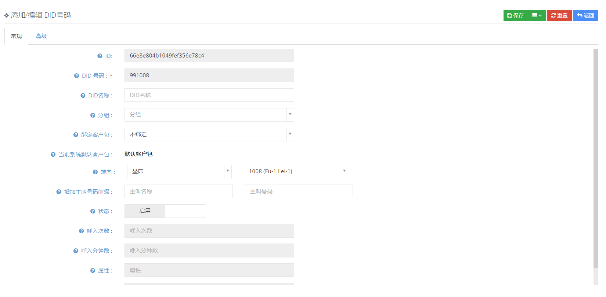

- **ID**：DID号码的唯一标识符，不可更改。

- **DID号码**：客户向坐席拨号时显示的号码。多个号码之间可用空格或英文逗号分隔。

- **DID名称**：便于用户在系统中识别该号码。若已设置，系统统计时将显示此名称。

- **分组**：用于对DID号码进行分类管理（如将使用相同呼入规则的号码归为一组）。输入分组名称后按回车即可选中。

- **绑定客户包**：若不绑定，系统将使用默认客户包（即系统偏好设置中的默认客户表）。若绑定至具体客户包，则当前DID与该客户包关联；当该客户包被设为不可见时，DID将自动释放，此字段恢复为“不绑定”。

- **转向**：决定系统接收到呼叫后应转接至的目标路由，例如：IVR菜单、振铃组、条件、播放列表、坐席、坐席组等。

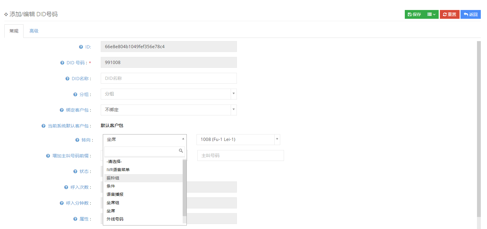

- **增加主叫号码前缀**：启用后，系统将在呼入电话的主叫号码前添加指定前缀。该前缀会在弹屏振铃界面及通话记录中显示。对于SIP设备，主叫号码还支持显示主叫名称。

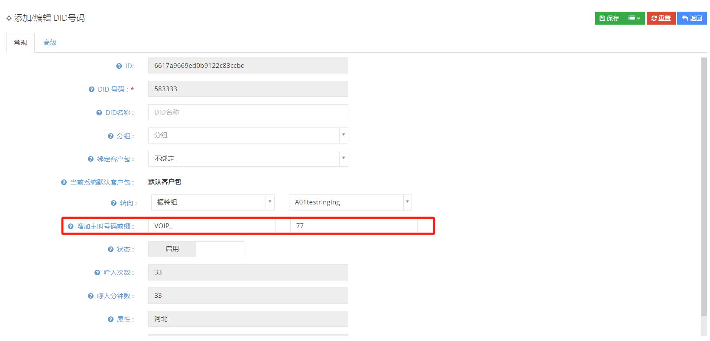

设置后如下图所示↓↓↓

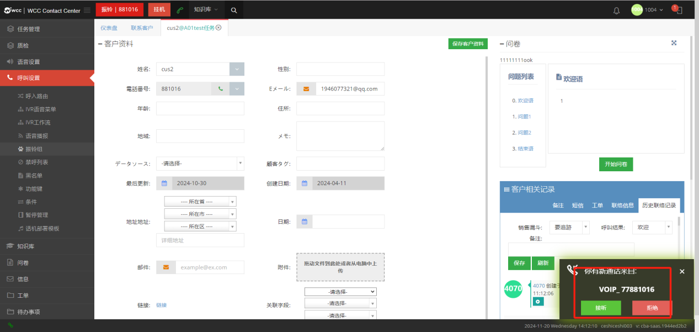

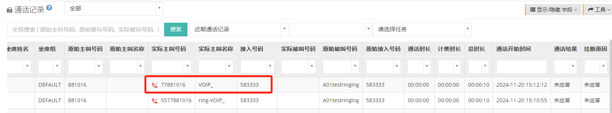

- **状态**：启用或禁用该DID号码。禁用后，拨打此号码将被系统直接拒绝。

- **呼入次数**：本月该DID号码的来电总数。

- **呼入分钟数**：本月该DID号码的累计通话时长（分钟）。

- **属性**：显示DID号码的归属地信息（由代理商在号码归属地菜单中配置）。

- **最后一次使用日期**：该号码最近一次被拨打的时间。

②点击高级进入添加/编辑DID号码的高级页:

- **国家**：由代理商或运营商设定，Client用户不可修改。

- **备注**：可在此填写相关说明信息。

**注意：若您是通过更高级别账号以“登录为”（loginas）方式进入客户端的**：

**登录时若选择“是”，界面将显示【代理商】字段**；

**登录时若选择“否”，界面将显示【组】字段**。

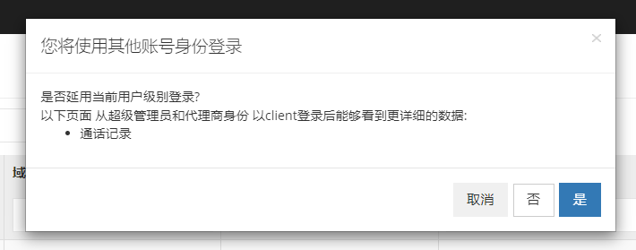

#### 3.5.2 外显号码

1. 核心作用：坐席外呼时显示的主叫号码，影响客户信任度。

2. 优先级规则：坐席级设置＞任务级设置＞系统级设置，优先级高的配置覆盖低优先级。

- 添加/编辑坐席-高级设置-外显号码

- client系统-系统偏好-呼叫设置-主叫

- 任务管理-常规-外显号码

3. 操作说明

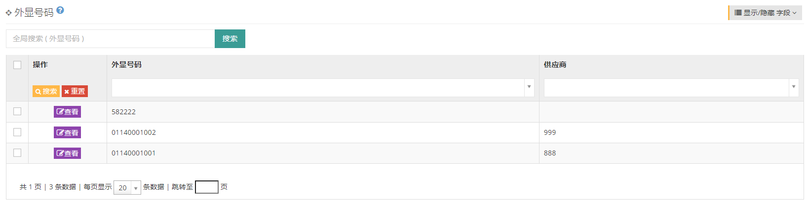

【搜索】全局搜索仅支持对外显号码进行搜索。

【显示/隐藏字段】设置在该页面用户需要显示或隐藏的字段。

【查看】查看该外显号码的设置，无法编辑.

4. 外显号码的设置

外显号码需要在代理商或运营商级别设置，设置后client可以选择所设置的外显号码。

- **ID**：每个外显号码都有一个独立ID。

- **外显号码**：输入需要添加的外显号码。

- **供应商**：你可以为这个外显号填写一个供应商名称，回车键选中（该功能需要在运营商级别进行设置）

#### 3.5.3 媒体文件

1. 核心作用：上传语音文件（如 IVR 语音、等待音乐），用于呼叫过程中的语音播报。

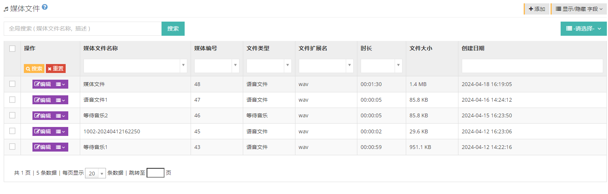

2. 关键操作：

【搜索】全局搜索支持媒体文件名称以及媒体文件描述搜索。

【添加】添加一个新的媒体文件。

【显示/隐藏字段】选择这个页面需要显示或是隐藏的字段。

【请选择】按条件删除。

【编辑】对已经建立好的媒体文件进行编辑。

【下拉菜单】在下拉菜单中用户可以对该条媒体文件进行预览、下载或是删除操作。

媒体文件预览

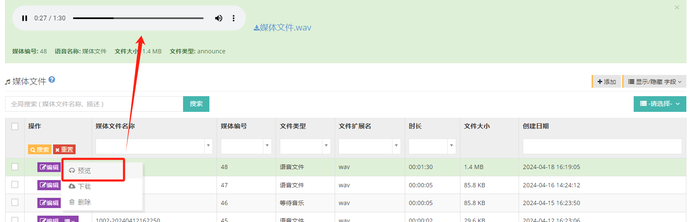

下载媒体文件的保存格式是wav

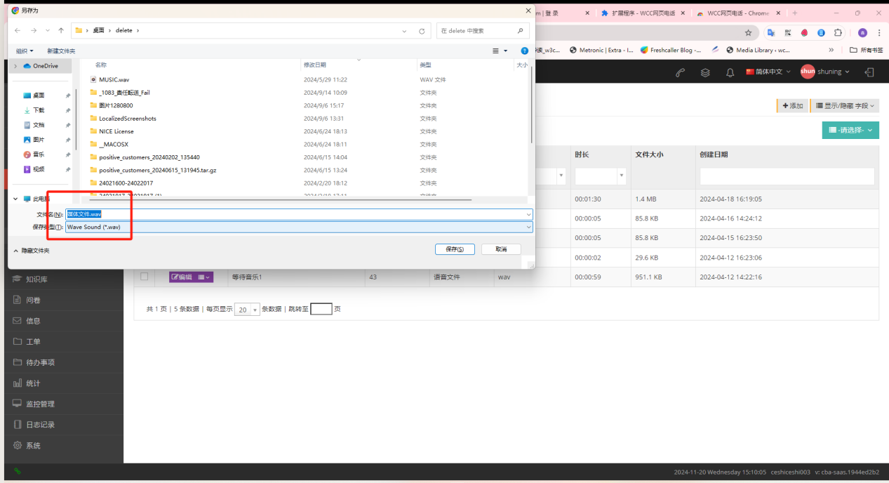

3. 添加一个新的媒体文件

①点击添加进入添加/编辑媒体文件的常规页面:

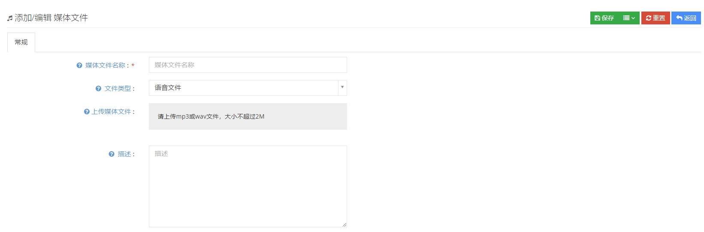

- **媒体文件名称**：请为此文件命名。

- **文件类型**：

***语音文件***：通适用于IVR或语音播报场景的简短语音消息。

***等待音乐***：用于客户通话等待或坐席组背景音乐。

- ***音乐类别***：仅支持英文命名，输入后按回车确认。

- **上传媒体文件**：支持从本地设备上传音频文件。

***试听***：可在线预览或下载已上传的音频。

- **描述**：可为文件添加说明信息，便于后续识别和管理。

②点击保存即可添加成功新的媒体文件。

### 3.6 呼叫设置

#### 3.6.1 呼入路由

1. 核心作用：控制外线呼入后的流转规则，适合多个号码共用同一流程或复杂规则配置（DID 设置优先于呼入路由）。

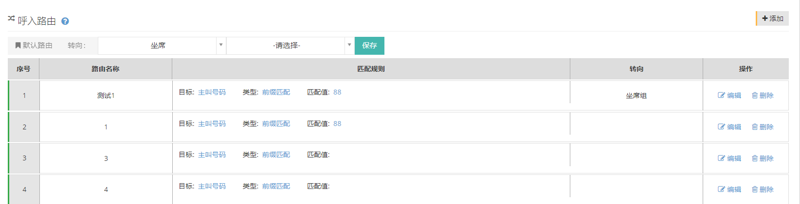

2. 关键操作

【默认路由】如果DID中无转向设置，且未新建路由设置转向，呼入将最后选择该默认路由进行转向。

【添加】添加一个新的呼入路由。

【编辑】对新建的呼入路由进行编辑。

【删除】删除该路由。

3. 新增一个路由

①点击添加进入添加/编辑呼入路由的常规设置页面:

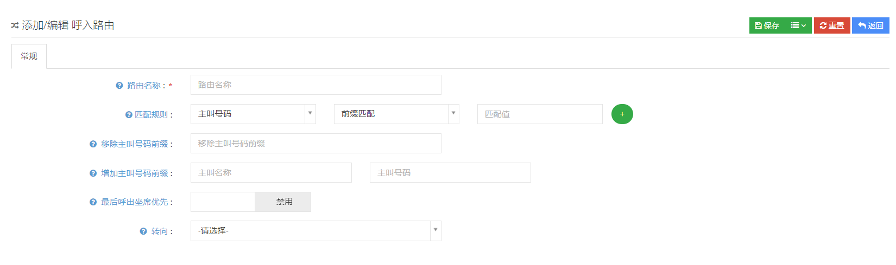

- **路由名称**：为此呼入路由设置一个易于识别的名称。

- **匹配规则**：

- **根据主叫号码设定匹配方式**：
        
    **前缀匹配** -根据主叫号码的前缀进行匹配。若 DID 号码中使用了其他前缀，可能导致通过此规则路由的号码无法正常显示归属地信息。 

    **地区匹配** -填写需匹配的地区，系统将根据地区信息进行匹配。  

    **正则匹配** -填写一段模糊号码，只要主叫号码包含该内容，即会按此规则匹配。
    
- **根据被叫 DID 号码设定匹配方式**：
          
    **前缀匹配** -根据 DID 号码的前缀进行匹配。

    **地区匹配** -填写需匹配的地区，系统将根据地区信息进行匹配。 

    **正则匹配** -填写正则表达式，系统将通过正则匹配主叫号码。  

    **分组匹配** -根据预先在 DID 设置中建立的分组进行匹配。  
    
    若不填写匹配值，系统将默认匹配所有符合该规则条件的来电。

- **移除主叫号码前缀**：系统将移除主叫号码中已在 DID 设置中配置的前缀。

- **增加呼叫号码前缀**：为来电号码添加前缀。若 DID 中也设置了前缀，此处添加的前缀将显示在 DID 前缀之前。

- **最后呼出坐席优先**：开启后，系统将优先呼叫最近与该主叫号码通话的坐席。

**转向**：符合匹配规则的来电将被转接至此处所选择的目标。

***关于前缀配置的示例***

***假设被叫号码为 881016*** ：

***若设置 移除主叫号码前缀 为 32，则坐席需拨打 32881016 进行外呼***

***若设置 增加呼叫号码前缀 为 88，则坐席需拨打 1016 进行外呼***

***若设置 替换号码（需完整符合匹配规则），例如填写 881005，则系统会将呼叫路由至该号码***

***以上所有操作（移除、添加、替换前缀或号码）均针对坐席外呼时所拨打的号码，不会修改客户的实际来电号码。若同时设置多项，系统将按顺序处理，并最终以 替换号码 为准***

#### 3.6.2IVR语音菜单

1. 核心作用：电脑话务导航，客户通过按键选择服务（如 “1 号键咨询业务，2 号键办理售后”）。

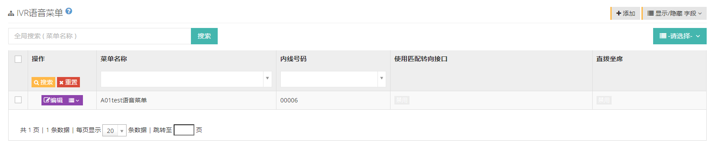

2. 关键操作

【搜索】全局搜索支持对菜单名称进行搜索。

【添加】添加一个新的语音菜单。

【显示/隐藏字段】选择该页面需要显示或是隐藏的字段。

【请选择】按条件删除。

【编辑】对建立好的语音菜单进行编辑。

【下拉菜单】删除该语音菜单.

3. 添加一个ivr菜单

①点击添加新增/编辑IVR语音菜单的常规页面：

- **菜单名称**：为当前IVR流程设置一个清晰、易识别的名称，便于管理。

- **内线号码**：设定一个内部短号。从任何内线分机拨打此号码，均可进入该IVR流程。

- **播放语音**：上传或选择引导语音文件。可设置多段语音并按顺序播放，每段后可设置“间隔时长”。注意：仅当设置了语音时，间隔时长才会生效。

- **重播次数**：当客户无任何输入时，系统重复播放引导语音的次数。设置为“0”表示仅播放一次。

- **输入超时时长**：每段语音播放完毕后，系统等待客户按键输入的时长（秒）。

- **直拨坐席**：

***启用*** ：客户可在听取IVR时，直接输入坐席分机号进行转接。

***禁用***：客户必须根据IVR菜单按键选择。注意：禁用后如需设置其他转向，请在“高级设置”中配置。若在“高级设置”中限制了“最大输入长度”，且坐席分机号长度超过此限制，则直拨功能将不可用。

- **增加主叫号码前缀**：当呼叫进入此IVR时，系统会自动为来电号码添加此前缀。后续转接至坐席时，坐席端将显示添加前缀后的号码。扩展功能：对于SIP设备，还可设置“主叫名称前缀”。

②点击高级进入添加/编辑IVR语音菜单的高级页面:

- **延迟播报**：来电进入IVR后，系统在开始播放引导语音前的等待时间（秒）。用于避免语音前段被截断，确保播报完整。

- **按键超时**：客户连续两次按键输入之间的最大允许间隔（秒）。若超时且未设置后续动作，通话将被挂断。

- **最大输入长度**：限制客户单次输入的数字位数。输入达到此长度后，系统将停止接收并立即处理。“0”表示无限制，系统将一直等待直到“按键超时”。

- **超时语音提醒**：在“输入超时时长”耗尽后、执行“超时转向”或“重播”前播放的提示语音。注意：未设置“重播次数”时，此语音不会播放。

- **超时转向**：当系统在最后一次语音播放后，于超时时间内仍未收到任何有效输入时，将呼叫转接至此预设目标（如人工坐席或留言信箱）。若不设置，超时后通话将自动挂断。

- **无匹配输入语音提示**：当客户输入的数字未匹配到任何预设的“转向”时，播放此提示音。

- **无匹配输入转向**：当客户输入未匹配任何选项时，将呼叫转接至此预设目标。若不设置，通话将在提示音后挂断。

- **使用匹配转向接口**：启用自定义插件处理客户输入，实现复杂逻辑（如根据输入查询并外呼、播报自定义信息等）。此功能需联系管理员配置。

③点击转向进入添加/编辑IVR语音菜单的转向页面，用户可以设置数字按键转向:

- **输入**:定义IVR接收的客户按键值。支持：数字 0-9、*键、#键。

- **转向**：定义客户按下对应键值后，呼叫将被转接至的目标（如：具体坐席、坐席组、其他IVR、语音信箱、外线号码等）。

④完成配置后，点击【保存】按钮，即可成功创建或更新IVR语音菜单。

#### 3.6.3 语音播报

1. 核心作用：当来电被转接到此功能时，系统将按顺序播放您预设的一条或多条语音信息。

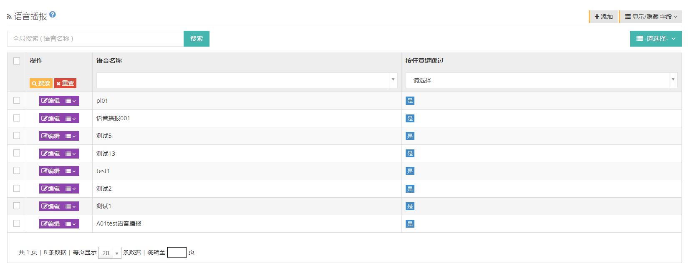

2. 关键操作

【搜索】全局搜索允许用户以语音名称进行搜索。

【添加】添加一个新的语音播报。

【显示/隐藏字段】选择在该页面想要显示或是隐藏的字段。

【请选择】按条件删除。

【编辑】对已建立的语音播报进行编辑。

【下拉菜单】可以删除该条语音播报.

3. 添加一个新的语音播报

①点击“添加”进入此页面，用于创建或修改一个语音播报流程:

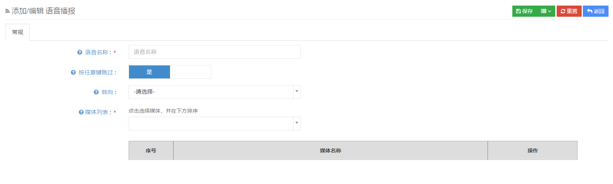

- **语音名称**：为此播报流程设置一个易于管理的名称。

- **媒体列表**：按顺序添加需要播放的语音文件。您可以在此列表中对文件进行排序或删除。

- **按任意键跳过**：启用后，客户在收听时按下电话任意键即可中断当前播放，直接跳转至指定流程。

- **转向**：设定当语音播放结束或被跳过后，系统下一步执行的动作（如下一步流程、转接等）。

- **媒体列表**：该列表中的文件将被顺序播放。可以在此删除列表中的语音播报。

②完成以上配置后，点击“保存”即可成功创建或更新播放列表。

#### 3.7.4 振铃组

1. 核心功能：用于实现基础的电话接听协作。与功能完整的“坐席组”不同，振铃组仅提供最核心的来电振铃分配功能。

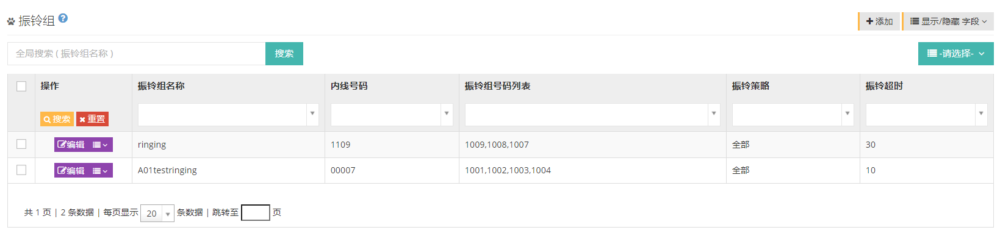

2. 关键操作

【搜索】全局搜索支持以振铃组名称进行搜索。

【添加】添加一个新的振铃组。

【显示/隐藏字段】选择这个页面需要显示或是隐藏的字段。

【请选择】按条件删除。

【编辑】对创建好的振铃组进行编辑。

【下拉菜单】删除该振铃组。

3. 添加一个振铃组

点击“添加”进入配置页面，用于创建一个新的振铃组：

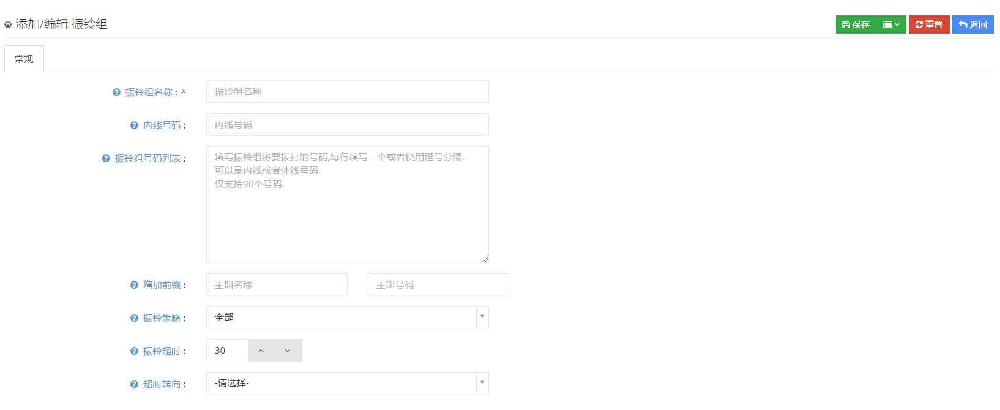

- **振铃组名称**：为此振铃组设置一个易于识别的名称。

- **内线号码**：为该组分配一个专属的短号。已占用的号码不可用。系统内部分机（如SIP话机）可直接拨打此号码呼叫本振铃组。

- **振铃组号码列表**：填入组成员的分机号或外线号码。请每行填写一个，或用英文逗号分隔。此列表顺序将直接影响“轮询”相关策略的呼叫次序。

- **增加前缀**：可为此振铃组发起的所有去电，在主叫号码前统一添加指定前缀（SIP设备还可修改主叫名称）。

- **振铃策略**：选择来电在组内的分配规则。

***全部*** -所有成员分机同时振铃。

***轮询*** -按列表顺序，逐个分机振铃。

***随机*** -随机选择一台分机振铃。

***记忆轮询*** -按顺序轮询，下次来电会从上次接听分机的下一台开始。

***顺序轮询*** -每次都从列表第一台分机开始顺序轮询。

- **振铃超时**：当策略为 “全部” 时：此值为整个振铃组的总等待时长。当策略为 其他类型 时：此值为呼叫每个号码的单独等待时长。

- **超时转向**：当振铃超时后，系统将把来电自动转接到您指定的下一目的地（如语音信箱或其他分机）

②完成以上配置后，点击“保存”即可成功创建振铃组。

#### 3.7.5黑名单

1. 核心作用：用于拦截指定号码的来电。被拦截的呼叫可被系统执行特定操作（如直接挂断、播放语音等），相关记录可在“通话记录”或“黑名单记录”中查看。

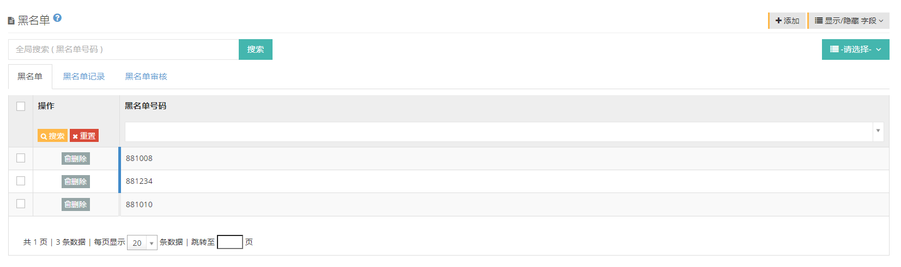

2. 核心操作

生效规则：

***Client管理员*** ：添加的黑名单立即生效。

***坐席*** ：添加的黑名单需经审核通过后方可生效。

【搜索】可按黑名单号码进行搜索。

【新增】添加新的黑名单号码（Client管理员操作）。

【显示/隐藏字段】自定义表格中显示的列。

【黑名单】当前已生效的拦截号码列表。

【黑名单记录】所有历史黑名单操作（包括已失效的）的完整日志。

【黑名单审核】查看和处理坐席提交的待审核申请。

client也可以在系统偏好设置黑名单中选择来自该号码的来电的其他方向。

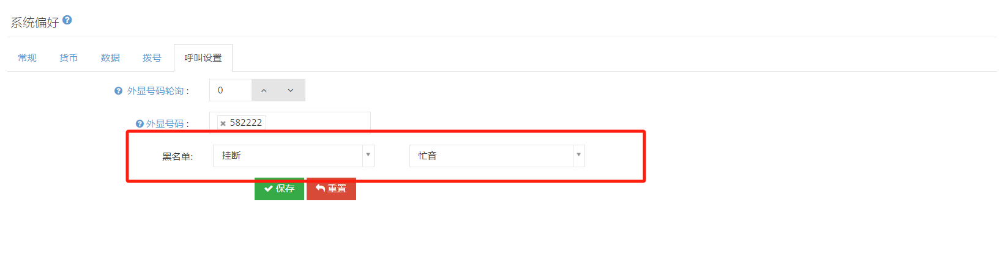

3. 添加一个黑名单号码

**client用户添加黑名单号码**

①点击添加进入添加/编辑黑名单的常规页面：

- **黑名单号码**：输入需拦截的号码。批量添加时，请使用英文逗号或换行分隔。

- **状态**：可立即“启用”或“禁用”此黑名单规则。

②点击“保存”，规则立即生效。

**坐席添加一个黑名单号码**

坐席可在客户资料页面中，将号码添加至黑名单。

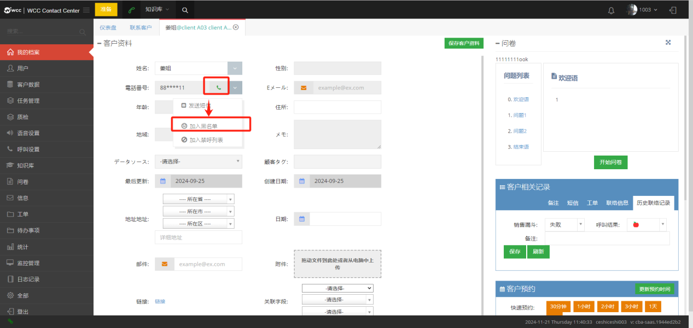

① 点击“添加到黑名单”后，需填写拦截原因。

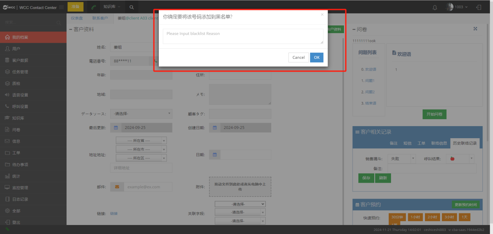

②提交后，该申请将进入审核队列，不会立即生效。

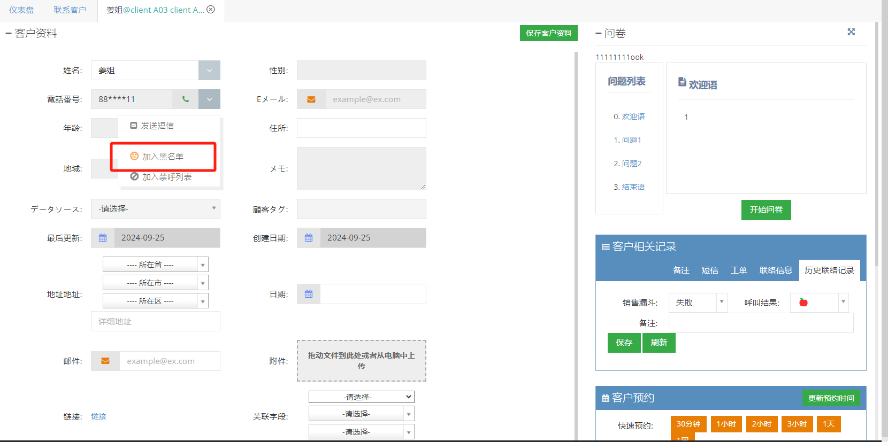

③ 拥有审核权限的管理员或坐席，需在 【黑名单审核】 页面处理申请。

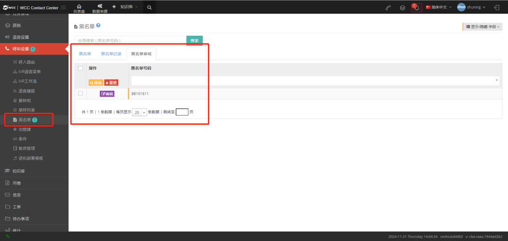

④ 点击“编辑”进入审核页面：

- **ID**：申请的唯一编号。

- **黑名单号码**：待审核的号码。

- **状态**：审核操作，选择“启用”或“拒绝”。

- **创建日期**：申请提交时间。

- **创建人**：提交申请的坐席。

⑤ 将状态设置为启用，点击保存，黑名单生效。

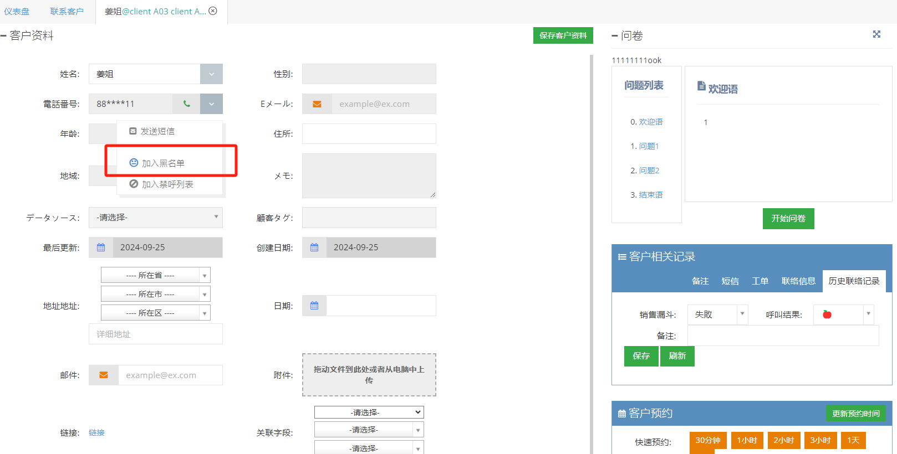

#### 3.7.6 DNCs

1. 核心作用：限制坐席向特定号码发起外呼。当坐席尝试拨打列表中的号码时，系统可执行预设操作，如直接挂断或转接至其他流程。

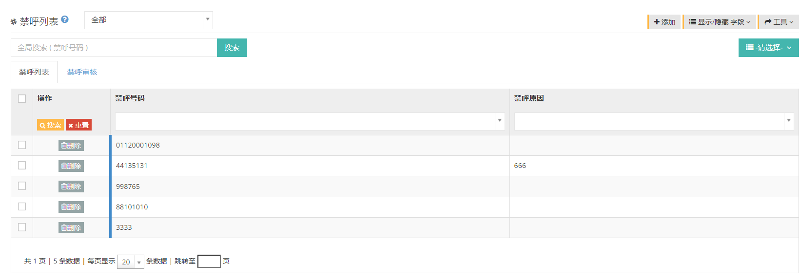

2. 关键操作

【全部】可按客户包筛选禁呼号码。

【搜索】支持通过禁呼号码进行全局搜索。

【添加】手动添加新的禁呼号码（Client管理员操作）。

【显示/隐藏字段】自定义当前页面表格的显示列。
  
【工具】提供数据导入功能。

【请选择】支持按条件批量删除记录。

【禁呼列表】查看所有已生效的禁呼号码。

【禁呼审核】处理坐席提交的待审核禁呼申请。

3. 添加一个禁呼号码

**client 添加禁呼号码**

① 点击“添加”进入编辑页面：

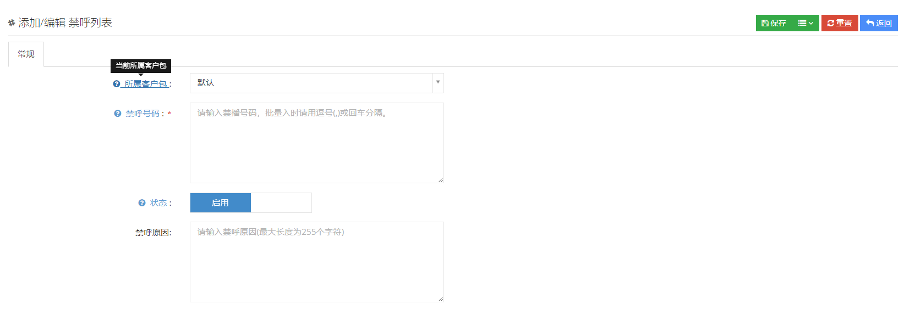

- **所属客户包**：选择此规则适用的客户包。注意：禁呼规则仅对所选客户包生效，其他客户包中的相同号码不受影响。

- **禁呼号码**：输入需要禁止外呼的号码。批量添加时，请使用英文逗号或换行进行分隔。

- **状态**：可立即“启用”或“禁用”此条禁呼规则。

- **禁呼原因**：填写添加该号码至禁呼列表的原因（便于后期管理与审核）。

②点击保存即可添加成功新的禁呼列表。

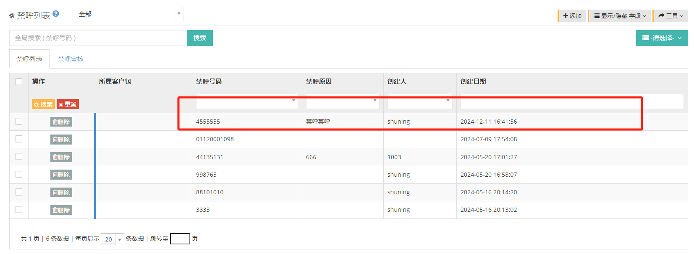

**坐席添加禁呼**

坐席可在其客户资料页面中，为特定客户号码提交禁呼申请。

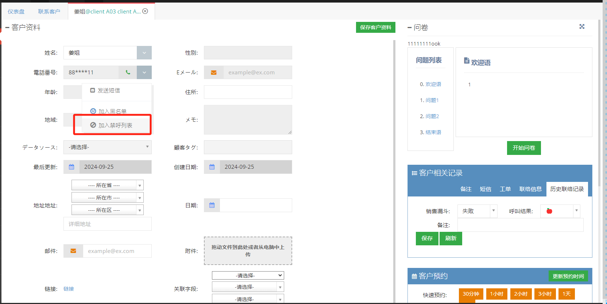

①在客户资料的下拉菜单中，点击 【加入禁呼列表】。以坐席身份提交的禁呼申请不会立即生效，将进入审核队列等待处理。

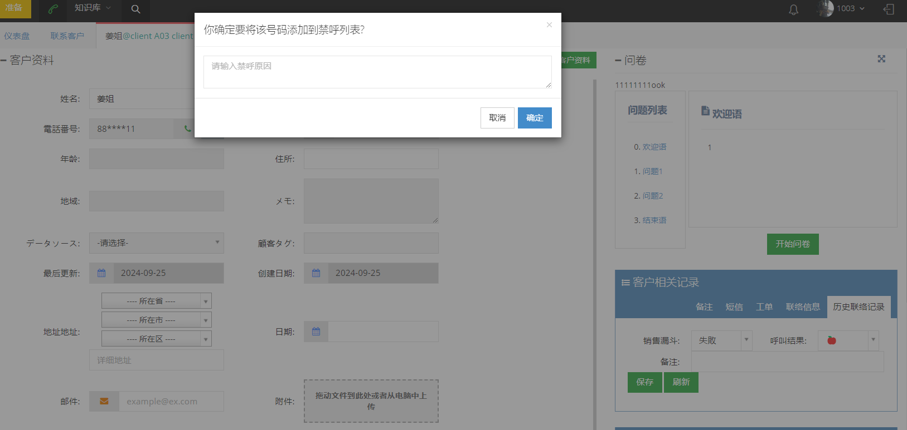

在弹出的窗口中，填写申请将该号码加入禁呼列表的具体原因，并提交。

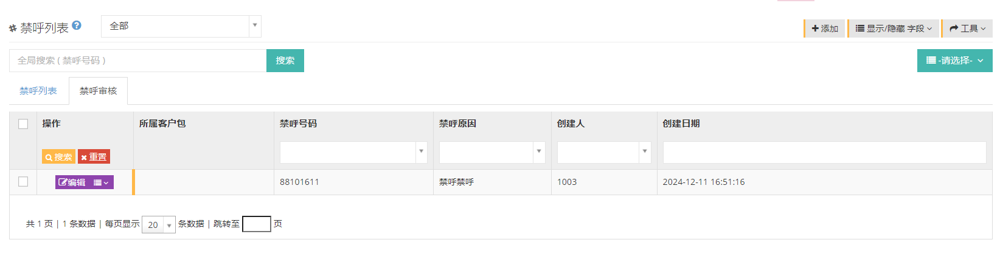

②点击编辑即可进入添加/编辑禁呼列表常规页面：

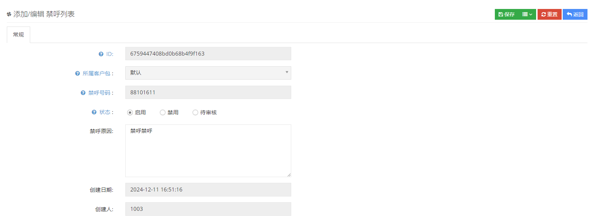

- **ID**：系统自动生成的唯一记录编号。

- **所属客户包**：此禁呼规则所关联的客户包。

- **禁呼号码**：待审核的号码。

- **状态**：审核操作项。选择 【启用】 以通过审核使规则生效，或选择其他状态。

- **禁呼原因**：可查看或修改坐席提交的原因。

- **创建日期**：申请提交的日期。

- **创建人**：提交申请的坐席。

③将 【状态】 设置为 【启用】，然后点击 【保存】，该禁呼规则即审核通过并生效。

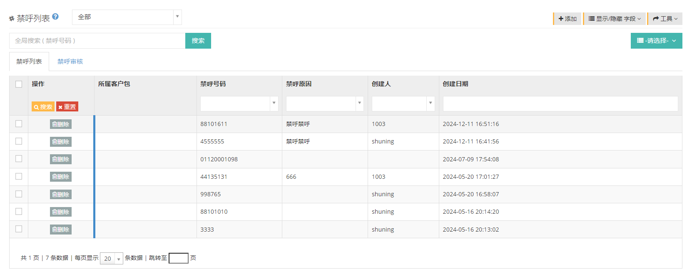

#### 3.7.7 功能键

1. 核心作用：功能键主要用于坐席分机电话，通过拨打特定号码实现快捷操作。各功能键说明如下：

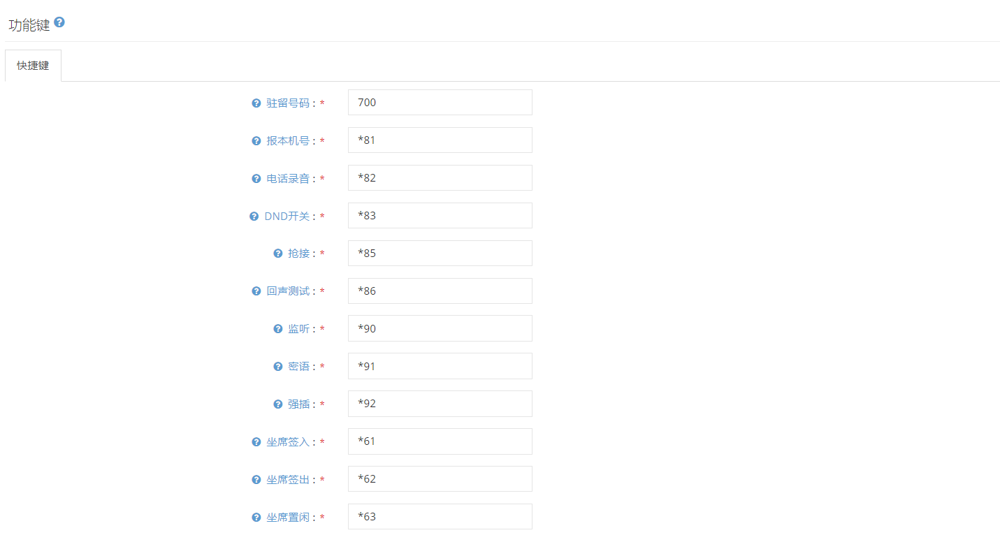

- **驻留号码（长度不能超过三位）** ：

    *驻留总机号* ：即此号码（如 701），是发起驻留的接入点。

    *驻留位置号* ：从该号码起向后连续的 20 个号码（如 701 至 720）均为可用的驻留位置。
   
    *寄存通话* ：在通话中按话机“保持”键，然后拨打此 驻留总机号（如 701）。

    *获取位置* ：系统将自动为该通话分配一个空闲的 驻留位置号（如 705）。

    *取回通话*：任何分机直接拨打该 驻留位置号（如 705），即可接听被寄存的通话。

    *重要说明*：此号段（如 701-720）优先用于驻留功能。即使其中有号码与其他分机号重复，拨打时系统也会优先检测是否存在驻留通话，而非直接呼叫分机。

- **报本机号**：拨打后，系统语音播报您当前使用的分机号码。

- **电话录音**：拨打后，可根据语音提示录制语音文件。录制文件可在【语音设置/媒体文件】页面查。

- **DND开关**：拨打可激活/取消当前分机的“免打扰”模式。激活后，分机将无法被呼叫。

- **抢接**：当同部门坐席无法及时接听来电时，其他坐席可使用此功能代为接听。

    *部门限制* ：仅可抢接同部门坐席的来电。若双方均未设置部门（即均为“默认”状态），则视为同部门。

    *抢接顺序* ：若坐席来电时间有先后，则最早呼入的优先被抢接；若多个坐席同时振铃，则随机抢接其中一个。

    *随机抢接* ：直接拨打 *85，系统将按上述规则自动抢接一个来电。

    *指定抢接* ：拨打 *85 + 目标坐席工号，可直接抢接该指定坐席的来电。

- **回声测试**：拨打后，系统将回放您输入的语音或按键音，用于测试通话媒体质量。

- **监听**：拨打此号码+坐席工号，在通话中拨打，可单向收听指定坐席与客户的通话，坐席与客户均不知情。

- **密语**：拨打此号码+坐席工号，在通话中拨打，可与坐席单独交谈，仅坐席能听到，客户听不见。

- **强插**：拨打此号码+坐席工号，在通话中拨打，可强行加入指定坐席的通话，形成三方会议，所有方都能听到彼此。

- **坐席签入**：拨打表示您已准备好从指定队列接收呼叫。

- **坐席置闲**：拨打表示您处于空闲状态，可以随时接收呼叫。

- **坐席暂停**：拨打后，您将暂时无法接收呼叫。系统会记录并显示暂停原因。

    注：网页监控页面支持在坐席非通话时发起监听/密语/强插，并可持续保持。话机操作仅限在通话过程中使用。

#### 3.7.8 条件

1. 核心作用：允许您根据设定的时间规则，将来电解锁至不同的目的地。系统会根据当前时间是否匹配设定的条件，自动执行相应的转向操作。

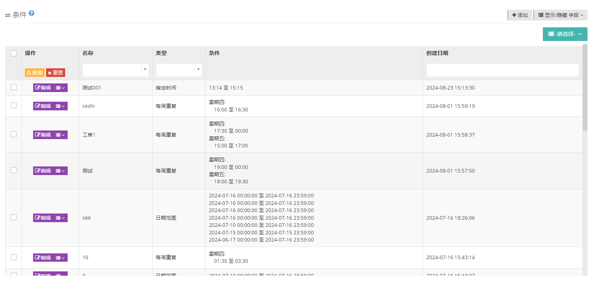

2. 关键操作

【添加】创建一个新的时间条件。

【显示/隐藏字段】自定义当前页面显示的列信息。

【请选择】批量删除已选中的条件。

【编辑】修改某个已创建的条件。

【下拉菜单】删除单条条件。

3. 添加一个新的条件

①点击添加进入添加/编辑号码条件的常规页面：

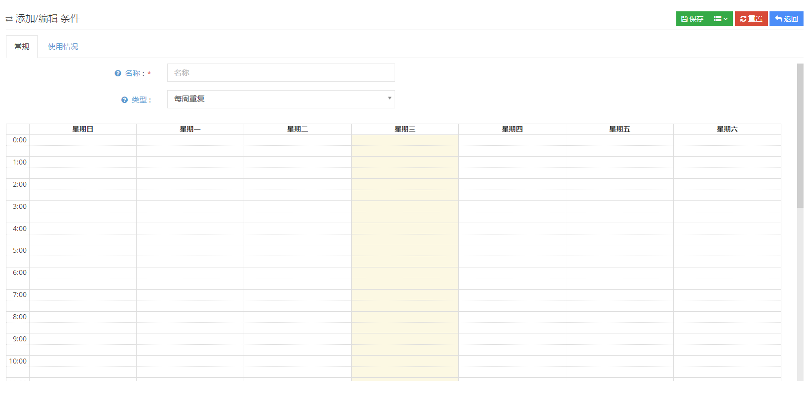

- **名称**：为此条件设置一个易于识别的名称。

- **类型**：选择时间判断的规则类型。

    ***每周重复***-设定每周固定重复生效的时间段（例如：每周一至周五 9:00-18:00）。

    ***指定时间***-设定每天内生效的精确时间范围（例如：每天 08:30:00 - 17:30:00）

    ***指定日期***-设定具体的生效日期（例如：2023-10-01）。

    ***日期范围***-设定一个连续的生效日期区间（例如：2023-12-20 至 2024-01-05）。

- **符合转向**：当来电时间满足上述条件时，电话将被转向的目的地。

- **不符合转向**：当来电时间不满足上述条件时，电话将被转向的目的地。

***各类设置详解***

**①每周重复**：在时间表格中点击以添加或编辑周期时间段。

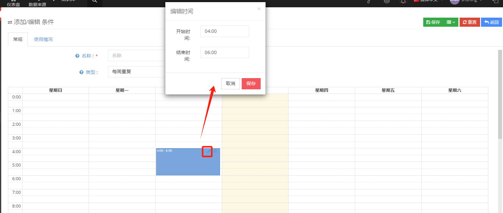

**②指定时间**：添加一个或多个每日的时间范围。系统判断精确到秒。若设定范围为 00:00:00 - 12:00:00，则 12:00:01 的来电将被判定为“不符合条件”。

**③指定日期**：添加一个或多个具体的生效日期。

**④日期范围**：添加一个或多个连续的日期范围。范围包含起始和结束时间的整分钟。若设定范围为 02-08 12:00 至 02-09 11:00，则 02-09 11:01 的来电将被判定为“不符合条件”。

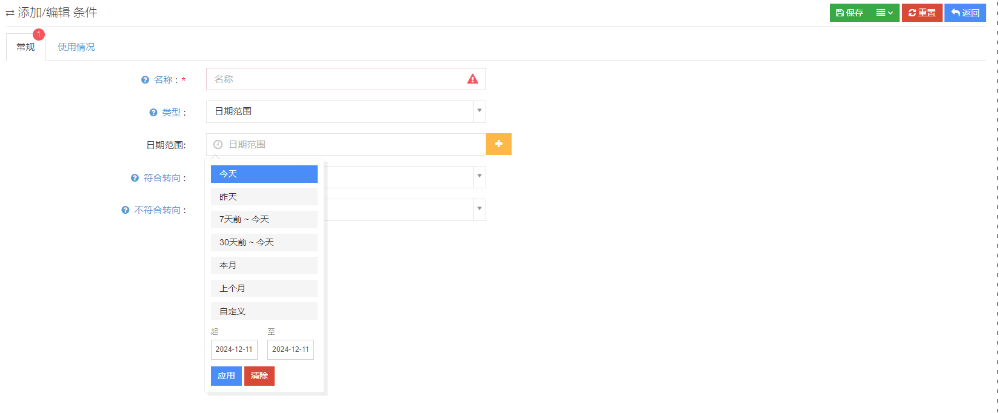

②使用情况：

点击【使用情况】标签页，可查看所有正在使用此条件的拨号任务及其具体设置，方便您进行统一管理和检查。

③配置完成后，点击【保存】按钮即可成功创建或更新时间条件。

#### 3.7.9 暂停管理

1. 核心作用：为坐席的“置忙”状态设置标准化的暂停原因。管理员可以在此页面统一配置坐席可选择的暂停原因，便于后续进行工作状态统计与分析。

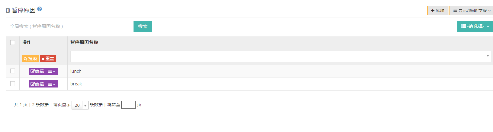

2. 关键操作

【搜索】根据暂停原因名称进行快速查找。

【添加】创建新的暂停原因。

【显示/隐藏字段】自定义页面显示的列信息。

【请选择】批量删除选中的暂停原因。

【编辑】对已建立的暂停原因进行编辑。

【下拉菜单】删除该暂停原因。

3. 添加暂停非原因及使用流程

①点击【添加】按钮，进入编辑页面：

②点填写或修改原因名称后，点击【保存】即可完成配置。

- 坐席如需临时暂停工作，可在系统右上角的下拉菜单中选择相应原因并点击“暂停”。

- 进入暂停状态后，坐席将处于“忙”态，无法主动外呼或处理系统分配的新任务。

- 呼入电话处理说明：若坐席未设置组，暂停期间仍可接听呼入电话，但该电话的所属组别将显示为“默认”。

- 数据记录：所有暂停操作（包括原因与时长）均会纳入统计报表，供管理员分析坐席工作状态与效率。

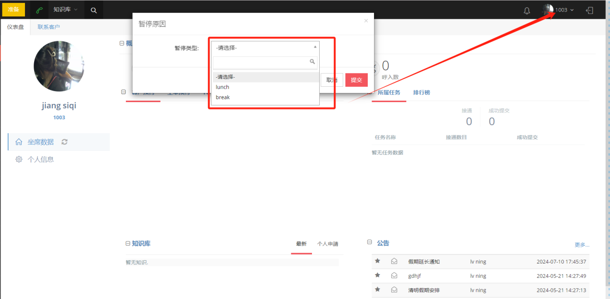

#### 2.7.10 话机部署模板

1. 核心作用：允许管理员将话机（IP电话）的常用配置保存为预设模板。在需要对大量话机进行相同配置时，使用模板可以极大地简化部署流程，实现一键批量配置，提升工作效率。

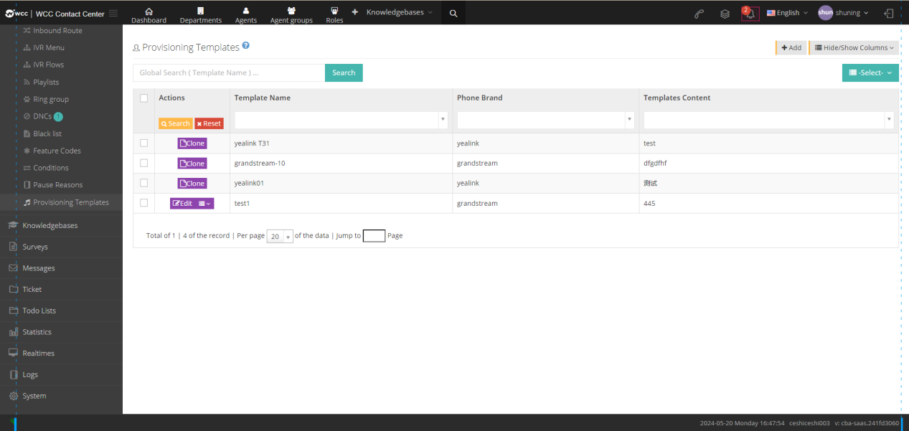

2. 关键操作

【搜索】可根据“模板名称”快速查找对应模板。

【添加】创建一个新的话机部署模板。

【显示/隐藏字段】自定义当前页面显示的列信息。

【请选择】批量删除已选中的模板。

【克隆】当用户权限较低时（如client级别），对上级创建的模板仅可进行克隆（复制），不可编辑。
【编辑】修改已创建的模板（仅限自己创建的或拥有权限的模板）。

【下拉菜单】可以删除该部署模板，也可以复制该话机部署模板.

3. 添加一个新的话机部署模版

①点击【添加】或【编辑】按钮，进入配置页面：

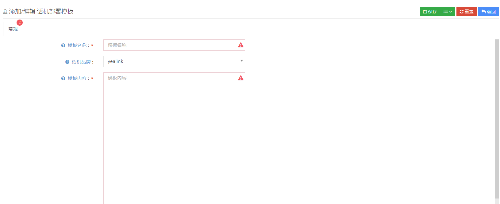

- **模板名称**：为此配置模板设置一个易于识别的名称。

- **话机品牌**：选择或填写此模板适用的电话机品牌（如Yealink、Cisco等）。

- **模板内容**：在此处填写或粘贴针对该品牌话机的具体配置参数（通常为XML或特定格式的配置文件）。

②点击【保存】即可完成创建或更新。

### 3.7 知识库

#### 3.7.1 知识库

1. 核心功能：集中存储、管理和共享企业常见问题与解决方案的核心平台，旨在帮助坐席快速、准确地解答客户问题，提升服务效率与一致性。

2. 关键操作

【搜索】搜索知识库里的文件。

【＋】点击搜索旁边的加号可以添加一个新的知识库文件

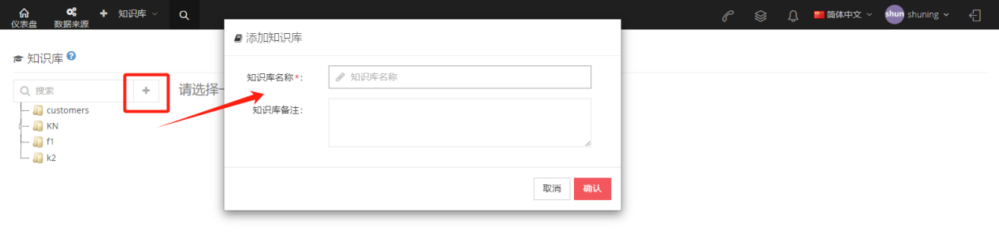

- **知识库名称**：为此知识库文件命名，建议名称清晰易懂。

- **知识库备注**：可填写该知识库的用途、范围等说明信息。

用每个知识库文件下可创建多个分支，用于细化分类：

- 点击已有知识库文件，再点击【＋】按钮，即可添加知识库分支。

- 使用分支旁的编辑、删除按钮可对分支进行修改。

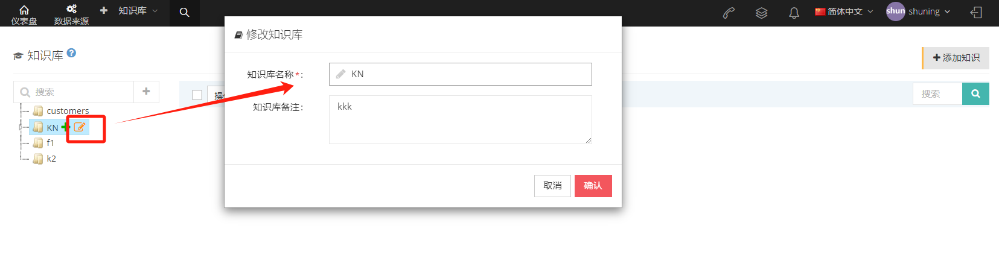

注意：若知识库下已存在分支，则需先删除所有分支后才能删除该知识库文件。

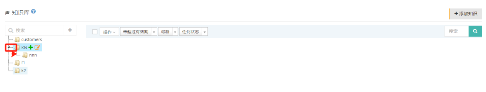

3. 添加知识

单击目标知识库文件，点击【添加知识】按钮。填写知识条目信息：

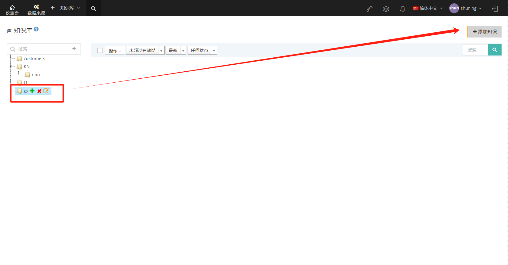

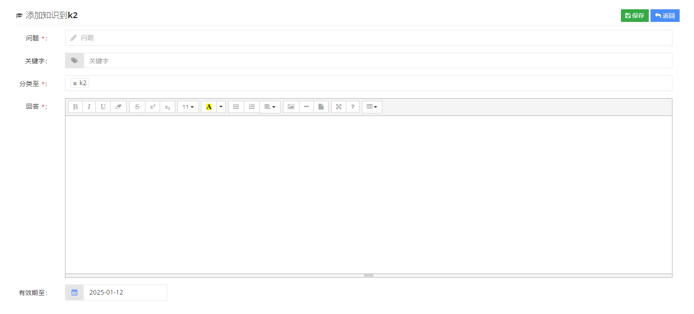

- **问题**：输入常见客户问题或场景描述。

- **关键字**：输入便于搜索的关键词，按 Enter 键添加多个关键词。

- **分类至**：可将该知识同时关联至多个知识库文件。

- **回答**：提供该问题的标准解答或处理步骤。

- **有效期至**：设置该知识的有效时间，到期后自动失效，不再被搜索到。

权限说明：拥有知识库页面权限的管理员所提交的知识将自动审核通过；坐席提交的知识需经管理员审核。

4. 其他操作

【批量操作】支持对坐席提交的知识条目进行批量审核（通过/不通过）。

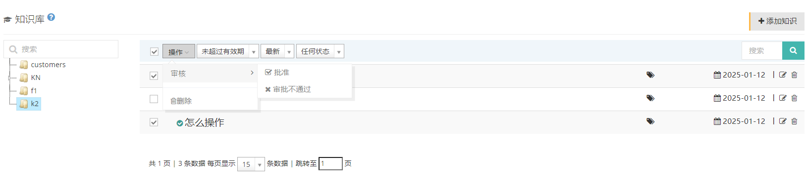

【有效期】查看已设置有效期的知识。

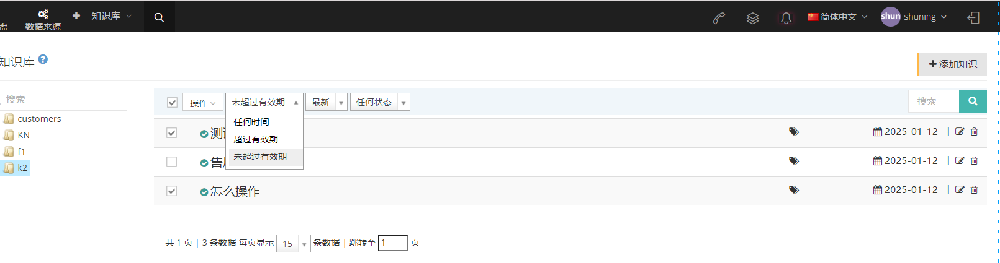

【最新/初始】按创建时间排序查看。

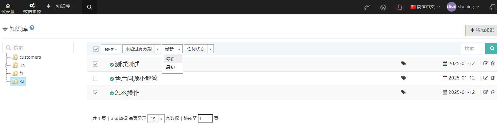

【状态】按审核状态（待审核/已通过/未通过）筛选知识。

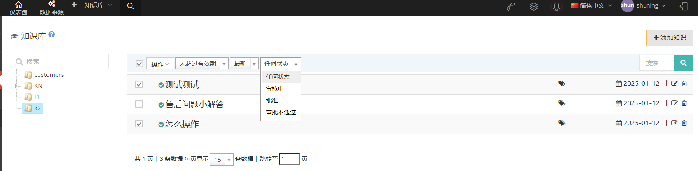

【坐席知识】若坐席角色包含知识库权限，其仪表盘将显示知识库入口。

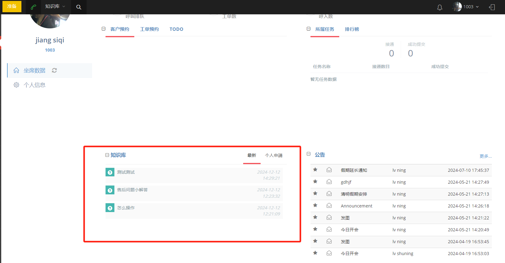

点击【我的提交】→【添加知识】，可提交新知识供管理员审核。

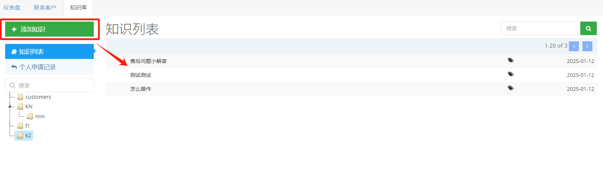

【知识列表】查看所有已审核通过的知识，可按标签快速筛选。

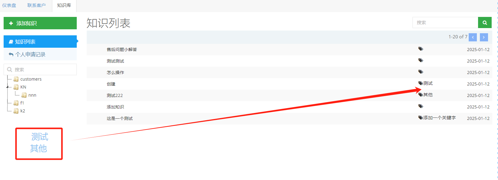

【我的提交】查看自己提交的所有知识条目及审核状态。

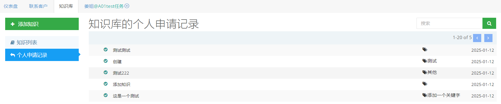

坐席提交知识后，管理员在知识库页面将看到提示标识。

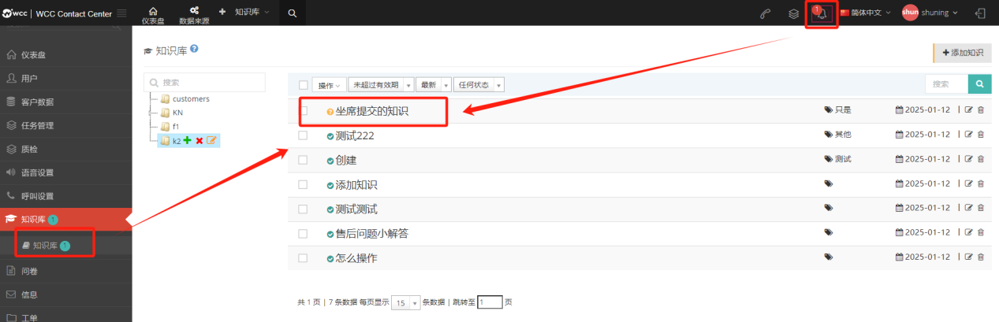

点击提示进入审核页面，可查看并审核坐席提交的知识。

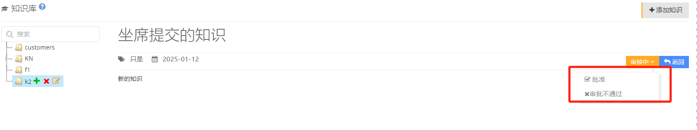

### 3.8 问卷

#### 3.8.1 问卷

1. 核心作用：创建客户满意度、市场调研、信息收集等各类调研表单。坐席可在与客户通话时，根据问卷内容进行提问并记录答案。所有收集到的答案可在“问卷答案”模块中导出与分析。

2. 关键操作

【搜索】可根据问卷名称进行快速查找。

【添加】创建一个新的问卷。

【显示/隐藏字段】自定义当前页面显示的列信息。

【请选择】批量删除已选中的问卷。

【编辑】对已建立的问卷进行编辑。

【下拉菜单】提供针对单条问卷的更多操作。

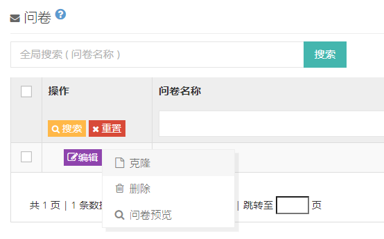

***删除***-删除此问卷。

***克隆***-复制此问卷，用于快速创建相似的新问卷。

***问卷预览***-预览此问卷的最终展示效果。

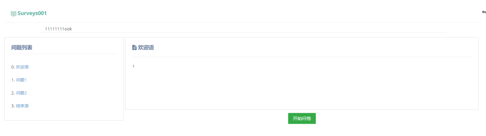

3. 添加一个新的问卷

①点击添加进入添加/编辑问卷常规页面：

- **问题名称**: 为此问卷设置一个易于识别的名称。

- **问卷类型**：选择问卷的类型

- ***文本问卷***应用于任务后，坐席可通过弹屏界面引导客户选择或填写答案。

- ***语音问卷***应用于任务后，系统将通过外呼自动以语音形式向客户播放问题。（需要配置TTS 引擎且暂时不可用）。

②点击【高级】标签页进行设置：

- **欢迎语**：问卷开始前向客户展示的问候语。

- **结束语**：问卷结束后向客户展示的感谢语。

- **备注**：显示在问卷标题下方的补充说明信息。

③点击问题进入添加/编辑问卷问题界面：

- **问题名称**：输入该问题的具体内容。

- **说明**：可添加对问题的补充说明，将显示在问题下方。

- **必填**：启用后，此问题必须回答，否则无法提交问卷。

- **使用模板**：启用后，可选择预设的选项模板来快速填充问题选项。请注意：若后续修改了选项模板，已引用的问卷问题不会自动同步，需在此页面重新保存以更新。

- **类型**：选择问题的回答形式:

    ***单选-*** 客户只能从多个选项中选择一个。

    ***多选-*** 客户可以从多个选项中选择多个。

    

    ***文本-*** 客户需自行输入文字回答。

    

-   **可输入**：启用后，客户在选择选项后还可额外输入备注文字。

提示：在此页面的问题列表下方，系统会提供所有已添加问题的序号列表，方便您在后续步骤中设置逻辑跳转。

④点击【逻辑】标签页，可根据客户对不同问题的回答，设置个性化的问卷跳转逻辑。若所有问题按顺序问答，可跳过此步骤:

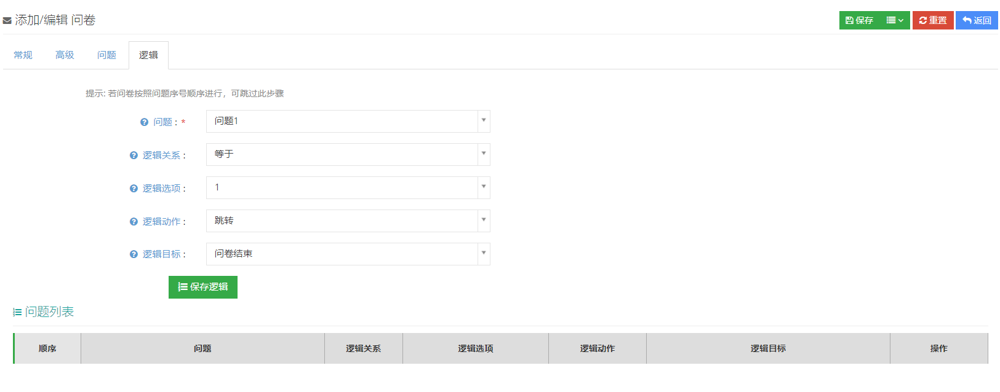

- **问题**：选择一个作为逻辑判断依据的“源问题”。

- **逻辑**：选择判断条件，包括“等于”、“只要有”、“只要没有”。

- **逻辑选项**：指定“源问题”中触发该逻辑的具体选项。

- **逻辑动作**:选择满足条件后执行的动作，如“跳转”、“隐藏问题”、“隐藏选项”。

- **逻辑目标**：选择逻辑动作执行的目标，例如跳转到哪个问题。

    注意：文本类型问题无法设置逻辑动作和目标，即使保存也不会生效;当多条逻辑规则存在冲突时，系统将优先执行最新设置的逻辑。

⑤所有配置完成后，点击【保存】即可。保存后返回问卷列表页，可通过下拉菜单中的问卷预览功能，完整查看问卷的最终形态与逻辑流程。

#### 3.8.2 问卷选项模版

1. 核心作用：问卷选项模板功能用于预设调研、评估等场景中的常用问题选项。在创建问卷时，管理员可直接调用模板，快速为问题设置标准化选项，确保调研内容统一、高效。

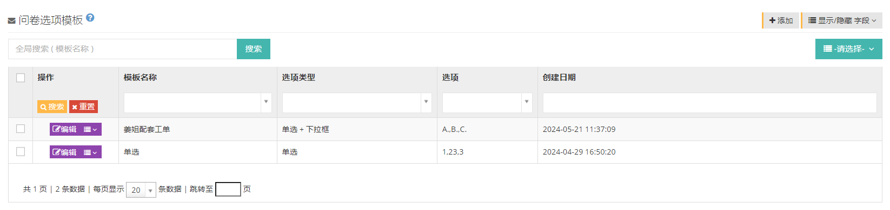

2. 关键操作

【搜索】根据模板名称进行快速查找。

【添加】创建一个新的问卷选项模板。

【显示/隐藏字段】自定义页面显示的列信息。

【请选择】批量删除选中的模板。

【编辑】修改已创建的模板内容。

【下拉菜单】删除单条问卷选项模板。

3. 添加一个新的问卷选项模版

①点击添加进入添加/编辑问卷选项模板常规界面：

- **模板名称**：为此模板设置一个易于识别和管理的名称。

- **选项类型**：选择该模板适用的题型交互形式。

    
***单选*** -只能选择一个选项。

***多选*** -可以选择多个选项。

***单选+文本框*** -每个单选选项后可附带文本输入框。

***单选+下拉框***每个单选选项后可附带下拉选择框。

- **选项**：输入该模板包含的具体选项内容。输入一个选项后按 Enter 键 可继续添加多个。

②点击【保存】即可完成创建。

#### 3.8.3 问卷答案

1. 核心功能：集中查看和分析所有客户完成的问卷调查结果。为精确筛选数据，您需要同时选择对应的问卷名称及其所关联的任务，以查看完整的调查结果明细。

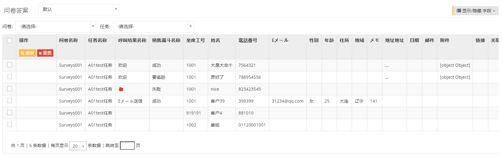

上图中的【默认】此视图将根据“客户包”维度展示问卷答案，便于您按客户归属范围进行分析。

【问卷】选择一个具体的问卷，查看该问卷下所有已收集的答案。

【任务】选择一个具体的任务，查看该任务下关联的所有问卷结果。

【显示/隐藏字段】自定义当前页面显示的列信息。

【工具】将当前筛选条件下的问卷答案导出为CSV格式文件，便于进行离线数据分析或存档。

请注意：此导出工具仅在您已选择具体【问卷】 后才会显示并可用。

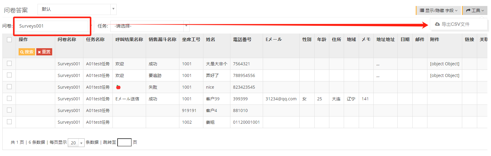

### 3.9 信息

#### 3.9.1 邮件模版

1. 核心功能：将标准化的沟通内容（如欢迎信、通知、报告）固化下来，并通过 ##变量## 实现批量个性化发送，是提升外联效率和专业度的必备工具。

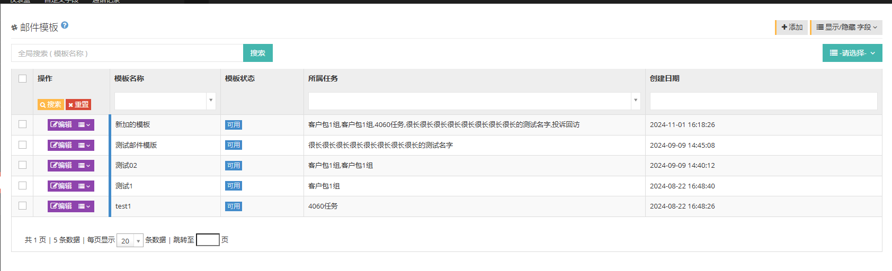

2. 关键操作

【搜索】根据邮件模板的名称进行快速查找。

【添加】创建一个新的邮件模板。

【显示/隐藏字段】自定义页面显示的列信息。

【请选择】批量删除已选中的邮件模板。

【编辑】修改已创建的邮件模板。

【下拉菜单】删除单条邮件模板。

3. 添加一个新的邮件模板

①点击【常规】标签页进行主要内容配置：

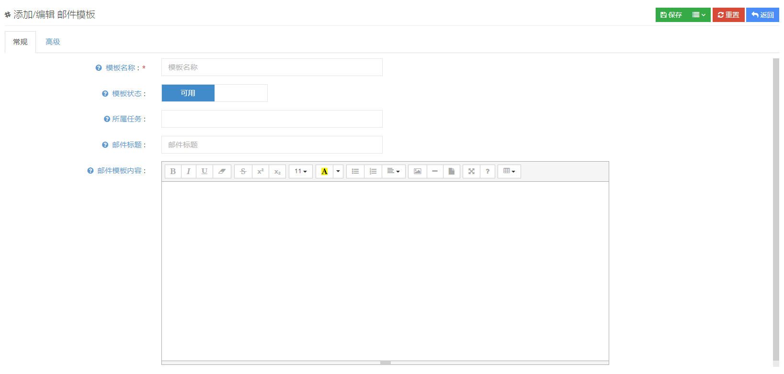

- **模板名称**：为此模板设置一个易于识别的名称（如“产品跟进欢迎信”、“售后满意度调查”）。

- **模板状态**：控制此模板是否可用。设置为 “禁用” 后，该模板将不会在发送邮件时显示。

- **所属任务**：（可选）将此模板与特定任务关联，关联后仅在该任务下可用，便于精细化管理。

- **邮件标题**：编写邮件的主题行。支持变量插入（见下方关键说明）。

- **邮件模板内容**：使用富文本编辑器编写邮件的正文。您可以设置字体、颜色、插入图片等，以设计专业的邮件样式。

> 关键功能：使用变量实现个性化

      操作方法：在邮件标题或邮件模板内容中，任何您希望根据客户数据动态填充的位置，都可以插入 ##变量名## 格式的标记。

      示例：如上图所示，在正文中写入 亲爱的##name##，您好！。当使用此模板为具体客户发送邮件时，系统会自动将 ##name## 替换为该客户数据表中“name”字段对应的实际姓名。

      变量来源：这些变量名需对应您系统中 客户数据表 的字段名称（如 ##company##、##order_id##）。

      详细应用：关于如何使用模板进行批量发送的具体操作，请参阅 【群发信息】 功能的相关文档。

②点击【高级】标签页进行补充信息配置。：

- 模板注释：可在此填写该模板的用途、使用场景等说明，便于团队内部理解。

③完成配置后，点击【保存】。新模板将立即出现在模板列表中。保存后，您随时可以返回进行【编辑】或【删除】操作。

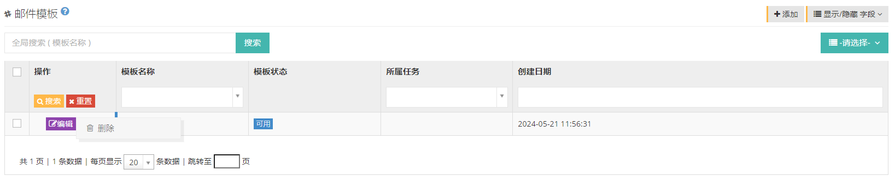

#### 3.9.2 群发信息

邮件群发功能允许您根据任务和客户筛选条件，向批量客户发送个性化的营销或通知邮件。整个过程分为四个清晰的步骤，并支持使用模板与变量实现高效个性化。：

①步骤1：在此步骤中，您需要设定本次群发的范围和类型

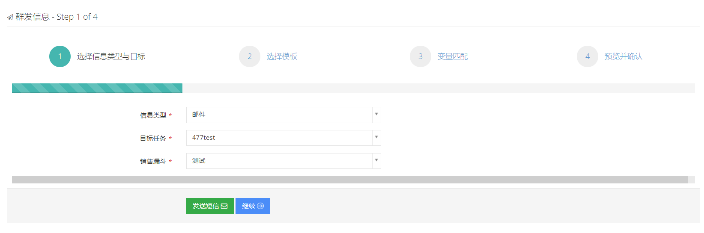

- **信息类型**：选择本次群发的媒介，请选择 “邮件”。

- **目标任务**：选择包含目标客户数据的 任务。

- **销售漏斗**：（可选）可进一步筛选，仅向该任务下处于特定“销售漏斗”阶段的客户发送。

设定完毕后，点击 【继续】 进入下一步。

②步骤2：选择邮件模板

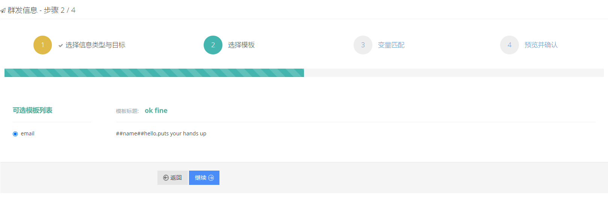

系统将根据上一步的筛选条件列出匹配的客户数量。在此页面，您可以从模板库中选择一个预设的 邮件模板，作为本次群发的基础内容。选择模板后点击 【继续】。

③步骤3：匹配变量（关键个性化步骤）

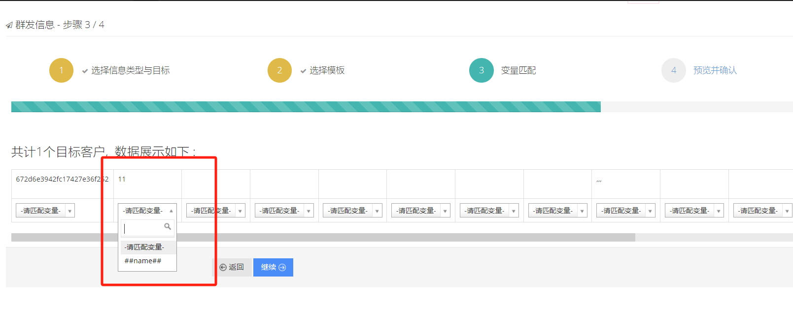

若您选择的模板中包含 ##变量## 标记，则进入此关键步骤。您需要为每个变量指定其对应的 客户数据字段。

- 操作：在变量右侧的下拉列表中，选择系统中对应的客户字段（如“客户姓名”、“公司名称”等）。

- 示例：模板中的 ##姓名## 变量，应匹配客户数据表中的“name”字段。发送时，系统会自动为每位客户填充其姓名。

确认匹配无误后，点击 【继续】。

④步骤4：预览并提交发送任务。

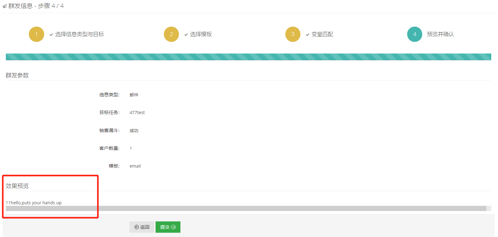

在最后一步，请仔细检查：

- 邮件的最终预览效果。

- 步骤三中设置的变量匹配关系是否正确。

确认无误后，点击 【提交】。

重要提示：

- 提交成功仅表示群发任务已进入发送队列，并非所有邮件已瞬时发出。

- 邮件将按队列顺序在后台逐一发送。具体的 发送状态（成功/失败） 需在 【邮件发送记录】 中查看。

#### 3.9.3 邮件发送记录

1. 核心功能：所有通过系统发送的邮件，其状态与详情均在此页面集中记录和追踪，便于您监控发送效果并进行后续跟进。

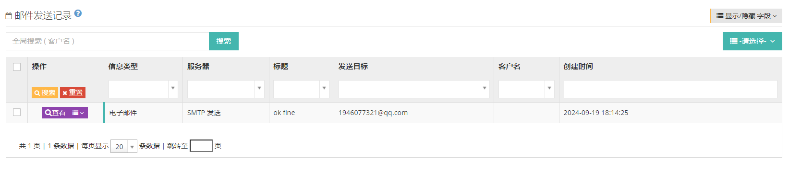

2.关键操作

【搜索】可根据发件人、收件人邮箱或邮件主题进行快速筛选。

【显示/隐藏字段】自定义页面显示的列信息（如发送时间、状态等）。

【请选择】批量删除选中的发送记录。

【下拉菜单】删除单条发送记录。

【查看】点击可查看该邮件的完整内容，包括发件人、收件人、主题、正文及发送状态详情。

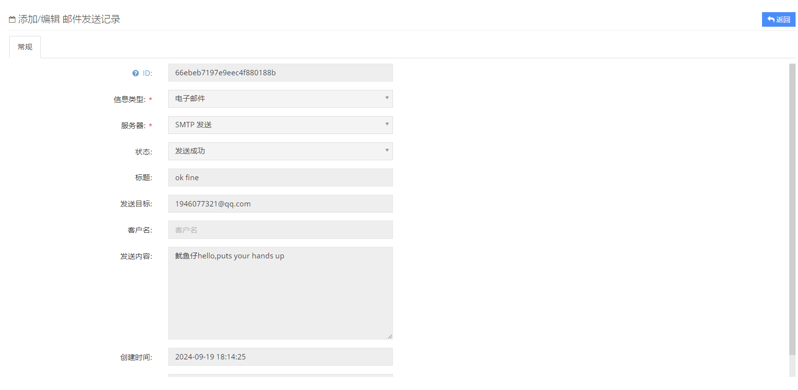

通过此记录页面，您可以：

- 核实邮件是否成功送达。

- 查找发送失败的记录并分析原因（如邮箱无效、被拒收等）。

- 对未成功发送的客户进行后续处理。

#### 3.9.4 公告管理

1. 核心功能：允许管理员（client 级别用户）向指定的坐席或账户用户发送通知、政策更新或重要提醒。发送的公告将显示在接收方的系统仪表盘中，确保信息能够及时、有效地触达。

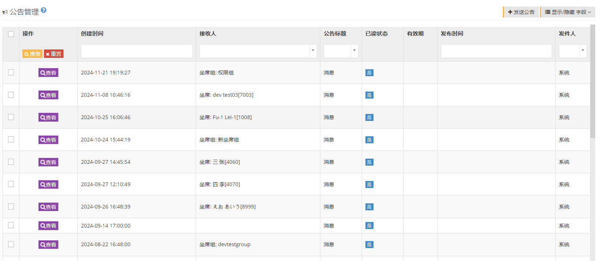

2. 关键操作

【发送公告】创建并发布一条新公告。

【显示/隐藏字段】自定义当前页面显示的列信息。

【查看】查看已发送公告的详细内容和状态。

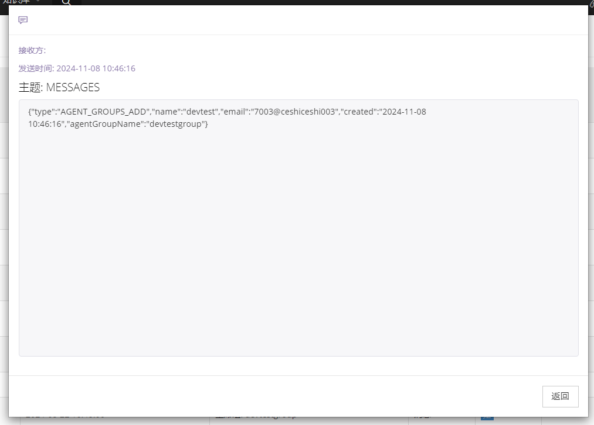

公告类型

① 用户手动发送公告

管理员可根据需要，随时创建并发送自定义公告。

② 系统自动发送的公告

当发生特定系统事件时，系统会自动生成公告。例如：

坐席组变更：当有坐席被添加至坐席组或从坐席组中移除时，系统会向相关坐席发送默认通知公告。

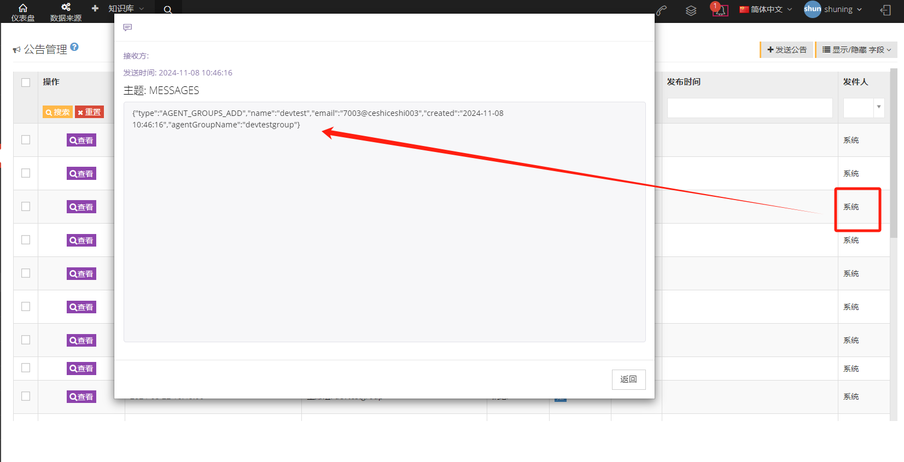

3. 发送一个新的公告

① 点击【发送公告】进入添加/编辑公告管理的常规页面：

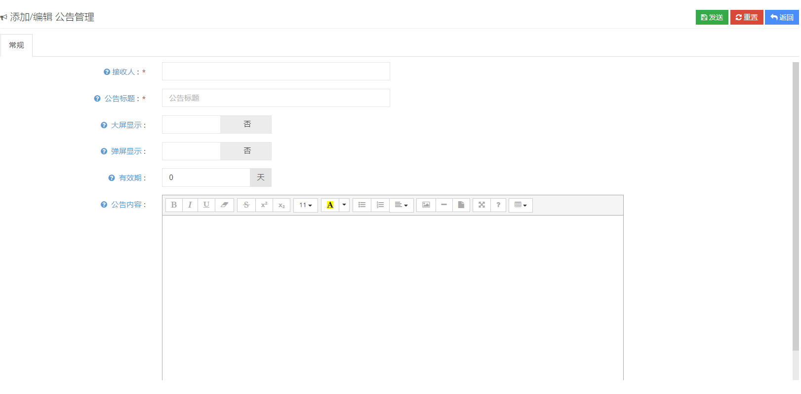

- **接收人**：选择此公告的接收对象。可以是特定的坐席、坐席组或账户用户。

- **公告标题**：输入公告的标题。此标题将显示在接收方的仪表盘公告列表中。

- **大屏显示**：若启用此选项，当接收方打开了大屏监控页面时，此公告会以醒目方式在大屏幕上滚动或显示。

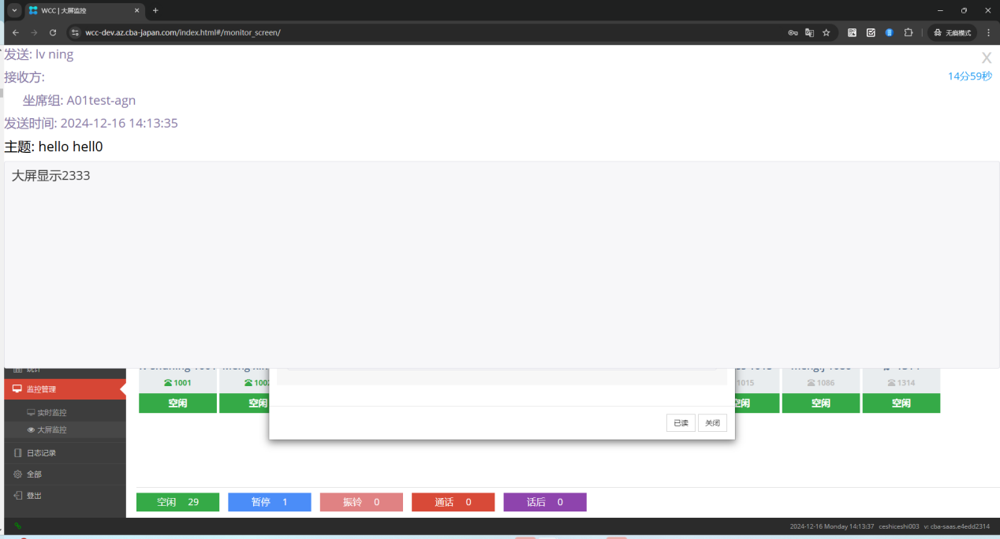

- **弹屏显示**：若启用此选项，公告将以弹窗形式在接收方下次登录系统时自动弹出，确保重要信息被即时阅读。

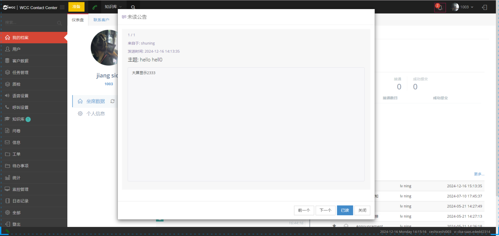

- **有效期**：设置公告的显示截止时间。超过有效期后，公告将自动从接收方的仪表盘隐藏。特殊值 0：表示公告永久有效，将一直显示。

- **公告内容**:填写公告的详细正文内容，支持富文本格式。

② 完成发送

所有配置完成后，点击发布即可。发送者（client）也可在自己的仪表盘中查看已发送的所有公告。

#### 3.9.5 通知

1. 核心功能：允许坐席组长在小组内部向所有成员发送即时信息，适用于发布临时提醒、共享动态或进行快速协调。发送的通知将以滚动走马灯的形式显示在组内坐席的工作页面，确保信息能被及时关注。

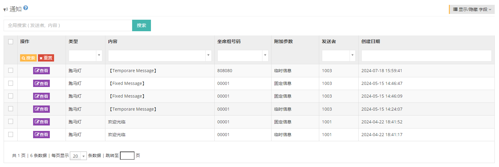

2. 关键操作

【搜索】可根据发送者姓名或通知内容关键字进行搜索。

【显示隐藏字段】自定义页面显示的列信息。

【查看】查看通知的完整内容和详情（仅支持查看，不可修改）。

3. 添加一个新的通知

由于通知功能主要由坐席组长在坐席工作页面操作，详细操作步骤将在《坐席操作手册》中说明。基本流程如下：

坐席组长登录后，在侧栏找到 “组内对话” 或 “发送通知” 入口。

选择通知类型（临时/固定），输入通知内容。

发送后，通知将立即以走马灯形式推送给组内所有在线坐席。

### 3.10 工单状态

工单系统用于记录、跟踪和处理内部工作请求或客户问题，实现任务的规范化流转与闭环管理。在使用前，需完成 工单状态、工单类别、处理结果 的基础配置。

#### 3.10.1 工单状态

1. 核心功能：工单状态用于标识工单在生命周期中所处的阶段（如“待处理”、“处理中”、“已解决”），便于团队直观掌握进度。

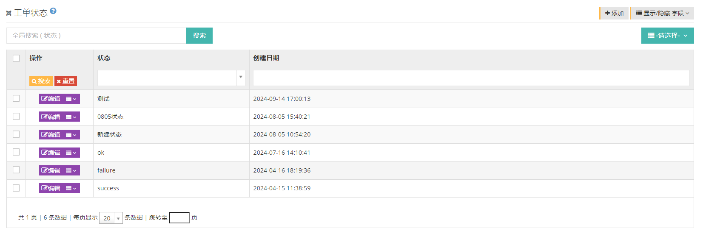

2. 关键操作

【搜索】全局搜索支持以工单状态进行搜索。

【添加】创建新状态。

【显示/隐藏字段】自定义列显示。

【请选择】按条件删除。

【编辑】修改或移除状态。

【下拉菜单】删除该工单状态.

3. 添加一个状态

① 点击【添加】进入添加/编辑工单状态的常规页面：

- **状态**:状态名称（如“处理中”）。

- **是否保留**：设置为该状态时，是否保持工单当前负责人不变。

- **坐席组**：设置为该状态时，工单将自动流转至指定坐席组。

- **是否自动分配**：流转至新坐席组后，是否自动分配给组内在线坐席。注意：若启用“保留坐席”或目标组无在线坐席，则跳过自动分配。

#### 3.10.2 工单类别

1. 核心作用：工单类别用于对工单进行业务分类（如“技术咨询”、“账单问题”），并可关联特定的处理流程与自定义信息字段。

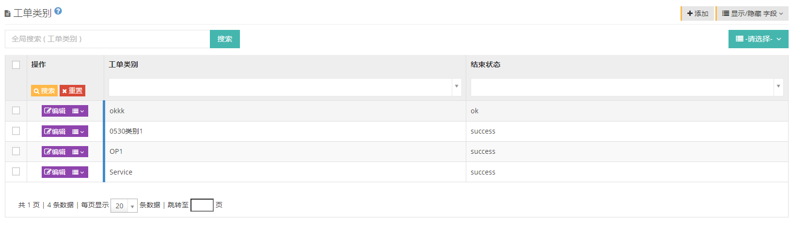

2. 关键操作

【搜索】全局搜索支持以工单类别进行搜索。

【添加】添加一个工单类别。

【显示/隐藏字段】选择该页面需要显示或是隐藏的字段。

【请选择】按条件删除。

【编辑】用户可以对已建立的工单类别进行编辑。

【下拉菜单】

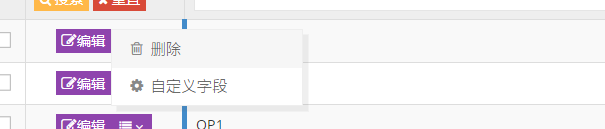

***删除***-删除该类别。

***自定义字段*** -为此类别添加工单表单的额外字段。字段类型包括文本框、日期、链接、关联字段等，坐席创建此类工单时将看到并填写这些字段。

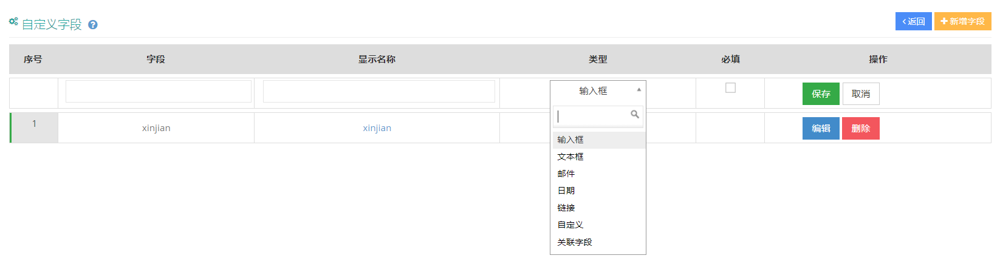

自定义字段在坐席页面显示。

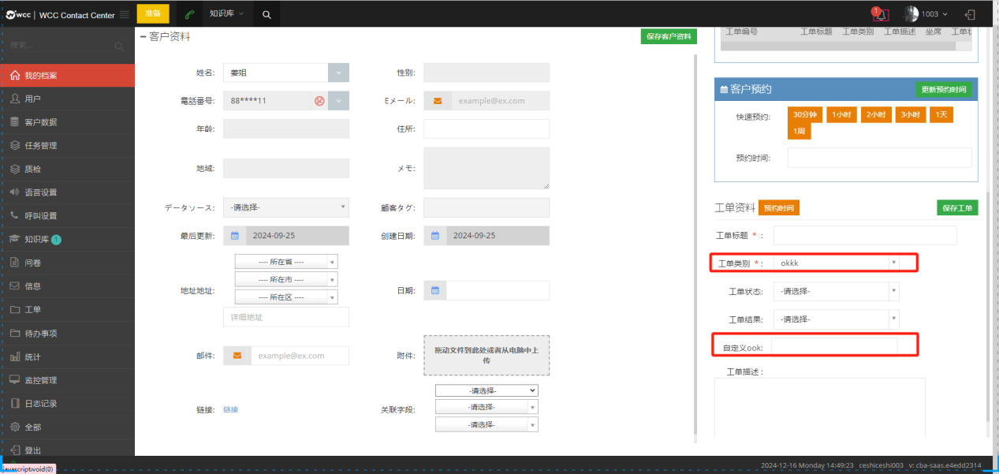

3. 添加一个工单类别

①点击【添加】进入添加/编辑工单类别的常规设置页面：

- **工单类别**：类别名称。

- **状态**：启用或禁用此类别。

- **结束状态**：选择哪些状态代表工单“已关闭”。

- **是否保留**：创建时是否将创建人设为负责人（仅当其属于指定坐席组时生效）。

- **坐席组**：指定负责处理此类工单的坐席组。

- **是否自动分配**：创建后是否自动分配给指定组内的在线坐席。

    在工单的高级设置页面用户可以对该工单添加备注，改备注是方便管理员对该工单类别作用的记录。

②点击保存即可添加成功新的工单类别。

#### 3.10.3 处理结果

1. 核心功能：处理结果用于记录工单关闭时的最终结论（如“已解决”、“用户放弃”、“转交其他部门”），便于后续分析与统计。

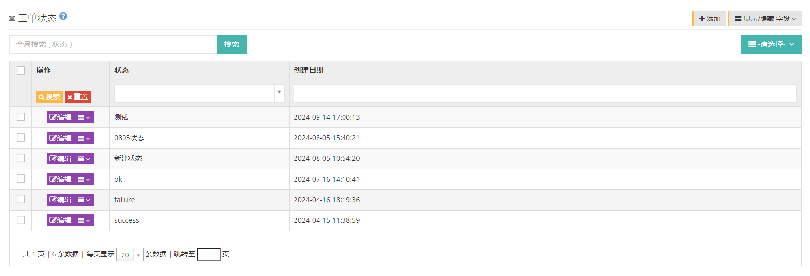

2. 关键操作

【搜索】全局搜索支持以结果命名进行搜索。

【添加】添加一个新的结果。

【显示/隐藏字段】选择这个页面需要显示或是隐藏的字段。

【请选择】按条件删除。

【编辑】对处理结果进行编辑。

【下拉菜单】删除这个处理结果.

3. 添加一个新的处理结果

①点击添加进入处理结果的添加/编辑的常规页面：

- 结果：输入结果名称（如“已修复”、“无需处理”）。

② 点击保存即可添加成功新的处理结果。

#### 3.10.4 工单

1. 核心功能：完成基础配置后，即可创建和派发工单。

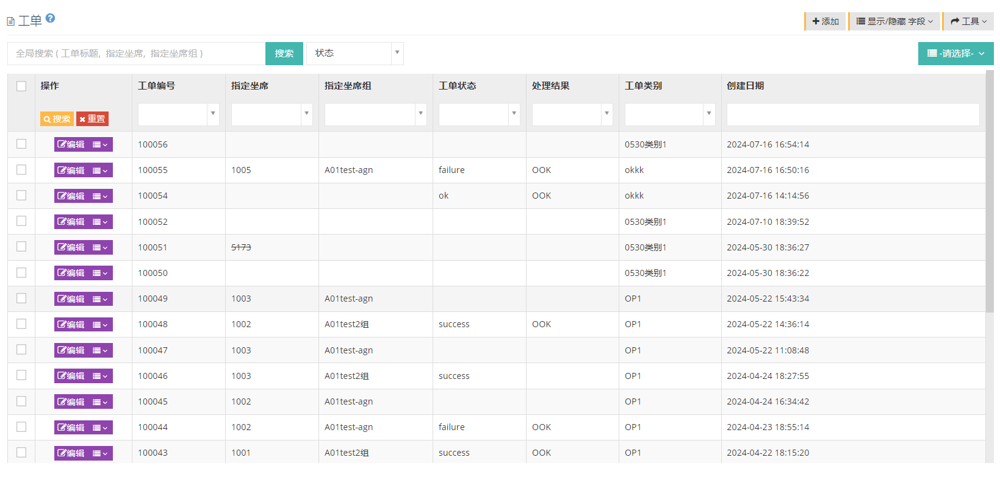

2. 关键操作

【搜索】全局搜索支持以工单标题、指定坐席、指定坐席组进行搜索。

【状态】这个工单的状态。

【添加】添加一个工单。

【显示/隐藏字段】选择这个页面需要显示或是隐藏的字段。

【工具】用户可以使用工具导出工单。

【请选择】按条件删除。

【编辑】对这个工单进行编辑。

【下拉菜单】删除这个工单.

3. 添加一个新的工单

①点击添加进入添加/编辑进入工单常规设置页面：

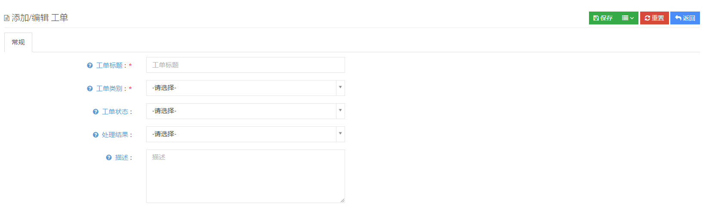

- **工单标题**：为这个工单添加一个标题（必填）。

- **工单类别**：为这个工单选择一个类别（必填）。

- **工单状态**：为这个工单选择一个处理状态，非必填，可以在工单分配至坐席后由经办坐席填写。

- **处理结果**：为这个工单选择一个处理结果，非必填，可以在工单分配至坐席后由经办坐席填写。

- **描述**:对这个工单添加一个描述。

在工单页面选择编辑进入编辑页面除在新增工单时的设置，坐席还能看到以下设置：

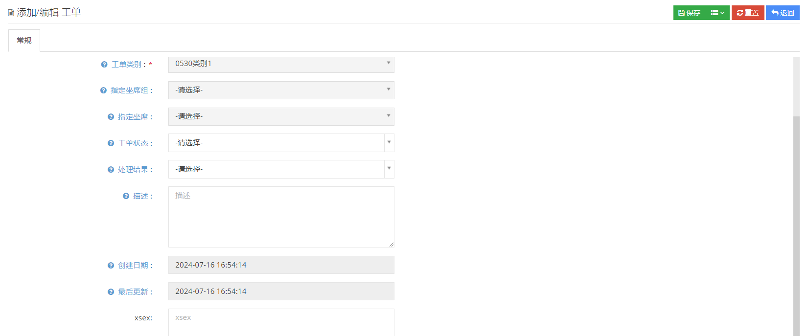

- **ID**：数据唯一ID。所有建立的数据均有一个唯一ID。

- **工单编号**：工单建立成功时会自动生成一个工单编号，该号码自动生成无法更改。

- **指定坐席组**：将该工单指定至坐席组完成，若未指定则该工单对坐席组不可见。

- **指定坐席**：该工单是否指定了坐席处理，若未指定，则该工单完成后仅有该坐席组组长的组内工单中会有显示。

- **创建日期**：该工单的创建日期。

- **最后更新日期**：最后一次对工单改动的时间。

②点击保存即可添加成功新的工单。

坐席可以在仪表板中查看未完成的工单; 在中间查看未完成的工作订单

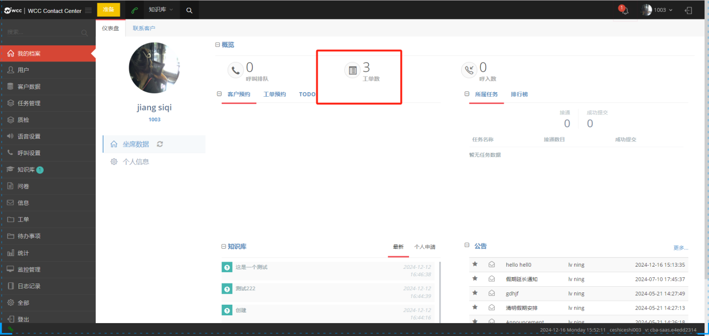

坐席可在其仪表盘的工单模块，清晰查看分配给自己的工单、按状态筛选的工单，以及（如果是组长）组内所有工单。

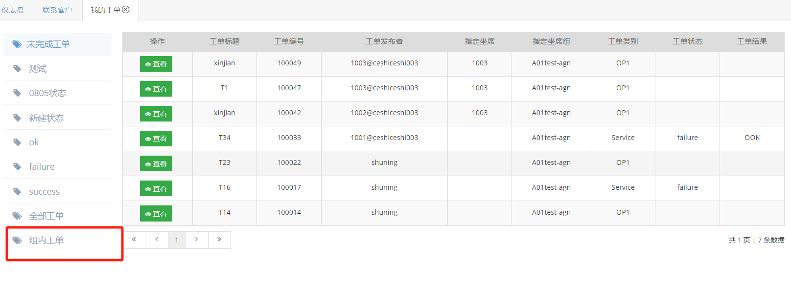

当工单创建或状态变更触发分配时，系统遵循以下优先级规则：

- 如果工单指定了状态：优先分配给 该状态绑定的坐席组 的在线坐席；若状态未绑定坐席组，则分配给 工单类别绑定的坐席组 的在线坐席。

- 如果工单未指定状态：直接分配给 工单类别绑定的坐席组 的在线坐席。

- 特殊情况：若启用了 “是否保留”（负责人不变），则跳过所有自动分配；若目标坐席组 无在线坐席，则工单停留在该组，等待手动领取或后续分配。

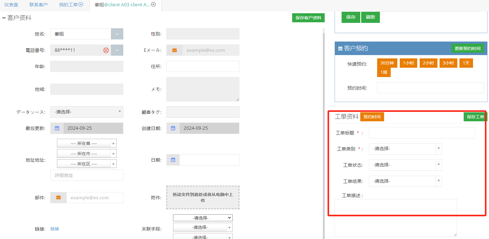

### 3.11 待办事项

#### 3.11.1 坐席待办

1. 核心功能：允许管理员（client）为指定坐席创建、分配并跟踪其需要完成的特定任务或提醒事项。坐席可在其工作页面查看和处理，任务的最终完成状态需由管理员确认，实现闭环管理。

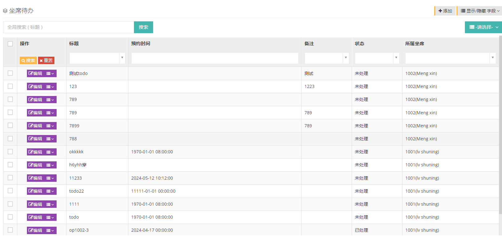

2. 关键操作

【搜索】可根据待办事项的标题进行快速查找。

【添加】创建一个新的待办事项。

【显示/隐藏字段】自定义页面显示的列信息。

【编辑】修改已创建的待办事项内容或状态。

【下拉菜单】删除单条待办事项。

3. 添加一个新的坐席待办

①点击添加进入添加/编辑坐席待办的常规页面：

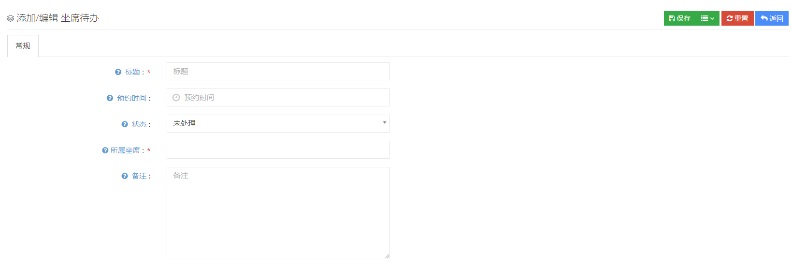

- **标题**:输入待办事项的简要描述，要求清晰明确。

- **预约时间**:设置该事项的计划执行或到期时间。此时间将在坐席仪表盘中突出显示，起到提醒作用。

- **状态**：管理员可在此设置或更新事项的状态（如“待处理”、“进行中”）。状态同步说明：当坐席在其页面将事项标记为“完成”时，此处的状态将自动同步更新，便于管理员实时追踪。

- **所属坐席**：选择负责处理此事项的特定坐席。

- **备注**:可添加详细的任务说明、要求或注意事项。

②填写完成后，点击【保存】。该事项将立即出现在指定坐席的仪表盘待办列表中。管理员可随时在本页面查看所有事项的进展，并进行最终的状态确认与归档。

### 3.12 统计

在坐席报表中用户可以查看包括坐席报表、坐席汇总、坐席组明细、坐席组汇总、部门报表在内的统计报表，用户选择坐席后可以点击搜索，搜索该坐席的报表。用户可以选择需要显示的字段，点击查看字段即可。用户也可以对坐席明细数据进行下载，点击下载即可。

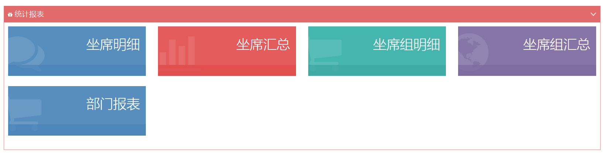

#### 3.12.1 统计报表

1. 核心功能：统计模块提供多维度的数据报表，帮助管理员全面评估坐席、坐席组及部门的绩效表现与运营效率。您可以根据筛选条件查看详细统计，并支持数据导出以便进一步分析。

2. 报表类型

- 坐席明细：单个坐席在所有或指定任务中的详细活动记录。

- 坐席汇总：坐席在所属组内的关键绩效指标（KPI）汇总。

- 坐席组明细：坐席组内各成员的详细活动记录。

- 坐席组汇总：坐席组级别的整体绩效指标汇总。

- 部门报表：基于部门维度的综合性统计数据。

##### 1坐席明细

1. 核心内容：此报表用于分析单个坐席的详细工作数据，可按任务和时间进行筛选。

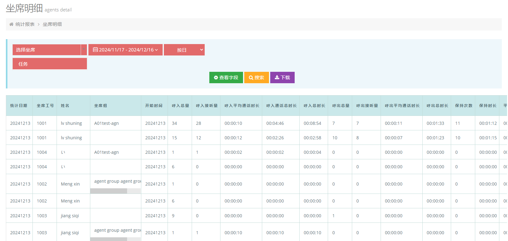

2. 主要筛选条件

【选择坐席】指定要分析的坐席。

【任务】可选定具体任务，或留空以查看该坐席在所有任务中的数据。

【日期】选择统计的时间范围。

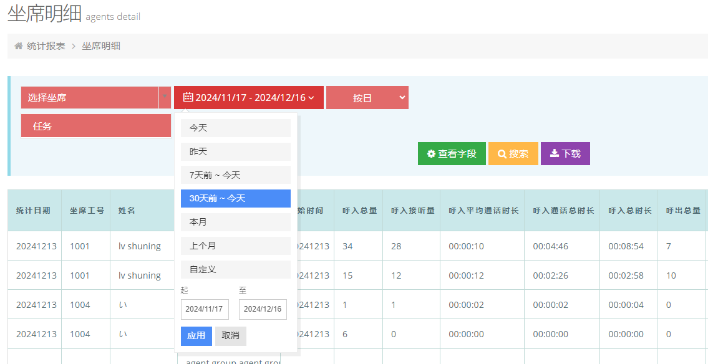

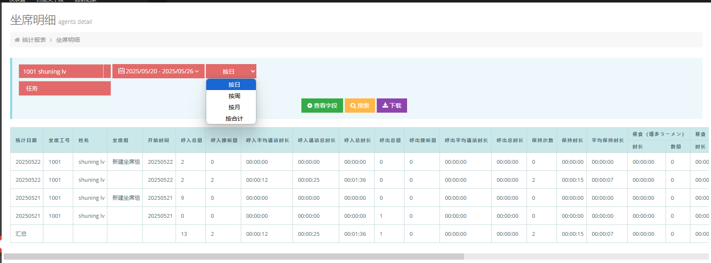

【查看字段】自定义报表中显示的指标列。

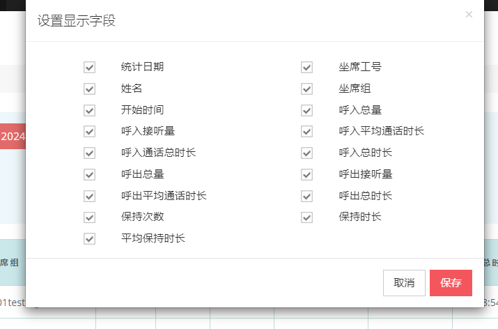

3. 核心指标说明

**呼入/呼出总量**：接听与主动拨出的电话总数（呼出不包含预拨号）。

**通话时长相关**：包括呼入/呼出平均通话时长、总通话时长、拨打总时长等。

**保持指标**：通话过程中的保持次数、总时长及平均时长。

**其他**：坐席工号、姓名、所属坐席组、统计日期等基础信息。

4. 字段解释

- 统计日期：该统计数据的所属日期。

- 坐席工号：这个坐席的工号。

- 姓名：该统计所属坐席的姓名。

- 坐席组：该坐席所属坐席组。

- 开始时间：该统计开始的日期。

- 呼入总量：该坐席接到的呼入总量。

- 呼入平均通话时长：该坐席接到呼入电话时的平均通话时长。

- 呼入通话总时长：该坐席接到呼入电话时的总通话时长。

- 呼入总时长：呼入电话的总数量。

- 呼出总量：该坐席呼出电话的总量（不包含预拨号）。

- 呼出接通量：呼出通话被接听的数量（不包含预拨号）。

- 呼出平均通话时长：该坐席呼出时通话的平均时长。

- 呼出总时长：该坐席呼出电话时的总通话时长。

- 保持次数：该坐席通话时的总保持次数。

- 保持时长：该坐席通话时的总保持状态时长，

- 平均保持时长：该坐席通话时的平均保持状态时长。（保持时间/次数，向下取值。示例：7/2=3.5，以3秒为单位）

【搜索】根据需求完成以上条件设定后搜索该坐席的统计明细。

【下载】根据需求完成以上条件设定后下载该坐席的统计明细.

##### 2 坐席汇总

1. 核心内容：此报表用于评估坐席在组内的整体绩效表现，侧重于结果性KPI。

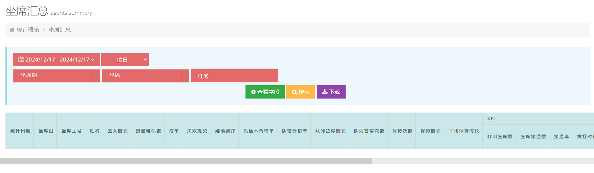

2. 筛选条件

【日期】选择统计周期。

【坐席组/坐席】可逐级筛选，查看特定组或特定坐席的数据。

【任务】可选填，以限定任务范围。

【查看字段】自定义显示的绩效指标。

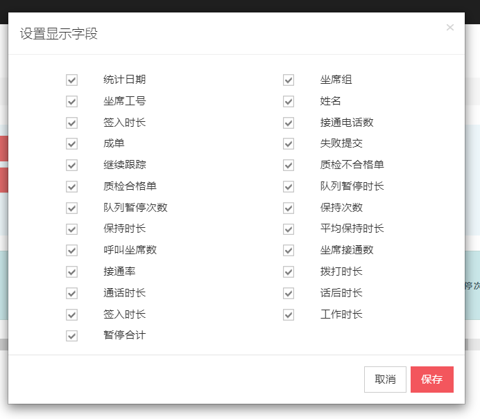

3. 核心指标说明

**签入与工作时长**：签入时长、工作时长（通话+话后处理）、暂停合计时长。

**效率与质量**：接通率、接通电话数、拨打时长、通话时长、话后时长。

**销售转化**：成单数（销售漏斗分值 > 0）、失败提交（分值 < 0）、继续跟踪（分值 = 0）。

**质检结果**：质检合格单数、质检不合格单数。

**队列状态**：队列暂停次数与总时长。

其他活动：保持次数/时长、抢接数、被呼叫数及接通数。

- 统计日期：坐席的统计日期。

- 坐席组：该坐席所属的坐席组。

- 坐席工号：统计坐席的工号。

- 姓名：该坐席的名字。

- 签入时长：该被统计坐席的签入时长。

- 接通电话数：该坐席接通电话的数量。

- 成单：该坐席保存的销售漏斗分值大于零。

- 失败提交：该坐席保存销售漏斗分值小于零。

- 继续跟踪：该坐席保存销售漏斗分值等于零。

- 质检不合格单：该坐席在任务中的质检不合格的名单。

- 质检合格单：该坐席在任务中的质检合格的名单，

- 队列暂停时长：该坐席在队列中暂停时长。

- 队列暂停次数：该坐席在队列暂停的次数。

- 保持次数：该坐席的通话保持次数。

- 保持时长：该坐席的通话保持状态的时长。

- 平均保持时长：该坐席通话保持状态的平均时长。

- 抢接数：该坐席的抢接次数。

- 呼叫坐席数：该坐席被呼叫的次数。

- 坐席接通数：该坐席被呼叫后接通的数量。

- 接通率：该坐席的接通率。

- 拨打时长：该坐席的拨打时长振铃+接通电话的时间。

- 通话时长：该坐席的所有通话时间。

- 话后时长：该坐席进入话后的时长。

- 签入时长：该坐席的签入时间。

- 工作时长：通话和话后处理时间的总和。

- 暂停合计：该坐席的合计暂停时间。

【搜索】根据需求完成以上条件设定后 **搜索** 坐席汇总。

【下载】根据需求完成以上条件设定后 **下载** 坐席汇总.

##### 3 坐席组明细

**坐席组明细** 是方便用户查看每个坐席组和该组内任务的统计数据，用户选择坐席组后可以查看该坐席组在所有任务下的统计数据，用户也可以直接选择想要查看的该坐席组和任务，查看该任务下坐席组的统计数据。（用户可以同时查看多个坐席组在多个任务下的统计数据）

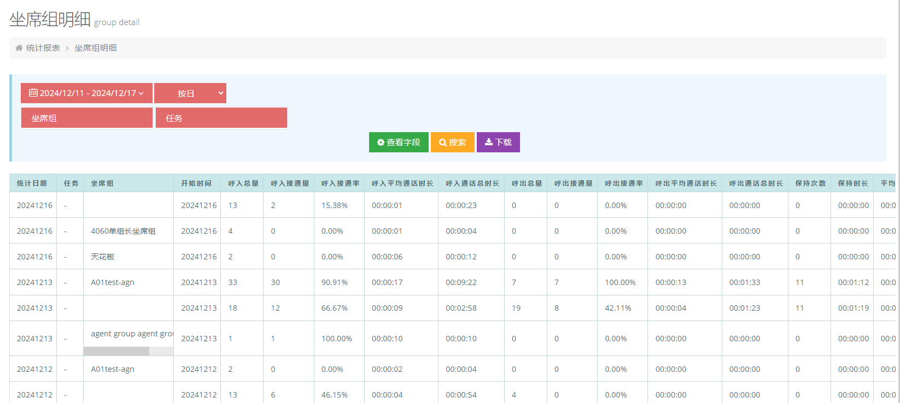

【日期】选择查看坐席组明细的日期或时间范围。

【坐席组】选择查看的坐席组，可以选择一个或多个坐席组。

【任务】选择查看该坐席组在选定的任务中明细，可以选择一个或多个任务。

【查看字段】选择查询显示的字段。

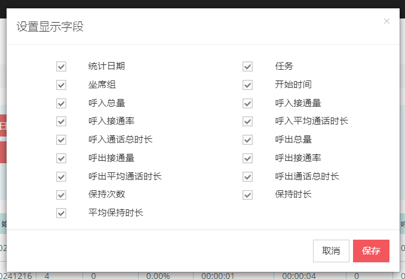

-   统计日期：用户需要查看的统计日期。

-   任务：该统计数据所在的任务名称。

-   坐席组：该统计数据所属坐席组。

-   开始时间：坐席开始统计的时间。

-   呼入总量：所统计坐席组的呼入总量。

-   呼入接通量：所统计坐席组的呼入接通总量。

-   呼入接通率：所统计坐席组的接通率。

-   呼入平均通话时长：所统计坐席组的平均通话时长。

-   呼入通话总时长：呼入该坐席组的通话的总时长。

-   呼出总量：所统计坐席组的呼出总量。

-   呼出接通量：所统计坐席组的接通量。

-   呼出接通率：所统计坐席组的接通率。

-   呼出客户平均振铃时长：呼出时客户的平均振铃时长。

-   呼出平均通话时长：所统计坐席组的呼出平均通话时长。

-   呼出通话总时长：所统计坐席组的呼出通话总时长。

-   保持次数：所统计坐席组的通话保持总次数。

-   保持时长：所统计坐席组的通话保持总时长。

-   平均保持时长：所统计坐席组的通话保持平均保持时长。

    【搜索】根据需求完成以上条件设定后 **搜索** 坐席组的统计明细。

【下载】根据需求完成以上条件设定后 **下载** 坐席组的统计明细.

##### 4 坐席组汇总

坐席组汇总主要统计坐席组的数据汇总，用户在坐席组汇总页面可以根据日期即日期范围对数据进行查看。

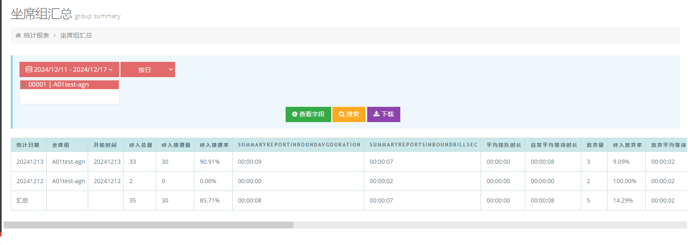

【日期】选择查看坐席组明细的日期或时间范围。

【坐席组】选择查看的坐席组，可以选择一个或多个坐席组。

【查看字段】选择查询显示的字段。

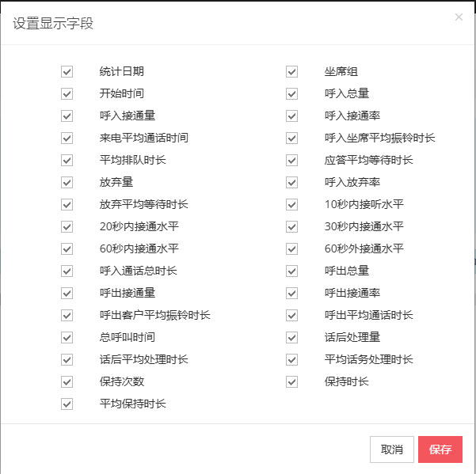

-   统计日期：该坐席组数据的统计日期。

-   坐席组：被统计的坐席组。

-   开始时间：该坐席组被统计的开始时间。

-   呼入总量：该坐席组接到呼入的总数量。

-   呼入接通量：该坐席组接通呼入的总数量。

-   呼入接通率：该坐席组的呼入接通率。

-   呼入平均通话时长：该坐席组接通呼入电话时的平均通话时长。

-   呼入坐席平均振铃时长：该坐席组的坐席接通呼入通话之前的平均振铃时长。

-   平均排队时长：客户呼入到系统中的平均排队时长。

-   应答平均等待时长：该坐席组中坐席应答通话的客户平均等待时长。

-   放弃量：该坐席组对于呼入通话未应答的个数。
  
-   呼入放弃率：该坐席组的呼入放弃率。  
  
-   放弃平均等待时长：该坐席组的未应答通话的平均等待时间。

-   10秒内接听水平：该坐席组中坐席在10秒内接听电话的个数。

-   20秒内接通水平：该坐席组中坐席在20秒内接听电话的个数.

-   30秒内接通水平：该坐席组中坐席在30秒内接听电话的个数。

-   60秒内接通水平：该坐席组中坐席在60秒内接听电话的个数。

-   60秒外接通水平：该坐席组中坐席在60秒外接听电话的个数。

-   呼入通话总时长：呼入该坐席组的通话的总时长。

-   呼出总量：该坐席组的呼出总量。

-   呼出接通量：该坐席组呼出通话的接通个数。

-   呼出接通率：该坐席组呼出通话的接通率。

-   呼出客户平均振铃时长：该坐席组呼出后客户应答的平均振铃时长。

-   呼出平均通话时长：该坐席组呼出的平均通话时长。

-   呼出通话总时长：该坐席组的通话总时长。

-   话后处理量：该坐席组在话后状态的数量。

-   话后平均处理时长：该坐席组坐席在话后状态的平均时长。

-   平均话务处理时长：该坐席组坐席的平均话务处理时长。

-   保持次数：该坐席组坐席通话保持次数。

-   保持时长：该坐席组坐席通话保持总时长。

-   平均保持时长：该坐席组坐席通话平均保持时长。

【搜索】根据需求完成以上条件设定后 **搜索** 坐席组汇总。

【下载】根据需求完成以上条件设定后 **下载** 坐席组汇总。

##### 5 部门报表

在部门报表页面，用户可以选择一个日期范围，选择想要查看的部门，点击搜索进行查看，此外，用户还可以选择该部门想要查看的坐席数据或是该部门的通话时长查看报表内容。

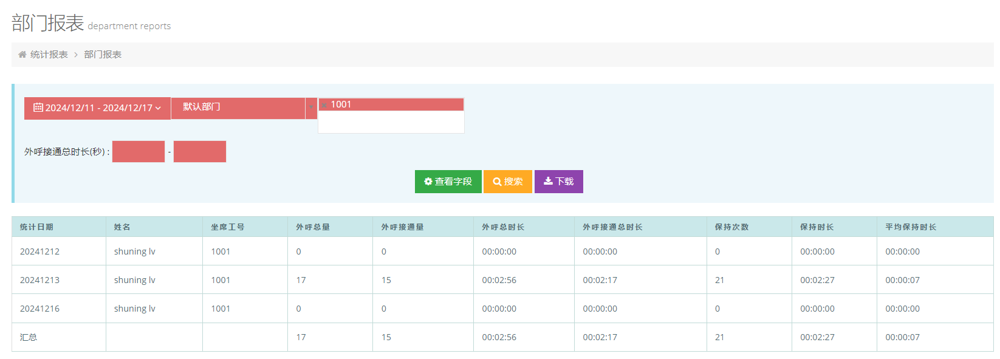

【日期】选择查看部门报表的日期或时间范围。

【部门】选择查看的部门

【坐席】选择该部门下的坐席。

【外呼接通总时长】选择查看的部门外呼接通的总时长。

【查看字段】选择查询显示的字段。

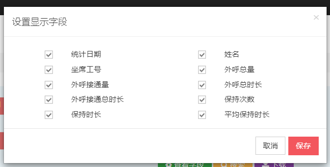

-   统计日期：该部门报表的统计日期。

-   姓名：该部门报表统计数据的坐席名。

-   坐席工号：该部门报表统计数据的坐席工号。

-   外出总量：该部门的呼出通话的总数量。

-   外呼接通量：该部门报表所统计坐席呼出通话的接通量。

-   外呼总时长：该部门报表所统计坐席呼出通话的总时长，

-   外呼总接通量：该部门报表所统计坐席呼出通话的总接通量。

-   保持次数：该部门报表所统计坐席的保持次数。

-   保持时长：该部门报表所统计坐席的保持时长。

-   平均保持时长：该部门报表所统计坐席的平均保持时长。

【搜索】根据需求完成以上条件设定后 **搜索** 部门报表。

【下载】根据需求完成以上条件设定后 **下载** 部门报表。

### 3.13 监控管理

#### 3.13.1 实时监控

在实时监控页面，用户可以看到座位组和座位、座位或座位组的实时动态，以及涉及的百分比信息。内部线路和转接呼叫也不会显示在实时监控页面上。

##### 1 坐席组坐席

用户在实时监控页面可以看到坐席组和坐席、坐席或坐席组的实时动态，以及所涉及的百分比信息。

坐席组坐席：进入该页面用户可以输入一个或多个想要监控的坐席组进行提交查看。

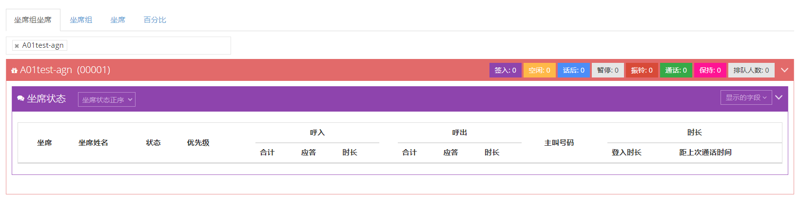

-   红框中显示这个组中所有坐席的状态情况。

**签入**：显示在这个坐席组中签入的坐席数。

**空闲**：在这个坐席组中状态为空闲的坐席。

**话后**：在这个坐席组中状态为话后的坐席。

**暂停**：坐席选择暂停或是在队列里设置了自动暂停时，坐席未应答暂停会显示暂停：未应答.

**振铃**：呼入或呼出时，通话没被接通均显示振铃。

**通话**：呼入到坐席组，预拨号呼出，联系客户页面双呼接通时，实时监控页面会显示通话。如果坐席签入这个坐席组但是不是经上述方式进入通话状态，此时，页面会显示忙碌中。

**保持**: 队列通话时保持/非队列通话的保持不会显示.

**排队人数**: 这个队列客户等待的人数。

-   **坐席排序**

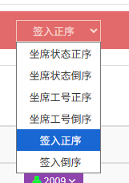

坐席状态正序：话后状态&gt;通话状态&gt;保持状态&gt;暂停&gt;空闲&gt;振铃

坐席状态倒序：振铃&gt;空闲&gt;暂停&gt;保持&gt;通话l&gt;话后状态

坐席工号正序：坐席工号由小到大排序。

坐席工号倒序：坐席工号由大到小排序。

优先级正序：坐席的优先级从小到大。

优先级倒序：坐席的优先级从大到小。

**坐席**：实时监控坐席，点击下拉菜单对坐席实现如下操作;

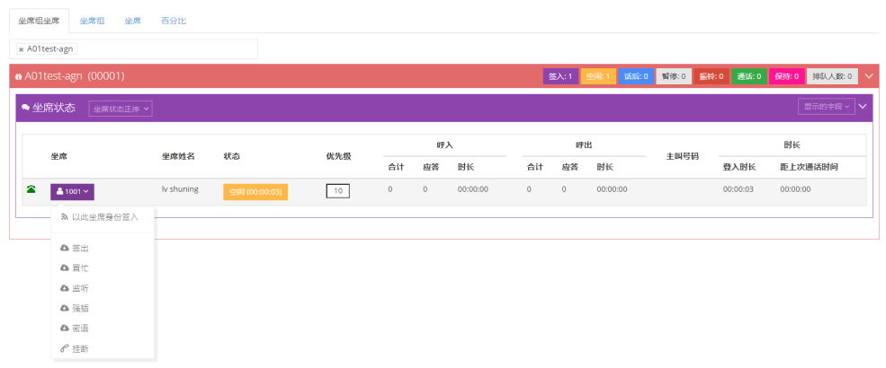

*以此坐席身份登录* -登录到此坐席。

签出 - 把这个坐席从坐席组里签出。

置忙 - 将这个坐席的状态更改为忙。

监听 - 监控指定席位与客户之间的通话。

强插 - 在座席通话过程中，强行干预通话，客户和座席都能听到您的声音，与三方通话效果相同。

密语 - 在坐席通话期间，在与坐席通信时，客户听不到拨号者的声音，只有座席能听到。

挂断 - 结束这个坐席的通话状态。

-   **状态**：这个坐席的当前状态。

-   **优先级**：这个坐席的优先级。

-   **呼入**：这个坐席在这个坐席组中被呼入的总数。

-   **呼出**：这个坐席在坐席组中呼出的总数。

-   **主叫号码**：呼入或呼出的主叫号码。

-   **时长**：

    登入时长- 最后一次签入坐席组到现在的时长。

    距上次通话时间- 距离上一次坐席签入的通话时间。

紫色框中显示的坐席状态可由用户在 显示字段按钮的下拉菜单中进行调整。

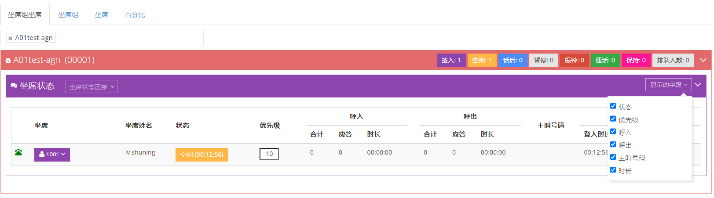

如果有来电但没有坐席应答，页面会弹出绿色的呼叫队列提示消息框.

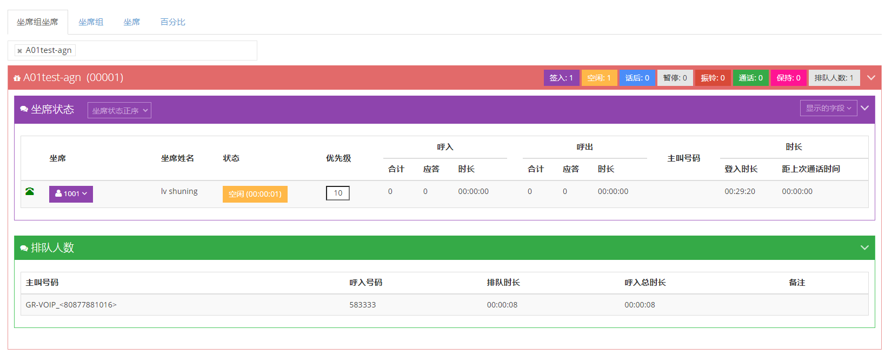

##### 2 坐席组

点击坐席组页面可以看到坐席组的实时信息

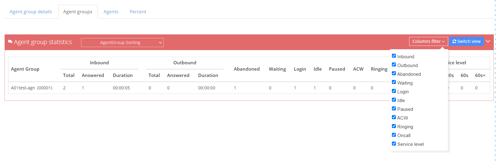

呼入

合计: 呼入到这个坐席组中，坐席振铃或接通+1。

应答:呼入到这个坐席组中，坐席应答+1。

时长:呼入到这个坐席组中，坐席应答的通话时长。

呼出

合计: 从这个坐席组中呼出，坐席振铃或接通+1。

应答: 从这个坐席组中呼出，通话被应答+1。

时长:从这个坐席组呼出，应答的通话时长。

放弃：呼入到队列的通话没有被接通的数量。

排队人数：在队列中等待的通话数量。

签入：显示在这个坐席组中签入的坐席数。

空闲：在这个坐席组中状态为空闲的坐席。

暂停：在这个坐席组中状态暂停或队列暂停的坐席。

话后：在这个坐席组中状态为话后的坐席。

振铃：呼入或呼出时，通话没被接通均显示振铃。

通话：在该坐席组中通话的坐席。

服务水平：呼入到队列的通话在多少秒内被接通，≤10S

用户也可以切换视图

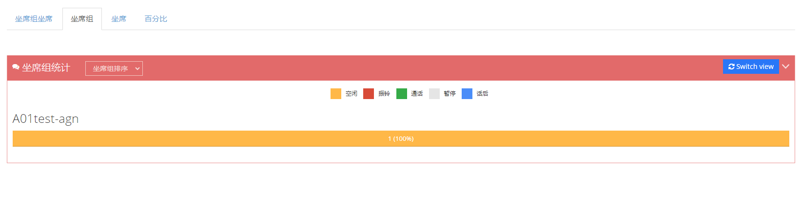

##### 3 坐席

点击坐席页面可以看到坐席的实时信息。显示的坐席范围为：全部坐席，本页面显示的坐席数量与百分比页面坐席总数、坐席状态数量保持一致，当选择 “只显示sip在线” 时，该页面只显示注册话机的坐席。

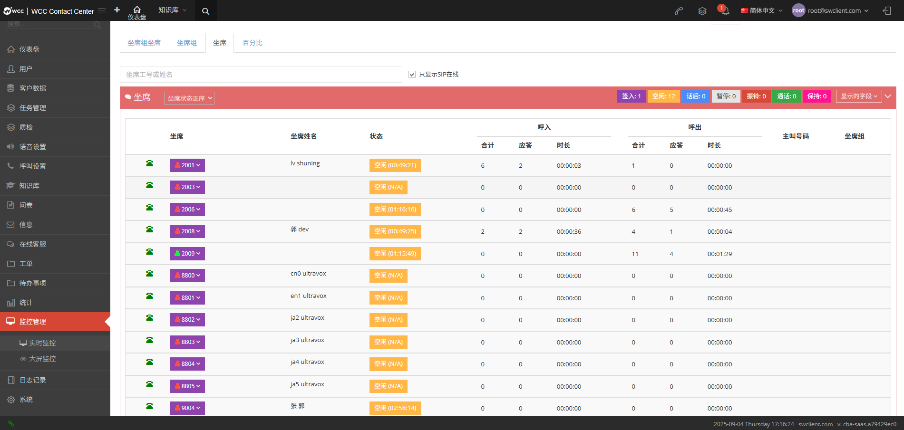  

坐席页面的排序如下  

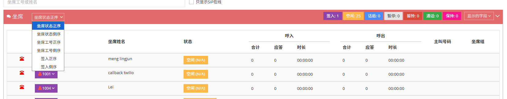

坐席状态正序：话后状态&gt;通话状态&gt;保持状态&gt;暂停&gt;空闲&gt;振铃

坐席状态倒序：振铃&gt;空闲&gt;暂停&gt;保持&gt;通话l&gt;话后状态

坐席工号正序：坐席工号由小到大排序。

坐席工号倒序：坐席工号由大到小排序。

签入正序：签入坐席组的坐席在上，按状态进行排列。

签入倒序：未签入坐席组坐席在上，按状态进行排列。

##### 4 百分比

如果坐席通话次数较多，可以直接切换到百分比模式（内部通话和转接通话不以百分比显示），在百分比页面用户也可以选择是否查看sip在线坐席。

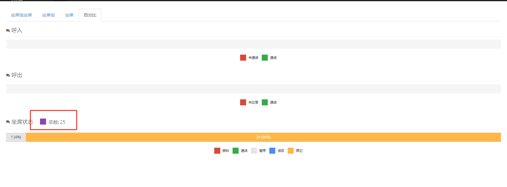  

#### 3.13.2 大屏监控

大屏监控能够实时看到所有坐席的状态闪烁，用户可以选择全屏或简洁模式观看，也可以选择是否只查看sip话机在线的坐席。用户点击坐席状态后可以以该坐席登录或是将该坐席置闲，同事也能看到该坐席的签入情况。该坐席的呼入、漏话、呼出、应答情况也可以直接查看。

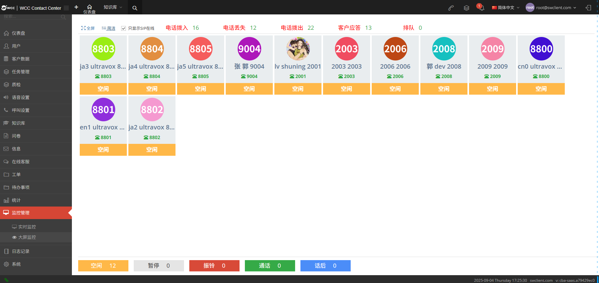

全屏:

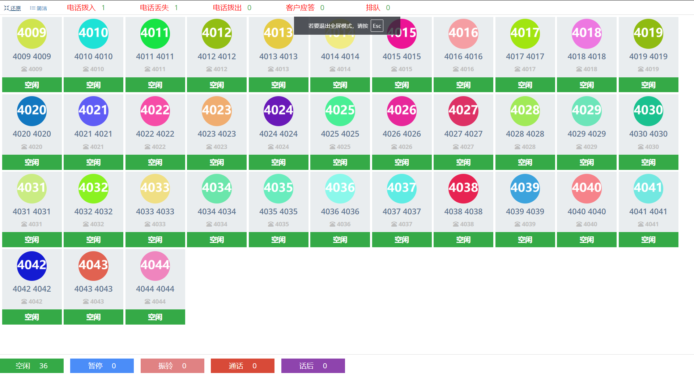

简洁:

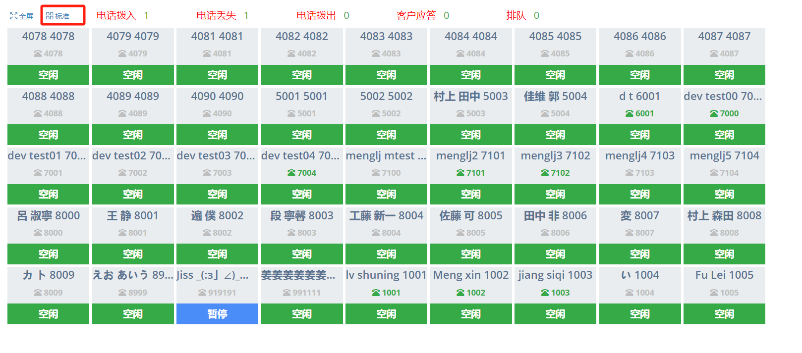

点击空闲，对坐席可以进行操作

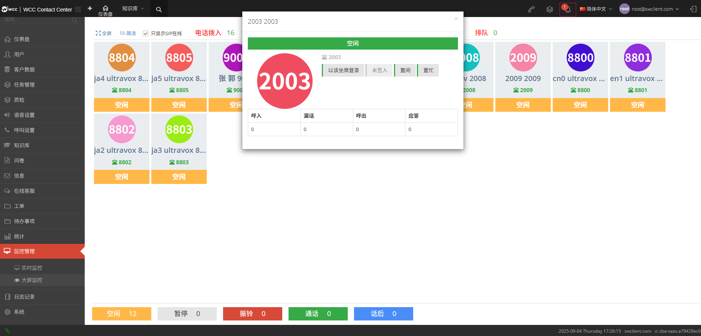

### 3.14 日志记录

#### 3.14.1 日志记录

##### 1 页面介绍

记录系统用户行为日志，系统中的默认保留期为30天。客户端及以上用户可以在此处查询和下载某个座位在特定时间和时刻的通话记录和客户数据。

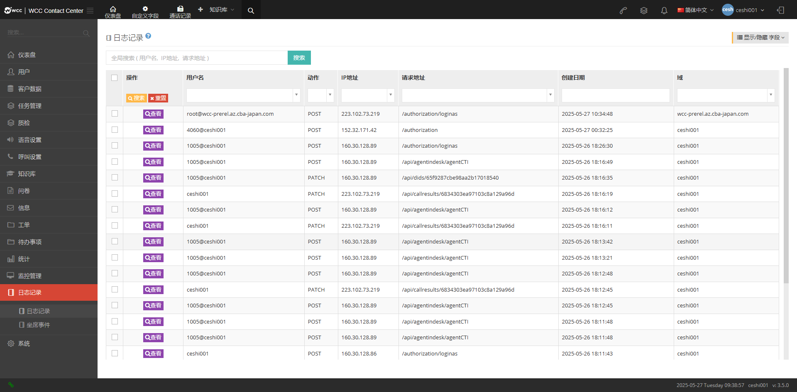

【搜索】日志记录支持以用户名、IP地址、请求地址作为搜索对象。

【显示/隐藏字段】选择这个页面需要显示或是隐藏的字段。

【查看】产看该日记的详情
 
#####  显示/隐藏字段

-   用户名：当前操作用户名称。

-   动作：当前用户的操作类型。

-   IP地址：当前用户所在的IP地址。

-   请求地址：当前用户的请求地址。

-   请求参数：当前用户操作的请求参数。

-   令牌：

-   创建日期：该日志的创建日期.

#### 3.14.2 坐席事件

##### 1 页面介绍

用于查询坐席事件日志。

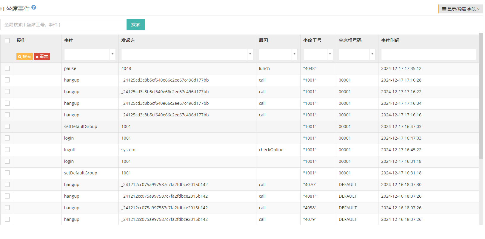

【搜索】支持以坐席工号、事件为搜索对象。

【显示/隐藏字段】选择这个页面需要显示或是隐藏的字段。

##### 2 显示/隐藏字段

-   事件：坐席发生的事件。

-   发起方：事件的发起方。

-   原因：事件的原因，如拨号,显示call。

-   坐席工号：发生该事件的坐席工号。

-   坐席组号码：发生该事件所属的坐席组号码。

-   事件时间：该事件发生的时间.

### 3.15 系统

#### 3.15.1 系统偏好

##### 1 常规

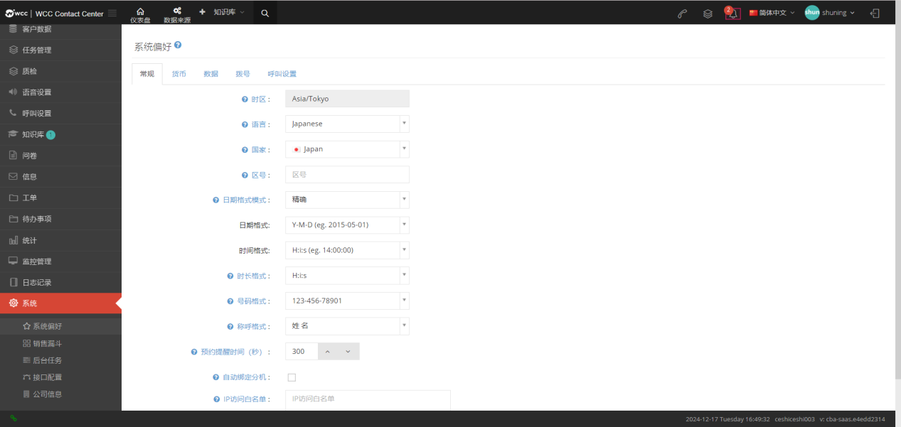

-   **时区**:该系统的时区。

-   **语言**:该语言指的是话机播放的语言，目前支持中文、日语、英文。

-   **国家**:该系统使用国家。

-   **区号**:该系统的区号。

-   **日期格式模式**：精确-可以设置日期的格式以及时间的格式。友好-系统直接默认的格式。

-   **时长格式**：可以选择时分秒也可以选择以秒计算时长。

-   **号码格式**：选择一个号码的格式。

-   **称呼格式**：选择习惯的称呼格式。

-   **预约提醒时间**：坐席预约、工单预约的提前通知的时间范围。

-   **自动绑定分机**：自动为坐席分配sip。

> 勾选 \[自动绑定分机\] 后，选择 \[默认话机部署模板\]

-   **IP访问白名单**：填写IP绑定白名单，只有白名单的用户才有权限访问。

##### 2 货币

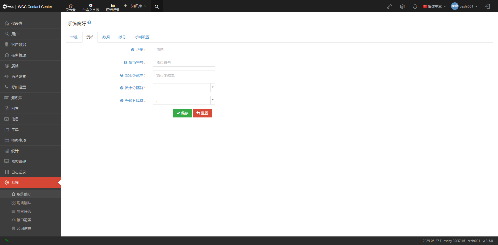

-   **货币**：使货币种类。

-   **货币符号**：货币的符号。

-   **货币小数点**：货币的小数点。

-   **数字分隔符**：数字分隔符。

-   **千位分隔符**：千位分隔符

##### 3 数据

-   **默认客户包:**系统默认呼入呼出时，使用的客户包。当前使用的具体客户包别设定不可见后，默认客户包将自动恢复为默认。

-   **导出文件编码**：设置导出文件的编码。

-   **导出单文件最大行数**：导出文件的最大行数.

##### 4 拨号

-   **拨打外线超时（秒）**：外呼振铃的超时时长。

-   **拨打分机超时（秒）**：拨打分机时振铃的超时时长。

-   **盲转振铃超时时长（秒）**：未咨询其他坐席直接将通话转给该坐席的最大超时时长。

-   **盲转未接通回呼**：盲转给其他坐席未接通后又回呼到盲转前坐席。

-   **盲转回呼主叫名称前缀**：设置盲转回呼的主叫名称前缀。

-   **默认等待音乐**：默认使用接通前的等待音乐。

-   **默认外呼档案**：
    当坐席没有指定外呼档案时，呼叫时将使用默认外呼档案，如果没有设定外呼档案，将会使用系统默认的外呼档案。.

##### 5呼叫设置

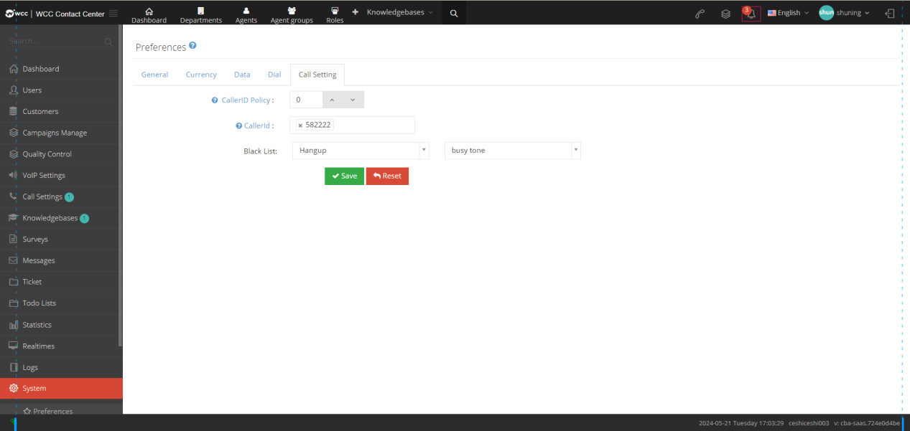

-   **外显号码轮询**：外显号码轮询功能可以帮助你自动更换外显号码，例如1表示每一天更换一个号码，0表示每次通话都会使用一个新的号码，此功能适用于外呼接口，坐席外呼或者外呼任务。

-   **外显号码**：选择显示的主叫号码。

-   **黑名单**：选择黑名单呼叫的转向.

#### 3.15.2 销售漏斗

##### 1 页面介绍

用于记录坐席记录的客户通话状态。如果销售漏斗大于0，则会在提交成功的位置进行记录。

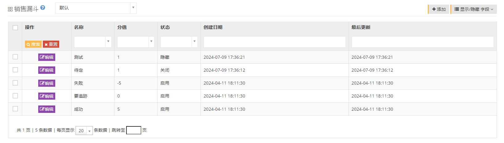

上图【默认】是可选择的客户包。

【新增】新增一个销售漏斗。

【显示/隐藏字段】选择这个页面需要显示或是隐藏的字段。

【编辑】编辑已建立好的销售漏斗.

##### 2 显示/隐藏字段

-   名称：销售漏斗的名称。

-   分值：设定的这个销售漏斗的分值。

-   创建日期：该销售漏斗的创建时间。

-   最后更新：该销售漏斗的最后更新时间.

##### 3 添加销售漏斗

①点击【添加】按钮，进入销售漏斗添加/编辑常规界面：

-   **名称**：为这个销售漏斗命名。

-   **分值**：设置这个销售漏斗的分值，分值可体现坐席的工作情况。

-   **状态**：销售漏斗的状态。

    ***启用***-正常显示

    ***隐藏***-坐席不可见

    ***关闭***-系统不可见

<!-- -->

-   **客户包**：选择该销售漏斗生效的客户包

#### 3.15.3 后台任务

##### 1 页面介绍

后台任务是允许在系统的程序任务，通常是属于耗时的任务，比如导入或是导出数据。页面默认显示的事正在进行中的任务，需要查看或搜索过往和现在全部的后台任务需要点击全部任务。

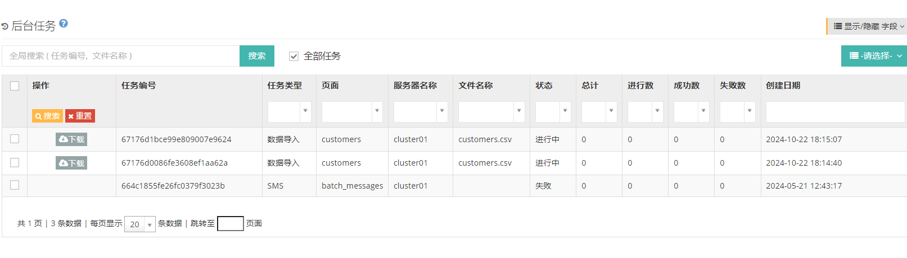

【搜索】在全局搜索中支持以任务编号、文件名称为关键词搜索。

【显示/隐藏字段】选择这个页面需要显示或是隐藏的字段。

【全部任务】正在进行以及过往的后台任务。

【请选择】按选择条件删除。

【删除】删除这个任务。

【下载】下载这个任务。（仅导入的用户可以下载该文件，其他用户则不能下载）

【下拉菜单】删除这条后台任务。

##### 2 显示/隐藏字段

-   任务编号：该任务的编号。

-   任务类型：该任务的呼叫类型。

-   页面：生成该任务的页面。

-   服务器名称：生成该任务的服务器。

-   文件名称：该后台任务的文件名称。

-   状态：该后台任务的状态。

-   任务选项：系统的程序任务类型。

-   总计：该后台任务发生的总数量。

-   进行数：该后台任务正在进行的数量。

-   成功数：该任务的成功数量。

-   失败数：该任务的失败数量。

-   创建人：该后台任务的发起人。

-   创建日期：该后台任务的创建日期。

-   结束日期：该后台任务的结束日期。

-   导出失败原因：比如导出数据会显示导出失败的原因

#### 3.15.4 接口配置

##### 1 api验证串

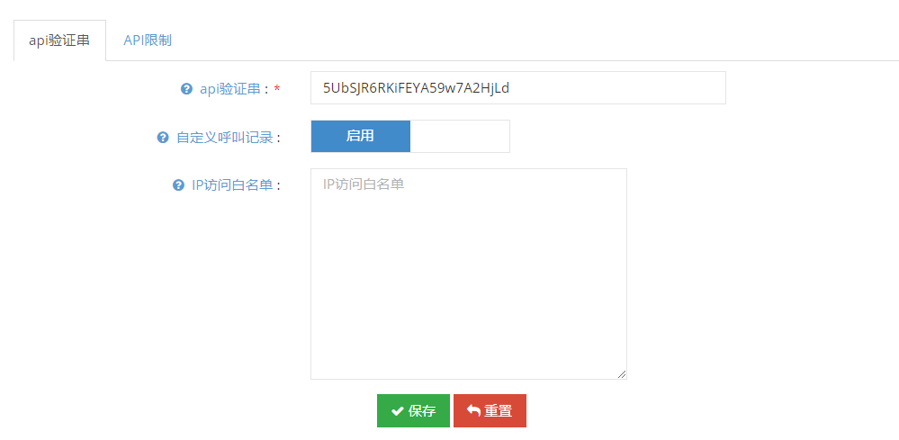

-   **api验证串**：填写api验证串。

-   **自定义呼叫记录**: 是否允许自定义呼叫记录。

-   **IP访问白名单**：可访问的白名单IP地址。填写白名单地址后，只有白名单上的IP地址才能通过账号密码登录此客户端。

##### 2 API 限制

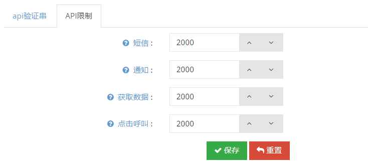

-   **短信**：设置短信的限制数量。

-   **通知**：设置通知的限制数量。

-   **获取数据**：设置获取数据的限制数量。

-   **点击呼叫**：设置点击呼叫的限制数量。

#### 3.15.5 公司信息

用户可以填写自己的公司信息和财务信息。

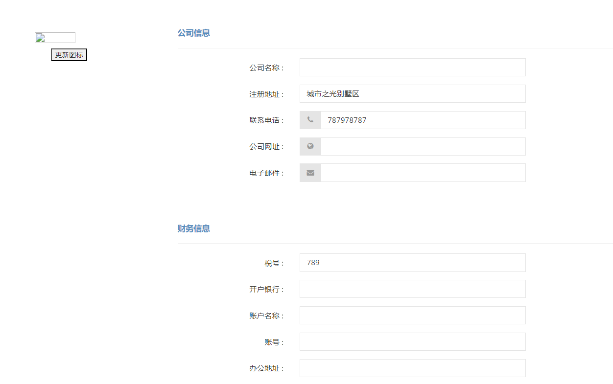
