## 3 菜单功能

### 3.1用户

#### 3.1.1账户

##### 1.账户页面介绍

**账户**是用于管理系统的用户,例如添加坐席,查询报表,更新配置等。通过为账户配置不同的权限角色,可以实现不同的账户拥有不同的功能权限

【搜索】支持用户名、名、姓进行账户的全局搜索。

【添加】添加一个新的账户。

【显示/隐藏字段】显示或隐藏该页面的字段。

【请选择】按条件删除。

【编辑】编辑该账户的信息。

【下拉菜单】以该账户登录或删除该账户。

##### 2.显示/隐藏字段

-   用户名：该账户用户名。

-   姓：该账户的姓。

-   名：该账户的名。

-   所属角色：该账户的所属角色。

-   创建日期：该账户的创建日期。

-   最后更新：该账户的最后更新日期。

-   最后登录日期：该账户的最后登录日期。

##### 3.添加一个账户

①点击【添加】进入添加账户常规设置页面：

-   **用户名**：用户将用此用户名进行系统登录。

<!-- -->

-   **状态**：您可以选择此帐户为禁用，禁用后，您无法使用该帐户的名称和密码登录，页面提示“该帐户不存在或密码不正确”。

-   **姓**：请输入用户姓氏。

-   **名**：请输入用户名字。

-   **密码**:输入一个密码或是，自动生成一个密码。

    

-   **确认密码**:请再次输入密码，确保两次密码相同。

-   **角色**:角色是用于设置这个账户可以访问的页面以及这个账户在这个页面上所拥有的权限。

②点击【高级】设置此账户的备注：

③保存后，账户创建成功。

④创建成功后账户页面显示创建成功的系统账户，点击编辑可对其账户信息进行重新编辑修改。

⑤点击下拉菜单，即可以该用户登录或删除该用户

#### 3.1.2坐席

##### 1.坐席页面介绍

**坐席**是系统中的基本工作单位,创建坐席时系统会自动创建一个SIP账号,你可以注册SIP设备或者将电话号码绑定到该坐席,然后坐席就可以通过系统发起和接收呼叫了。

坐席可以签入到不同的坐席组进行不同的工作,系统能够提供多种报表来表现坐席的工作内容。坐席页面列表中是client用户已添加的坐席，在此页面，client用户可以添加/批量添加/查看/编辑/批量编辑/删除，也能以创建的坐席身份登录。

【搜索】全局搜索仅支持坐席工号搜索。

【添加】添加一个新的坐席。

【显示/隐藏字段】选择在坐席页面需要显示或是需要隐藏的字段。

【批量操作】对坐席进行-批量添加-批量编辑。

【请选择】按条件删除。

##### 2.隐藏/显示字段

-   坐席工号：坐席工号。

-   名：坐席名。

-   姓：坐席姓。

-   角色：坐席角色。

-   外显号码：该坐席设置的外显号码。

-   创建日期：该坐席的创建日期。

-   最后更新：该坐席最后设置更新的日期。

-   最后登录日期：直接从网页登录该坐席的日期。注：以该坐席身份登录不计算在内。

-   话机部署模板：话机部署模板的名称。

-   话机MAC地址：话机的MAC地址。

##### 3.添加新的坐席

添加坐席有两种方式：逐个添加或批量添加。

①点击添加进入添加/编辑坐席的常规页面：

-   **坐席工号**:坐席工号应该是唯一的，它是注册sip电话机时的用户名。用途包括-通过浏览器登录系统，通过电话签入坐席组，内部拨号使用等。坐席工号是长度为2-6的数字组成，且首位非零，如01001不可设置，坐席工号设定后不可更改。

-   **角色**:为这个坐席分配权限角色。

-   **名**：为这个坐席填写名字。

-   **姓**：填写坐席姓氏。

-   **部门**:设置这个坐席所在的部门。

-   **sip分机注册密码**:当坐席需要注册sip设备时，需要使用这个密码。

-   **web登录密码**:浏览器的登录密码。

-   **电话签入密码**:当坐席需要通过电话签入系统时，需要使用此密码。

-   **只允许点击呼叫**:当该功能启动时，坐席不能用通话话机直接按键拨号至客户，只允许坐席在浏览器上对客户点击呼叫。

-   **状态**:当坐席被禁用时，坐席无法进行拨号操作，例如接打电话，登录系统。
登录系统时会被提示，账号已被禁用，无法登录，请联系管理员。

    ②点击【高级】进入添加/编辑坐席的高级页面：

    

<!-- -->

-   **外显号码**: 定义坐席外呼时显示的主叫号码。设置外显号码的地方有三处，分别是系统偏好，外呼任务，坐席，如果三处均设置不一样的外显号码，他们的显示关系为坐席>任务>系统偏好，坐席设置的外显号码最优先显示。如果该坐席设置了多个外显号码，显示规则受系统-外显号码轮询控制。

-   **使用浏览器工作**:  选择坐席是否使用浏览器工作，如果选择使用浏览器工作，在坐席不登录浏览器时，这个坐席将无法使用话机签入坐席组。如果不选择，坐席在不登录浏览器的情况下，可以使用话机签入坐席组。

-   **默认外呼档案**:你可以为此坐席组设置一个默认外呼档案，签入此坐席的坐席都会根据此外呼规则通话。可以设置外呼档案的地方有：坐席、部门、任务、系统，当坐席两端呼时，使用外呼档案的有优先级是：任务&gt;坐席&gt;部门&gt;系统

-   **话机部署模版**:请选择您需要的模版名称。

-   **话机MAC地址**:请填写你的话机响应的MAC地址。

##### 4.批量建立新坐席

①单击“批量操作”-“批量添加”，进入“批量添加”页面：

-   **起始坐席工号**：添加坐席的首个开头工号。

-   **批量数值**：批量添加的坐席个数。

-   **sip分机注册密码**：当坐席需要注册sip设备时，需要使用这个密码。

-   **web登录密码**：浏览器的登录密码。

-   **电话签入密码**：当坐席需要通过电话签入系统时，需要使用此密码。

-   **部门**：请设置这些坐席所在的部门。

-   **只允许点击呼叫**：当该功能启动时，坐席不能用通话话机直接按键拨号至客户，只允许坐席在系统中对客户点击呼叫。

    <u>注意：如果从起始号码开始到批量数值结束的坐席号码中存在重复的坐席号码，坐席建立时会自动跳过这些已经存在的坐席，右上角会有系统提示。</u>

②点击【预览并配置】出现批量导入表单，可以进行细致的设置：

③对已经建立好的坐席，用户也可以选择需要的坐席，点击工具中的【批量编辑】，对坐席进行批量的快速编辑:

#### 3.1.3坐席组

##### 1.坐席组页面介绍

**坐席组** 用于管理坐席，坐席组包含静态坐席、动态坐席和坐席组长。坐席组是坐席能分配到任务的基本单位，坐席通过签入/签出坐席组来工作，对任务进行处理。系统中，坐席组是重要的存在，报表中有专门针对坐席组的统计，实时监控中也会对坐席组进行监控，呼入呼出方式中有专门针对坐席组的呼叫方式。只有针对坐席组的呼叫才会产生话后状态，例如转向到坐席组或是预拨号拨号。没有任何组别的呼叫，我们统称为默认组。

【搜索】全局搜索仅支持坐席组名称搜索。

【添加】添加一个新的坐席组。

【显示/隐藏字段】选择在坐席组页面需要显示或是需要隐藏的字段。

【请选择】按条件删除。

【编辑】编辑该坐席组。

【下拉菜单】删除该坐席组。

##### 2.显示/隐藏字段

-   坐席组名称：坐席组的名称。

-   坐席组号码：坐席组的号码。

-   组内坐席：该坐席组内的所有坐席。

-   队列：坐席组高级设置中sip自动应答中是否选择了队列，如果选择了队列，当有通话呼入到队列坐席振铃，使用话机注册的坐席会自动应答这个通话。

-   预拨号：坐席组高级设置中sip自动应答中是否选择了预拨号，如果选择了预拨号，有通话通过预拨号外呼坐席振铃，使用话机注册的坐席会自动应答这个通话。

-   点击拨号：坐席组高级设置中sip自动应答中是否选择了点击拨号，如果选择了点击拨号，当坐席双呼时，使用话机注册的坐席会自动应答这个通话。

-   呼入队列：是否启动呼入队列。

-   主叫名称前缀：通过该队列呼入或是呼出的通话，可以添加一个可以区分的主叫名称。

-   主叫号码前缀：通过该队列呼入或是呼出的通话，可以添加一个可以区分的主叫号码前缀。  
  
-   队列设置为0且无可用坐席时的转发地：当呼叫限制设置为开启时，指定无应答用户组内的呼叫转发地址。

-   溢出转向：队列无空位时的转向。

-   技能别名：咨询服务中坐席对外提供的名称。

#####  添加一个新的坐席组

①点击【添加】，进入添加 坐席组的通用页面：   
  
 

-   **坐席组名称**：坐席组名称用于在系统中识别该坐席组，你可以在任何时候修改该名称。

-   **坐席组号码**：坐席组号码只能使用数字，不同的坐席组必须使用不同的号码，一旦设定好便不能修改。

-   **组内坐席**：添加坐席到此坐席组，添加的坐席默认是动态坐席，你可以添加多个坐席到该坐席组。

-   **坐席组长**：坐席组可以设定多个坐席组长。坐席组长除了普通坐席功能外，还有监控、监听、密语、强插等功能。

②点击【高级】进入添加坐席组高级设置页面：

-   **自动退出话后**：设置坐席进入话后状态，多少秒之后自动结束话后。（当设置选择零时，即为不退出话后状态）

-   **话后处理**：表示当通话结束后，系统将暂停坐席以便他能够完成剩余的工作而不是被新的通话打断。此处三个选项，①禁用：关闭话后处理功能；②应答话后：将坐席设置为话后处理模式；③振铃话后：坐席电话振铃后，通话结束后坐席设置为话后处理模式。

-   **SIP自动应答**：大部分的IP话机支持一个特殊的SIP头消息，当呼叫请求中包含此消息时，话机会自动应答，例如点击拨号和预拨号。

<!-- -->

-   **队列**：呼入到队列的时候，sip注册的坐席，签入队列并空闲，呼到坐席自动会被接通。

-   **预拨号**：在预拨号呼出时，坐席签入队列并空闲，外线接通电话后，呼到坐席时话机会被自动接通。

-   **点击拨号**：坐席可以在【我的客户】中的电话符号拨出电话进行双呼，双呼时不需要坐席先接通话机再进行外呼，而是可以直接自动接通再外呼。

③点击【队列】进入添加坐席组的队列设置页面:

-   **呼入队列**：如果你想使用该坐席组处理呼入通话或者预拨号，你需要开启并配置队列功能。

-   **振铃策略**：

    

    *<u>最久未呼叫</u>*-组内当日最长时间未振铃的坐席会被优先呼叫，如果有相同时间未振铃的坐席，呼叫将以坐席组页面中组内坐席的顺序，依次呼叫。

    <u>*最少通话*-</u>组内当日接通电话最少的坐席会被优先呼叫，如果坐席接通电话数量相同，呼叫将以坐席组页面中组内坐席的顺序，依次呼叫。

    *<u>顺序</u>*-每一次呼叫都会以坐席组页面中组内坐席的顺序，依次呼叫。

    <u>*记忆轮询*-</u>第一次呼叫会以坐席组页面中组内坐席的顺序，依次呼叫，下一次呼叫从上一次接通电话的坐席的下一顺位坐席开始呼叫，以此类推。每保存一次振铃策略为记忆轮询，呼叫都会以坐席组页面中组内坐席的顺序依次呼叫。

    *<u>随机</u>*-随机选取坐席呼叫，无固定顺序。

    *<u>全部振铃</u>*-签入坐席组中的全部坐席一起振铃，全部振铃坐席没有限制，建议三十坐席内。

-   **动态坐席**：动态坐席表示这些坐席可以自由的从该坐席组签入签出。

-   **静态坐席**：静态坐席将一直签入在此坐席组中，静态坐席不允许在坐席页面被删除。

-   **保持音乐**：选择一段音乐，以便在队列呼叫处于保持状态时播放，如果未选择，则默认播放系统保持音乐。

-   **启用工号语音**：若此队列需要播报工号，你可以通过设定工号通告来实现，系统默认提供了“工号前语音”和“工号后语音。如果选择【是】，则会出现工号前语音和工号后语音。

-   **工号前语音**：在选择启用工号语音后，可以选择一个语音文件，该文件在播报工号前播放。

-   **工号后语音**：在选择启用工号语音后，可以选择一个语音文件，该文件在播报工号后播放。

-   **启用等待音乐**：客户在队列中等待时，是否播放等待音乐。若选择【是】，则会出现等待音乐选项。

-   **等待音乐**：如果选择了启用保持音，请选择一个等待音乐，以便坐席呼入时播放音乐。

-   **坐席超时时长**：坐席最多几秒不接电话的时长就是超时时长，到达该时间后队列将呼叫下一个优先级的坐席。

-   **最大等待时长**：允许客户在队列中等待的最长时间，0表示无限制。

-   **重试时间**：在重新拨打下一个可用坐席前的等待时间。

-   **增加主叫号码前缀**：队列将在助教号码前增加前缀，用于帮助坐席识别呼叫的来源。  

-   **队列最大排队数**：队列中的排队人数到达此限制后，则不允许新的客户进入队列。

-   **允许进入空队列**：是否允许客户进入一个没有任何坐席签入的队列。当选择是时，即该队列中没有任何坐席，客户仍然可以在队列中等待，否则当此项设定为否时，队列中没有任何坐席签入时，主叫方将进入失败转向。

-   **自动退出空队列**：当队列中有客户排队，此时最后一个坐席签出，剩下的客户是否会被移出队列。

-   **自动暂停**：启用自动暂停后，如果呼叫当前座席组中的座席，未应答或挂断，则该座席将被自动暂停。

-   **启用队列通告**：队列通告是刚一进入队列要播放给客户的语音。如果系统启用队列通告，客户将在队列中首先听到通告语音。若选择【是】，则会出现队列通告。

    **队列通告**：队列通告是刚一进入队列要播放给客户的语音。如果系统启用队列通告，客户将在队列中首先听到通告语音。

-   **启用坐席通告**：坐席在接听队列来电时,与主叫通话前播放语音通告。若选择【是】，则会出现坐席通告语音。

    **坐席通告语音**：坐席通告语音是通话被分配到坐席要播放的语音。如果系统启用坐席通告，客户将在与坐席通话前先听到通告语音。

-   **周期性公告**：系统是否允许你向队列中排队的客户周期性播放信息。若选择【是】，则会出现播放周期和周期语言。

    **播放周期**：选择周期性播放后会出现播放周期，可以设置公告循环时间，即多少秒循环一次该公告。

-   **周期语音**：选择周期性公告后会出现周期语音，周期语音是指可以选择循环公告的语音。

-   **坐席位置通告**：是否启用座席所在位置的通告语音。若选择【是】，则会出现通告周期。

    **通告周期**：系统是否允许你向队列中排队的客户周期性播放信

-   **溢出转向**：当呼叫列队无空位时，有其他例如IVR语音菜单、振铃组、条件、语音播报、坐席组、坐席、外显号码等可供转向选择选择.

④单击【IM 队列】可进入添加坐席组的 IM队列设置页面：

-   **技能别名**：坐席组能够被分配到在线咨询服务中。技能别名是这个坐席组能够对外提供的服务名称，用于展示给客户。

-   **分配方式**：当在线咨询服务产生请求时，坐席能够通过哪种方式获得这个请求。

-   **同时接待数量**：坐席组能够同时处理的请求数量最大值。

#### 3.1.4角色和权限

##### 1.页面介绍 

**角色** 用于控制用户的权限。例如设置一个账户拥有查看任务权限，首先添加一个查看任务权限的角色，然后分配此权限权限角色到某一账户，此账户即可拥有查看任务功能，可以查看任务。同理也可以根据需要，为坐席设置权限。角色和权限页面的列表显示的是当前用户和账户新建的权限角色。

【搜索】仅支持以角色名称进行全域搜索。

【添加】添加一个新的角色。

【显示/隐藏字段】显示或隐藏该页面的字段。

【请选择】按条件删除。

【编辑】编辑该角色。

【下拉菜单】克隆或删除该角色。

##### 2.显示/隐藏字段

-   名称：角色名称。

-   创建日期：角色的创建日期。

-   最后更新：角色的最后更新日期。

##### 3.添加新角色

①点击添加进入添加/编辑角色权限【常规】界面：

-   名称：请为这个权限的角色命名。

②点击高级进入添加/编辑角色和权限的高级页面：

在高级页面，用户可以为角色设置查看表格中字段的高级页面显示或隐藏，用户禁用角色查看坐席组的高级页面权限，那么拥有这个角色的坐席或账户就不能查看编辑坐席组的高级页面。

用户也可以为角色设置查看管理范围，用户设置通话记录仅自己，意思是仅查看自己的通话记录（如果选择全部就是可查看所有坐席的通话记录，选择坐席组则可以查看所在坐席组内所有成员的通话记录），设置保存后拥有这个角色的坐席或账户就只能查看自己的通话记录，其他坐席的通话记录不可查看。

③点击权限设置进入添加/编辑角色和权限的权限设置页面：

在权限设置页面上，用户可以为角色设置系统功能使用权限，系统默认将列表中不可单击的字段（如统计页面等）赋予坐席或帐户，以说明权限设置对代理或帐户的影响，用户禁用角色添加代理的权限，则具有该角色的代理或帐户没有添加代理的权限。

④完成以上步骤后点击保存即可保存该角色权限。

#### 3.1.5部门

##### 1.部门页面功能简介

标记坐席所在的部门可以让管理员更清楚地管理坐席。在呼叫流程中有一个抢答流程，系统规定只有来自同一部门的坐席才能抢接电话。没有分配部门的坐席默认为默认部门，不显示在部门页面。

【搜索】全局搜索仅支持部门名称搜索。

【隐藏（显示）结构】选择是否显示部门结构。

【添加】添加一个新的部门

【显示/隐藏字段】选择在部门页面需要显示或是需要隐藏的字段。

【请选择】用户可以按条件进行删除操作。

##### 2.显示/隐藏字段

-   部门名称：该部门名称。

-   部门坐席：该部门的所属坐席。

-   上级部门：该部门的上级部门。

##### 3.添加一个新的部门

①点击添加进入添加/编辑部门的常规页面：

-   **部门名称**：请填写这个部门名称。

-   **坐席**：当前Client用户已创建的坐席，添加在该部门的坐席成员，可以选择多个坐席到此部门，但一个坐席只能在一个部门中。

-   **外呼档案**：任务的外呼档案，设置后此任务外呼或预拨号时都会根据此外呼规则通话。（此处在呼叫设置中有详细讲解）

-   **上级部门**：请选择上级部门。

-   **管理员**：请填写管理人员。

②点击保存即可保存该部门。

### 3.2客户数据

#### 3.2.1自定义字段

##### 1.页面介绍

在 **自定义字段页面** 可以新增/编辑/删除客户资料字段，也可以对自定义字段进行拖拽字段列重新排列顺序，新增的自定义字段默认是非必填字段且管理员接坐席可以编辑或查看字段，如果需要修改可以继续继续设置字段的显示。

上图中的【默认】是客户包的选择，【默认】为默认客户包，也可选择具体客户包进行自定义字段的添加编辑或搜索，如果这个client没有被开启客户包的功能，不会出现客户包相关显示。

【搜索】全局搜索只能搜索键名，即自定义数据库里自定义字段名。

【添加】添加一条自定义字段。

【请选择】按条件删除。

【编辑】或【下拉菜单】可以对新建成功的自定义字段编辑或删除。

【工具】可以进行字段修复、字段权限设置和字段显示顺序。

***字段修复***-在自定义字段不显示或显示不完全有错误时可以进行字段修复。

-   **指定修复键**:客户数据页面缺失自定义字段的功能，缺失附件上传功能，包括客户弹屏界面，附件上传流程异常。

-   **自动修复**:在可能存在自定义字段错误，但无法确定具体字段时，直接点击自动修复即为将全部字段进行修复。

-   **指定修复**：在存在自定义字段错误，确定具体字段时，点击指定修复将具体字段进行修复。

***字段权限设置***- 用户可以根据角色对字段进行查看和编辑的权限。不选择任何角色时，查看和编辑功能不可更改；角色字段只能更改是否可以编辑的权限，不能更改是否查看的权限。
    

***字段显示顺序***- 用户可以在字段顺序设置中拖动字段，更该字段的排列顺序，姓名字段默认在第一位不可更改。字段可按标签A和标签B两个标签区分显示，标签B区背景颜色为高亮。在字段操作中，可以对字段是否必填，自定义字段是否在客户资料弹屏的自定义通话记录中进行编辑，字段和字段中填写内容的宽度可根据需要进行设置。

如果标签设置为 B，坐席登录后，客户数据弹出屏幕将在显示为高亮。

##### 2.显示/隐藏字段

-   字段名：数据库里的字段名。

-   字段显示名：该字段在客户数据中显示的名字。

-   字段类型：该字段的输入类型。

-   默认地址：字段类型中选择地址后填写的默认地址。

-   关联选项：字段类型中选择关联时填写的默认选项。

-   链接地址：字段类型中选择链接时填写的链接地址。

-   链接的唯一性：字段类型中选择链接时可以更改，选择其他字段时默认填写。

-   打开模式：字段类型中选择链接时，链接的打开模式。

-   选项：字段类型为自定义时，自定义的选项。

-   默认选项：字段类型为自定义时的默认选项。

-   可输入：字段类型为自定义时是否可输入。

-   支持多选：字段类型为自定义时是否支持多选。

-   成功必填字段：成功提交时该字段是否为必填字段。

-   全局搜索：允许该字段全局搜索。

-   必填：该字段是否为必填。

-   唯一索引：该字段是否有唯一性。

-   创建日期：该字段的创建日期。

-   最后更新：该字段的最新更新日期。

##### 3.添加自定义字段

①点击添加进入添加/编辑自定义字段常规页面：

-   **所属客户包**:设置的字段所在的客户包，仅在该客户包下的客户能够查看这个自定义字段。

-   **字段名**:在数据库中自定义字段的定义名称。

-   **字段名显示**:定义展示到页面上的自定义字段的显示名称。

-   **字段类型**:定义自定义字段的类型，包括：

> ***输入框***-用户可以输入数据但无法换行；  
>  
> ***电话号码***-填写一个电话号码；
>
> ***文本框***-用户可以输入数据也可以换行；
>
> ***邮件***-填写一个邮件地址；
>
> ***日期***-选择一个日期进行填写；
>
> ***链接***-添加一个链接用户可以对链接的打开方式等进行设置；
>
> ***附件***-选择一个附件进行上传；  
>  
> ***地址***-选择一个默认地址；
>
> ***自定义***-自定义多选单选或可输入类型；
>
> ***关联字段***-自定义关联的字段选项，例如地区，填写省份会出现该省份的城市等。
>
> ***数值***-自定义只填数字的字段。

-   **全局搜索**：当前字段是否参与到全局搜索，会加快这个自定义字段的搜索速度。

-   **成功必填字段**：当提交成功状态联络记录（销售漏斗的值大于0）时，当前字段是否必填  
  
-   **必填**：是否为必填字段。

-   **唯一索引**：是否是唯一性（什么是唯一性？表里数据的当前字段没有重复值）。

②点击保存即可保存新的自定义字段。

#### 3.2.2客户包

##### 1.页面介绍

用户在代理商级别设置client时，如果用户为该client勾选了多 **客户包** 功能，则在该client用户下，可以同时拥有多个客户包组合，每个客户包并不会互相干预，坐席可以同时对不同客户包中的客户进行处理。

【全局搜索】该页面支持使用客户包的显示名称进行搜索。

【添加】添加一个新的客户包。

【显示隐藏字段】选择该页面需要显示或是隐藏的字段。

【编辑】用户可以对已经添加好的客户包进行编辑。

##### 2.显示/隐藏字段

-   显示名称：该客户包的名称。

-   状态：该客户包是可见状态还是隐藏状态。

-   唯一标识：该客户报的唯一标识。

-   唯一键值：该客户包的不可重复的加速搜索字段，对常用字段来说设置比较方便查找。

-   索引字段：该客户包的加速搜索字段，设置以后方便查找.

##### 3.新建一个客户包

①点击添加进入添加/编辑客户包的常规页面：

-   **显示名称**：该客户包所显示的客户包名称。

-   **唯一标识**：为该客户包设置一个唯一标识，仅支持填写数字和字母。

-   **状态:**当客户包关闭时，可以选择自定义字段/客户/CDR/联系日志/活动/调查答案/QC/销售漏斗页面，以关闭客户包以供查看。特别是当客户包关闭时，与客户包关联的任务会自动更改为隐藏状态，当重新打开包时，隐藏的Campaign 不会自动启用，需要用户手动设置。

-   **全局唯一**：选中代表客户包下的客户号码全局唯一，即使用一个客户的多个同一号码字段，也会提示重复。

-   **唯一键值**：用户可以设置唯一索引字段，索引字段可添加多个，添加成唯一唯一索引字段后，在该客户包下该索引字段下不可以重复。

-   **索引字段**：用户可以将使用频率较高的字段设置为索引，能够优化用户对其查询的速度（指在数据库中查询）。

②点击保存即可保存新的客户包。

#### 3.3.3客户数据

##### 1.页面介绍

**客户数据** 页面显示的是坐席拨打的客户数据，通过客户包/项目/任务/销售漏斗/呼叫结果/客户标签等方式进行筛选，可以查看到相应的客户数据。在客户数据页面用户可以添加客户的数据字段，通过选择任务，在任务下进行新增或者批量导入客户数据。用户也可以对客户数据进行编辑/删除/批量导出。

**以下的默认、全局搜索、销售漏斗、所属任务、呼叫结果、客户标签都为搜索条件。**

【默认】客户包选择，默认状态就是默认客户包即全部客户数据，也可以选择具体客户包，关于客户包的创建及编辑会在客户包中详细说明。

【搜索】全局搜索范围包括姓名、电话号码、电子邮件、城区、区域、备注。

【搜索】后面的【请选择】为销售漏斗，显示该客户包下的所有销售漏斗，根据坐席提交的销售漏斗，用户可以搜索销售漏斗里的客户数据。.

【所属任务】】用户可以根据所属任务搜索客户数据，分配了任务的客户数据可以被分配到指定坐席。

【呼叫结果】根据坐席提交的呼叫结果，用户可以搜索呼叫结果中的客户数据。

【客户标签】根据用户设置的客户标签搜索客户数据。

【客户分配】对客户数据进行分配。根据以上的搜索条件对客户数据进行分配。销售漏斗中选择成功的客户数据，对该搜索条件下的客户进行重新分配到客户表或任务等地方

客户数据可以从以下三种形式进行分配:

1.  释放客户到-客户表：被分配到坐席或是任务中的客户，被释放到客户公海中，成为没有归属的客户。

2.  分配到任务-选择一个任务：选择客户数据，分配到一个任务中，坐席可以在客户池中对客户数据进行抓取，完成任务。如果，客户数据已属于一个坐席，同时这个坐席属于客户数据即将要分配的任务，那么这个客户数据在重新分配后，依旧属于这个坐席。
例如：客户数据A属于任务1且被分配给了坐席a，坐席a属于任务1，也属于任务2，如果将客户数据A分配给任务2，则在查看客户数据归属时，客户数据A属于坐席a，任务2。

3.  分配到坐席：如果先选择一个任务，然后再点击客户分配时，可以将客户数据直接分配给坐席。

↓↓↓直接分配给坐席

【工具】

***导出CSV文件***-将数据以CSV格式导出;

***数据导入***-将CSV格式的数据批量导入; (导入的客户数据文件不能超过
    20 MB)  

***添加至禁呼列表***-将选中的客户数据添加到禁呼列表;

***从禁呼列表移除***-将客户数据从禁呼列表移出。

【编辑】或【下拉菜单】可以对新建成功的客户数据进行编辑。

##### 2.显示/隐藏字段

-   姓名：客户的姓名。  
  
-   電話番号：客户的电话号码  
  
-   Eメール: 客户的邮箱地址。  

-   性别：客户性别。

-   年龄：客户年龄。

-   住所：客户的住址。

-   地域：客户所在地区。

-   顧客タグ：设置的客户标签。

-   坐席工号：客户分配坐席的工号。

-   销售漏斗：该客户数据最后提交的销售漏斗。

-   呼叫结果：该客户数据最后提交的呼叫结果。

-   质检结果：该条客户数据的质检结果。

-   最后更新：该条客户数据最后更新的时间。

-   创建日期：该条客户数据的创建日期。

-   最后分配时间：客户最后分配的时间。

-   最后提交更新时间；客户最后提交更新时间  
  
-   ID：客户ID，具有唯一性

-   总呼叫次数：对该客户的总呼叫次数.

##### 3.新增客户数据

###### 3.1单条数据创建

①点击添加进入添加/编辑客户数据的常规页面:

-   **姓名**：客户名称。当客户来电时弹出屏幕时，当客户弹出时显示的名称。

-   **電話番号**：客户的电话号码，在默认客户包中，客户的电话号码具有唯一性不能重复添加。

-   **Eメール**: 客户的邮箱地址。 
  
-   **性别**：客户的性别

-   **年龄**: 客户的年龄。  
  
-   **住所**：客户的住址。

-   **地域**: 客户的地址。

-   **メモ**: 备注填写。

如果在自定义字段中增添了新的字段，可以在新增/编辑客户数据页面中编辑新字段的内容。

②点击数据进入添加/编辑客户数据的数据页面:

-   **数据来源**：用户在数据来源页面可以对数据来源进行编辑，主要用于对客户数据进行分组。

-   **客户标签**：用户在客户标签页面可以对客户标签进行编辑，主要用于对客户数据进行分组。

-   **所属任务**：用户可以将该条数据直接分配至任务中，若此时未选择分组用户也可以在客户数据页面-分配数据中进行分组。

-   **坐席工号**:该条客户数据所指定的专属坐席。

-   **最后分配时间**：用于该条客户数据归属坐席最后一次被分配的时间。

    ③点击保存即可保存新的客户数据。

###### 3.2批量数据导入

①如果需要导入一批客户数据，可以直接在客户数据页面点击 工具 - 数据导入。选择 以 CSV 格式导入客户数据列表。导入的 CSV 文件需要编码为UTF-8，否则可能会出现乱码。

导入数据后，系统会自动匹配和数据相同的字段，系统没有的字段需要用户点击请选择的下拉菜单进行新建：请选择——新建字段——输入框（输入新字段）。

【导入首行】选择是否导入数据中的第一行数据。

【选择数据来源】客户数据的来源可以在客户数据——数据来源中添加，没有特殊设置，默认会以时间和颜色对数据进行标记。

【匹配字典】按字典中设置的数据进行匹配，字典设置在客户数据——字典管理中。

【分配数据】在这里可以将客户数据手动分配至某个坐席。当导入数据中含有##AgentNo##字段，导入时系统会自动匹配，不需要再手动分配数据。

【数据重复时】如果导入的客户数据系统中已经存在，用户可以有两种选择①直接将重复数据导入至预拨号列表中；②更新数据，将系统中原来的客户数据更新为导入的数据

注：数据重复时导入预拨号与导入预拨号的几种情况：

1.  数据重复时导入预拨号+导入预拨号=全部数据导入至预拨号列表

2.  数据重复时导入预拨号+不导入预拨号=重复数据在预拨号列表中

3.  数据重复时不导入预拨号+导入预拨号=除重复数据外其他新数据在预拨号列表中。

    【导入预拨号】将导入的客户数据导入预拨号中。若有重复数据详见数据重复时的备注解释。

    【电话号码去零】电话号码首位为零时，去掉首位0.

    【选择必填字段】选择必须要填写的字段。

    【选择客户标签】为客户数据选择标签。

    ②点击【按当前设置创建导入任务】完成数据的批量上传，页面右上角会实时显示数据上传状态，上传成功后点击【返回】返回客户数据页面。
 
    

###### 3.3添加至禁呼列表

将客户添加进禁呼列表中，会有是否选择高亮的选择。高亮指的是把这个客户添加到禁呼，例如这个客户下面有多个号码，这个客户下面的多个号码都会被禁呼。

添加突出显示的客户数据将在客户数据页面上显示无呼叫标志，但是该客户数据下的号码不会显示在禁呼列表中。

如果不添加高亮，只添加一个 no-call，这个号码不会显示 no-call 标志，被禁止的号码会显示在 no-call 列表中。

坐席登录后可以看到这个客户的弹屏被标记为高亮，且高亮客户不能拨打电话。

###### 3.4从禁呼列表移除

用户还可以通过删除高亮或将客户从DNC列表中移除。

【移除高亮】将客户数据的高亮移除。

【移除DNC】将号码从禁呼列表中移除。

如果一个客户被标记为高亮，并且该客户的一个号码被设置在禁呼列表中，则如果只删除了一种类型的禁呼，另一种禁呼仍将生效。您需要同时取消这两项操作。

#### 3.3.4通话记录

##### 1页面介绍

系统所有的 **通话记录** 都存在此页面，列表显示的是client用户下坐席的所有呼叫客户记录，用户可以选择部门或者近期通话的时间、任务进行查看，在此页面也可以试听坐席与客户的通话记录，用户也可以使用工具，批量导出通话记录。

上图中的【全部】可将通话记录按照全部、默认客户包和客户包进行筛选。

【搜索】用户可以根据原始主叫号码、原始被叫号码等对通话记录进行查询。

【近期通话记录】用户可搜索近半年的通话记录。

【请选择部门】选择需要查询通话记录的部门。  
  
【请选择任务】选择需要查询电话记录的任务。

【显示/隐藏字段】设置在该页面上需要显示或隐藏的字段。

【工具】用户可选择通话记录导出CSV文件。

【试听】点击试听在通话记录上方会有该录音的播放器显示，用户可以选择跨进或减慢该录音的播放速度。

【下拉菜单】点击下载录音。

##### 显示/隐藏字段

-   任务名称：该通话的任务名称。

-   部门名称：该通话所属部门。

-   坐席姓名：该通话所属坐席姓名。

-   坐席：该通话所属坐席号。

-   坐席组：该通话所属坐席组号码。

-   周几：该通话的周几日期。

-   是否节假日：该通话日期是否是节假日。

-   呼叫日期(小时）：该通话当天几点拨打的（统计到小时，例如18：20拨打，那么显示为18点）

-   原始主叫号码：在外呼时未加任何前缀的原始主叫。

-   原始主叫名称：在外呼时未加任何前缀的原始主叫名称。

-   实际主叫号码：在外呼时最终被叫放所显示的号码。

-   实际主叫名称：在外呼时最终被叫放所显示的名称。

-   接入号码：客户呼入时未添加任何前缀的接入号码。

-   实际被叫号码：最终接听呼入的号码。

-   原始被叫号码：原始接听呼入的号码。

-   原始接入号码：未做任何设置的接入号码。

-   DID计费时长：DID号码计费时长。

-   通话时长：本次呼叫被应答的通话的时长。

-   计费时长:通话计费时长。

-   总时长：本次通话的时间。

-   通话开始时间：本次通话开始的时间。

-   通话应答时间：本次通话被应答的时间。

-   通话结束时间：本次通话被挂断的结束时间。

-   DID计费：本次通话DID号码的通话及时费用。

-   呼出计费：本次通话呼出电话的计费。

-   DID抵扣分钟：本次通话DID号码抵扣的时长。

-   呼出抵扣分钟：本次通话呼出电话的抵扣时长。

-   通话唯一标识：当一个通话开始，便会生成一个通话唯一标识。

-   呼叫类型：根据呼叫的类型查看通话记录。

-   转接类型：根据转接类型查看通话记录。

-   通话结果：该呼叫是接通还是未应答或呼叫失败的通话结果显示。

-   语音提示信息：语音转文字的一种提示信息。

-   转接于：显示通话从何处转接。

-   客户自定义内容：客户自己定义的内容。

-   主叫地区代码：系统设置的区域代码，在root级别设置，设置后，和这个号码匹配，就会显示主叫地区名称。

-   被叫地区代码：被叫方的区域代码，在root级别设置，设置后，和这个好吗疲惫，就会显示被叫地区名称。

-   挂断原因：通话挂断的原因。

-   挂断方：哪一方挂断的电话。

-   SIP编码：主要是用来判断通话的问题，比如200是正常通话，L415就是外呼档案没匹配。

-   SIP编码描述：对SIP编码的描述。

-   保持次数：通话过程中有个保持按键，计算保持次数。

-   保持总时长：计算通话过程中的保持状态总时长。

-   保持平均时长：计算通话过程中的保持状态平均时长。

-   客户按键输入：客户根据语音提示的按键输入例：IVR中的提示输入。

-   DID名称：系统中设置的DID号码名称。

-   备注：该通话的备注

-   创建日期：该条通话的创建日期。

-   服务器：该条通话所在服务器。

    注： client登录时使用loginas的方式从高级别登录，在登录时如果选择“是”通话记录中还会有【接入号码别名】【接入号码别名地区】【中继名称】这三个字段。如果选择“否”则不会出现这三个字段。

##### 呼叫类型/挂断原因

###### 3.1呼叫类型

-   呼入

-   呼出

-   两端呼

-   预拨号

-   内线

-   语音通知

-   放音收号

-   强插

-   密语

-   监听

-   抢接

-   驻留

-   呼叫转移

###### 3.2挂断原因

-   接通:通话被接通。

-   未应答:呼入到未在线的坐席。

-   呼叫失败:呼出错误号码（呼出匹配不到外呼档案）。

-   黑名单:该号码设置在黑名单中。

-   呼叫次数限制:系统设置了呼叫次数限制，当达到限制次数时，会提示。

-   被叫忙:呼叫的一方正在通话中或是拒绝通话，会显示被叫忙。

-   被叫拒绝:当呼叫特殊型号的 sip 电话（例如Polycom）时，当电话拒绝连接时会显示。

-   主叫提前挂机:呼叫了错误的号码，但该号码可以与相应的外呼档案匹配。

-   主叫提前挂机:已取消，并且可能会有旧数据的残余。它现在已统一为主叫提前挂机。

-   呼叫超时:呼叫（呼入呼出）到在线坐席或客户，但坐席或客户没有接通，直到超时挂断。

-   队列等待退出:呼入到队列时，客户在队列中等待坐席接通电话时，挂断。

-   队列超时：呼入到队列时，客户在队列中等待坐席接通电话，直到队列超时时间，通话被挂断。

-   空队列禁入:队列中设置，没有坐席签入时不允许呼入。

-   空队列溢出:队列设置为允许进入空队列并允许自动退出空队列。

-   队列排队溢出:当呼入队列通话超过坐席组设置的最大排队数时，通话被挂断。

-   识别错误:对运营商返回的语音的中国特定识别（目前不可用）。

-   关机:对运营商返回的语音的中国特定识别（目前不可用）。

-   停机:对运营商返回的语音的中国特定识别（目前不可用）。

-   其他:对运营商返回的语音的中国特定识别（目前不可用）。

-   呼叫错误:对运营商返回的语音的中国特定识别（目前不可用）。

-   转接:对运营商返回的语音的中国特定识别（目前不可用）。  
  
-   队列无可用坐席退出：队列开启了无可用坐席溢出并挂断

#### 3.3.5联络记录

##### 1联络记录页面介绍

坐席与客户之间的 **联络记录** 与通话记录不同，联络记录是记录坐席与客户通话后通话历史的反馈，包括坐席对与客户通话后的呼叫结果，呼叫状态，通话坐席，数据来源等的记录。用户可以使用工具对联络记录进行导出.

联络记录默认保存坐席和客户通话的记录，只要坐席接通了与客户的通话，就会生成一条默认的联络记录；若坐席对客户手动设置销售漏斗和呼叫结果，那么则会生成两段联络记录，在手动设置生成的联络记录中会显示坐席姓名及呼叫结果，呼叫状态，通话坐席，数据来源等的记录。

上图中的【默认】可将联络记录按照默认和客户包进行筛选。

【显示/隐藏字段】选择这个页面所要显示或隐藏的字段。

【工具】导出CSV格式的文件。.

##### 2显示/隐藏字段

-   姓名：该条联络记录的客户名字。

-   联络记录ID：每个客户的联络记录都有一个唯一ID。

-   工单号：该条联络中所有的工单号。

-   通话唯一标识：该条通话的唯一标识。

-   坐席工号：保存该联络记录的坐席工号。

-   呼叫结果：该条联络记录的呼叫结果（由坐席保存）。

-   联络备注：该联络记录的备注。

-   客户状态：该条联络记录所选择的销售漏斗。

-   数据来源：联络记录的来源。

-   创建时间：该条联络记录的创建时间。

-   更新时间：该条联络记录在通话状态下会更新。

-   是否质检：该条联络记录是否需要质检。

-   质检结果：该条联络记录的质检结果。

-   质检备注：该条联络记录质检时的备注。

-   第一次质检时间：该条联络记录第一次质检的时间。

-   最后一次质检时间：该条联络记录最后一次质检的时间。

-   電話番号：该条联络记录的电话号码。

-   若有必填自定义字段，则此处也可显示或隐藏自定义字段

#### 3.3.6客户标签

##### 1. 页面简介

**客户标签** 用于为客户选择不同的客户标签，用户通过客户标签进行查找客户。在客户标签页面，可以新增/查看/编辑/删除客户标签。

【搜索】全局搜索仅支持使用标签名称进行搜索。

【添加】添加一个新的标签名称。

【显示/隐藏字段】选择这个页面需要显示或隐藏的字段。

【请选择】按条件删除所选数据。

【编辑】对已有客户标签进行编辑。

【下拉菜单】可以删除该客户标签.

##### 2.添加一个新的标签

①点击添加进入添加新客户标签常规界面

②点击高级进入添加新客户标签高级界面：

③保存新的客户标签后，可以在客户数据的【添加/编辑客户数据】的数据页面中选择客户标签。

#### 3.3.7 数据来源 

##### 1. 页面介绍

**数据来源** 是指客户数据的数据来源，导入一次客户数据就会增加一次数据来源，用时间和颜色标记。在数据来源页面，用户可以新增/查看/编辑/删除数据来源。

客户数据上传时会自动产生一个数据来源。

【搜索】全局搜索仅支持来源名称搜索。

【添加】添加一个新的来源名称。

【显示/隐藏字】选择该页面想要添加或隐藏的字段。

【请选择】按条件删除

【编辑】对已经建立的数据来源可以进行编辑。

【下拉菜单】可以删除该数据来源。

##### 2 添加一个新的数据来源

①点击添加进入添加/编辑数据来源的常规页面:

**来源名称**:请输入数据来源的名称。

**来源颜色**:请选择客户数据来源的颜色。

②点击高级进入添加/编辑数据来源的高级页面:

③点击保存即可保存新的数据来源

#### 3.3.8 弹屏警告

##### 1. 页面介绍

当被用户设置了 **弹屏警告** 的客户数据，在坐席打开该客户或是拨打该客户号码时，会出现弹屏提醒。有弹屏警告权限的用户可以直接设置弹屏警告，坐席在客户数据弹屏页面设置弹屏警告时需要由有弹屏警告审核权限的用户进行审核。

上图中【全部】可点击选择默认和客户包的弹屏警告。

【搜索】全局搜索仅能以弹屏警告号码搜索。

【添加】添加一个新的弹屏警告。

【显示/隐藏字段】选择这个页面想要显示或隐藏的字段。

【请选择】按条件删除。

【弹屏警告】有弹屏警告的号码列表。

【弹屏警告审核】坐席提交需要审核的弹屏警告号码列表。

##### 2 .添加一个弹屏警告

###### 2.1client用户添加一个新的弹屏警告

①点击添加进入添加/编辑弹屏警告常规页面:

-   **所属客户包**：当前所属客户包。

-   **弹屏警告号码**：输入弹屏警告号码，批量输入时需要用英文逗号或回车分隔。

-   **内容**：请输入弹屏警告内容。

-   **状态**：选择弹屏警告的使用状态。

②点击保存即可添加一个新的弹屏警告。

###### 2.2 坐席添加一个新的弹屏警告

如果client用户没有给坐席角色设置弹屏警告的审核权限，那么坐席页面添加弹屏警告需要由client审核成功后才可以生效。我们这里大概说明一下坐席添加弹屏警告即client的审核流程。

①坐席在客户资料页面——客户相关记录——备注——添加备注——备注类型选择弹屏警告，添加好弹屏内容——确认。

②坐席在客户备注页面会查看到自己设置的备注弹屏警告，此时弹屏警告未生效。

③client用户收到坐席的弹屏警告审核通知。

④client用户点击编辑进入添加/编辑弹屏警告的常规页面，将状态由待审核改为启用后保存，坐席提交的弹屏审核就通过了。

⑤弹屏警告设置成功后，坐席查看该客户资料，拨打该客户电话或者接听该客户电话时就会收到该条弹屏警告。

##### 2. 显示/隐藏字段

-   客户姓名：弹屏警告的客户名称。如果未设置，则不会显示.

-   所属客户包：客户所属的客户包。

-   弹屏警告号码：弹屏警告的号码。

-   内容：弹屏警告的内容。

#### 3.3.9 字典管理

##### 1 字典管理功能介绍

在 **字典** 内容与客户数据字段相匹配的情况下，客户数据中与字典匹配某一字段中不包含数据，启用字典功能可以自动填充没有数据的字段，将客户数据自动填充完整。

【搜索】全局搜搜仅支持搜索字典名称。

【添加】添加一个新的字典。

【显示/隐藏字段】选择该页面上显示或隐藏的字段。

【工具】导入一个CSV格式的字典内容。

【请选择】按条件删除。

【编辑】或【下拉菜单】编辑或删除当前字典。

##### 2 .显示/隐藏字段

-   字典名称：该字典的名称。

-   匹配键值数量：导入的需要匹配的字典数据信息的数量。

-   匹配键值与条目数量：需要匹配的字典数据信息以及该信息下的项目数量。

##### 3 字典的使用方法

简单说，字典功能就好像一个信息不完全自动填充模板。

例如字典示例：

原始导入客户数据示例：

最终导入数据：

##### 4.字典使用的流程

①用户在客户数据——字典管理中点击添加，添加一个新的字典名称。

②在字典管理页面选择工具——导入字典：

-   **字典名称**：选择需要导入数据的字典。

-   **匹配键值**：填写需要匹配的数据名称，每次只能填写一个，若不填写系统则默认匹配导入文件首行首列的数据。

-   **选择文件**：选择需要导入的字典文件.（所选词典文件应为 CSV
    文件格式，编码设置为 UTF-8 文件）

    

    ③字典建立完成在批量导入数据时，选择需要的字典内容，即可完成需要的数据填充。

    

### 3.3任务管理

#### 3.3.1任务管理

##### 1 页面介绍

**任务管理** 是创建分配任务的过程，坐席被分配任务后，可以在任务中获取客户进行服务。根据对任务的设置可以让坐席更高效便捷的进行工作。

【搜索】全局搜索仅支持对任务名称进行搜索。

【添加】添加一个新的任务。

【显示/隐藏字段】选择该页面的任务需要显示或隐藏的字段。

【状态】为用户可以选择任务的状态，例如启用、隐藏、关闭来查看任务。

【坐席组】根据坐席组选择需要查看的任务。

【下拉菜单】在任务的编辑下拉菜单中：

**导入**：客户数据的导入，用户可以直接将客户数据导入到这个任务中或是下载该任务的客户数据模版。具体导入方法详见客户数据的导入

**下载导入模版**：下载 CSV 格式模板，以便在此推广活动下上传客户数据。

**克隆**：点击克隆，用户可以复制一个相同设置的任务，并对复制任务进行命名，但复制内容不包括被复制任务中的客户数据。

**信息群发**：对该任务中的客户进行信息群发。

**呼叫结果设置**：用户可以选择该任务中需要设置的呼叫结果。

##### 2 显示/隐藏字段

-   任务ID：每个建立成功的任务都会有一个属于自己的ID。

-   任务名称：任务的名称。

-   状态：该任务的启动状态。

-   是否质检：该任务中的坐席与客户的通话数据是否需要质检。

-   坐席组：该条任务所分配的坐席组。

-   语音播报：选择的语音播报内容。

-   重播次数：该条语音播报的重播次数。0即为只播报一次。

-   最大输入长度：用户听到语音后最多能输入的字符长度。最大输入为0时，则为不限制。

-   配额：配额即限制成功提交客户的数量，如果配额是100，那么该任务的成功提交客户数量达到100，则不会此任务无需坐席再访问，防止资源浪费。在已建立的任务编辑汇总可设置配额。

-   质检比：用于提示告知质检人员此任务的质检比例。

-   最大客户样本数量：坐席单次从客户池中获取客户数量。

-   发送统计的CSV到指定地址：预拨号拨号完成后，发送预拨号的客户统计CSV到指定地址，关于地址详情请联系供应商或管理员。

##### 3 添加一个新的任务

任务管理是创建或是分配任务的过程，只有客户数据被分配在任务中，坐席才能够进行拨打。

①点击添加进如添加/编辑任务管理的常规页面：

-   **任务名称**：请为这个任务命名。

-   **坐席组**：请选择执行此任务的坐席组，保存之后不允许修改。

-   **客户包**：选择任务所在的客户包。

-   **外显号码**：系统在此任务中使用的主叫号码。

-   **工作时间**：设置任务的工作时间，如果不在任务的工作时间内，坐席将不能接听或是拨打来自此任务的客户数据。

-   **客户振铃超时时长**：呼叫客户时最长振铃时间，超过该时间通话挂断。

-   **外呼档案**：设置外呼档案，从该任务呼出的客户都将遵循该外呼档案的规则。

②点击高级进入添加/编辑任务管理的高级页面：

-   **是否质检**：若该任务选择质检，在坐席保存客户的联络记录时选择销售漏斗分值大于0时，则该条客户数据进入质检状态，无法再进行拨打或是更改联络记录。只有当质检选择可回拨时，该条记录可继续拨打或更改联络记录。

-   **优先级**：在坐席联系客户页面切换任务时排列显示的顺序，优先级越高，排列越靠前。

    

-   **状态**：用户可以选择该任务的状态，包括：启动、待审核、关闭、结算中、暂停。

-   **坐席权限**：

    ***获取客户***-是否允许该任务中的坐席组坐席从外呼的任务池中获取客户数据，若该功能没有启动，除在预拨号状态下，否则客户数据需要被手动分配给坐席才能够获取客户数据。

    

    

    ***添加客户***-是否允许坐席向该任务中添加新的客户。

    

    

-   **提交后动作**：在坐席保存与客户的联络记录时：

    ***退出话后***-保存联络记录后退出话后状态，如果在通话中保存联络记录，将不会进入话后。

    ***挂机***-如果在通话过程中保存联络记录，通话会被直接挂断。

    ***删除预约呼叫***-删除该客户的预约呼叫，包络本次通话的预约。

    ***关闭客户标签***-保存联络记录后，关闭这个客户弹屏。.

-   **加载联络记录**：是否允许坐席查看客户联络记录：

    ***自动***-当坐席打开客户资料时，系统自动加载联络记录。

    ***禁用***-当启动禁用状态，坐席不能查看客户历史联络记录。

    ***手动***-当启动手动加载联络记录，坐席打开客户弹屏后查看历史联络记录需要自己手动点击查看。

-   **默认客户状态**：当坐席打开一个客户时，系统会默认选择的销售漏斗状态。

-   **自动拨号选项**：当坐席使用自动拨号模式时：

    ***倒计时***-当坐席完成一个通话时，系统就会开始倒计时，倒计时结束后将自动拨打下一个号码。

    ***延时***-在通话结束后时间不充裕，坐席可以点击延迟按钮获得时间进行整理。

-   **快速预约**:用户可以设定若干个时间，这些选项将帮助坐席快速设定回拨客户的时间，该时间需要以英文的时h、分m表示，例如10m，1h。

    

-   **最大客户样本数量**：坐席单次从项目客户池中获取客户的数量。

-   **隐藏联系方式**：

    ***隐藏***-隐藏客户的联系方式，中间四位（号码需要在七位及以上才会隐藏）。

    ***不隐藏***-坐席可以直接看到客户数据的联系方式。

③点击预拨号进入添加/编辑任务管理的预拨号页面：

-   **预拨号重播间隔**：当启用预拨号时，下一次拨打呼叫失败的客户号码的间隔时间，支持的格式是“数字 + \[m,h,d,w,M\]”，例"1m,2h..."，其中，m为分钟，h为小时，d为天，w为周，M为月。

-   **预拨号类型**：

    ***坐席组***-当预拨号开启时，客户接听通话后坐席正常响应。

    ***通知***-播放语音通知后电话挂断。

    语音播报：选择一个播报时需要的语音，用来提示客户接下来的操作。

    重播次数：这个语音播报重复播放的次数,0为只播报一次。

    ***放音收号***-当预拨号开启工作后，客户接听电话时会播放一段语音列表的内容，客户根据语音列表里的内容按键输入，输入的信息可以在通话记录中查看。输入后的跳转状态用户可以根据语音播报中的转向来设置，不做设置的默认状态则是按键后直接挂断。

    ***语音播报***-：选择一个播报时需要的语音，用来提示客户接下来的操作。

    

    **重播次数**-开启预拨号后，当客户接听电话时，会播放语音列表。客户根据语音列表中的内容输入一串数字，输入的信息可以在通话记录中查看。

    **最大输入长度**-:使用预拨号时，客户接通电话后，如果客户输入一个键并按任意一个键或自动挂断， 则记录中没有记录。（不允许输入负数）

     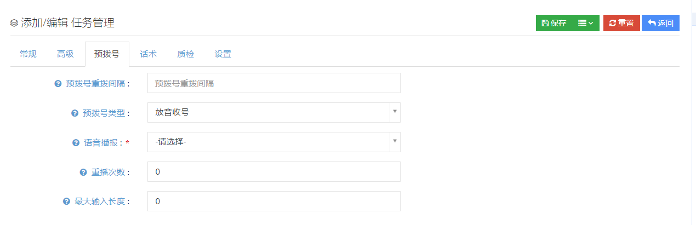

④点击话术进入添加/编辑任务管理的话术页面:

-   **问卷**：在【问卷】中设置问卷，用于坐席根据问卷问题对客户进行问卷调查。

    如果一个任务设置了问卷，当坐席打开客户弹屏时，将会显示这个问卷的内容。.

    

⑤点击质检进入添加/编辑任务管理的质检页面：

-   **质检比**：用于提示告知质检人员此任务的质检比例。

    设置的质检比可以在质检页面上查看，用于查看质检数量。

    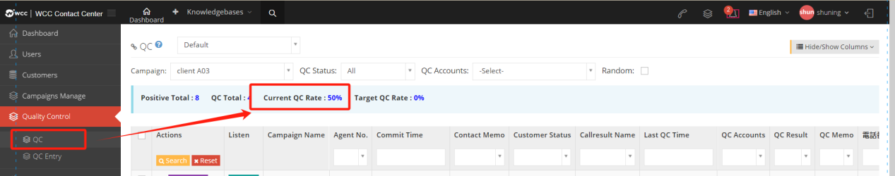

⑥点击设置进入添加/编辑任务管理的设置页面:

-  **发送统计的CSV到指定地址**：预拨号拨号完成后，发送预拨号的客户统计CSV到指定地址。关于地址请联系供应商或管理员。

#### 3.3.2成功提交客户
         
##### 1页面介绍

**成功提交客户** 用于展示最近一次联络记录选择的销售漏斗（分值大于0）的客户数据。

在成功提交客户页面用户可以根据外呼营销任务、呼叫结果、质检情况、销售漏斗等来查看需要的客户信息。成功提交客户是坐席在与客户通话结束后进行的操作，在客户相关记录页面坐席可以对联络记录进行设置保存。

上图中的【默认】用户可以选择默认客户包或客户包查看成功提交客户数据。

【搜索】全局搜索支持用户对客户姓名、电话号码、电子邮件、城市、区域、备注等进行搜索。

【搜索】后的【请选择】选择销售漏斗进行查看。

【所属任务】选择成功提交客户所属的任务。

【呼叫结果】选择成功提交客户的呼叫结果。（显示绑定销售漏斗>0和未绑定任务的呼叫结果）

【质检情况】选择成功提交客户的质检情况。

【显示/隐藏字段】选择该页面想要显示或隐藏的字段。

【工具菜单中】

导出CSV文件：用户可以根据需要对成功提交数据进行导出，不选择任何数据默认是导出全部数据.

##### 2 显示/隐藏字段

-   姓名：成功提交客户姓名。

-   电话号码：成功提交客户电话号码。  
  
-   电子邮件：成功提交客户的电子邮件。  
  
-   性别：成功提交客户的性别。  
  
-   年龄：成功提交客户的年龄。  
  
-   住所：成功提交客户的住址。  
  
-   地域：成功提交客户所在的地区。  
  
-   客户标签：该成功提交客户保存的客户标签。

-   坐席工号：成功提交该客户的坐席工号。

-   销售漏斗：该成功提交客户的销售漏斗。

-   呼叫结果：该成功提交客户的呼叫结果。  
  
-   最后更新：该成功提交客户最后更新客户资料的时间。

-   创建日期：该条成功提交客户的创建日期。  
  
-   最后分配时间：该成功提交客户最后分配的时间。

-   坐席姓名：提交该客户的坐席姓名。

-   质检结果：对该成功提交客户的质检结果。

-   质检备注：质检时的备注内容。

-   最后提交时间：最后一次成功提交的时间。

-   最后一次通话时长：该客户与坐席最后一次通话的时长。

 

#### 3.3.3预拨号

##### 1 页面介绍

**坐席组预拨号** 主要是用于，在用户对整个坐席组的工作效率有一定了解，为了节省更多时间，而采用的预测拨号。除了client页面可以设置预拨号，当坐席身份为坐席组长时，client也可以为坐席组长增加坐席组预拨号的设置权限。

在分配外呼任务后，启动预拨号之前可以先对预拨号进行设置。

①在操作中的下拉菜单，可以对坐席组预拨号进行【高级设置】，此处的设置需要用户对坐席组的工作效率有一定了解:

选择按最大并发，设置高级选项启用，此时预拨号会按照高级选项中的拨号间隔设置的秒数还有每次拨号最大并发进行拨号。

选择坐席百分比，设置高级选项启用，此时预拨号会按照高级设置中，接听率、短话单、短话单时长、平均通话时长这些数据，通过系统计算进行预拨号。

最大并发就是设置多少并发，每次就按设置的并发数进行拨号，坐席百分比就是需要进行计算，启用高级设置，让坐席百分比计算更精确。

-   启用：启动这个预拨号的高级设置。

-   拨号间隔：单位是秒，预拨号开始工作时每两个号码的拨打间隔。

-   每次拨号最大并发：每个坐席组中能够接受的最大拨号并发数量。

-   接听率：坐席组内的坐席能够及时接听电话的比率。

-   短话单比率：短话单所占总通话量的比率。

-   短话单通话时长：用户可以选择短话单的界定时长，小于该时长的话单，即为短话单（单位秒）。

-   平均通话时长：设置该坐席组的平均通话时长（秒）。

-   平均话后时长：设置该坐席组的平均通话后时长（秒）。

-   平均振铃时长：设置该坐席组的平均响铃的时间（秒）。

*列举情况说明*：  

*坐席在线总数10*

*坐席1：通话时长20s*

*坐席2：通话时长120s（大于平均通话时长60s【talkend】）*

*坐席3：通话时长4s（小于短话单时长10s短话单比率50%=5s【shorttalk】）*

*坐席4：话后时长60s（大于平均话后时长30s单小于平均话后时长90S【acwend】）*

*坐席5：话后时长30s*

*其他坐席为空闲坐席【idleagent】*

*客户1：振铃，振铃15S，已经接通，但是没有坐席接通*

*客户2：振铃20s被接通（小于平均振铃时长25s【ringing】）*

*可用坐席 = idleAgent + talkEnd + acwEnd + shortTalk - waiting*

*预测下次可用坐席数量=空闲坐席5个+坐席2（此时系统判断这个通话即将要被挂断了）+坐席4（大于平均话后时长系统预测这个坐席即将离开话后）+坐席3（短话单即将结束）-客户1=5+1+1+1-1=7*

*拨号数 =（可用坐席 × 坐席百分比）/应答率 - ringing*

*拨号数量=（7*150%）/50%-1=20*

*系统会在每次轮预拨号开始前预测计算下一次拨号的数量，大概就是以上的步骤。*

*可用坐席都是指坐席的数量，高级里的设置，是作为下一次预拨号判断的依据*。

②设置好预拨号的高级选项后，就可以进入开启预拨号的流程。如果等待客户数不为0，则需要先清空预拨号列表：

③点击【回收】，对任务中的客户数据进行回收。在【请选择】中有两种回收的方式：

-   **按选中回收**：选中需要回收的客户数据，点击确定即可进行回收。

-   **按条件回收**：用户选择回收数据的条件，比如跳过已分配客户数据、跳过今日拨打客户数，或是某一销售漏斗数据，选择该条件后直接点击按条件回收数据，该条件下的数据可被回收。

-   **优先级**：在预拨号拨号时被分配数值越小的客户数据，拨打顺序越靠前，优先级可以从1-9数字中选择。

-   **预约时间**：在预拨号拨号时按照预约的时间进行拨号。

-   **跳过已分配客户数据**：跳过已经分配给指定坐席的客户数据。

    此时回到坐席组预拨号页面点击开始，开启预拨号。在预拨号拨打过程中，用户可以在预拨号列表中点击预拨号列表查看当前拨号列表。

注：在整个回收过程中预拨号是在停止的状态下进行。

在预拨号期间你可以点击查看【预拨号列表】，列表中显示了当前正在被预拨号的号码。

【搜索】全局搜索 ( 姓名,  電話番号,  Eメール,  住所,  地域,  メモ ) ...

【销售漏斗分值】以销售漏斗作为筛选查看客户的条件。

【上次预拨号结果】查看预拨号列表中，上次预拨号结果条件下的客户。

【显示隐藏字段】选择想要查看的字段。

【请选择】按条件从列表中删除或选择数据。

**预拨号时状态的显示**：

**客户电话**：振铃客户的电话号码。

**开始时间**：客户开始振铃的时间。

**振铃时长**：客户振铃的时长。

**客户电话**：接通客户的电话号码。

**开始时间**：客户开始振铃的时间。

**客户应答时间**：客户应答这个通话的时间。

**等待时长**：客户应答这个通话开始计算的等待时长。

**客户电话**：坐席应答这个客户的电话号码。

**坐席（电话-工号）**：接通这个客户电话的坐席工号。

**坐席应答时间**：坐席接通这个客户电话的时间。

##### 2 显示/隐藏字段

-   姓名：客户姓名

-   电话:客户的电话号码

-   电子邮件:客户的电子邮件

-   客户标签:客户的标签类别

-   坐席工号:该客户所属的坐席工号

-   销售漏斗:该客户最近保存的销售漏斗。

-   呼叫结果:该客户最近保存的呼叫结果。

-   质检结果:该客户的质检结果。

-   最后更新:该客户的资料最后一次更新的时间。

-   创建日期:该客户的创建日期。

-   上次预拨号结果:该客户上次拨打预拨号的结果

-   预拨号次数:该客户被预拨号拨打的次数。

-   最后一次拨打时间:该客户上一次被拨打的时间。

-   优先级:该客户在预拨号时的优先级。

-   预约时间:该客户在回收时所设置的预约时间，当预拨号启动时，该客户会在该预约的时间进行拨打。

#### 3.3.4 呼叫结果

##### 1页面介绍

**呼叫结果** 是坐席呼叫客户后，坐席保存联络记录的通话结果，用于对通话结果的分类。

【搜索】全局搜索仅可以使用呼叫结果名称来搜索。

【添加】添加一个新的呼叫结果。

【显示/隐藏字段】选择该页面需要显示或是隐藏的字段。

【请选择】按条件删除。

【编辑】对已建立的呼叫结果可以编辑。每个新建的呼叫结果都有一个唯一ID，以及创建时间。

【下拉菜单】删除这个呼叫结果。

##### 2 显示/隐藏字段

-   呼叫结果名称：建立呼叫结果的名称。

-   通话状态：在该通话状态下能够设置呼叫结果。

-   所属销售漏斗：该呼叫结果所属的销售漏斗

-   创建日期：呼叫结果的创建日期。

-   创建人：呼叫结果的创建人。

##### 3 新增一个呼叫结果

①在呼叫结果页面中点击添加进入添加/编辑呼叫结果页面：

-   **呼叫结果名称**：用户可以自定义一个呼叫结果，当坐席完成通话后，坐席可以选择一个呼叫结果记录此次通话结束。

-   **通话状态**：应答-当呼叫被应答时才能设置这个呼叫结果；无则-意味着在任何状态下都可以使用呼叫结果；未应答-只有通话没有被应答时这个通话结果才会显示。

-   **所属销售漏斗**：设置指定的销售漏斗在这个指定的销售漏斗下才会显示这个呼叫结果。

-   **应用到任务**：应用这个呼叫结果到指定的外呼任务中，该呼叫结果只在指定任务中显示，若选择应用到全部或多个任务，则该呼叫结果可以在全部任务或是选中任务中选择。

-   **强制预约**：必须建立预约，否则无法保存客户和提交联络记录。

    用户登录坐席身份后，可以在客户弹屏页面-客户相关记录-历史联络记录中对呼叫结果进行选择

### 3.4 质检

#### 3.4.1 质检

##### 1 页面介绍

**质检** 是质检人员可对通话结果进行抽查，可同步播放录音，核实记录内容是否真实，对坐席的交流技巧、工作态度等进行评估，进行质检评分。坐席也可以对有歧义的质检结果进行申诉。在任务中选择需要质检后，该任务中的客户在坐席提交联络记录后将不会再被拨打，质检中选择可回拨才能够继续拨打。

【默认】选择需要质检的客户包。

【显示/隐藏字段】选择该页面需要显示或是隐藏的字段。

【所属任务】需要质检的呼叫任务。

【质检情况】根绝选择的质检情况查看质检数据。（抽检合格包含 质检成功、话术不规范、未质检；可回拨属于质检不合格中。）

【质检人】根据选择的质检人查看质检数据。

【随机】随机查看需要质检的数据。

【试听】

【质检】点击质检进入质检页面。

【下拉菜单】选择质量检查的结果可以对成功提交的数据进行快速质量检查。

##### 2 显示/隐藏字段

-   外呼任务：组要质检呼叫的所属任务。

-   坐席工号：该条需要质检的呼叫所属坐席。

-   提交时间：该条质检的提交时间。

-   修改日期：修改该条质检结果的日期。

-   联络备注：在历史联络中保存的备注。

-   客户状态：客户销售漏斗（分值大于0)保存的状态名称。

-   呼叫结果：该客户保存的呼叫结果。

-   最后质检时间：该客户的最后一次质检的时间。

-   质检人：对该呼叫结果进行质检的人员。

-   质检结果：质检的结果。

-   质检备注：质检的备注。

-   电话号码：客户的电话号码.

##### 3 质检流程

点击质检进入质检流程：

在质检页面有4个功能块，包括质检、联络记录以及客户资料功能和上次质检结果。

【质检】

在质检页面中，质检员可以对坐席成功提交的通话进行质检，质检员可以对通话的播放速度进行更改或是对通话进行下载。

在质检结果中，质检员可以选择质检的结果，包括合格、话术不规范（合格）、失败或是可回拨。

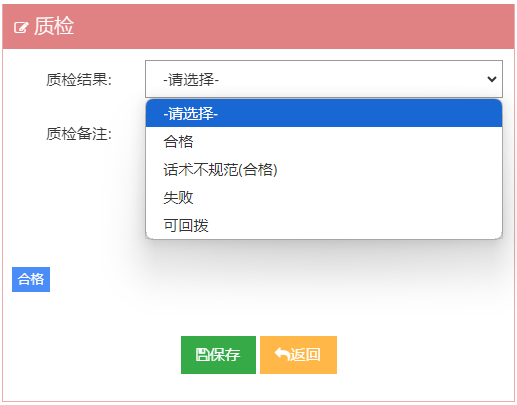

如果质检结果不规范、失败或可调用，质检员除了需要填写质检备注（质检备注的快速选择入口可在质检词条中设置）。

【相关记录】

相关记录页面记录的是坐席跟客户的历史联络记录，质检员可以对联络记录进行查看或是听取历史录音。

【客户资料】

检员在质检的时候可以查看客户资料。

【上次质检结果】

如果上次质检结果是因为已质检的客户质检结果为可回拨，当坐席再次成功提交该客户的联络记录后，需要再次进行质检，此时，该客户页面会出现上次质检结果，以方便质检员的查看。

联络记录：显示的是上次成功提交时所写的备注。

质检人：上次质检的质检人。

质检时间：上条质检的质检时间。

质检结果：上次质检的质检结果。

质检备注：上次质检未成功时所填写的备注。

#### 3.4.2 质检词条

##### 1 页面介绍

**质检词条** 是设置的常用质备注信息，质检时，质检人员可以通过一键点击质检词条快速添加质检备注。

【搜索】全局搜索仅可以使用质检词条名称来搜索。

【添加】添加一个新的质检词条（上限为40个字符）。

【显示/隐藏字段】选择该页面需要显示或是隐藏的字段。

【请选择】请按条件删除。

【编辑】对已建立的质检词条可以编辑。每个新建的呼叫结果都有一个唯一ID。

【下拉菜单】删除该质检词条.

### 3.5 语音设置

#### 3.5.1did号码

##### 1 页面介绍

**DID号码** 指电信运营商提供的能够呼入到系统的电话号码，是外线呼入时的接通号码即被叫号码，市公司对外公布的电话号码，也可以理解成客户拨打的号码。DID在系统中的主要作用是，通过对DID号码的识别，我们可以制作不同的拨入路由，例如直接呼叫一个分机，一个振铃组，进入一个IVR或者一个队列。

【搜索】全局搜索支持did号码、client以及域名进行搜索。

【显示/隐藏字段】选择该页面需要显示或隐藏的字段。

【工具】批量编辑-导出CSV文件

【编辑】编辑可以对did号码的转向、名称、分组和主叫号码的前缀进行设置。

##### 2 显示/隐藏字段

-   DID号码：DID显示号码。

-   DID名称：DID显示名称。

-   分组：选择的DID分组。

-   转向：DID的转向位置。

-   主叫名称：增加主叫号码前缀的名称。

-   主叫号码：增加主叫号码前缀的号码。

-   国家：DID中设置的国家。

-   属性：号码区域信息中设置的号码归属地信息。

-   创建日期：该DID号码创建的时间。

-   最后更新：最后一次对DID进行修改保存的时间。

##### 3 编辑DID号码

① 点击【编辑】进入添加/编辑DID号码的常规界面:

需要注意的是client用户没有添加DID号码的权限，需要由运营商建立再分给代理商，由代理商再分给client，如有需要请联系代理商或供应商。这里我们只讲client用户对DID号码的编辑权限。下图标记字段client可以编辑。

-   **ID**：每个DID号码都有一个唯一的ID。

-   **DID号码**：如果有多个DID号码会使用空格或者英文逗号分开。该号码用作客户向坐席拨号时使用的号码。

-   **DID名称**：用于帮助用户在系统中识别该号码，在统计时，如果设置了DID名称则会使用此名称。

-   **分组**：用于管理DID号码，例如你可以把使用相同呼入规则的号码归为一组。输入分组名称后回车选中该分组。

-   **绑定客户包**：不绑定，将使用系统偏好设置下设置的默认客户包，默认客户包即使用默认客户表，绑定后选择具体客户包，标明当前DID与该客户包进行绑定，当客户包不可见时，会释放当前DID，并且该字段重置为不绑定。

-   **转向**：系统接收到呼叫后会判断应该呼叫或转入到相应的路由，从而继续提供服务。

    

    根据需要选择转接目标，在转向中设置 IVR菜单、振铃组、条件、播放列表、坐席、坐席组等。您也可以在此处设置外线号码。所有打到该号码的来电都将由外线号码接听。如果转接设置为挂断，则对这个did 号码的任何呼叫都将被挂断。.

-   **增加主叫号码前缀**：做出该设置后系统将为主叫号码增加前缀。当有电话呼入时，在下方弹屏振铃处，通话记录都会出现前缀。对于SIP设备，主叫号码还支持使用主叫名称。

    

    设置后如下图所示↓↓↓

    

    

-   **状态**：当DID号码被禁用时拨打该号码会直接拒绝该通话。

-   **呼入次数**：该DID号码本月呼入的次数。

-   **呼入分钟数**：此DID号码本月的呼入分钟数。

-   **属性**：显示DID号码的归属地信息（在代理商级别号码归属地菜单下配置）。

-   **最后一次使用日期**：该号码最后一次拨打时间.

②点击高级进入添加/编辑DID号码的高级页:

-   **国家**：在代理商或运营商级别设置的国家，client级别不可更改。

-   **备注**：根据需要填写备注说明

注意：如果用户是从更高级别以 loginas形式登录的客户端，如果您在登录时选择“是”，则会出现【代理商】字段，如果您选择“否”，则会出现【组】字段。

#### 3.5.2 外显号码

**外显号码** 是呼叫客户时显示的主叫号码。

##### 1 影响外显号码的三个设置

1.  添加/编辑坐席-高级设置-外显号码

2.  client系统-系统偏好-呼叫设置-主叫

3.  任务管理-常规-外显号码

当三种情况都设置了不同的外显号码，则最终外显号码是坐席所设置的。如果只有client系统和任务管理中设置了外显号码，则最终的外显号码是任务中所设置的。当不设置任何外显号码，最后呼叫客户显示的是坐席工号.

##### 2 外显号码页面功能介绍

【搜索】全局搜索仅支持对外显号码进行搜索。

【显示/隐藏字段】设置在该页面用户需要显示或隐藏的字段。

【查看】查看该外显号码的设置，无法编辑.

##### 3 显示/隐藏字段

-   外显号码：外号的号码

-   供应商：该外显号码的供应商设置.

##### 4 外显号码的设置

外显号码需要在代理商或运营商级别设置，设置后client可以选择所设置的外显号码。

-   **ID**：每个外显号码都有一个独立ID。

-   **外显号码**：输入需要添加的外显号码。

-   **供应商**：你可以为这个外显号填写一个供应商名称，回车键选中（该功能需要在运营商级别进行设置）

#### 3.5.3 媒体文件

##### 1 页面介绍

用户在 **媒体文件** 中添加添加语音或者等待音乐，能够在IVR、振铃组、语音播报等需要媒体文件的地方使用。

【搜索】全局搜索支持媒体文件名称以及媒体文件描述搜索。

【添加】添加一个新的媒体文件。

【显示/隐藏字段】选择这个页面需要显示或是隐藏的字段。

【请选择】按条件删除。

【编辑】对已经建立好的媒体文件进行编辑。

【下拉菜单】在下拉菜单中用户可以对该条媒体文件进行预览、下载或是删除操作。

媒体文件预览

下载媒体文件的保存格式是wav

##### 2 显示/隐藏字段

-   媒体文件名称：媒体文件名。

-   媒体编号：默认媒体编号。

-   文件类型：选择的文件类型。

-   文件扩展名：文件格式。

-   时长：媒体文件的时长。

-   音乐类别：所选择的音乐类别。

-   文件大小：媒体文件的大小。

-   描述：对该媒体文件的描述。

-   创建日期：该条媒体文件的创建日期。

-   最后更新：该条媒体文件的更新日期

##### 3 添加一个新的媒体文件

①点击添加进入添加/编辑媒体文件的常规页面:

-   **媒体文件名称**：请为这个媒体文件命名。

-   **文件类型**：

    ***语音文件***：通常是一个短的语音消息，可以在IVR和语音播报中使用。

    ***等待音乐***：系统将在客户呼叫处于等待状态时播放的音乐，也可以在坐席组中使用。

-   ***音乐类别***：填写一个类别回车输入，为该音乐分类。（注：命名只能为英文。）

-   **上传媒体文件**：用户可以在本地上传一个媒体文件。

    **试听**：可以在此处试听或导出媒体文件。

-   **描述**：你可以为这个媒体文件进行描述说明.

②点击保存即可添加成功新的媒体文件。

### 3.6 呼叫设置

#### 3.6.1 呼入路由

##### 1 页面介绍

**呼入路由** 是用于控制外线电话呼叫到系统之后流程，DID页面可以实现同样的功能，但是如果有多个号码使用相同的流程，或者有更复杂的规则，通过呼入路由更容易配置。当一个号码同时满足DID号码和呼入路由的规则设置，DID设置优先。在呼入路由页面用户还可以设定一个默认路由，如果没有其他的匹配规则，呼叫将使用默认呼入规则。

【默认路由】如果DID中无转向设置，且未新建路由设置转向，呼入将最后选择该默认路由进行转向。

【添加】添加一个新的呼入路由。

【编辑】对新建的呼入路由进行编辑。

【删除】删除该路由.

##### 2 新增一个路由

①点击添加进入添加/编辑呼入路由的常规设置页面:

-   **路由名称**：为这个呼入路由命名。

-   **匹配规则**：设置一个匹配规则，符合此规则的呼叫将会指定该呼入路由的规则。在匹配规则中分两类：

-   **一类是以主叫号码为主**，设置主叫号码的规则形式：
        
    **前缀匹配** -通过主叫号码前缀进行匹配，若did号码中使用了其他前缀号码，则可能会导致通过该规则路由的号码无法正常显示区域信息。  
    **地区匹配** -在匹配值中填写需要匹配的地区，系统通过地区信息来匹配。  
    **正则匹配** -选择该匹配，用户只需要在匹配值中填写一个模糊号码只要主叫号码包含该模糊号码，则都会通过该规则进行匹配。
    

-   **一类是以DID号码为主**，设置DID号码的规则形式：
          
    **前缀匹配** -用过该主叫号码的前缀进行匹配。  
    **地区匹配** -在匹配值中填写需要匹配的地区，系统通过地区信息来匹配。  
    **正则匹配** -选择该匹配，用户只需要在匹配值中填写一个正则表达式，正则表达式与前面主叫号码匹配，则都会通过该规则进行正则匹配。  
    **分组匹配** -根据分组进行匹配，该分组在DID设置中进行建立分配。  
    
    
    如果不对匹配值设置，默认是直接全部符合该规则。

-   **移除主叫号码前缀**：系统将移除掉主叫号码在DID中设置的前缀。

-   **增加呼叫号码前缀**：增加一个前缀，若DID中也设置了前缀，则该前缀要在DID设置的前缀前面显示。

-   **最后呼出坐席优先**：开启此项后，将先呼叫最后与该主叫通话的坐席。

    **转向**：如果符合匹配规则，则呼叫最后会被送至该项中选择的目标.

    *关于前缀问题的举例：*

    *假设被叫号码是881016，如果填写了移除主叫号码前缀32，那坐席外呼需要拨号32881016*

    *如果在增加呼叫前缀处填写了88，那么坐席外呼时需要拨号1016*

    *如果想要替换号码，则需要填写另外一个符合匹配规则的完整号码，例如填写一个881005*

    *如果三处一起填写，最后都会被替换成替换号码*
    
    *总结：被叫号码的移除添加替换，更改的是坐席拨打的号码，不是更改客户的号码。*

#### 3.6.2IVR语音菜单

##### 1.页面介绍

**IVR语音菜单**也称为电脑话务，为用户提供了通过电话键盘和语音进行交互的功能，目的是让连接系统的电话和直接连接交换机的电话之间进行内线拨打，以及外线呼入的电话能够拨打到连接在系统上的电话。

【搜索】全局搜索支持对菜单名称进行搜索。

【添加】添加一个新的语音菜单。

【显示/隐藏字段】选择该页面需要显示或是隐藏的字段。

【请选择】按条件删除。

【编辑】对建立好的语音菜单进行编辑。

【下拉菜单】删除该语音菜单.

##### 2.添加一个ivr菜单

①点击添加新增/编辑IVR语音菜单的常规页面：

-   **菜单名称**：为这个IVR命名。

-   **内线号码**：定义这个IVR的内线号码，从内线sip分机上拨打该内线号码均可达到此IVR。

-   **播放语音**：管理员可以选择语音文件作为IVR语音菜单播放的语音，在语音后可以增加一个间隔时长，间隔时长过后播放下一段设置的语音。如果不设置语音，间隔时长不会生效。

-   **重播次数**：如果客户没有任何输入，系统重复播放IVR语音的次数，0表示只播放一次。

-   **输入超时时长**：IVR语音播放完毕之后，等待客户输入的时长。

-   **直拨坐席**：在IVR播放时是否允许客户直接拨打坐席的工号（分机号），若选择不允许直拨坐席，此时想继续做其他转向设置请在IVR语音菜单高级设置中设置。当在高级设置中设置输入最大长度时，坐席分机号长度大于最大输入长度该功能不可用。

-   **增加主叫号码前缀**：当客户呼叫到达该IVR，系统将为该呼叫增加呼叫号码前缀，此时呼叫到达坐席时是增加前缀后的状态。对于SIP设备，系统还支持增加主叫名称前缀.

②点击高级进入添加/编辑IVR语音菜单的高级页面:

-   **延迟播报**：用户初次到达IVR时，系统在播放语音前的等待时间。延迟播报用于避免IVR中的语音丢失（单位为秒）。

-   **按键超时**：客户输入间隔超时的时间（单位为秒），如果没有设置超时后的其他设置，当超过按键超时时间后，通话将被挂断。

-   **最大输入长度**：限制客户的输入，一旦客户输入长度达到最大输入长度，IVR将停止接受客户输入。0表示不受限制，IVR会一直接受输入直到按键超时。

-   **超时语音提醒**：等待客户输入超时后，下一个动作前出现的超时提示。

-   **超时转向**：如果IVR在最后一次播放完毕且在超时时间内仍然没有接收到客户的输入指示，IVR将把此次通话转接至此处设置的转向，在无其他设置的情况下，若超时转向不设置，在超时后通话将直接挂断。

-   **无匹配输入语音提示**：当客户输入没有匹配到任何转向时，IVR将播放此语音。

-   **无匹配输入转向**：当系统发现客户输入没有匹配到任何转向时，系统将把呼叫转接至此处设置的转向。若无其他设置且此项为空，则该通话在无匹配输入后将挂断。

-   **使用匹配转向接口**：用于处理用户输入的插件，例如根据输入查询播打外线，播放自定义客户数据，如果想启用该功能请联络管理员.

    ③点击转向进入添加/编辑IVR语音菜单的转向页面，用户可以设置数字按键转向:

    

-   **输入**:定义IVR所能接受的客户输入，内容包括数字0-9键，\*键和#键。

-   **转向**：客户输入键值匹配后，IVR通话将转向该目标。

④点击保存即可添加成功新的IVR语音菜单

##### 显示/隐藏字段

-   菜单名称：这个语音菜单的名称。

-   内线号码：这个语音菜单的内线号码。

-   重播次数：没有客户输入时的语音重复播放次数。

-   使用匹配转向接口：转向插件。

-   延迟播报：系统在播放语音前的等待时间。

-   按键超时：客户输入间隔超时的时间（单位为秒），如果没有设置超时后的其他设置，当超过按键超时时间后，通话将被挂断。

-   最大输入长度：用户能够根据语音提示进行输入时的最大输入长度。

-   直拨坐席：IVR是否允许客户直接拨坐席的分机号码。

-   增加主叫号码前缀：增加的主叫号码前缀。

-   主叫号码：增加的号码前缀。

-   主叫名称：增加的主叫号码前缀的名称。

-   创建日期：该IVR语音菜单的创建时间。

-   最后更新：该IVR语音菜单最后修改保存的时间。

#### 3.6.3 语音播报

##### 1 页面介绍

**语音播报** 可以包含一条或是多条语音，当有通话呼入到语音播报时，系统将逐一播报。用户在将语音播报设为转向时，可以选择【是】允许按任意键退出当前语音，或是全部语音播放完毕后的转向目标。

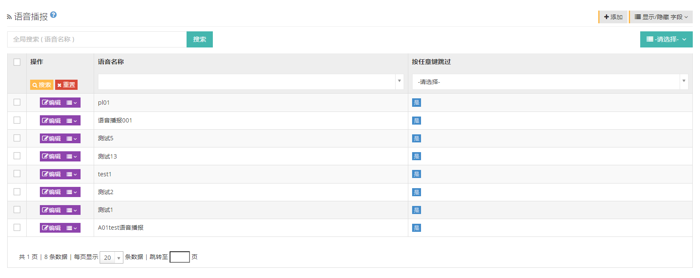

【搜索】全局搜索允许用户以语音名称进行搜索。

【添加】添加一个新的语音播报。

【显示/隐藏字段】选择在该页面想要显示或是隐藏的字段。

【请选择】按条件删除。

【编辑】对已建立的语音播报进行编辑。

【下拉菜单】可以删除该条语音播报.

##### 2 显示/隐藏字段

-   语音名称：该语音播报的名称。

-   按任意键跳过：是否按任意键跳过该语音播报。

-   创建日期：该语音播报的创建日期。

-   最后更新：该语音播报的左后更新日期。

##### 3 添加一个新的语音播报

①点击添加进入添加/编辑播放列表的通用页面:

-   **语音名称**：为这个语音播报命名。

-   **媒体列表**：该列表中的文件将被顺序播放。

-   **按任意键跳过**：是否允许客户按键盘任意键跳过当前播放的语音。

-   **转向**：当语音播报结束或被跳过后，客户将会被转向你所指定的方向（有下拉菜单可选择）。

-   **媒体列表**：该列表中的文件将被顺序播放。可以在此删除列表中的语音播报。

②点击保存添加成功。

#### 3.7.4 振铃组

##### 1 页面介绍

**振铃组** 将分机组成集合，用于分别处理客户呼入通话，与坐席组不同，振铃组没有签到或是单独进行统计的功能。

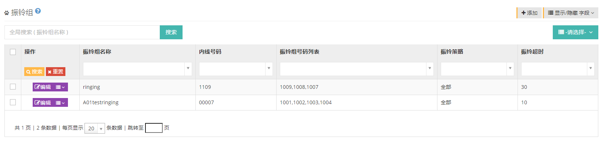

【搜索】全局搜索支持以振铃组名称进行搜索。

【添加】添加一个新的振铃组。

【显示/隐藏字段】选择这个页面需要显示或是隐藏的字段。

【请选择】按条件删除。

【编辑】对创建好的振铃组进行编辑。

【下拉菜单】删除该振铃组 .

##### 2 显示/隐藏字段

-   振铃组名称：该振铃组的名称。

-   内线号码：振铃组内线号码。

-   振铃组号码列表：振铃组中的号码列表。

-   主叫名称：增加的前缀名称。

-   主叫号码：增加的前缀号码。

-   振铃策略：队列收到呼叫请求后分配给坐席的规则。

-   振铃超时：振铃组全部振铃时的超时时长。

-   创建日期：该振铃组的创建日期。

-   最后更新：该振铃组最后更新保存的日期。

##### 3 添加一个振铃组

点击添加进入添加振铃组页面：

-   **振铃组名称**：为这个振铃组命名。

-   **内线号码**：你可以为此振铃组定义一个内线号码，但已使用的内线号码不可用。通过注册SIP分机拨打此内线号码就可以呼入该振铃组。

-   **振铃组号码列表**：填写振铃组要拨打的号码，每行填写一个或者使用英文逗号分隔。可以是内线或是外线号码，列表中号码排序影响振铃组内轮询相关的振铃策略，如下振铃策略中有详细内容。

-   **增加前缀**：用户可以为来自该振铃组的呼叫增加主叫号码的前缀。对于SIP设备，主叫号码还支持使用主叫名称。

-   **振铃策略**：振铃策略是队列收到呼叫请求后分配给坐席的规则。

-   **全部**-来电后，所有分机同时振铃。

-   **轮询**-来电后，组内的分机号码一个接着一个的振铃。

-   **随机**-来电后，随机选择分机振铃。

-   **记忆轮询**-来电后按所选入的分机次序逐个振铃直到应答，当该呼叫再次呼入时将记住上一次最后的分机，再按最后分机下一个分机开始的顺序逐个分机振铃。

-   **顺序轮询**-按所选入的分机次序逐个振铃直到应答，当再次呼入是再重新按照次序进行逐个分机振铃。

-   **振铃超时**：当振铃策略为全部振铃时，该值为振铃组的超时时长，在其他情况下则为呼叫每个号码的超时长。

-   **超时转向**：当振铃时长超出超时时长时，用户可以为该呼叫设置一个转向.

②点击保存即可添加成功新的振铃组。

#### 3.7.5黑名单

##### 1 页面介绍

当被加入 **黑名单** 的号码呼叫到系统时，系统将识别该通话，用户可以选择设置将黑名单号码直接挂断、播放振铃、一段语音或是等待音乐。该呼叫可从通话记录或是黑名单记录中查看。

用户可以在黑名单页面添加黑名单号码，在client级别添加黑名单号码可以直接生效不需要审核。

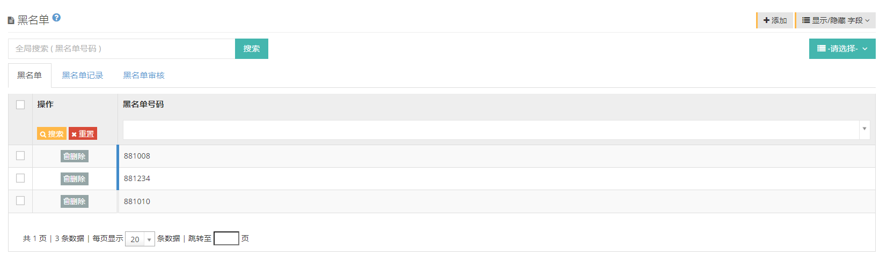

【搜索】全局搜索仅支持对黑名单号码进行搜索。

【新增】新增一个黑名单号码。

【显示/隐藏字段】选择这个页面需要显示或是隐藏的字段。

【黑名单】被加入黑名单的电话列表。

【黑名单记录】曾经被加入黑名单的所有记录。

【黑名单审核】需要审核的黑名单号码

客户端也可以在系统偏好设置黑名单中选择来自该号码的来电的其他方向。

##### 2 显示/隐藏字段

-   黑名单号码：被加入黑名单的号码。

-   创建人：将该号码加入黑名单的人。

-   创建日期：该号码被加入黑名单的时间.

##### 3 添加一个黑名单号码

###### 3.1 client用户添加黑名单号码

①点击添加进入添加/编辑黑名单的常规页面：

-   **黑名单号码**：输入黑名单号码，批量输入时请用英文逗号或回车分隔。

-   **状态**：用户可以开启或禁用这些黑名单号码的状态。

②点击保存即可添加成功新的黑名单号码。

###### 3.2坐席添加一个黑名单号码

除了在client级别可以直接设置黑名单号码，坐席在打开自己的客户数据时也能对该条数据进行黑名单的设置。

点击添加黑名单后，坐席需要输入将这个电话添加到黑名单的原因。

以坐席身份加入黑名单时，不能立即生效，该条黑名单请求会在client级别进行审核（若坐席有审核权限也可以坐席身份进行审核），审核通过才会生效。

①在客户的下拉菜单中，用户可以点击将号码添加到黑名单。当坐席加入黑名单时，它不会立即生效。黑名单禁用将client级别进行审核（如果坐席有审核权限，也可以审核）。只有在审核通过后，黑名单才会生效。

②点击编辑，进入黑名单审核页面：

-   **ID**：数据唯一ID。

-   **黑名单号码**：审核的黑名单号码。

-   **状态**：用户可以对黑名单进行审核，选择该条黑名单的使用状态。

-   **创建日期**：号码加入黑名单的日期。

-   **创建人**：将号码创建为黑名单号码的坐席号码。

③将状态设置为启用，点击保存，黑名单生效。

#### 3.7.6 DNCs

##### 1 禁呼列表页面介绍

电话**禁呼列表**是坐席外呼禁止的电话列表，禁呼列表中的号码被坐席拨打后，可以设置系统直接挂机，或者转入其他功能。

【全部】可按客户包搜索禁呼列表。

【搜索】全局搜索支持使用禁呼的号码进行搜索。

【添加】添加一个号码到禁呼列表中。

【显示/隐藏字段】选择在该页面需要显示或是隐藏的字段。  
  
【工具】导入数据。

【请选择】按条件删除。

【禁呼列表】所有被禁呼号码的列表。

【禁呼审核】坐席提交需要被审核的禁呼号码。

##### 2 显示/隐藏字段

-   客户包：选择所属客户包查看禁呼号码。

-   禁呼号码：被禁呼的号码。

-   禁呼原因：该号码被禁呼的原因。

-   创建人：该禁呼号码的创建人。

-   创建日期：禁呼号码的创建日期。

##### 3 添加一个禁呼号码

###### 3.1 client 添加禁呼号码

①点击添加进入添加/编辑禁呼列表的常规页面

-   **所属客户包**：选择禁呼号码所在的客户包，不同客户包内相同号码不会被影响。

-   **禁呼号码**：请输入禁呼号码，批量导入时请用英文逗号或回车分隔。

-   **状态**：用户可以选择是否启用或禁用这些禁呼号码。

-   **禁呼原因**：请输入禁呼原因。

②点击保存即可添加成功新的禁呼列表。

###### 3.2 坐席添加禁呼

除了在client级别可以直接设置禁呼号码，坐席在打开自己的客户数据时也能对该条数据进行禁呼设置。

①在客户资料中的下拉菜单中，用户可以点击将该号码加入禁呼列表。以坐席身份加入禁呼列表时，不能立即生效，该条禁呼请求会在client级别进行审核（若坐席有审核权限也可以坐席身份进行审核），审核通过才会生效。

②点击编辑即可进入添加/编辑禁呼列表常规页面：

-   **ID**：创建禁呼号码后自动生成的表示身份的唯一ID。

-   **所属客户包**：禁呼号码所属客户包。

-   **禁呼号码**：被坐席提交的禁呼号码。

-   **状态**：用户可以对禁呼号码进行审核，选择该条黑名单的使用状态。

-   **禁呼原因**：所填写的禁呼原因，可以修改。

-   **创建日期**：该禁呼号码的创建日期。

-   **创建人**：创建禁呼的坐席。

③选择启用点击添加即可添加禁呼列表。

#### 3.7.7 功能键

**功能键** 主要作用于坐席使用的分机电话，以下是一些电话操作的功能说明：

-   **驻留号码**：此号码为呼叫驻留号码，向后延续20个号码为驻留位置号码（如：701-720，如果此号段中有和其他分机号重复的情况，当拨打时会优先检测是否有驻留通话）使用方法：在话机上将当前通话保持并发起新通话到此驻留号码，则当前通话会被分配一个驻留位置号码，并被驻留，可使用任一分机拨打分配的驻留位置号码取回这个呼叫。

-   **报本机号**：使用分机拨打此号码，系统会播报当前分机号码.

-   **电话录音**：使用分机拨打此号码，可根据提示进行语音文件录制，录制的文件可在‘语音设置/媒体文件’页面查看。

-   **DND开关**：使用分机拨打此号码，可激活/取消当前分机免打扰模式，激活免打扰时，分机将无法被呼叫。

-   **抢接**：当同部门的相邻坐席因为各种原因在电话响起时并不在座位上，其他任何坐席可以按此键进行抢接该呼入电话。当抢接坐席和被抢接坐席用在一个部门或是同时没有设置部门都为默认时可以进行抢接，不在同一部门的坐席不能抢接。被抢接坐席中有同部门和不同部门，抢接只能抢到同部门坐席通话。当坐席先后呼入时进行抢接，实现方式为顺序抢接，即最早呼入的优先被抢接。如果有多个坐席同时振铃，抢接坐席直接输入*85随机抢接一个振铃坐席，如果使用 *85+坐席号码，则可以直接抢接指定这个坐席的电话。

-   **回声测试**：分机拨打此号码，系统将对输入的语音或DTMF进行回放，用以测试媒体情况。

-   **监听**：拨打此号码+坐席工号，用以监听指定坐席与客户的通话。

-   **密语**：拨打此号码+坐席工号，用以在坐席通话过程，与坐席进行沟通，此时客户听不到拨号者的声音，只有坐席能听到。

-   **强插**：拨打此号码+坐席工号，用以在坐席通话过程，强行介入该通话，此时客户与坐席都可以听你的声音，和三方通话有相同效果。

-   **坐席签入**：坐席签入一个队列表示该坐席准备从该队列中接收呼叫。

-   **坐席签入**：坐席签入一个队列则表示该坐席准备好从该队列中接收呼叫。

-   **坐席置闲**：坐席置闲表示该坐席可以随时接收呼叫。

-   **坐席暂停**：坐席在该状态无法接收呼叫，在大屏监控时会显示暂停原因。

    注：在网页的监控页面中，可以实现在坐席并未通话时就开始实现监听、强插、密语的功能，且被监听、强插、密语的通话挂断后，监听、强插、密语仍可继续保持。话机操作仅支持通话中进行。

#### 3.7.8 条件

##### 1 页面介绍

**条件** 是根据设定的时间条件来决定通话的转向，符合时间的转向指定处，不符合时间的转向指定处。设定

【添加】添加一个新的条件。

【显示/隐藏字段】选择在这个页面上需要显示或是隐藏的字段。

【请选择】按条件删除。

【编辑】编辑已添加的条件。

【下拉菜单】删除该条件。

##### 2 显示/隐藏字段

-   名称：条件的名称。

-   类型：该条件的所属类型。

-   条件：条件所约束的时间。

-   符合转向：符合该条件的转向。

-   不符合转向：不符合该条件的转向。

-   创建日期：该条件的创建日期。

-   最后更新：该条件最后的更新日期.

##### 3 添加一个新的条件

①点击添加进入添加/编辑号码条件的常规页面：

-   **名称**：为这个条件命名。

-   **类型**：为这个条件选择一个预拨号的类型。

    ***每周重复***-选择每周使用该条件的时间段，用户在表格中点击事件或点击编辑编辑时间。

    ***指定时间***-指定一个条件生成的时间范围,例如如果设定条件在指定范围00:00:00——12:00:00生效，则当有电话在12:00:01呼入时就系统会判定不符合该条件。

    ***指定日期***-指定一个条件生成的日期。

    ***日期范围***-指定一个日期范围在这个日期范围内符合条件，需要注意，这里指定的日期时指定的时间是包含这个时间所在的分钟，例如日期范围是02.08 12:00-02.09 11:00，这里在02.09 11:01呼入的电话是属于符合这个条件的。

-   **符合转向**：选择符合该时间条件的转向。

-   **不符合转向**：选择一个不符合该时间条件的转向。

    介绍一下指定日期的不同选择状态

**①每周重复**：选定每周重复的时间（可编辑或删除），然后选择符合该条件的转向和不符合该时间条件的转向保存即可。

**②指定时间**：选择指定时间的范围，然后选择符合该条件的转向和不符合该时间条件的转向保存即可，可添加多个指定时间。

**③指定日期**：选择指定日期，然后选择符合该条件的转向和不符合该时间条件的转向保存即可，可添加多个指定日期。

**④日期范围**：选择一个条件生成的日期范围，然后选择符合该条件的转向和不符合该时间条件的转向保存即可，可添加多个日期范围。

②点击使用情况进入添加/编辑条件的使用情况页面：

在使用情况页面可以看到所有使用该条件的任务的情况。（在任务中的工作时间即为该条件的使用设置）

③点击保存即可添加成功新的条件。

#### 3.7.9 暂停管理

##### 1 页面介绍

**暂停管理** 是坐席置忙时选择的一个暂停的理由，在暂停原因页面系统用户可以添加/查看/编辑/删除暂停原因。

【搜索】仅支持以暂停原因名称进行全局搜索。

【添加】添加一个新的暂停原因。

【显示/隐藏字段】选择在该页面需要显示或是隐藏的字段。

【请选择】按条件删除。

【编辑】对已建立的暂停原因进行编辑。

【下拉菜单】删除该暂停原因。

##### 2 添加暂停非原因及使用流程

①点击添加进入添加/编辑暂停原因常规页面：

②点击保存即可添加成功新的暂停原因。

坐席在忙碌时可以在右上角的下拉菜单中选择暂停，此时坐席为忙，无法开始工作。当坐席暂停时，暂停的次数和原因会在统计中记录。如果没有设置默认组坐席在暂停状态下依旧能够收到呼入的电话，但此时呼入电话的组别显示的是默认。

#### 2.7.10 话机部署模板

##### 1 页面介绍

**话机部署模板** 可以直接对话机甚至进行配置，模板内容可以自主添加进行默认配置，在多台话机运用时能够节省更多的时间一键进行部署。

高级别设置的话机模板，低级别不能编辑只能复制该模板。client自己建立的模板可以进行编辑。

【搜索】全局搜索支持以话机部署模板的名称进行搜索。

【添加】添加一个新的话机部署模板。

【显示/隐藏字段】选择这个页面需要显示或是隐藏的字段。

【请选择】按条件删除。

【克隆】上一级设置的话机部署模板在client只能复制不能编辑。

【编辑】对已建立的话机部署模板可以对话机品牌进行编辑。

【下拉菜单】可以删除该部署模板，也可以复制该话机部署模板.

##### 2 显示/隐藏字段

-   模板名称：该模板的名称。

-   路径：话机部署模板的路径地址。

-   话机品牌：这个话机部署模板的话机品牌。

<!-- -->

-   模板内容：部署模板的内容。

##### 3 添加一个新的话机部署模版

①点击添加进入添加/编辑话机部署模板常规页面：

-   **模板名称**：请写出模板的名称。

-   **话机品牌**：填写话机的品牌。

-   **模板内容**：填写需要配置的模板内容。

②点击保存即可添加成功新的话机部署模板。

### 3.7 知识库

#### 3.7.1 知识库

##### 1 页面介绍

【搜索】搜索知识库里的文件。

【＋】点击搜索旁边的加号可以添加一个新的知识库文件

-   **知识库名称**：为这个知识库命名。

-   **知识库备注**：填写这个知识库的备注。

用户还可以为已建立的知识库增加一个知识库分支，可以直接点击知识库，再点击【＋】即可添加一个知识库分支，也可以使用删除编辑按钮对知识库进行修改。

添加完成后，点击折叠标志即可查看添加的知识库分支，也可进行添加删除编辑，对已经有知识库分支的知识库不能删除，需要先删除知识库分支后才可删除。

##### 2 添加知识

单击知识库文件，然后单击添加知识可以将知识添加到文件中。具有知识库页面权限的管理员提交的知识无需审核即可成功创建.

-   **问题**：输入需要解答的问题内容。

-   **关键字**：用户可以输入帮助坐席在使用知识库时搜索的关键字，可以添加多个，enter键输入。

-   **分类至**：用户可以将该知识库信息分类到多个知识库中。

-   **回答**：该问题的答案。

-   **有效期至**：创建者可以对该知识库的有效期限进行定义，超过有效期该知识不会被搜索到。

##### 3 其他操作

【批量操作】

在知识库页面用户可以选择批量审核，用户可以选择选择需要批量审核通过或是不通过的数据。需要审核的知识是坐席建立的。

【有效期】用户可以选择查看有关有效期限的知识库知识。

【最新】

用户可以根据初始或最新的排列方式排列知识。

【状态】

用户可以根据知识的审核状态对知识进行查看。

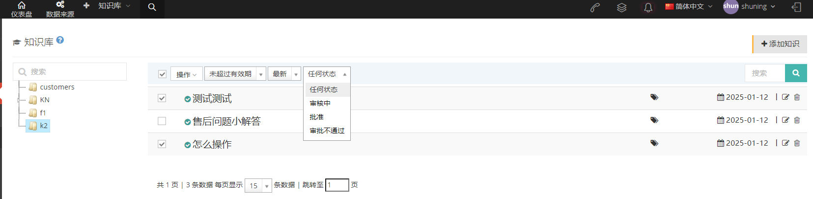

【坐席知识】

当坐席的角色中包含了坐席知识库的权限，坐席仪表盘页面会显示知识库。

点击【我的提交】进入坐席添加知识库页面，点击【添加知识】添加新知识

点击【知识列表】可查看已审核并提交但未审核的知识。可以直接点击大字体标签，显示该标签下的知识。

点击【我的提交】，查看坐席自己提交的知识.

坐席提交知识后client知识库页面上将出现提示。单击此提示，带有问号的知识将是需要审核的知识。点击这个黄色问号进入审核页面.

在页面上可以审核查看知识。

### 3.8 问卷

#### 3.8.1 问卷

##### 1 问卷介绍

**问卷** 是坐席与客户通话时坐席跟据问卷内容对客户进行问卷调，问卷的答案用户可以再问卷答案中进行导出。

【搜索】全局搜索支持以问卷名称搜索。

【添加】添加一个新的问卷。

【显示/隐藏字段】选择这个该页面需要显示或是隐藏的字段。

【请选择】按条件删除。

【编辑】对已建立的问卷进行编辑。

【下拉菜单】

***删除***-删除这个问卷。

***克隆***-复制这个问卷。

***问卷预览***-预览这个问卷.

##### 2 显示/隐藏字段

-   问卷名称：问卷的名称。

-   问卷类型：这个问卷的类型。

-   创建日期：问卷的创建日期。

-   最后更新：问卷的最后更新保存时间。

##### 3 添加一个新的问卷

①点击添加进入添加/编辑问卷常规页面：

-   **问题名称**: 为问卷命名。

-   **问卷类型**：选择问卷的类型

-   ***文本问卷***将此调查应用于任务后，任务中的客户可以根据调查中设置的问题进行填写和选择。

-   ***语音问卷***将调查问卷应用于任务后，通过预拨号呼出的客户将听到以语音格式播放的调查问题（需要配置TTS 引擎且暂时不可用）。

②点击高级进入添加/编辑问卷高级页面：

-   **欢迎语**：问卷首页的欢迎语。

-   **结束语**：问卷结束时出现的结束语。

-   **备注**：备注会出现在问卷标题的下方。

③点击问题进入添加/编辑问卷问题界面：

-   **问题名称**：一个问卷是由多个问题组成的，在在这里用户可以为其中一个问题命名。

-   **说明**：对这个问题添加一个说明，会在问卷问题名称下进行说明提示的显示。

-   **必填**：这个问题是否是必填问题，若启动必填，一定要填写这个问题，不可以直接跳过。

-   **使用模板**：是否要使用设置调查模板？ 如果不勾选 \[使用模板\]，可以设置三种类型的问题：单选题、单选题和文本题。

-   **选项模板**：启用选项模板后，你可以根据已添加的选项模板进行对此问题的选项添加。（当问卷选项模板的内容进行改变，问卷选项模板的更改与此处所选问卷的更改不同步，需要用户重新保存。）

-   **类型**：问题类型:

    ***单选-*** 该问题只有一个选项。

    ***多选-*** 该问题可以有多个选项。

    

    ***文本-*** 该问题没有选项，需要直接输入文字回答。

    

-   **可输入**：是否启用可输入，若启用可以在选择答案之后进行备注说明。

>在最后会有输入问题的列表，用户可以根据该列表进行后续问题逻辑的操作。

④点击逻辑进入添加/编辑问卷逻辑页面（若按问题序号顺序进行则可跳过该页面设置）：

-   **问题**：根据只选择问卷的必选问题，进行逻辑问题的问答。

-   **逻辑**：逻辑关系是根据客户的回答和逻辑关系重定向调查。选择问题后，可以选择一个逻辑关系，逻辑关系可以分为三种类型：等于、只要有、只要没有。

-   **逻辑选项**：该逻辑问题下的选项是或否。

-   **逻辑动作**:逻辑动作包括跳转、隐藏问题和隐藏选项（在逻辑目标中隐藏问题选项）.

-   **逻辑目标**：逻辑动作选择的逻辑目标即问卷在逻辑动作后的结果。

    注意：文本问题不允许设置逻辑动作和逻辑目标，即使保存了逻辑，也不会生效。当存在逻辑冲突时，将首先执行最新的逻辑。

    ⑤问卷保存后回到问卷页面，在编辑的下拉菜单中，用户可以将问卷进行删除、复制操作。也可以对该问卷进行预览。

#### 3.8.2 问卷选项模版

##### 1 页面介绍

**问卷选项模板** 是常用问题的选项，在添加问卷问题中可以选择问卷选项模板快速进行选项添加。

【搜索】全局搜索支持以模板名称进行搜索。

【添加】添加一个新的问卷模板。

【显示/隐藏字段】选择在该页面需要显示或是隐藏的字段。

【请选择】按条件删除。

【编辑】对已建立的问卷选项模板进行编辑。

【下拉菜单】删除这个问卷选项模板。

##### 2 显示/隐藏字段

-   模板名称：这个模板的名称。

-   选项类型：这个模板的选项类型。

-   选项：模板的选项内容。

-   创建日期：该模板的创建日期。

-   最后更新：该模板最后更新保存的日期。.

##### 3 添加一个新的问卷选项模版

①点击添加进入添加/编辑问卷选项模板常规界面：

-   **模板名称**：为这个模板命名。

-   **选项类型**：

    
    
    ***单选***-此问题只能选择一个选项。

    ***多选***  -此问题可以选择多个选项。

    ***单选+文本框***  -这个问题每个单选后面都可以输入文本。

    ***单选+下拉框***此问题每个单选后面都可以下拉添加选项.

    

-   **选项**：常用的选项作为此模板的选项，输入选项，enter键添加可以添加多个。

②点击保存即可添加成功新的问卷选项模板。

#### 3.8.3 问卷答案

##### 1 页面介绍

在 **问卷答案** 页面用户可以查看客户问卷调查的结果。用户需要选择问卷的名称还有问卷所属的任务才能查看完整的问卷调查结果。

上图中的【默认】为可根据客户包查看问卷答案。

【问卷】选择一个问卷查看该问卷下的答案。

【任务】选择一个任务查看该任务下的问卷答案。

【显示/隐藏字段】选择在该页面上需要显示或是隐藏的字段。

【工具】导出CSV文件。只有在选择问卷时，该导出工具才会显示。

##### 2 显示/隐藏字段

-   问卷名称：这个问卷的名称。

-   任务名称：这个问卷所应用的任务名称

-   呼叫结果名称：这个问卷所属客户的呼叫结果。

-   销售漏斗名称：这个问卷所属客户的销售漏斗

-   坐席工号：保存该问卷的坐席的工号。

-   作答时间：该问卷的作答时间。

-   姓名：该问卷所属客户的姓名。

-   电话号码：该问卷所属客户的号码。

-   电子邮件：该问卷所属客户的电子邮件。

-   性别：该问卷所属客户的性别。

-   年龄：该问卷所属客户的年龄。

-   住所：该问卷所属客户的住址。  
  
-   地域：该问卷所属客户的地区。  
  
-   备注：该问卷所属客户的备注。

### 3.9 信息

#### 3.9.1 邮件模版

##### 1 页面介绍

**邮件模板** 的目的是为了给客户发送邮件时一键添加邮件模板，从而节省工作时间。

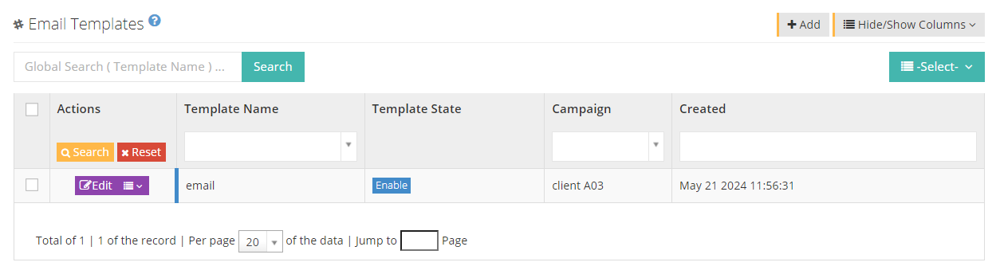

【搜索】仅支持以邮件模板名称进行全局搜索。

【添加】添加一个新的邮件模板。

【显示/隐藏字段】显示或隐藏该页面的字段。

【请选择】按条件删除。

【编辑】对已建立的邮件模板进行编辑。

【下拉菜单】删除这个邮件模板。

##### 2 显示/隐藏字段

-   模板名称：该邮件模板的名称。

-   模板状态：该邮件模板的启用或禁用状态。

-   所属任务：该邮件模板所属任务。

-   邮件标题：该邮件模板的标题，

-   模板注释：该邮件模板的注释。

-   创建日期：该邮件模板的创建日期。

-   最后更新：该邮件模板的最后更新时间。

##### 3 添加一个新的邮件模板

①C点击【添加】进入添加/编辑邮件模板的【常规】界面：

-   **模板名称**：请为这个邮件模板命名。

-   **模板状态**：模板启用或者禁用，若想关闭此模板，你可以设置禁用状态。

-   **所属任务**：你可以为在这个模板选择一个所属任务，然后在此任务下就可以使用该邮件模板。

-   **邮件标题**：你可以设置这个邮件的标题。

-   **邮件模板内容**：你可以根据需要填写模板内容，可以设置不同的样式。

> 特别提醒：无论你想匹配客户数据中的任何信息，都可在模板中用##变量信息##标记，使用模板群发信息时就可以按照客户数据表匹配你想加上的变量信息，上图邮件模板内容中的##name##为可填写客户姓名的变量，具体内容请参考下文的 **群发信息** 操作步骤。

②点击【高级】进入添加/编辑邮件模板的高级界面：

-   模板注释：你可以填写邮件模板的注释说明。

③点击保存即可在邮件模板列表查看到已保存的邮件模板，你也可以在点击【编辑】对已保存的邮件模板进行重新编辑，点击【下拉菜单】对保存的邮件模板进行删除。

#### 3.9.2 短信模版

##### 1 页面介绍

短信模板是为了给客户发短信时一键添加，从而节省工作时间。

【搜索】仅支持以短信模板名称进行全局搜索。

【添加】添加一个新的短信模板。

【显示/隐藏字段】显示或隐藏该页面的字段。

【请选择】按条件删除。

【编辑】对已建立的短信模板进行编辑。

【下拉菜单】删除这个短信模板及发送模板内容。  
  

##### 2 显示/隐藏字段

-   模板名称：该短信模板的名称。

-   模板状态：该短信模板的启用或禁用状态。

-   所属任务：该短信模板所属任务。

-   创建日期：该短信模板的创建日期。

-   最后更新：该短信模板的最后更新时间.

##### 3 添加一个新的短信模版

①点击【添加】进入添加/编辑短信模板的常规界面：

-   **模板名称**：请为这个短信模板命名。

-   **所属任务**：你可以为在这个模板选择一个所属任务，然后在此任务下就可以使用该短信模板。

-   **模板状态**：模板启用或者禁用，若想关闭此模板，你可以设置禁用状态。

-   **短信模板内容**：你可以根据需要填写模板内容，可以设置不同的样式。

    特别提醒，无论你想匹配客户数据中的任何信息，都可在模板中用##变量信息##标记，使用模板群发信息时就可以按照客户数据表匹配你想加上的变量信息，上图短信模板内容中的##姓名##为可填写客户姓名的变量，具体内容请参考下文的 **群发信息** 操作步骤。

②点击【高级】进入添加/编辑短信模板的【高级】界面：

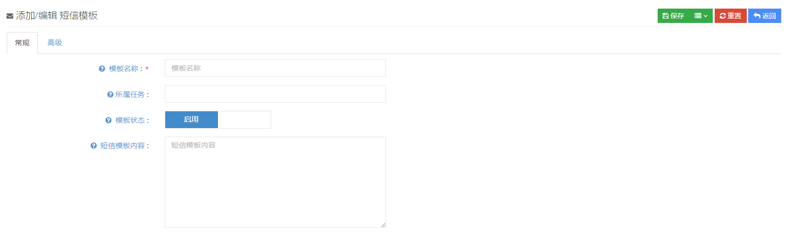

-   **允许修改**：你可以设置此短信模板是否允许修改。

-   **模板注释**：在这里你可以填写模板的注释说明。

③点击保存即可在短信模板列表查看到已保存的短信模板，你也可以在点击【编辑】对已保存的短信模板进行重新编辑，点击【下拉菜单】对保存的短信模板进行删除。

#### 3.9.3 群发信息

用户可以选择对邮件或信息进行群发，一共4个步骤如下：

①步骤1：选择信息类型与目标

-   **信息类型**：用户可以选择群发信息的类型，可以选择邮件、闪信、短信。

-   **目标任务**：选择要进行群发的任务。

-   **销售漏斗**：选择该任务下符合该销售漏斗的客户信息进行群发。

> 在步骤1页面可以选择直接发送短信，点击发送短信填写群发的客户号码，编辑短信内容，但不能选择模板，点击发送即可。

②步骤2：根据步骤1中的设定客户数据条件后点击【继续】选择模板，进行更加个性化的设置

③步骤3：变量匹配，选择需要匹配的变量信息，变量信息即为邮件信息中以##变量##格式出现的信息，双#号中间的变量信息即为选择可以替换的信息。例如名字、性别等。

④步骤4：对邮件群发内容进行预览和确认，请确认步骤3中设置的匹配变量是否正确，如检查无误，点击提交即可。

特别提醒，提交成功并不意味着发送成功。这里，它只表示进入发送队列。发送状态可以在短信发送记录或邮件发送记录中查看。.

#### 3.9.4 短信发送记录

坐席或client用户给客户发送的所有短信记录都可以在此查看，包括发送失败的短信记录也可查看。

【搜索】支持发送号码、接收号码、短信内容进行全局搜索。

【显示/隐藏字段】显示或隐藏该页面的字段。

【请选择】请按条件删除。

【下拉菜单】删除该条短信记录。

【查看】点击查看可以看到该条短信息的具体内容。

#### 3.9.5 邮件发送记录

坐席或client用户给客户发送的所有邮件记录都可以在此查看，包括发送失败的邮件记录也可查看。

【搜索】支持发送号码、接收号码、短信内容进行全局搜索。

【显示/隐藏字段】显示或隐藏该页面的字段。

【请选择】请按条件删除。

【下拉菜单】删除该条短信记录。

【查看】点击查看可以看到该条短信息的具体内容。

#### 3.9.6 公告管理

##### 1 页面介绍

client可以在 **公告** 页面给坐席或是账户用户发送一个公告。账户用户和坐席可以在仪表盘中查看公告。client也可以在仪表盘中查看所发的公告。

【发送公告】发送一个新的公告。

【显示/隐藏字段】选择这个页面需要显示或是隐藏的字段。

【查看】查看这个公告。

在坐席组中添加或移除坐席时，系统会发送默认公告，如下图所示

##### 2 发送一个新的公告

①点击【发送公告】进入添加/编辑公告管理的常规页面：

-   **接收人**：公告的接收人。

-   **公告标题**：这个公告的标题，在仪表盘页面显示的公告的名称。

-   **大屏显示**：该功能需要用户打开大屏监控页面，在大屏监控页面开启时，发送该公告，公告会大屏显示。

    

<!-- -->

-   **弹屏显示**：选择弹屏显示时，接收人在登录该账号时该公告会自动弹出。

    

<!-- -->

-   **有效期**：选择这个公告的有效期限，超过该期限公告不再显示，有限期为0.表示一直有效。

-   **公告内容**:填写这个公告的内容。

#### 3.9.7 通知

##### 1 页面介绍

**通知** 是坐席组长在侧栏的组内对话中发送给坐席组成员的信息，有临时信息和固定信息两种，临时信息失效为30s。信息在组内坐席页面以走马灯的类型出现。

【搜索】全局搜索支持以发送者名字以及内容进行搜索。

【显示隐藏字段】选择这个页面需要显示或是隐藏的字段。

【查看】查看这个通知。里面参数无法更改

##### 2 显示/隐藏字段

-   类型：这个通知的类型。

-   内容：这个通知的内容。

-   坐席组号码：接收这个通知的坐席组的号码。

-   附加参数：该通知为临时还是固定。

-   发送者：这个通知的发送者。

-   创建日期：这个通知的创建日期.

##### 3 添加一个新的通知

**通知** 是由坐席组长操作，client只有查看权限，所以该内容在坐席操作页面讲解。

### 3.10 工单状态

要创建工单，您需要先创建工单状态、工单类别和工单结果，那么让我们从工单状态开始。

#### 3.10.1 工单状态

##### 1 页面介绍

工单的完成状态。方便判断工单的进度。

【搜索】全局搜索支持以工单状态进行搜索。

【添加】添加一个新的工单状态。

【显示/隐藏字段】选择该页面需要显示或是隐藏的字段。

【请选择】按条件删除。

【编辑】编辑这个工单状态。

【下拉菜单】删除该工单状态.

##### 2显示/隐藏字段

-   状态:工单状态的名称。

-   创建时间：工单状态的创建时间。

-   最后更新：该工单状态最后的更新时间。

##### 3 添加一个状态

① 点击【添加】进入添加/编辑工单状态的常规页面：

-   **状态**:工单状态的名称。

-   **是否保留**：为工单设置此状态时，是否保留工单当前所属坐席。

-   **坐席组**：为工单设置此状态时，工单将流转至此坐席组。

-   **是否自动分配**：为工单设置此状态时，工单进入对应坐席组后是否自动分配到在线坐席，如果当前本组没有在线坐席，则跳过自动分配；如果设置了保留坐席，也将跳过自动分配。

#### 3.10.2 工单类别

##### 1 页面介绍

工单类别主要用来标记工单的分类，对工单进行设置。

【搜索】全局搜索支持以工单类别进行搜索。

【添加】添加一个工单类别。

【显示/隐藏字段】选择该页面需要显示或是隐藏的字段。

【请选择】按条件删除。

【编辑】用户可以对已建立的工单类别进行编辑。

【下拉菜单】

***删除***-删除该条工单类别。

***自定义字段*** -添加一个需要的自定义字段，字段类型包括文本框、输入框、日期、链接、邮件、关联字段、自定义。用户可以新增自定义字段也可以对新增后的字段进行编辑或删除。新增时用户可以自定义字段、显示名称、输入类型和该字段是否为必填。设定该自定义字段后，当新增工单时用户在工单类别中选择了增加了自定义字段的类别，新增工单时能够直接填写该新增字段。（坐席新增时同样适用具体可参考坐席页面手册）

自定义字段在坐席页面显示。

##### 2 显示/隐藏字段

-   工单类别：该工单类别的名称。

-   结束状态：该类别工单的结束时应选择的状态。

##### 3 添加一个工单类别

①点击【添加】进入添加/编辑工单类别的常规设置页面：

-   **工单类别**：为这个工单的类别命名。

-   **状态**：选择是都启用该类别的工单。

-   **结束状态**：选定在此设置范围内的工单状态时，工单将转为关闭状态。

-   **是否保留**：创建工单时是否保留当前坐席为工单所有者。注：仅在当前坐席属于本工单类别所设置的坐席组中时生效；如果此项目生效，则会跳过自动分配流程，当不选择该项目且自动分配未分配，该工单提交成功结束后仅有该坐席组组长的组内工单中会有显示。

-   **坐席组**：将该工单指定一个坐席组完成。

-   **是否自动分配**：创建工单时，工单进入对应坐席组后是都自动分配到在线坐席，如果当前本组没有在线坐席，则跳过自动分配。

    在工单的高级设置页面用户可以对该工单添加备注，改备注是方便管理员对该工单类别作用的记录。

②点击保存即可添加成功新的工单类别。

#### 3.10.3 处理结果

##### 1 页面介绍

工单的整个处理的结果，从结果判断该工单是否完成。

【搜索】全局搜索支持以结果命名进行搜索。

【添加】添加一个新的结果。

【显示/隐藏字段】选择这个页面需要显示或是隐藏的字段。

【请选择】按条件删除。

【编辑】对处理结果进行编辑。

【下拉菜单】删除这个处理结果.

##### 2 显示/隐藏字段

-   结果：处理结果的名字。

-   创建日期：这个处理结果的创建日期。

##### 3 添加一个新的处理结果

①点击添加进入处理结果的添加/编辑的常规页面：

-   结果：处理结果的名称。

② 点击保存即可添加成功新的处理结果。

#### 3.10.4 工单

##### 1 页面介绍

**工单** 是根据工作需要提出的工作记录，工单可以由client建立也可以由坐席直接建立。

【搜索】全局搜索支持以工单标题、指定坐席、指定坐席组进行搜索。

【状态】这个工单的状态。

【添加】添加一个工单。

【显示/隐藏字段】选择这个页面需要显示或是隐藏的字段。

【工具】用户可以使用工具导出工单。

【请选择】按条件删除。

【编辑】对这个工单进行编辑。

【下拉菜单】删除这个工单.

##### 2 显示/隐藏字段

-   工单标题：这个工单的标题。

-   工单编号：这个工单的自动生成编号。

-   工单发布者：这个工单的发布人。

-   描述：对该工单的描述。

-   创建日期：该工单的创建日期。

-   最后更新：该工单最后的更新日期.

##### 3 添加一个新的工单

①点击添加进入添加/编辑进入工单常规设置页面：

-   **工单标题**：为这个工单添加一个标题。

-   **工单类别**：为这个工单选择一个类别。

-   **工单状态**：为这个工单选择一个处理状态，非必填，可以在工单分配至坐席后由经办坐席填写。

-   **处理结果**：为这个工单选择一个处理结果，非必填，可以在工单分配至坐席后由经办坐席填写。

-   **描述**:对这个工单添加一个描述。

    在工单页面选择编辑进入编辑页面除在新增工单时的设置，坐席还能看到以下设置：

    

-   **ID**：数据唯一ID。所有建立的数据均有一个唯一ID。

-   **工单编号**：工单建立成功时会自动生成一个工单编号，该号码自动生成无法更改。

-   **指定坐席组**：将该工单指定至坐席组完成，若未指定则该工单对坐席组不可见。

-   **指定坐席**：该工单是否指定了坐席处理，若未指定，则该工单完成后仅有该坐席组组长的组内工单中会有显示。

-   **创建日期**：该工单的创建日期。

-   **最后更新日期**：最后一次对工单改动的时间。

②点击保存即可添加成功新的工单。

坐席可以在仪表板中查看未完成的工单 --&gt; 在中间查看未完成的工作订单

坐席可以查看分配给他们的未完成工单、不同状态的工单，如果他们是坐席组长，他们还可以看到组内的工单.

当工单状态和工单类别同时开启自动分配功能时，

如果工单状态和工单类别绑定同一坐席组，创建工单会分配给该组在线坐席

如果工单状态和工单类别绑定不通坐席组，创建工单会分配给状态绑定坐席组中的在线坐席

如果创建的工单没有指定状态，则会分配给类别绑定坐席组中的在线坐席.

### 3.11 待办事项

#### 3.11.1 坐席待办

##### 1 页面介绍

**坐席待办** 由client设置的需要坐席办理的事项发布，该事项只能由client编辑，坐席处理完成可以在坐席页面进行标记，最后的完成状态需要client来进行。

【搜索】全局搜索支持以坐席待办的标题来搜索。

【添加】添加一个新的坐席待办。

【显示/隐藏字段】选择这个页面需要显示或是隐藏的字段。

【编辑】编辑已建立的坐席待办。

【下拉菜单】删除这条坐席待办

##### 2 显示/隐藏字段

-   标题：坐席待办的标题。

-   预约时间：坐席待办的预约时间。

-   备注：坐席待办的备注。

-   状态：这个坐席待办的处理状态。

-   所属坐席：创立这个坐席待办的人.

##### 3 添加一个新的坐席待办

①点击添加进入添加/编辑坐席待办的常规页面：

-   **标题**:坐席待办事项标题。

-   **预约时间**:这个待办的预约时间，会在坐席的仪表盘页面显示。

-   **状态**：用户可以对该待办事项的状态进行更改，坐席建立的待办如果被坐席标记成完成，则在client页面中的状态也会随之更改。

-   **所属坐席**：待办事项所属的坐席。

-   **备注**:该坐席待办需要特殊注意或说明的备注

②点击保存即可添加成功新的坐席待办。

### 3.12 统计

在坐席报表中用户可以查看包括坐席报表、坐席汇总、坐席组明细、坐席组汇总、部门报表在内的统计报表，用户选择坐席后可以点击搜索，搜索该坐席的报表。用户可以选择需要显示的字段，点击查看字段即可。用户也可以对坐席明细数据进行下载，点击下载即可。

#### 3.12.1 统计报表

**统计报表** 分为坐席明细、坐席汇总、坐席组明细、坐席组汇总和部门报表五项，对数据机型统计汇总和下载。

##### 1坐席明细

坐席明细主要统计坐席在任务中所产生的数据进行统计，用户可以选择一个坐席不选择任务查看该坐席在所有任务中的统计数据，也可以选择一个坐席查看该坐席在选定任务中的统计数据。

【选择坐席】选择查看的坐席。

【任务】选择查看该坐席在选定的任务中统计明细。

【日期】选择查看该坐席的统计明细的日期或时间或总计的范围。

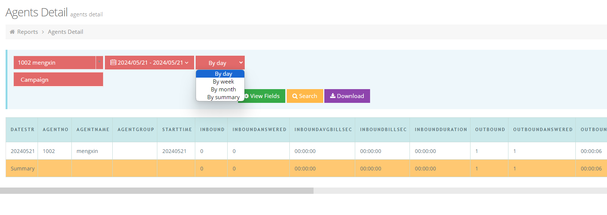

【查看字段】选择查询显示的字段数据。

-   统计日期：该统计数据的所属日期。

-   坐席工号：这个坐席的工号。

-   姓名：该统计所属坐席的姓名。

-   坐席组：该坐席所属坐席组。

-   开始时间：该统计开始的日期。

-   呼入总量：该坐席接到的呼入总量。

-   呼入平均通话时长：该坐席接到呼入电话时的平均通话时长。

-   呼入通话总时长：该坐席接到呼入电话时的总通话时长。

-   呼入总时长：呼入电话的总数量。

-   呼出总量：该坐席呼出电话的总量（不包含预拨号）。

-   呼出接通量：呼出通话被接听的数量（不包含预拨号）。

-   呼出平均通话时长：该坐席呼出时通话的平均时长。

-   呼出总时长：该坐席呼出电话时的总通话时长。

-   保持次数：该坐席通话时的总保持次数。

-   保持时长：该坐席通话时的总保持状态时长，

-   平均保持时长：该坐席通话时的平均保持状态时长。（保持时间/次数，向下取值。示例：7/2=3.5，以3秒为单位）

【搜索】根据需求完成以上条件设定后搜索该坐席的统计明细。

【下载】根据需求完成以上条件设定后下载该坐席的统计明细.

##### 2 坐席汇总

坐席汇总主要统计坐席在组内的数据汇总，用户在坐席汇总页面可以根据坐席组坐席以及任务对数据进行查看。

【日期】选择查看坐席汇总的日期或时间范围。

【坐席组】选择查看坐席所在的坐席组。

【坐席】选择查看的坐席。

【任务】选择查看该坐席在选定的任务中汇总。

【查看字段】选择查询显示的字段。

-   统计日期：坐席的统计日期。

-   坐席组：该坐席所属的坐席组。

-   坐席工号：统计坐席的工号。

-   姓名：该坐席的名字。

-   签入时长：该被统计坐席的签入时长。

-   接通电话数：该坐席接通电话的数量。

-   成单：该坐席保存的销售漏斗分值大于零。

-   失败提交：该坐席保存销售漏斗分值小于零。

-   继续跟踪：该坐席保存销售漏斗分值等于零。

-   质检不合格单：该坐席在任务中的质检不合格的名单。

-   质检合格单：该坐席在任务中的质检合格的名单，

-   队列暂停时长：该坐席在队列中暂停时长。

-   队列暂停次数：该坐席在队列暂停的次数。

-   保持次数：该坐席的通话保持次数。

-   保持时长：该坐席的通话保持状态的时长。

-   平均保持时长：该坐席通话保持状态的平均时长。

-   抢接数：该坐席的抢接次数。

-   呼叫坐席数：该坐席被呼叫的次数。

-   坐席接通数：该坐席被呼叫后接通的数量。

-   接通率：该坐席的接通率。

-   拨打时长：该坐席的拨打时长振铃+接通电话的时间。

-   通话时长：该坐席的所有通话时间。

-   话后时长：该坐席进入话后的时长。

-   签入时长：该坐席的签入时间。

-   工作时长：通话和话后处理时间的总和。

-   暂停合计：该坐席的合计暂停时间。

【搜索】根据需求完成以上条件设定后 **搜索** 坐席汇总。

【下载】根据需求完成以上条件设定后 **下载** 坐席汇总.

##### 3 坐席组明细

**坐席组明细** 是方便用户查看每个坐席组和该组内任务的统计数据，用户选择坐席组后可以查看该坐席组在所有任务下的统计数据，用户也可以直接选择想要查看的该坐席组和任务，查看该任务下坐席组的统计数据。（用户可以同时查看多个坐席组在多个任务下的统计数据）

【日期】选择查看坐席组明细的日期或时间范围。

【坐席组】选择查看的坐席组，可以选择一个或多个坐席组。

【任务】选择查看该坐席组在选定的任务中明细，可以选择一个或多个任务。

【查看字段】选择查询显示的字段。

-   统计日期：用户需要查看的统计日期。

-   任务：该统计数据所在的任务名称。

-   坐席组：该统计数据所属坐席组。

-   开始时间：坐席开始统计的时间。

-   呼入总量：所统计坐席组的呼入总量。

-   呼入接通量：所统计坐席组的呼入接通总量。

-   呼入接通率：所统计坐席组的接通率。

-   呼入平均通话时长：所统计坐席组的平均通话时长。

-   呼入通话总时长：呼入该坐席组的通话的总时长。

-   呼出总量：所统计坐席组的呼出总量。

-   呼出接通量：所统计坐席组的接通量。

-   呼出接通率：所统计坐席组的接通率。

-   呼出客户平均振铃时长：呼出时客户的平均振铃时长。

-   呼出平均通话时长：所统计坐席组的呼出平均通话时长。

-   呼出通话总时长：所统计坐席组的呼出通话总时长。

-   保持次数：所统计坐席组的通话保持总次数。

-   保持时长：所统计坐席组的通话保持总时长。

-   平均保持时长：所统计坐席组的通话保持平均保持时长。

    【搜索】根据需求完成以上条件设定后 **搜索** 坐席组的统计明细。

【下载】根据需求完成以上条件设定后 **下载** 坐席组的统计明细.

##### 4 坐席组汇总

坐席组汇总主要统计坐席组的数据汇总，用户在坐席组汇总页面可以根据日期即日期范围对数据进行查看。

【日期】选择查看坐席组明细的日期或时间范围。

【坐席组】选择查看的坐席组，可以选择一个或多个坐席组。

【查看字段】选择查询显示的字段。

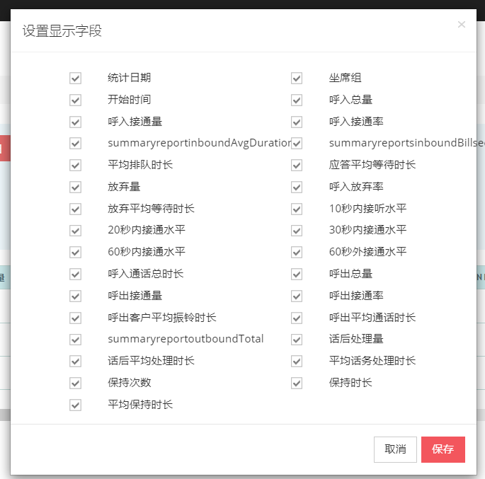

-   统计日期：该坐席组数据的统计日期。

-   坐席组：被统计的坐席组。

-   开始时间：该坐席组被统计的开始时间。

-   呼入总量：该坐席组接到呼入的总数量。

-   呼入接通量：该坐席组接通呼入的总数量。

-   呼入接通率：该坐席组的呼入接通率。

-   呼入平均通话时长：该坐席组接通呼入电话时的平均通话时长。

-   呼入坐席平均振铃时长：该坐席组的坐席接通呼入通话之前的平均振铃时长。

-   平均排队时长：客户呼入到系统中的平均排队时长。

-   应答平均等待时长：该坐席组中坐席应答通话的客户平均等待时长。

-   放弃量：该坐席组对于呼入通话未应答的个数。
  
-   呼入放弃率：该坐席组的呼入放弃率。  
  
-   放弃平均等待时长：该坐席组的未应答通话的平均等待时间。

-   10秒内接听水平：该坐席组中坐席在10秒内接听电话的个数。

-   20秒内接通水平：该坐席组中坐席在20秒内接听电话的个数.

-   30秒内接通水平：该坐席组中坐席在30秒内接听电话的个数。

-   60秒内接通水平：该坐席组中坐席在60秒内接听电话的个数。

-   60秒外接通水平：该坐席组中坐席在60秒外接听电话的个数。

-   呼入通话总时长：呼入该坐席组的通话的总时长。

-   呼出总量：该坐席组的呼出总量。

-   呼出接通量：该坐席组呼出通话的接通个数。

-   呼出接通率：该坐席组呼出通话的接通率。

-   呼出客户平均振铃时长：该坐席组呼出后客户应答的平均振铃时长。

-   呼出平均通话时长：该坐席组呼出的平均通话时长。

-   呼出通话总时长：该坐席组的通话总时长。

-   话后处理量：该坐席组在话后状态的数量。

-   话后平均处理时长：该坐席组坐席在话后状态的平均时长。

-   平均话务处理时长：该坐席组坐席的平均话务处理时长。

-   保持次数：该坐席组坐席通话保持次数。

-   保持时长：该坐席组坐席通话保持总时长。

-   平均保持时长：该坐席组坐席通话平均保持时长。

【搜索】根据需求完成以上条件设定后 **搜索** 坐席组汇总。

【下载】根据需求完成以上条件设定后 **下载** 坐席组汇总。

##### 5 部门报表

在部门报表页面，用户可以选择一个日期范围，选择想要查看的部门，点击搜索进行查看，此外，用户还可以选择该部门想要查看的坐席数据或是该部门的通话时长查看报表内容。

【日期】选择查看部门报表的日期或时间范围。

【部门】选择查看的部门

【坐席】选择该部门下的坐席。

【外呼接通总时长】选择查看的部门外呼接通的总时长。

【查看字段】选择查询显示的字段。

-   统计日期：该部门报表的统计日期。

-   姓名：该部门报表统计数据的坐席名。

-   坐席工号：该部门报表统计数据的坐席工号。

-   外出总量：该部门的呼出通话的总数量。

-   外呼接通量：该部门报表所统计坐席呼出通话的接通量。

-   外呼总时长：该部门报表所统计坐席呼出通话的总时长，

-   外呼总接通量：该部门报表所统计坐席呼出通话的总接通量。

-   保持次数：该部门报表所统计坐席的保持次数。

-   保持时长：该部门报表所统计坐席的保持时长。

-   平均保持时长：该部门报表所统计坐席的平均保持时长。

【搜索】根据需求完成以上条件设定后 **搜索** 部门报表。

【下载】根据需求完成以上条件设定后 **下载** 部门报表。

### 3.13 监控管理

#### 3.13.1 实时监控

在实时监控页面，用户可以看到座位组和座位、座位或座位组的实时动态，以及涉及的百分比信息。内部线路和转接呼叫也不会显示在实时监控页面上。

##### 1 坐席组坐席

用户在实时监控页面可以看到坐席组和坐席、坐席或坐席组的实时动态，以及所涉及的百分比信息。

坐席组坐席：进入该页面用户可以输入一个或多个想要监控的坐席组进行提交查看。

-   红框中显示这个组中所有坐席的状态情况。

**签入**：显示在这个坐席组中签入的坐席数。

**空闲**：在这个坐席组中状态为空闲的坐席。

**话后**：在这个坐席组中状态为话后的坐席。

**暂停**：坐席选择暂停或是在队列里设置了自动暂停时，坐席未应答暂停会显示暂停：未应答.

**振铃**：呼入或呼出时，通话没被接通均显示振铃。

**通话**：
呼入到坐席组，预拨号呼出，联系客户页面双呼接通时，实时监控页面会显示通话。如果坐席签入这个坐席组但是不是经上述方式进入通话状态，此时，页面会显示忙碌中。

**保持**: 队列通话时保持/非队列通话的保持不会显示.

**排队人数**: 这个队列客户等待的人数。

-   **坐席排序**

坐席状态正序：话后状态&gt;通话状态&gt;保持状态&gt;暂停&gt;空闲&gt;振铃

坐席状态倒序：振铃&gt;空闲&gt;暂停&gt;保持&gt;通话l&gt;话后状态

坐席工号正序：坐席工号由小到大排序。

坐席工号倒序：坐席工号由大到小排序。

优先级正序：坐席的优先级从小到大。

优先级倒序：坐席的优先级从大到小。

**坐席**：实时监控坐席，点击下拉菜单对坐席实现如下操作;

*以此坐席身份登录* -登录到此坐席。

签出 - 把这个坐席从坐席组里签出。

置忙 - 将这个坐席的状态更改为忙。

监听 - 监控指定席位与客户之间的通话。

强插 -
在座席通话过程中，强行干预通话，客户和座席都能听到您的声音，与三方通话效果相同。

密语 -
在坐席通话期间，在与坐席通信时，客户听不到拨号者的声音，只有座席能听到。

挂断 - 结束这个坐席的通话状态。

-   **状态**：这个坐席的当前状态。

-   **优先级**：这个坐席的优先级。

-   **呼入**：这个坐席在这个坐席组中被呼入的总数。

-   **呼出**：这个坐席在坐席组中呼出的总数。

-   **主叫号码**：呼入或呼出的主叫号码。

-   **时长**：

    登入时长- 最后一次签入坐席组到现在的时长。

    距上次通话时间- 距离上一次坐席签入的通话时间。

紫色框中显示的坐席状态可由用户在 显示字段按钮的下拉菜单中进行调整。

如果有来电但没有坐席应答，页面会弹出绿色的呼叫队列提示消息框.

##### 2 坐席组

点击坐席组页面可以看到坐席组的实时信息

呼入

合计: 呼入到这个坐席组中，坐席振铃或接通+1。

应答:呼入到这个坐席组中，坐席应答+1。

时长:呼入到这个坐席组中，坐席应答的通话时长。

呼出

合计: 从这个坐席组中呼出，坐席振铃或接通+1。

应答: 从这个坐席组中呼出，通话被应答+1。

时长:从这个坐席组呼出，应答的通话时长。

放弃：呼入到队列的通话没有被接通的数量。

排队人数：在队列中等待的通话数量。

签入：显示在这个坐席组中签入的坐席数。

空闲：在这个坐席组中状态为空闲的坐席。

暂停：在这个坐席组中状态暂停或队列暂停的坐席。

话后：在这个坐席组中状态为话后的坐席。

振铃：呼入或呼出时，通话没被接通均显示振铃。

通话：在该坐席组中通话的坐席。

服务水平：呼入到队列的通话在多少秒内被接通，≤10S

用户也可以切换视图

##### 3 坐席

点击坐席页面可以看到坐席的实时信息。

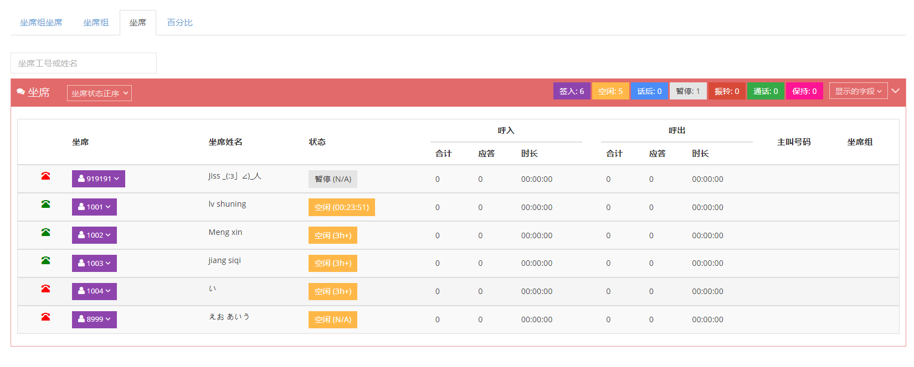

##### 4 百分比

如果坐席通话次数较多，可以直接切换到百分比模式（内部通话和转接通话不以百分比显示）

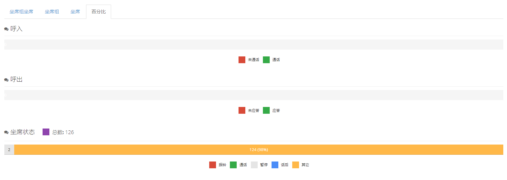

#### 3.13.2 大屏监控

大屏监控能够实时看到所有坐席的状态闪烁，用户可以选择全屏或简洁模式观看。用户点击坐席状态后可以以该坐席登录或是将该坐席置闲，同事也能看到该坐席的签入情况。该坐席的呼入、漏话、呼出、应答情况也可以直接查看。

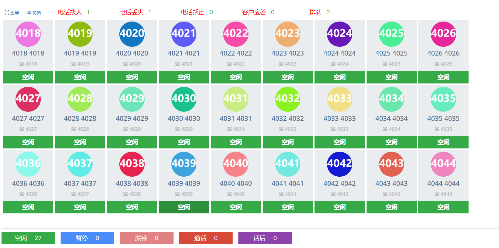

全屏:

简洁:

点击空闲，对坐席可以进行操作

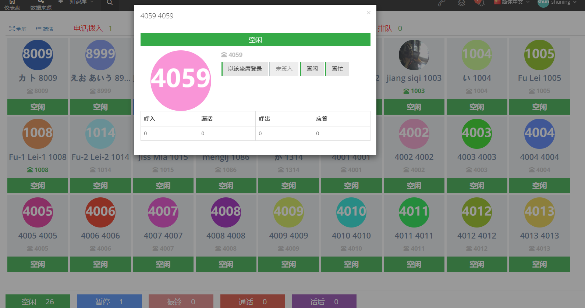

### 3.14 日志记录

#### 3.14.1 日志记录

##### 1 页面介绍

记录系统用户行为日志，系统中的默认保留期为30天。客户端及以上用户可以在此处查询和下载某个座位在特定时间和时刻的通话记录和客户数据。

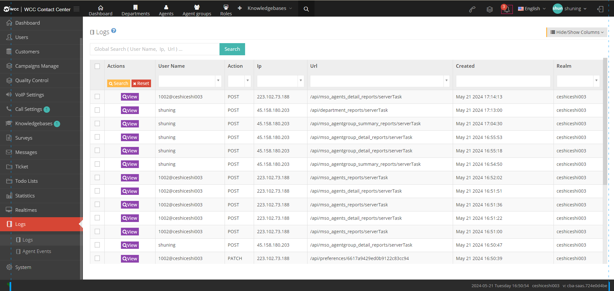

【搜索】日志记录支持以用户名、IP地址、请求地址作为搜索对象。

【显示/隐藏字段】选择这个页面需要显示或是隐藏的字段。

【查看】产看该日记的详情
 
#####  显示/隐藏字段

-   用户名：当前操作用户名称。

-   动作：当前用户的操作类型。

-   IP地址：当前用户所在的IP地址。

-   请求地址：当前用户的请求地址。

-   请求参数：当前用户操作的请求参数。

-   令牌：

-   创建日期：该日志的创建日期.

#### 3.14.2 坐席事件

##### 1 页面介绍

用于查询坐席事件日志。

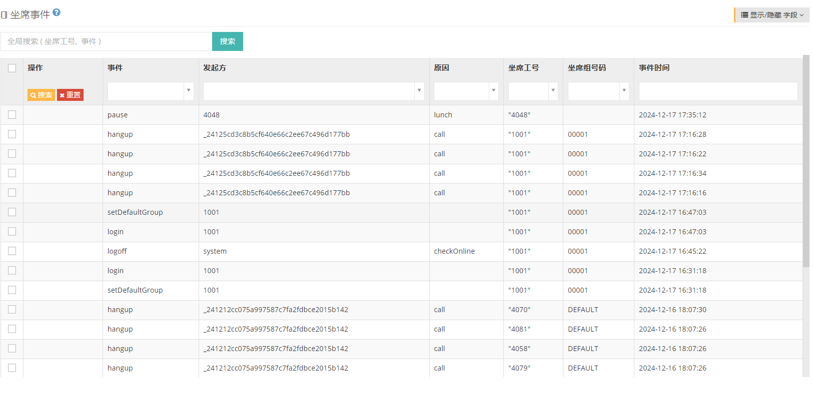

【搜索】支持以坐席工号、事件为搜索对象。

【显示/隐藏字段】选择这个页面需要显示或是隐藏的字段。

##### 2 显示/隐藏字段

-   事件：坐席发生的事件。

-   发起方：事件的发起方。

-   原因：事件的原因，如拨号,显示call。

-   坐席工号：发生该事件的坐席工号。

-   坐席组号码：发生该事件所属的坐席组号码。

-   事件时间：该事件发生的时间.

### 3.15 系统

#### 3.15.1 系统偏好

##### 1 常规

-   **时区**:该系统的时区。

-   **语言**:该语言指的是话机播放的语言，目前支持中文、日语、英文。

-   **国家**:该系统使用国家。

-   **区号**:该系统的区号。

-   **日期格式模式**：精确-可以设置日期的格式以及时间的格式。友好-系统直接默认的格式。

-   **时长格式**：可以选择时分秒也可以选择以秒计算时长。

-   **号码格式**：选择一个号码的格式。

-   **称呼格式**：选择习惯的称呼格式。

-   **预约提醒时间**：坐席预约、工单预约的提前通知的时间范围。

-   **自动绑定分机**：自动为坐席分配sip。

> 勾选 \[自动绑定分机\] 后，选择 \[默认话机部署模板\]

-   **IP访问白名单**：填写IP绑定白名单，只有白名单的用户才有权限访问。

##### 2 货币

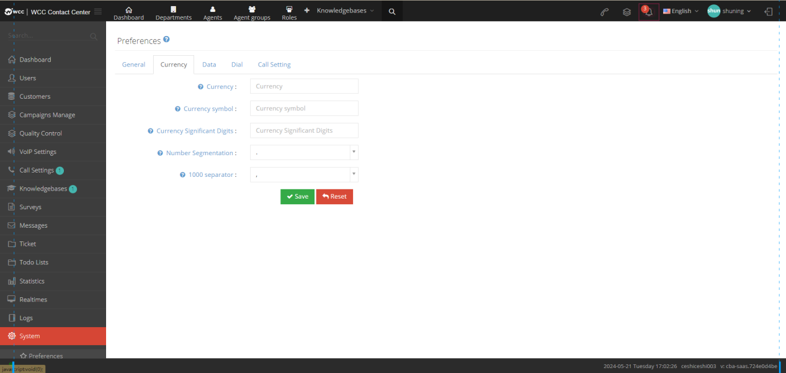

-   **货币**：使货币种类。

-   **货币符号**：货币的符号。

-   **货币小数点**：货币的小数点。

-   **数字分隔符**：数字分隔符。

-   **千位分隔符**：千位分隔符

##### 3 数据

-   **默认客户包:**系统默认呼入呼出时，使用的客户包。当前使用的具体客户包别设定不可见后，默认客户包将自动恢复为默认。

-   **导出文件编码**：设置导出文件的编码。

-   **导出单文件最大行数**：导出文件的最大行数.

##### 4 拨号

-   **拨打外线超时（秒）**：外呼振铃的超时时长。

-   **拨打分机超时（秒）**：拨打分机时振铃的超时时长。

-   **盲转振铃超时时长（秒）**：未咨询其他坐席直接将通话转给该坐席的最大超时时长。

-   **盲转未接通回呼**：盲转给其他坐席未接通后又回呼到盲转前坐席。

-   **盲转回呼主叫名称前缀**：设置盲转回呼的主叫名称前缀。

-   **默认等待音乐**：默认使用接通前的等待音乐。

-   **默认外呼档案**：
    当坐席没有指定外呼档案时，呼叫时将使用默认外呼档案，如果没有设定外呼档案，将会使用系统默认的外呼档案。.

##### 5呼叫设置

-   **外显号码轮询**：外显号码轮询功能可以帮助你自动更换外显号码，例如1表示每一天更换一个号码，0表示每次通话都会使用一个新的号码，此功能适用于外呼接口，坐席外呼或者外呼任务。

-   **外显号码**：选择显示的主叫号码。

-   **黑名单**：选择黑名单呼叫的转向.

#### 3.15.2 销售漏斗

##### 1 页面介绍

用于记录坐席记录的客户通话状态。如果销售漏斗大于0，则会在提交成功的位置进行记录。

上图【默认】是可选择的客户包。

【新增】新增一个销售漏斗。

【显示/隐藏字段】选择这个页面需要显示或是隐藏的字段。

【编辑】编辑已建立好的销售漏斗.

##### 2 显示/隐藏字段

-   名称：销售漏斗的名称。

-   分值：设定的这个销售漏斗的分值。

-   创建日期：该销售漏斗的创建时间。

-   最后更新：该销售漏斗的最后更新时间.

##### 3 添加销售漏斗

①点击【添加】按钮，进入销售漏斗添加/编辑常规界面：

-   **名称**：为这个销售漏斗命名。

-   **分值**：设置这个销售漏斗的分值，分值可体现坐席的工作情况。

-   **状态**：销售漏斗的状态。

    ***启用***-正常显示

    ***隐藏***-坐席不可见

    ***关闭***-系统不可见

<!-- -->

-   **客户包**：选择该销售漏斗生效的客户包

#### 3.15.3 后台任务

##### 1 页面介绍

后台任务是允许在系统的程序任务，通常是属于耗时的任务，比如导入或是导出数据。页面默认显示的事正在进行中的任务，需要查看或搜索过往和现在全部的后台任务需要点击全部任务。

【搜索】在全局搜索中支持以任务编号、文件名称为关键词搜索。

【显示/隐藏字段】选择这个页面需要显示或是隐藏的字段。

【全部任务】正在进行以及过往的后台任务。

【请选择】按选择条件删除。

【删除】删除这个任务。

【下载】下载这个任务。（仅导入的用户可以下载该文件，其他用户则不能下载）

【下拉菜单】删除这条后台任务。

##### 2 显示/隐藏字段

-   任务编号：该任务的编号。

-   任务类型：该任务的呼叫类型。

-   页面：生成该任务的页面。

-   服务器名称：生成该任务的服务器。

-   文件名称：该后台任务的文件名称。

-   状态：该后台任务的状态。

-   任务选项：系统的程序任务类型。

-   总计：该后台任务发生的总数量。

-   进行数：该后台任务正在进行的数量。

-   成功数：该任务的成功数量。

-   失败数：该任务的失败数量。

-   创建人：该后台任务的发起人。

-   创建日期：该后台任务的创建日期。

-   结束日期：该后台任务的结束日期。

-   导出失败原因：比如导出数据会显示导出失败的原因

#### 3.15.4 接口配置

##### 1 api验证串

-   **api验证串**：填写api验证串。

-   **自定义呼叫记录**: 是否允许自定义呼叫记录。

-   **IP访问白名单**：可访问的白名单IP地址。填写白名单地址后，只有白名单上的IP地址才能通过账号密码登录此客户端。

##### 2 API 限制

-   **短信**：设置短信的限制数量。

-   **通知**：设置通知的限制数量。

-   **获取数据**：设置获取数据的限制数量。

-   **点击呼叫**：设置点击呼叫的限制数量。

#### 3.15.5 公司信息

用户可以填写自己的公司信息和财务信息。

