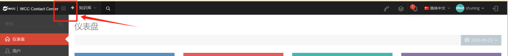
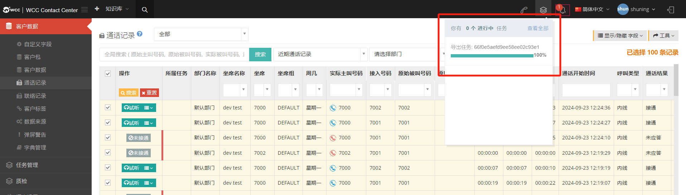
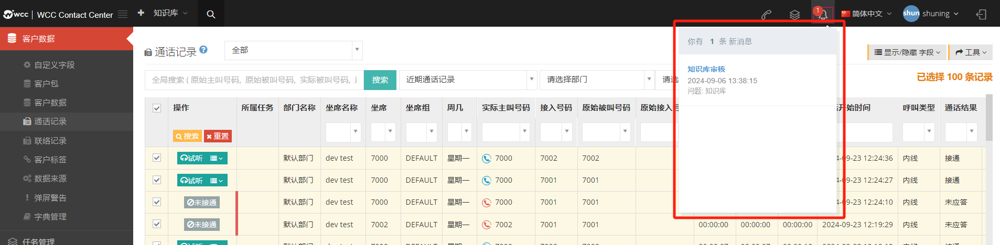
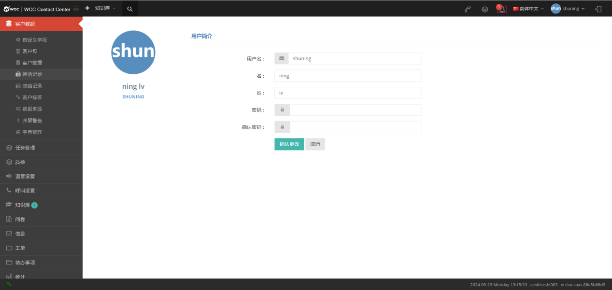
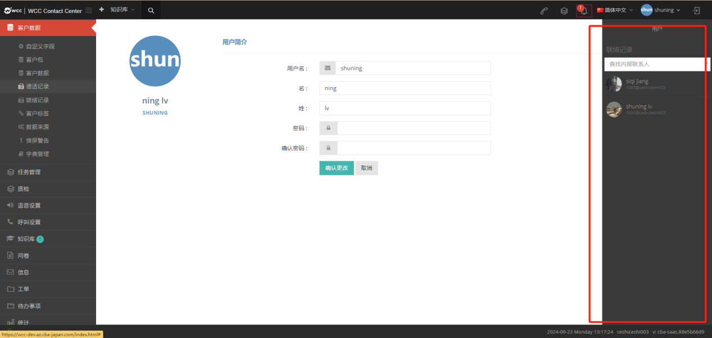
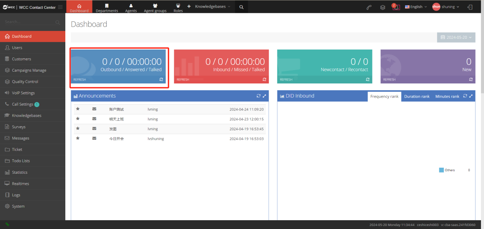
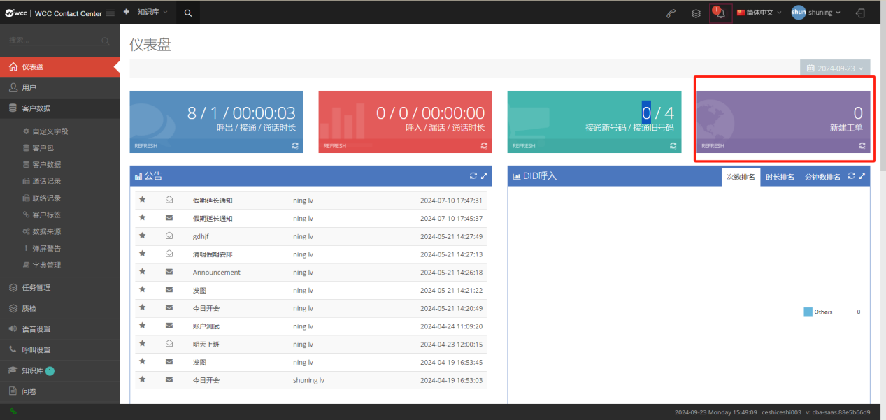
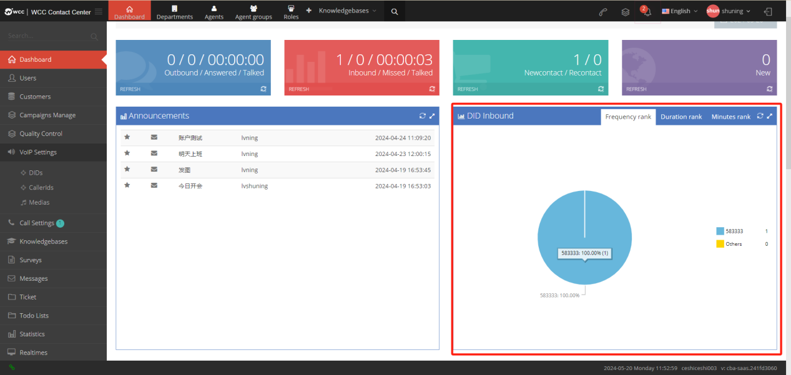
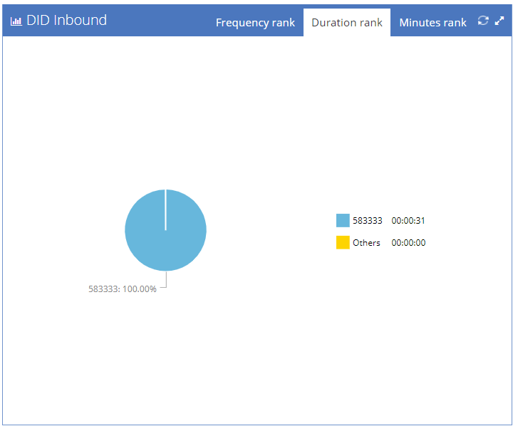

## 2 工具栏
### 2.1工具栏概述

成功登录 WCC 客户端后，页面顶部将显示快捷工具栏，聚合了系统核心功能入口、状态提示及个性化设置选项。通过工具栏可快速访问常用功能、查看关键信息，大幅提升操作效率，无需在多级菜单中反复切换。

### 2.2核心功能模块说明

#### 2.2.1  菜单折叠 / 展开

- 功能作用：灵活调整页面布局，隐藏菜单文本仅显示图标，释放更多操作空间；再次点击可恢复文本显示。

- 操作方式：点击工具栏中的【折叠菜单】按钮（图标标识），即可切换菜单显示状态。

↓↓↓

↓↓↓

#### 2.2.2 快速搜索

- 功能作用：直接检索知识库中的相关知识，无需进入知识库主页即可快速获取所需信息。

- 操作方式：点击工具栏【快速搜索】按钮（带 “搜索” 图标或 “知识库 Q” 标识），在弹出的搜索框中输入关键字，系统将实时匹配相关知识库内容。

- 注意事项：若搜索结果显示 “无知识库”，说明当前账号权限下暂无可用知识库资源，可联系管理员确认权限或补充知识库内容。

#### 2.2.3 呼叫功能

- 功能作用：在客户端直接发起指定呼叫，支持自定义主叫、被叫号码及外显号码。

- 操作步骤：
点击工具栏【呼叫】按钮，打开呼叫设置窗口；

- 按要求填写信息：

     1. 主叫号码：填写坐席专属号码；

     2. 被叫号码：填写需外呼的目标号码；

     3. 外显号码：从下拉选项中选择对外展示的号码；

 信息核对无误后，点击【呼叫】按钮发起通话；若需取消，点击【取消】按钮即可。

#### 2.2.4 任务进度查看

- 功能作用：实时展示导入、导出等后台任务的处理进度，便于跟踪任务状态。

- 操作说明：当存在进行中或已完成的导入 / 导出任务时，工具栏对应区域会显示任务名称、进度百分比（如 “100%”）及相关统计数据（如 “已选择 100 条记录”）；点击可查看任务详情或导出结果。

- 状态提示：显示 “你有 0 个进行中任务” 时，说明当前无后台任务执行。

#### 2.2.5 消息提示

- 功能作用：集中展示系统通知、公告、知识库审核结果等重要消息，避免遗漏关键信息。

- 操作说明：当有新消息时，工具栏对应区域会显示提示（如 “你有 1 条新消息”）；点击消息提示区域，即可查看消息详情（如公告内容、审核结果通知）。

#### 2.2.6 语言切换

- 功能作用：自定义系统显示语言，适配不同用户的使用习惯。

- 操作步骤：
 
   1. 点击工具栏中的语言选择按钮（默认显示 “简体中文”）；

   2. 从下拉菜单中选择目标语言（支持 English、日本语等，以系统实际提供为准）；

   3. 切换完成后，刷新页面即可生效；后续登录将默认遵循本次设置的语言。

#### 2.2.7 个人中心相关

【client】单击此处查看客户的个人资料、公告和登录足迹（如果您是从高级登录者登录）

【我的档案】客户可以在此处修改他们的账户信息，包括用户名。

【聊天页面】client可以搜索坐席并与坐席聊天，有聊天记录的坐席可以直接显示在对话框栏中。

【用户】

1.  显示最近的联系人的姓名。

2.  Client在输入框中输入要发送的文本消息。

3.  单击获取消息历史记录 以查看以前与坐席的聊天。

4.  Client在输入框中输入短信发送。

5.  点击图【片发送】发送图片，图片格式目前支持JPG、PNG、JPEG。图片大小不得超过 2MB。

    点击【返回】，返回对话列表。

    

    
    
    

    【仪表盘】

仪表板显示代理呼叫的传入和传出统计信息。

Client用户可以在控制面板上查看统计信息; 呼出 / 接通 / 通话时长; 呼入 / 漏话 / 通话时长; 

接通新号码 /接通旧号码; 新建工单; 公告; DID 呼入; 主叫地区; 被叫地区; 设置参数 。

### 2.1 呼出 /接通/通话时长

**呼出**:该client当天呼出的电话总数。

**接通**:此client当天呼出通话的接通次数。

**通话时长:** client当天呼出接通的时间长度。

### 2.2呼入/ 漏话 /通话时长

**呼入**:该client当日呼入通话的次数。

**漏话**:当日呼入到该client的通话，但是没有被接通。

**通话时长**: 当日呼入到该client的接通通话时长。

### 2.3接通新号码/ 接通旧号码

**接通新号码**:首次呼入该client并被接通的号码。

**接通旧号码**:系统已保存或删除的号码将在拨打并接通后显示为旧号码。

### 2.4 新建工单

同一天创建的所有工单，包括在客户端级工单页面上创建的工单和在客户配置文件页面上创建的工单。只有当天的记录将在第二天重置。

### 2.5 公告 

Client及其坐席创建的所有公告将累积显示。

### 2.6 did 呼入

did呼入次数所占百分比的饼状图。  

次数、时长、分钟数的饼状图会先显示 DID 名称，没有名字则显示数字。

1.频率排名：统计 DID 号码的来电次数，所有打到 DID 的号码都会被统计（来电接通/未接通），每个来电在 DID 号码后 +1。  

2.时长排名：计算 DID 号码来电的通话时长，以分钟为单位显示，计数范围如下：

1）**DID 转IVR，按钮转接给坐席**：呼入时间将计入总通话时长，无论是否点击按钮转接，也无论坐席是否接通。

2）**DID 转语音播报，再转给坐席**：呼入时间将计入总通话时长，无论坐席是否接通，总通话时长都计算在内。

3）**DID 转接坐席组**：呼入时间将计入总通话时长，无论坐席是否接通，总通话时长都计算在内。

4）**DID 转振铃组**：只有坐席接通后，才会计算通话时长。

5）**DID 转条件，再转接给坐席**:只有坐席接通后，才会计算通话时长。

6）**DID 转接坐席**:只有坐席接通后，才会计算通话时长。

7）**DID 转外号码**：只有外线号码接通时，才会计算通话时长。

8）**DID 转挂断**：不计算在内。 

3.分钟数排名：计算呼入到该did号码下的呼入应答数，每呼入并接通一通电话就会在该did号码后+1，呼入到坐席组、语音播报和ivr语音菜单，呼入不接通也会计数。

1）**DID 转接 IVR，按键转接给坐席**：呼入会 +1。

2）**DID 转到语音播报，然后转接给坐席**：呼入会 +1。

3）**DID 转接到坐席组**：呼入会 +1。

4）**DID转接到振铃组**：坐席接通+1，未接通不会计算。

5）**DID转条件后转给坐席**：坐席接通+1，未接通不会计算。

6）**DID转坐席**：坐席接通+1，未接通不会计算。

7）**DID转外线号码**：坐席接通+1，未接通不会计算。

8）**DID转向挂断**:不计算在内。

