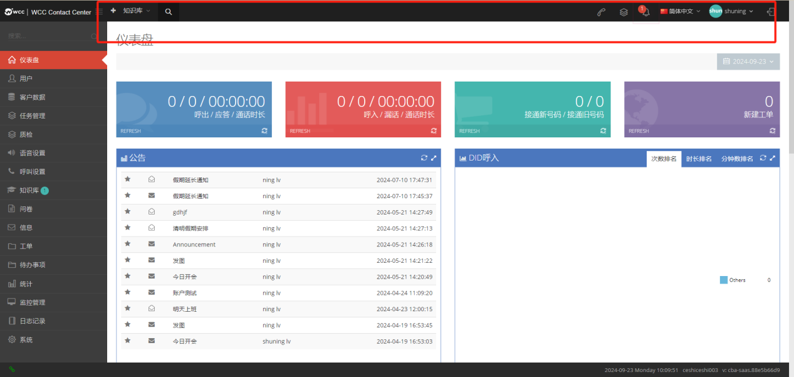
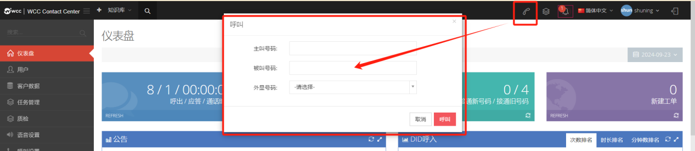
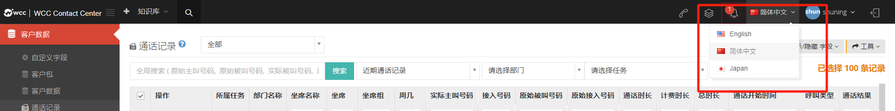
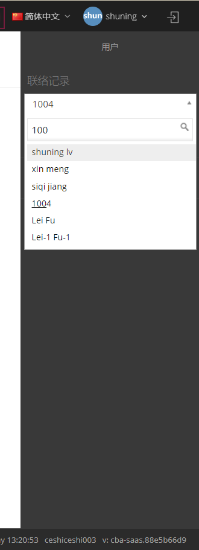

## 2 工具栏
### 2.1工具栏概述

成功登录 WCC 客户端后，页面顶部将显示快捷工具栏，聚合了系统核心功能入口、状态提示及个性化设置选项。通过工具栏可快速访问常用功能、查看关键信息，大幅提升操作效率，无需在多级菜单中反复切换。

### 2.2核心功能模块说明

#### 2.2.1  菜单折叠 / 展开

- 功能作用：灵活调整页面布局，隐藏菜单文本仅显示图标，释放更多操作空间；再次点击可恢复文本显示。

- 操作方式：点击工具栏中的【折叠菜单】按钮（图标标识），即可切换菜单显示状态。

↓↓↓

↓↓↓

#### 2.2.2 快速搜索

- 功能作用：直接检索知识库中的相关知识，无需进入知识库主页即可快速获取所需信息。

- 操作方式：点击工具栏【快速搜索】按钮（带 “搜索” 图标或 “知识库 Q” 标识），在弹出的搜索框中输入关键字，系统将实时匹配相关知识库内容。

- 注意事项：若搜索结果显示 “无知识库”，说明当前账号权限下暂无可用知识库资源，可联系管理员确认权限或补充知识库内容。

#### 2.2.3 呼叫功能

- 功能作用：在客户端直接发起指定呼叫，支持自定义主叫、被叫号码及外显号码。

- 操作步骤：
点击工具栏【呼叫】按钮，打开呼叫设置窗口；

- 按要求填写信息：

     1. 主叫号码：填写坐席专属号码；

     2. 被叫号码：填写需外呼的目标号码；

     3. 外显号码：从下拉选项中选择对外展示的号码；

 信息核对无误后，点击【呼叫】按钮发起通话；若需取消，点击【取消】按钮即可。

#### 2.2.4 任务进度查看

- 功能作用：实时展示导入、导出等后台任务的处理进度，便于跟踪任务状态。

- 操作说明：当存在进行中或已完成的导入 / 导出任务时，工具栏对应区域会显示任务名称、进度百分比（如 “100%”）及相关统计数据（如 “已选择 100 条记录”）；点击可查看任务详情或导出结果。

- 状态提示：显示 “你有 0 个进行中任务” 时，说明当前无后台任务执行。

#### 2.2.5 消息提示

- 功能作用：集中展示系统通知、公告、知识库审核结果等重要消息，避免遗漏关键信息。

- 操作说明：当有新消息时，工具栏对应区域会显示提示（如 “你有 1 条新消息”）；点击消息提示区域，即可查看消息详情（如公告内容、审核结果通知）。

#### 2.2.6 语言切换

- 功能作用：自定义系统显示语言，适配不同用户的使用习惯。

- 操作步骤：
 
   1. 点击工具栏中的语言选择按钮（默认显示 “简体中文”）；

   2. 从下拉菜单中选择目标语言（支持 English、日本语等，以系统实际提供为准）；

   3. 切换完成后，刷新页面即可生效；后续登录将默认遵循本次设置的语言。

#### 2.2.7 个人中心相关

1. 客户资料查看

- 功能作用：查看客户个人资料、系统公告及登录足迹（以高级别账号向下登录），便于权限管理和操作追溯。

- 操作方式：点击工具栏中用户名或 “我的档案” 入口，在下拉菜单中选择对应选项即可查看。

2. 我的档案

- 功能作用：修改个人账户信息，保障账户信息准确性。

- 可修改内容： 用户名、姓名、密码等（部分信息可能受管理员权限限制）。

- 操作步骤：

   1. 进入 “我的档案” 页面；

   2. 在对应编辑框中修改信息（修改密码时需填写原密码、新密码及确认密码）；

   3. 修改完成后点击【确认更改】，取消修改点击【取消】；

#### 2.2.8 聊天功能

- 功能作用：搜索内部坐席并发起即时沟通，支持文本、图片发送及聊天记录查询。

- 核心操作：

   1. 查找联系人：在聊天入口的搜索框中输入坐席姓名，快速定位目标联系人；

   2. 发送消息：在输入框中输入文本内容，点击发送按钮即可；

   3. 发送图片：点击【图片发送】按钮，选择格式为 JPG、PNG、JPEG 且大小不超过 2MB 的图片，确认后发送；

   4. 查看历史记录：点击【获取消息历史记录】，可查看与该坐席的过往聊天记录；

   5. 返回列表：点击【返回】按钮，回到联系人对话列表。

    

### 2.3 仪表盘功能详解

仪表盘是工具栏关联的核心数据展示模块，集中呈现呼叫统计、工单、公告等关键信息，支持实时刷新查看最新数据。

#### 2.3.1 核心统计指标说明

- 刷新数据：点击各指标旁的【REFRESH】按钮，可实时更新对应统计数据；

| 指标名称    | 定义及统计规则    | 
| ----------- | ----------- |
| 呼出 / 接通 / 通话时长 | 呼出：当日该client的呼出电话总数；  接通：当日呼出通话中成功接通的次数；  通话时长：当日呼出接通通话的总时长 |
| 呼入 / 漏话 / 通话时长 | 呼入：当日该client的呼入电话总数； 漏话：当日呼入但未被接通的通话次数； 通话时长：当日呼入接通通话的总时长 |
| 接通新号码 / 接通旧号码 | 接通新号码：首次呼入该client并成功接通的号码；  接通旧号码：系统已保存或曾删除，再次拨打并接通的号码|
| 新建工单 | 当日创建的所有工单（含client工单页面、客户资料页面创建的工单），次日自动重置统计数据|
| 公告 | client及所属坐席创建的所有公告累积展示，按发布时间排序|
| DID 呼入 | 以饼状图展示各 DID 号码的呼入占比，包含次数排名、时长排名、分钟数排名三个维度|

#### 2.3.2 DID 呼入排名统计规则

1. 次数排名
- 统计所有呼入 DID 号码的来电次数（含接通、未接通），每通来电对应 DID 号码计数 +1；

- 饼状图优先显示 DID 名称，无名称则显示 DID 数字编号

2. 时长排名

- 按分钟统计 DID 号码来电的通话时长，不同转接场景统计规则如下：

| 转接场景    | 统计规则    | 
| ----------- | ----------- |
| DID 转 IVR（按键转接坐席） | 呼入时间全部计入总时长，与是否转接、坐席是否接通无关|
| DID 转语音播报（再转坐席） | 呼入时间全部计入总时长，与坐席是否接通无关|
| DID 转坐席组	 | 呼入时间全部计入总时长，与坐席是否接通无关|
| DID 转振铃组 / 条件转接坐席 / 直接转坐席	 | 仅坐席接通后，才计算通话时长|
| DID 转外线号码 | 仅外线号码接通时，才计算通话时长 |
| DID 转挂断 | 不计入通话时长|

3. 分钟数排名

- 统计 DID 号码下的呼入应答数，每接通一通电话计数 +1，部分场景特殊规则如下：

| 转接场景    | 统计规则    | 
| ----------- | ----------- |
| DID 转 IVR / 语音播报 / 坐席组 | 呼入即 +1，与是否接通无关 |
| DID 转振铃组 / 条件转接坐席 / 直接转坐席 / 外线号码 | 仅接通后 +1 |
| DID 转挂断 | 不计入计数 |

#### 2.3.3 设置参数

- 集中展示当前client的关键基础信息，便于快速核对配置状态，具体包含以下内容：

1. 状态：显示client的可用状态（如启用、禁用等）；

2. 坐席数目：明确当前client下可分配使用的坐席总数；

3. SRTP 状态：展示通话加密功能的启用情况（启用 / 未启用）；

4. 录音状态：说明坐席通话过程的录音配置情况（如是否开启录音、录音存储规则等，以系统实际配置为准）。

#### 补充说明

1. 工具栏功能显示可能受账号权限限制，部分高级功能仅管理员或高级登录者可见；

2. 操作过程中若遇到功能无响应、数据异常等问题，可尝试刷新页面或联系系统运维人员处理；

3. 图片发送需严格遵循格式（JPG/PNG/JPEG）和大小（≤2MB）限制，超出限制将无法成功发送；

4. 公告、任务进度、消息提示等信息实时同步，无需手动刷新即可获取最新状态。