##  常见问题
#### 1 PBX错误编码的解释

| 错误编码     | 中文解释     | 示例   |
| ----------- | ----------- |-------|
|404          |未找到此分机，禁止呼出|例：坐席A注册一个sip电话，然后在坐席编辑页面中将坐席状态设置为禁用，保存后删除该坐席，在话机注册超时前呼出外线，就会听到语音提示|
|410          |转向类型或转向目标缺失|例：did不设置转向，呼入电话走呼入路由，然后呼入路由能匹配上但是不设置转向，听不到提示音，但是在通话记录里显示410/did转向到坐席组，坐席组溢出转向有类别没目标，会听到语音提示
|411       |未找到该转向目标配置(一般是设置是转向目标被删除了)|例：did转向到ivr，然后删掉该ivr，外线呼入时会听到语音提示
|415      |外呼档案中未匹配到路由|例：没有设置外呼档案；或设置的外呼档案路由匹配不上
|416      |未找到指定的外呼中继  |例：外呼档案中不设置中继
|417      |获取IVR语音列表媒体文件失败|例：在ivr语音菜单中设置了一个媒体文件，然后将设置的媒体文件删除，did转向到该ivr，外线呼入时会听到语音提示
|418      | 中继绑定的Client与DID绑定的Client不一致|以did的realm为准
|419      | 呼入通话未匹配到任何Client，无法进行转向|例：呼入的DID和中继都不绑定clien
|420      |DNC列表中的号码，禁止呼叫|例：将客户号码添加到禁呼列表，坐席呼出，会有语音提示
|421      |DID已被禁用|  |
|422      |达到系统呼叫次数限制规则，禁止呼出|例：在root-呼叫限制次数页面，添加呼叫限制，坐席呼出会有语音提示 
|423      |默认呼入路由未设置转向目标|例：did不设置转向，已有的呼入路由匹配不上时，默认呼入路由未设置转向，外线呼入会语音提示
|424      |监听/秘语/强插对象未在通话中|例：9010未在通话，9003输入*909010，会有语音提示
|425      |该坐席只允许进行点击呼叫(双呼)，禁止直接呼叫|例：在坐席编辑页面开启：只允许点击呼叫，坐席直接呼出会有语音提示
|426      |无权使用功能键进行监听相关操作，监听目标不在监控范围内|例：该坐席没有监听特权或者被监听方不在该坐席的监听范围内，该坐席监听时会听到语音提示  
|427      |不允许坐席自己的分机对自己进行监听相关操作|例：坐席监听、密语、强插自己会听到语音提示
|430      |未在任何节点找到该目标通话/*85不加工号|例：同部门的坐席不处于振铃状态，该坐席输入*85会有语音提示
|432      |抢接目标未处于振铃状态|例：坐席2006输入“*859010:”抢接9010坐席的电话，但9010处于空闲状态，会语音提示
|434      |功能键抢接不同部门的电话|例：坐席2006输入“*859010:”抢接9010坐席的电话，但9010处于空闲状态，会语音提示
|460      |接回的驻留通话不存在|例：找不到驻留取回通话对应的SIP节点,  这个系统节点数据错误，或不存在的时候才会报
|461      |同上|
|462      |抢接的通话不存在|例：找不到抢接通话对应的SIP节点,  这个系统节点数据错误，或不存在的时候才会报

#### 2 通话记录中呼叫类型
| 呼叫类型     |     
| ----------- |
|呼入|  
|呼出|
|两端呼|
|预拨号|
|内线|
|语音通知|
|放音收号|
|强插|
|密语|
|监听|
|抢接|
|驻留|
|三方通话|

#### 3 通话记录中挂断原因及其产生的方式
| 挂断原因     | 产生原因    |  
| ----------- | ----------- |
|接通|通话接通|
|未应答|呼入到未在线的坐席|
|呼叫失败|呼出错误号码（呼出匹配不到外呼档案）|
|黑名单|把这个号码设置在黑名单中进行呼叫|
|呼叫次数限制|系统设置了呼叫次数限制，当达到限制次数时，会提示|
|紧急号码屏蔽|禁止呼叫紧急号码 110 118 119 |
|被叫忙|呼叫的一方正在通话中或是拒绝通话，会显示被叫忙|
|被叫拒接|
|主叫提前挂机|呼出错误号码，但号码可以匹配到对应的外呼档案|
|主叫提前挂机|已删除，系统可能会有残留|
|主叫提前挂机
|呼叫超时|呼叫（呼入呼出）到在线坐席或客户，但坐席或客户没有接通，直到超时挂断|
|队列等待退出|呼入到队列时，客户在队列中等待坐席接通电话时，挂断|
|队列超时|呼入到队列时，客户在队列中等待坐席接通电话，直到队列超时时间，通话被挂断|
|空队列禁入|队列中设置，没有坐席签入时不允许呼入|
|空队列溢出|
|队列排队溢出|当呼入队列通话超过坐席组设置的最大排队数时，通话被挂断|
|识别错误|
|关机|
|停机|
|其他|
|呼叫错误|
|转接|通话因为转接而被挂断|
|抢接|通话抢接|
|阻塞|

#### 4 坐席事件
| Party     | Action     | 描述   |原因
| ----------- | ----------- |-------|-------|
|agent|ringing|坐席进入振铃状态|
||answer|坐席进入应答状态（坐席接通电话的事件）|
||pause|坐席暂停|①默认暂停不显示 ②选择暂停原因显示暂停名称 ③组长暂停:SP|
||ACW|进入话后|
||hangup|通话被挂断|
||hangupPause|挂机恢复暂停|呼入到坐席组，坐席签入但话机不在线: NoR|
||hangupACW|挂机进入话后|auto|
||onhold|通话保持|
||resume|通话恢复|
||unpause|取消暂停|
||exitACW|结束话后|
||login|签入坐席组|
||logoff|签出坐席组|①坐席签入坐席组没有签出，直接关闭浏览器页面或是网络断开-->坐席浏览器超时--checkws.②坐席登录超时--checkonline|
||QPause|队列暂停|
||QUnpause|取消队列暂停|
||confJoin|加入三方会议| 加入三方会在两个坐席处分别产生一个加入的事件|
||confLeave|离开三方会议|退出三方也会有两个坐席事件|
||setDefaultGroup|设置坐席默认组，该功能已取消，只是保留了事件日志|  
||abandon|①队列中没被接听，等待超时或是主叫挂断。②呼入到队列，有坐席振铃没接通，到超时。③呼入到队列，达到最大排队数|①JOINEMPTY（队列中未开启允许进入空队列时，通话呼入挂断会显示该提示）。②timeout。③如果队列没有溢出转向，当坐席呼入队列达到最大排队数时，通话记录的挂断原因也是full，如果队列中有溢出转向，会显示最后挂断原因，不会显示full|
||joinQueue|有通话进入队列|
|call|create|开始新通话（通话建立）|
||answer|通话应答（在双方的通话建立被应答，会现有一个answer的事件）|
||hangup|通话挂断|
|caller|incoming|有呼入通话|
||hangup|主叫挂断|
|callee|ringing|被叫振铃|
||answer|被叫应答（被叫应答建立的事件）|
||hangup|被叫挂断|
|conversation|hangup|通话挂断|
|consult|ringing|开始呼叫被咨询方|
|ivr|start|进入IVR(内线拨ivr才会出现)|
||userInput|IVR按键操作|
||end|退出IVR|

#### 5 统计报表中，各项数据的计算公式和统计范围
| 统计项目     | 类别     | 计算方法   |取整方法|
| ----------- | ----------- |-------|-------|
|坐席明细|呼入平均通话时长|呼入平均通话时长=呼入通话总时长 /呼入接通量|向下取整,比如11/2=5.5最后取5秒|
||呼入通话总时长|呼入通话总时长=通话|按通话情况直接取整|
||呼出平均通话时长|呼出平均通话时长=呼出通话总时长 / 呼出接通总量|
|||呼出总时长|呼出总时长=振铃+通话|按通话情况直接取整|
||平均保持时长|平均保持时长=保持时长 / 保持次数|平均保持时长=保持时长 / 保持次数	向下取整,比如7/2=3.5最后保持时长取3|
|坐席汇总|平均保持时长|平均保持时长=保持时长 / 保持次数|向下取整,比如7/2=3.5最后保持时长取3|
||话后时长|呼入到坐席组，坐席挂断通话后进入的话后时长|按话后情况直接取整|
||签入时长|签入到坐席组的时长|按签入时长直接取整| 
||拨打时长=振铃+通话||按拨打时长直接取整|
|坐席组明细|呼入接通率|呼入接通率=呼入接通量 / 呼入总量 后再乘以 100|留小数点后两位,四舍五入,1/3*100%=33.33%|
||呼入平均通话时长|呼入平均通话时长=呼入通话总时长 / 呼入接通总量|向下取整数,11/2=5.5取5|
||呼入通话总时长|呼入通话总时长=通话|
||呼出接通率|呼出接通率=呼出接通量 / 呼出总量 后再乘以 100|留小数点后两位,四舍五入,1/3*100%=33.33%|
||呼出平均通话时长|呼出平均通话时长=呼出通话总时长 / 呼出接通总量|向下取整数,240/9=26.66取26|
||呼出通话总时长|呼出通话总时长=通话|
||平均保持时长|平均保持时长=保持时长 / 保持次数|向下取整数,116/15=7.73取7|
|坐席组汇总|呼入接通率|呼入接通率=呼入接通量 / 呼入总量 后再乘以 100|留小数点后两位,四舍五入,7/9*100%=77.78%|

#### 6预拨号高级设置中按坐席百分比计算的例子

高级设置如图

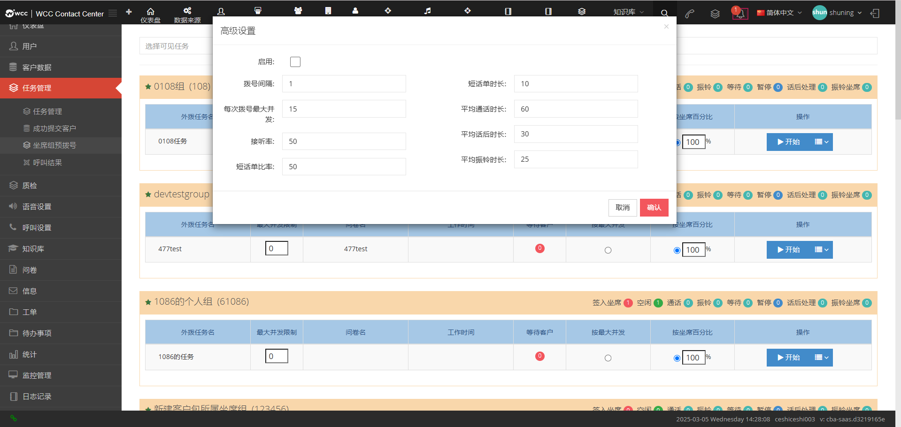

列举情况

坐席在线总数10

坐席1：通话时长20s

坐席2：通话时长120s（大于平均通话时长60s【talkend】）

坐席3：通话时长4s（小于短话单时长10s*短话单比率50%=5s【shorttalk】）

坐席4：话后时长60s（大于平均话后时长30s单小于平均话后时长90S【acwend】）

坐席5：话后时长30s

其他坐席为空闲坐席【idleagent】

客户1：振铃，振铃15S，已经接通，但是没有坐席接通

客户2：振铃20s被接通（小于平均振铃时长25s【ringing】）

可用坐席 = idleAgent + talkEnd + acwEnd + shortTalk - waiting

预测下次可用坐席数量=空闲坐席5个+坐席2（此时系统判断这个通话即将要被挂断了）+坐席4（大于平均话后时长系统预测这个坐席即将离开话后）+坐席3（短话单即将结束）-客户1=5+1+1+1-1=7

拨号数 =（可用坐席 × 坐席百分比）/应答率 - ringing

拨号数量=（7*150%）/50%-1=20

系统会在每次轮预拨号开始前预测计算下一次拨号的数量。

allRinging = 所有振铃数

waiting = 客户接通但坐席未接的通话通话数

allAnswered = 坐席接通的通话数

ringing = 振铃时长小于平均振铃时长的通话数

talkEnd = 通话时长大于平均通话时长的通话数

shortTalk = 通话时长小于短话单 × 短话单比例

maxChannel = 任务最大拨号限制

idleAgent = 队列中空闲的坐席

可用坐席 = idleAgent + talkEnd + acwEnd + shortTalk - waiting

拨号数 =（可用坐席 × 坐席百分比）/应答率 - ringing

每次发起的呼叫数取：（公式计算所得拨号数）， （每次拨号最大并发），(任务最大并发数 - allRinging -waiting - allAnswered ) 三者中最小值

#### 7坐席进行外呼前，都需要做什么准备？

①首先在root级别建立好中继，外显号码，和外呼档案

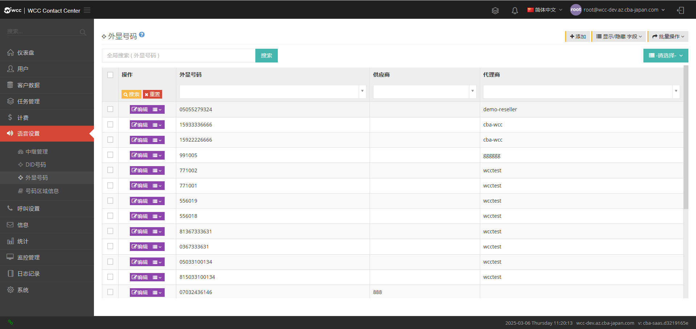

先将外显号码分配给所属代理商，由代理商分配给client进行使用

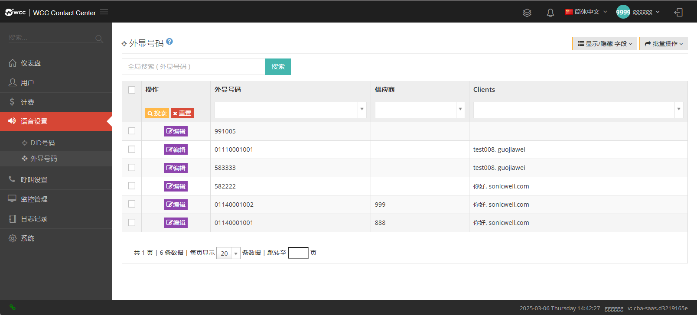

建立外呼档案，把外呼档案分到client

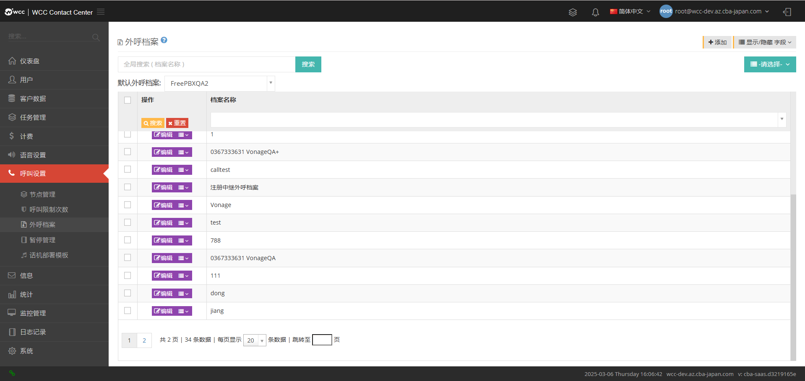

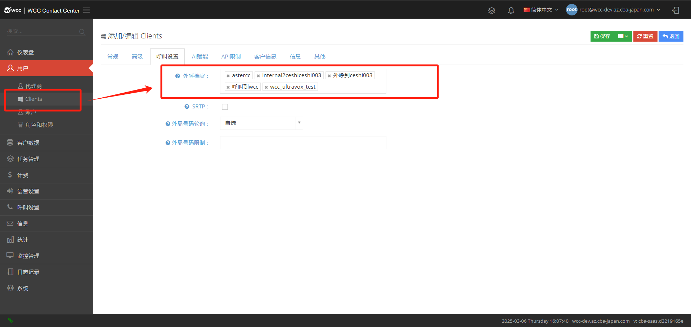

在client级别--->系统偏好--->拨号--->默认外呼档案中选择相应的外呼档案

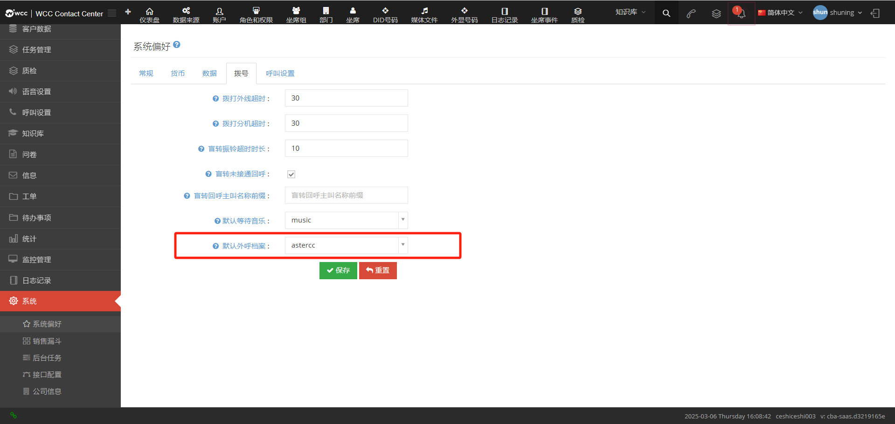

在client级别--->系统偏好--->呼叫设置--->外显号码中选择相应的外显号码

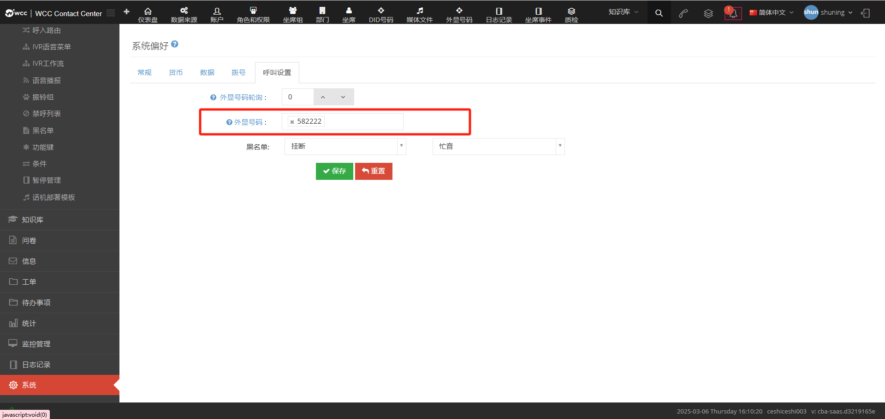

如外呼档案中相应配置正常，登录坐席后，坐席开启电话就可以进行外呼了。

#### 8使用外呼任务的呼叫方法

**1.坐席手动拨打**

client建立坐席后，登录坐席，坐席签入坐席组，打开联系客户页面准备开始工作。

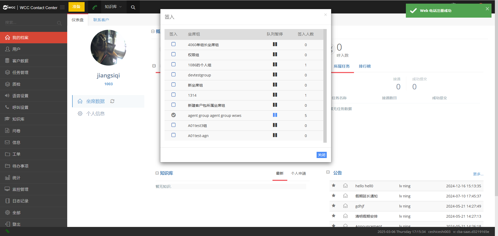

在【联系客户】页面选择想要添加客户的任务，点击【我的客户】后面的“+”添加客户

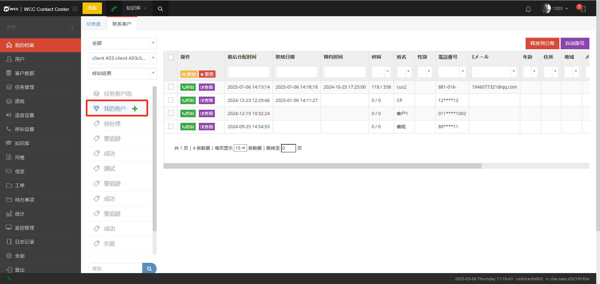

对客户资料进行编辑，并保存。保存后在电话号码处用户可以拨打电话。

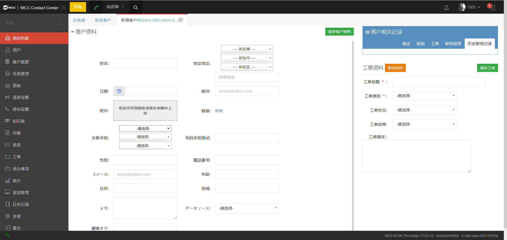

保存客户资料后还可以对该客户进行问卷调查，或是建立、处理工单等。

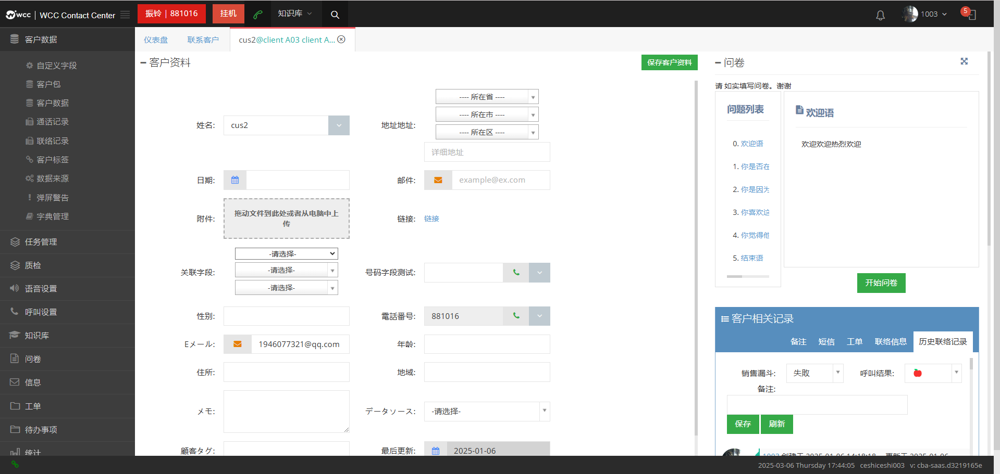

当坐席组中有被分配的客户坐席也可以在任务客户池中对客户池中的客户进行批量获取。获取到的客户会再我的客户池中显示。坐席点击呼叫客户资料页面会自动弹出，坐席响铃，坐席接听坐席电话外呼呼叫开始。

**2.分配坐席自动拨号**

坐席签入坐席组后，选择对应任务。选择联系系客户，点击任务客户池可以对该任务下的客户进行获取。获取到的客户会在我的客户池中，点击自动拨号可以对列表中的客户进行自动拨打。

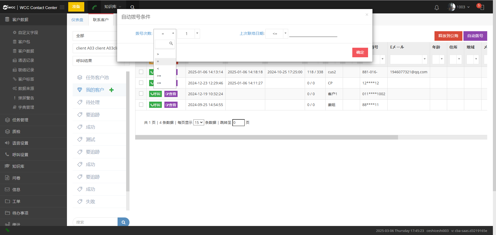

点击自动拨号会显示坐席需要自动拨号的客户所满足的条件：

拨号次数：坐席可以根据客户所拨号的次数的数值进行筛选所要拨打的客户号码。

上次联络信息：坐席可以根据客户上次联络的时间界定所要拨打的客户号码。

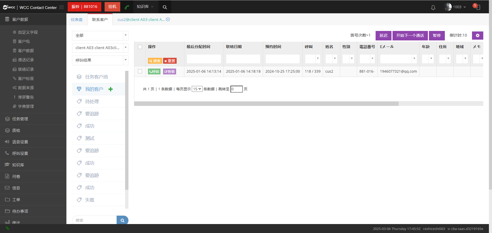

拨号次数：自动拨号设定的条件。

延迟：在通话结束后到下一个自动呼叫开始时有一个间歇时间供坐席处理该通话的结果，如果时间不够，坐席可以点击延迟，延迟的时间由任务管理中设定，点击一次即可延迟该设定的延迟时间，延迟可累计。

开始到下一个通话：在通话结束后到下一个自动呼叫开始时如果坐席在任务设定的倒计时时间内完成该呼叫的处理，可以开始下一个自动呼叫，坐席可以点击该键直接进入下一个自动呼叫状态。

暂停：在通话结束后到下一个自动呼叫开始时，坐席如果临时有事暂时不能处理接下来的自动呼叫可以暂停该自动呼叫，等待有时间时继续处理。在暂停状态下如有任何通话则视为结束暂停状态。

倒计时：任务管理所设置的在通话结束后到下一个自动呼叫开始时的一个间歇的时间倒计时。

×：关闭自动呼叫，已经在呼叫的无法关闭。

**3.预拨号**

在分配外呼任务后，启动预拨号之前可以先对预拨号进行设置。在操作中的下拉菜单，可以对坐席组预拨号进行高级设置，此处的设置需要用户对坐席组的工作效率有一定了解。

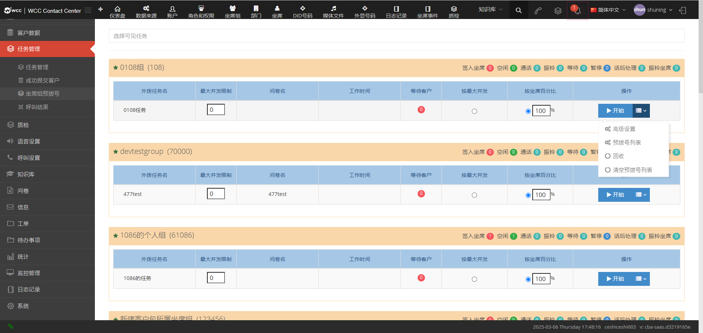

设置好预拨号的高级选项后，就可以进入开启预拨号的流程。如果等待客户数不为0，则需要先清空预拨号列表。

点击回收，对任务中的客户数据进行回收。

此时回到坐席组预拨号页面点击开始，开启预拨号。

在预拨号拨打过程中，用户可以在预拨号列表中点击预拨号列表查看当前拨号列表。

#### 9通话中的三种转接方式

**1话机盲转**

坐席在通话状态时，当需要对该通话进行转接至第三方时，坐席有两种方法可以进行盲转转接，即可以使用在页面上直接转接，也可以使用话机转接，具体操作方法如下：

A.以yealink电话为例，直接使用话机点击（trans话机中对应按键）输入第三方号码后再次点击（trans）转接至第三方处，此时坐席的所有操作仅在话机上执行。

B.使用坐席页面可以直接点击呼叫按钮然后输入第三方号码，再次点击呼叫按钮，对通话进行转接，此时坐席操作是在网页上执行。

转接后，发起转接坐席的通话直接挂断，当前通话转接至第三方，此时由于第三方的状态未知，若第三方可以应答，则该次转接成功，即拨号用户与第三方成功连接。若第三方未应答或为忙，则该通话直接挂断结束。

上述即实现电话盲转。

注：第三方可包含坐席、外线等。

**2话机咨询转接**

坐席在通话状态时，以yealink电话为例，当需要对该通话进行转接至第三方时，需要直接使用话机点击（trans）输入第三方号码，输入后点击话机上的（send），发起转接的坐席可以与指定的第三方进行通话确定此时第三方的通话状态，确认能够接听再将电话点击（trans）转接。若第三方为忙或无法接听，坐席可将继续重复上述操作将通话转接至能够接听方，若转接不成功，该通话最终回到原坐席处。在转接过程中用户电话端为等待音乐,该操作目前仅支持在话机上进行。

**3话机驻留**

坐席在通话状态时，以yealink电话为例，当需要对该通话进行转接至第三方时，需要直接使用话机点击（trans）输入功能键中设置的驻留号码以系统默认700为例，输入后点击话机上的（send），通话驻留，被驻留方响保持音乐，当第三方坐席或是原坐席想要取回，可以根据语音提示，按701取回。如果没有坐席取回，电话会回呼到驻留坐席处。

#### 10话机自动部署的使用方法

以yealink话机为例，在client和话机中设置自动部署的用户名及密码

在坐席--高级页面选择话机部署模版--填写话机的MAC地址

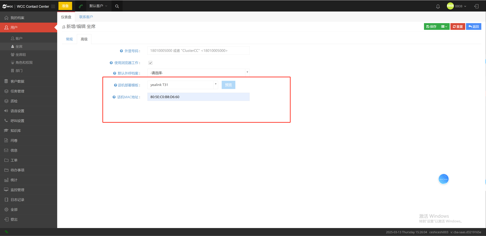

保存后再点击该坐席编辑--预览话机部署模版，填写用户名跟密码进行预览

在yealink话机设置页面--设置--自动更新处填写服务器url以及在client设置中设置的用户名和密码

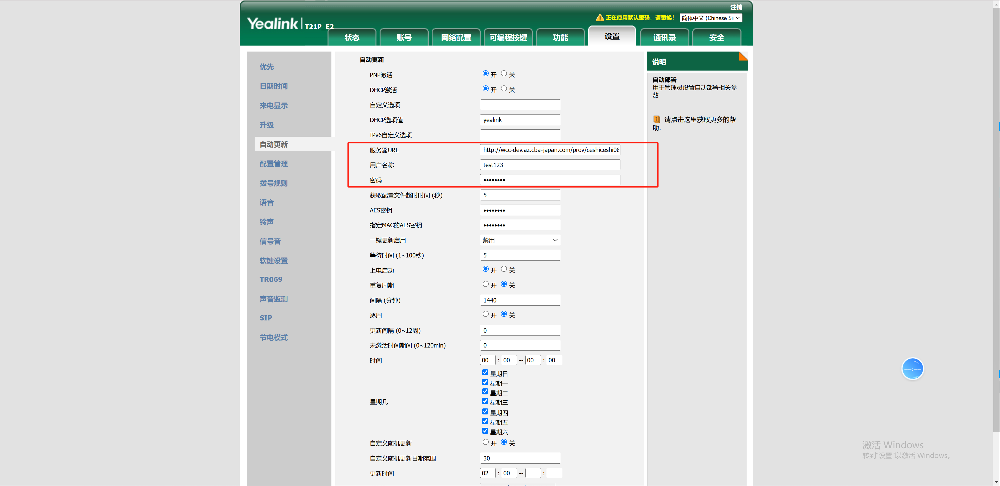

话机的自动部署就会成功。  
  
    
#### 11 同一系统下两个client之间呼叫，都需要做什么准备？  

**建立中继**    

1.建立一个使用ip的中继，因为都在同一个环境中，所以建立的中继就是本环境的  
例如stg的两个client互相打，就建一个stgIP的中继    

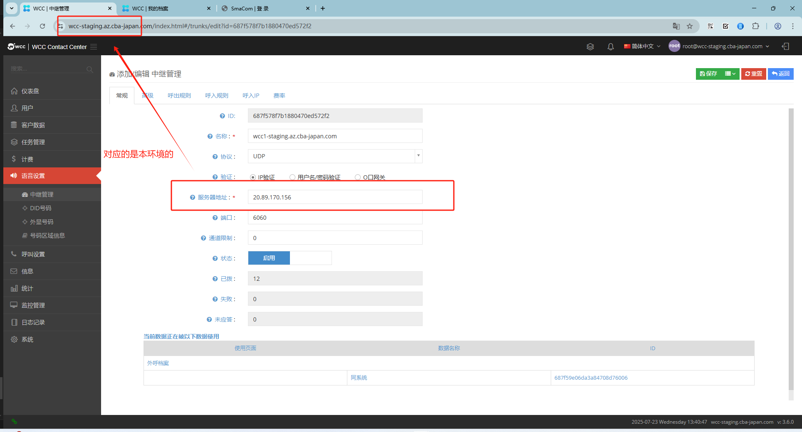  

**建立外呼档案**  
  
2.以被叫号码-前缀匹配为条件，匹配目标client所用did的前缀，中继都使用同一个中继（上述创建好的）    

例如：client1使用的did前缀是56，client2使用的did前缀是57  
     那么client1--外呼档案1的前缀就匹配57，client2--外呼档案2前缀就匹配56  
      
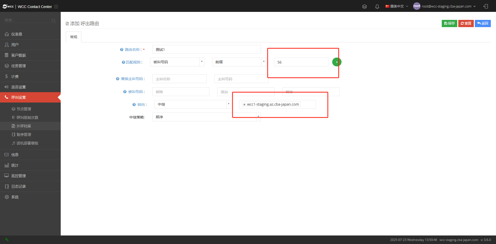  

**分配**  

3.将创建好的外呼档案、did号码、外线号码等分配给对应的两个client，就可以双向进行呼叫了    
  
   
  
    
      
#### 12  blf的使用说明及方法  
  
**1 功能说明** 

**blf功能**：如果某一坐席需要知道另外一个或多个指定坐席目前所处的状态情况，就可以启动blf功能。   
  
**2 配置方法**  
  
目前blf功能可以在两种话机类型上实现。分别是硬电话、wcc网页电话。 
  
 **sip电话的配置步骤（以yealink为例）**    

 ①登录sip电话的IP地址，进入到sip电话的功能配置页面  
   
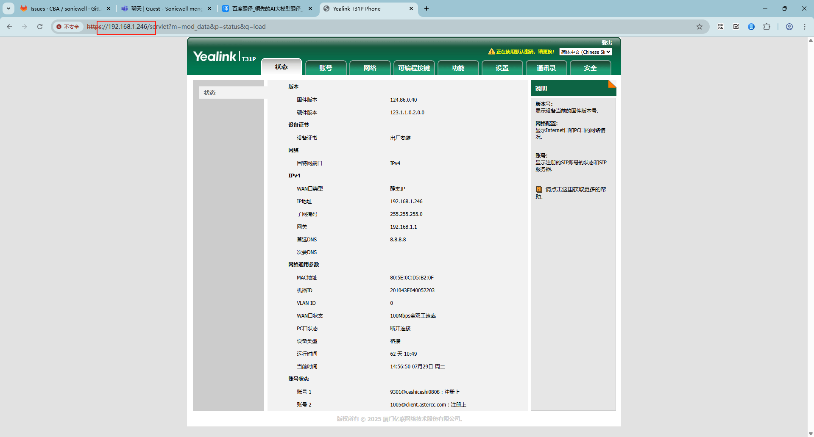     
  
 ②在【账号】页面注册一个分机    

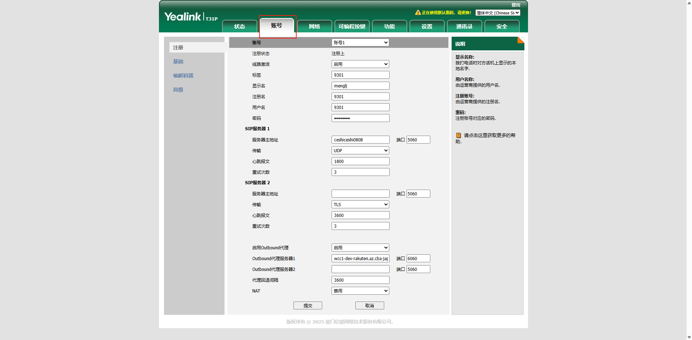  
  
 ③点击【可编程按键】页面，将账号键2的类型改成blf，分别在值、标签、和分机号中填上被监控坐席的工号，点击【提交】按钮，sip话机上的账号2就启用了blf的功能，账号1中的分机就可以监控账号2中分机的状态  

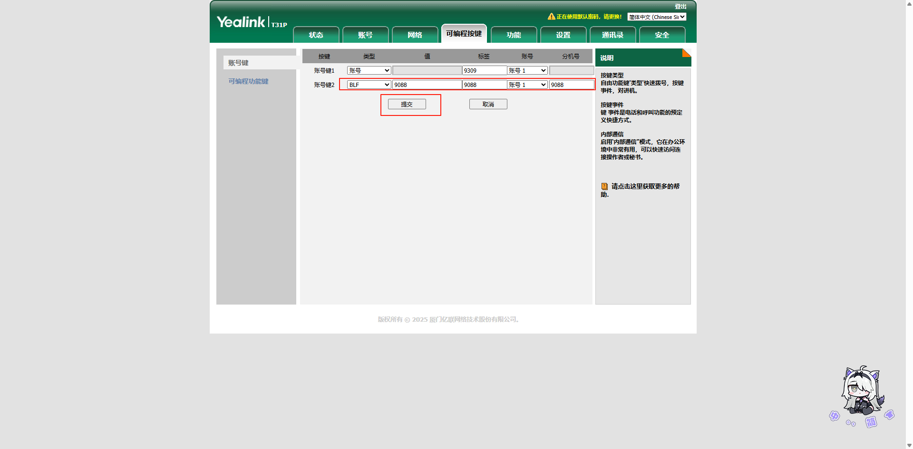  

**注**如果在“值”中输入*85等功能键，监控坐席可以直接按sip电话上的指示灯按钮抢接被监控坐席的电话
 
  
 **wcc网页电话的配置步骤**  
  
 ①登录一个分机  
   
   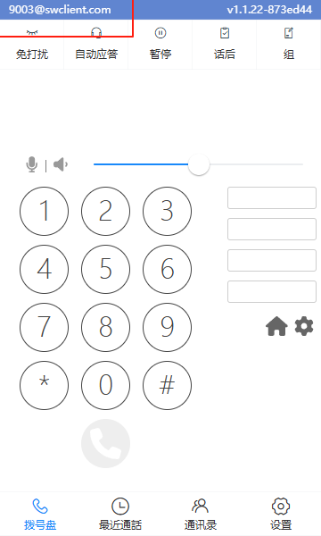   
     
 ②点击页面上的【设置】按钮，进入到自定义按键页面  
   
   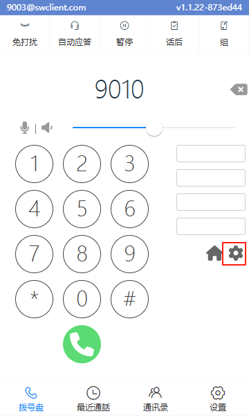   
     
      
     
 ③在自定义按键页面可以选择添加一个或多个被监控的坐席  
   
  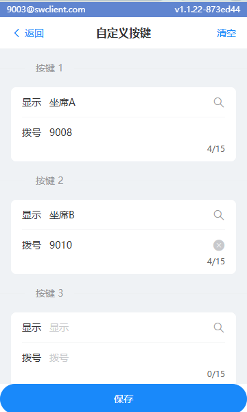    
    
 ④添加成功后，就可以看到被监控坐席当前的状态了  
   
  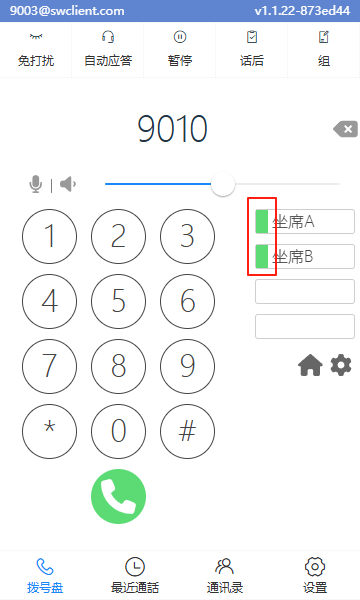   
    
      
**颜色显示**  
  
  无论是sip电话还是wcc网页电话，若被监控的坐席指示灯显示的是绿色，说明该坐席当前处于空闲状态；若被监控坐席的指示灯显示的是红色，说明该坐席当前处于振铃、通话等繁忙状态。  
    
 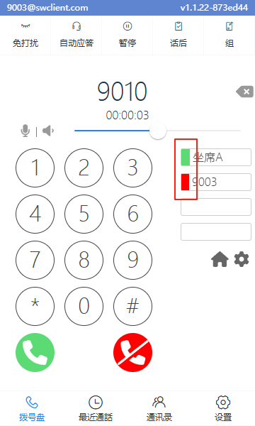  
   
 **注**：只有内线之间或外线号码呼入到被监控坐席时，才会触发该功能，指示灯才会变成红色，呼出到外线暂不支持该功能

 #### 13  不同通话类型，原始主叫号码、原始被叫号码等8个字段显示情况  0.
 | 显示字段    |  原始主叫号码     | 原始主叫名称   |实际主叫号码| 实际主叫名称 |接入号码  | 实际被叫号码  | 原始被叫号码  | 原始接入号码  |   
| ----------- | ----------- |-------|-------|-------|-------|-------|-------|-------|  
|坐席明细|呼入平均通话时长|呼入平均通话时长=呼入通话总时长 /呼入接通量|向下取整,比如11/2=5.5最后取5秒|
||呼入通话总时长|呼入通话总时长=通话|按通话情况直接取整|
||呼出平均通话时长|呼出平均通话时长=呼出通话总时长 / 呼出接通总量|
|||呼出总时长|呼出总时长=振铃+通话|按通话情况直接取整|
||平均保持时长|平均保持时长=保持时长 / 保持次数|平均保持时长=保持时长 / 保持次数	向下取整,比如7/2=3.5最后保持时长取3|
|坐席汇总|平均保持时长|平均保持时长=保持时长 / 保持次数|向下取整,比如7/2=3.5最后保持时长取3|
||话后时长|呼入到坐席组，坐席挂断通话后进入的话后时长|按话后情况直接取整|
||签入时长|签入到坐席组的时长|按签入时长直接取整| 
||拨打时长=振铃+通话||按拨打时长直接取整|
|坐席组明细|呼入接通率|呼入接通率=呼入接通量 / 呼入总量 后再乘以 100|留小数点后两位,四舍五入,1/3*100%=33.33%|
||呼入平均通话时长|呼入平均通话时长=呼入通话总时长 / 呼入接通总量|向下取整数,11/2=5.5取5|
||呼入通话总时长|呼入通话总时长=通话|
||呼出接通率|呼出接通率=呼出接通量 / 呼出总量 后再乘以 100|留小数点后两位,四舍五入,1/3*100%=33.33%|
||呼出平均通话时长|呼出平均通话时长=呼出通话总时长 / 呼出接通总量|向下取整数,240/9=26.66取26|
||呼出通话总时长|呼出通话总时长=通话|
||平均保持时长|平均保持时长=保持时长 / 保持次数|向下取整数,116/15=7.73取7|
|坐席组汇总|呼入接通率|呼入接通率=呼入接通量 / 呼入总量 后再乘以 100|留小数点后两位,四舍五入,7/9*100%=77.78%|