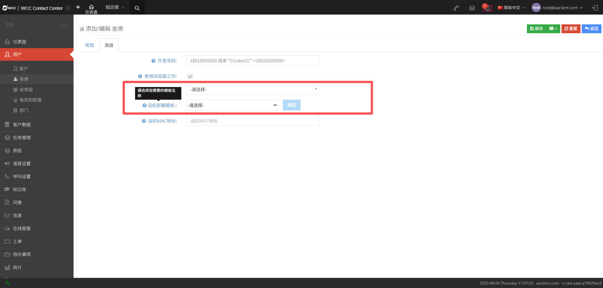
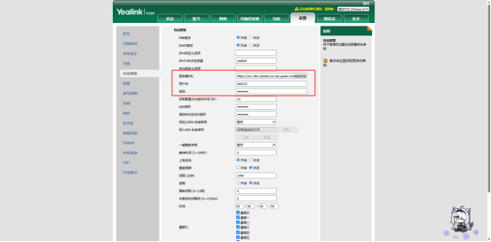
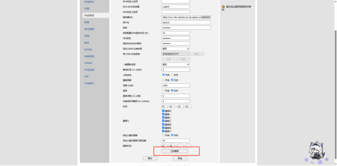

## 1.2 代理商系统界面功能使用指南

### 一、 界面整体布局

WCC 代理商系统界面核心分为三大功能区域，逻辑清晰且操作便捷，便于快速上手：

1. 左侧菜单栏：包含仪表盘、用户管理、计费、语音设置等核心功能模块，点击模块可展开子功能列表，支持关键词搜索菜单。

2. 上部状态栏：显示当前登录账号、语言切换、通知消息、后台任务入口及退出按钮，可快速切换系统语言（支持中文、英文等）、查看实时通知与后台任务进度。

3. 中间工作区：对应左侧选中功能的操作界面，包含数据列表、表单填写、设置选项等核心交互内容，支持显示 / 隐藏字段、全局搜索等快捷操作。


### 二、 核心功能模块详解

#### （一）仪表盘：

- 核心作用：代理商业务数据总览中心，快速掌握整体运营状态。

- 关键数据：展示呼出 / 应答 / 通话时长、呼入 / 漏话 / 通话时长、活跃坐席数量、收入 / 成本统计、DID 呼入排名（次数 / 时长 / 分钟数）、主叫地区分布等核心指标。

- 操作提示：所有数据支持点击【REFRESH】刷新获取实时数据，数据卡片可根据业务优先级调整显示顺序。

#### （二）用户管理：

包含 Clients、账户、角色和权限三大子模块，实现客户与权限的分级管控。

##### 1.Clients：

建与管理代理商下属客户账号，支持编辑、删除、查看及代登录操作。


**单击【添加】进入【常规】设置页面**


- **域名**: 每个客户端都必须有一个唯一的域，通常使用域名，它可以用于sip 注册、web 登录等，一旦设置了域，就无法再次修改。

- **客户名称**: 填写一个客户名称，该名称可以随时更改.

- **用户名**: 请填写这个Client的用户名，Client用户将使用此用户名登陆系统，一旦设定，将不能再修改。

- **密码**:Client管理员将使用该密码进行系统登录。

- **确认密码**: 再次确认您的密码，并确保两次密码相同，必填。

- **名**: 请填写此用户的名字。

- **姓**: 请填写此用户的姓氏，必填。

- **状态**:客户端用户的状态可分为正常、禁用和暂停。当客户端被禁用时，登录会提示“帐户不存在或密码不正确”。当帐户被暂停时，登录将提示“该帐户已被禁用，无法登录。请联系管理员”。

**【高级】设置**:


- **多客户包**: 允许client创建多个客户包，开启该功能时，client页面会出现客户包功能。

- **时区**: 请选择此client的时区，一旦设置，将不会修改。

- **事件类型**:系统可以提供呼叫事件、坐席事件和通话记录三种对接方式，三种可同时启用:

- **呼叫事件**: 您可以获得简单的事件，例如通话的创建、回答、挂断。

- **坐席事件**: 您可以接收到一路通话的所有事件，例如座席振铃、座席应答、被叫振铃、被叫方应答，挂断等。

- **通话记录**: 当通话结束后，系统会将通话记录推送到指定地址.

- **事件接收地址**: 如果你需要从系统接收事件，请提供一个可用的地址。

- **隐藏费率**: 您可以设置此client用户是否具有隐藏汇率。

- **录音设置**: 请选择哪类通话需要被录音。

- **录音格式**:请选择录音的格式有 MP3 和 WAV 两种类型可供选择.

- **录音文件格式**:你可以自定义录音文件的命名规则，可用的变量包括:

    ```
    %agentNo,%caller,%callee%year,%mon,%day%hour,%min,%sec
    %agentNo: 坐席工号  
    %caller: 主叫号码  
    %callee: 被叫号码  
    %year,%mon,%day,%hour,%min,%sec: 年-月-日-时-分-秒
    ```

-   **IP访问白名单**: 设置一个其他地点的ip，跟当前ip不一致的，此时登录这个client是不能登录的。当IP地址换成当前位置地址时，可登录。

-   **自动部署用户名**: 指坐席使用话机部署模版进行部署，在部署成功后查看配置需要输入的用户名。

-   **自动部署密码**:指坐席使用话机部署模版进行部署，在部署成功后查看配置需要输入的密码。  
  
    **【话机自动部署具体操作步骤】**  
      
    1.在 Clients 编辑页【高级】中，设置自动部署用户名和密码。 

         
      
    2.获取物理话机 MAC 地址（话机菜单→状态设置）。  
      
    3.登录 Clients 账号，进入坐席编辑页，选择话机部署模板，填写 MAC 地址并保存，点击【预览】。   

      
      
    4.需要填写自动部署用户名和自动部署密码，进入到下图页面后，复制url（红框内）  
      
      
      
    5.登录话机 IP 地址，在【设置 - 自动更新】中填写 URL、用户名、密码，点击【立刻更新】完成部署。  
      
    - **服务器url**：上图红框内的url；  
      
    - **用户名**：自动部署用户名；  
      
    - **密码**：自动部署密码。  
      
      
      
    


**【呼叫设置】**:


- **外呼档案**: 这里可以选择在root级别中分配的外呼档案，如果用户不做修改直接保存，不会影响root级别对client外呼档案的编辑，如果代理商更改了外呼档案的设置，client最后能够使用的外呼档案由代理商最后编辑的为准。

- **SRTP**: 启用加密语音流，如果client开启了加密，响应注册的话机也需要开启tls模式。  
  
  **【 client不开启srtp，而不同话机类型开启srtp情况】**  
      
    |话机类型/情况|协议类型|话机是否开启srtp|是否能注册上|注册时是否需要开启tls|能否通话|  
    |----------|----------|----------|----------|----------|----------|    
    |yealink|UDP|√|√|×|可以正常通话|  
    ||TLS|√|√|√|可以正常通话| 
    |rectel2|TLS|√|√|√|可以正常通话|  
    |AGEphone|UDP|√|√|×|可以正常通话|  
      
  **【client开启srtp，而不同话机类型不开启srtp的情况】**   
      
    |话机类型/情况|协议类型|是否能注册上|注册时是否开启tls|能否通话|
    |----------|----------|----------|----------|----------|
    |yealink|UDP|√|×|做主叫，呼出坐席和外线，坐席和外线会振铃，接通后立刻挂断|   
    |||||做被叫，外线和坐席都呼不进来，会听到忙音|   
    ||TLS|√|√|做主叫，呼出坐席和外线，坐席和外线会振铃，接通后立刻挂断|  
    |||||做被叫，外线和坐席都呼不进来，会听到忙音|
    |rectel2|UDP|√|×|不能正常通话，内线外线都打不出去|  
    |AGEphone|UDP|√|×|做主叫，呼出坐席和外线，坐席和外线会振铃，接通后没有声音|  
    |||||做被叫，外线和坐席都呼不进来，会听到忙音|     
    

- **外显号码轮询**: 用户可以为c lient设置主叫号码的轮询规则，改规则将在设置了多个主叫号码时生效。

- **外显号码限制**: 请在这里输入改client可以使用的所有主叫号码，如果没有输入，则表示该客户可以选择使用任何主叫号码。  

**【AI赋能】设置**:


- **AI 参数配置**: 联系管理管理员进行配置。

- **【API 限制】设置**


- **短信**:请设置短信调用的最大限制数量，当调用超过限制数，则停止调用。

- **通知**:请设置通知调用的最大限制数量，当调用超过限制数，则停止调用。

- **广播**:请设置广播调用的最大限制数量，当调用超过限制数，则停止调用。

- **点击呼叫**:请设置点击呼叫调用的最大限制数量，当调用超过限制数，则停止调用。

**【客户信息】设置**:


- **公司名称**: 请填写公司名称。

- **注册地址**: 请填写注册地址。

- **联系电话**: 请填写联系电话。

- **公司网址**: 请填写公司网站。

- **电子邮件**: 请填写电子邮件。

- **税号**: 请填写税号。

- **开户银行**: 请填写开户银行。

- **账户名称**: 请填写账户名称。

- **账号**: 请填写账号。

- **办公地址**: 请填写办公室地址。

**【信息】设置**:


- **邮件服务器**:根据已添加的邮件服务器的名称，选择要作为邮件服务器管理的邮件服务器。

**【其他】设置**:


- **禁止坐席web登录**:您可以设置坐席是否可以从网页登录，如果禁止坐席使用web登录，则坐席无法使用账号和密码直接登录，页面会提示“管理员已禁止从web登录”。

- **账号超时时间**: 登录账号超时时间。 (单位：分钟)

- **坐席超时时间**: 坐席登录超时时间。 (单位：分钟)

- **坐席浏览器超时时间**:如果坐席设置了使用浏览器工作，当关闭浏览器后，达到此超时时间时，系统会将坐席签出所有动态签入的坐席组（单位：秒）。

- **隐藏页面组件**: 隐藏的页面不会在client左侧菜单显示（左侧默认显示，右侧隐藏）。.

##### 2.账户：

创建管理系统操作账户，通过角色分配控制功能权限


**点击\[添加\] 进入\[常规\] 设置**:

  

- **用户名**: 用户将用此用户名进行系统登录。

- **状态**: 你可以将这个账户临时禁用。

- **名**: 请输入用户的名字。

- **姓**:请输入用户的姓氏。

- **密码**: 用户将用词密码进行系统登录。

- **确认密码**: 请再次输入密码，确保两次密码相同。

- **所属角色**:角色用于设置此账户可以访问的页面以及在该页面上拥有的权限。

**【高级 】设置**:


**备注**: 您可以在此处设置有关此帐户的一些注释信息。

##### 3.角色和权限：

通过 “创建角色→配置权限→分配账户” 实现精细化权限管控。

  

**在 \[添加/编辑\] 角色权限中，可以设置 \[常规\] 设置来命名角色。**


**【编辑】**:


- **名称**: 请为这个权限角色命名。

**【高级】设置**:

控制此角色下用户页面的高级显示权限，以及显示是否由用户自己创建。


**【权限】设置**:

控制具有此角色的用户的页面显示权限。


#### （三）计费：

核心为客户计费模块，实现 Clients 账户的费用核算与管理。

##### 1.客户计费：

Clients 账户创建后自动生成对应账单，删除 Clients 则账单同步删除。


**单击 \[编辑\] 执行 \[常规\] 设置。**


- **ID**: 数据的唯一 ID。

- **客户名称**: 客户名称是新经销商用户的名称，无法修改。

- **域名**: 域名是已新增的代理商用户的域名，不可以再修改。

**【计费】设置**:


- **应缴费用**: 应当缴纳的本期费用。

- **最大坐席数量**: 允许使用的最大坐席数量。

- **付款方式**: 选择付款方式预付款或后付款。

- **信用额度**: 设置可使用的信用额度。

- **月租**: 设置月租数额。

- **短信**:能够详细了解本月短信的消费情况、本月剩余时间、手动添加使用的短信数量，并选择SMS 费率。

- **呼出**:能够了解更多关于本月和本月剩余时间呼出的钱的消耗情况。您可以手动添加套餐分钟数和费率。

- **实际通话**:当系统拨打至座席电话后，由座席电话回拨给客户，客户接听时即产生费用。

-  *主叫通话**: 由系统拨打到坐席绑定电话的呼叫流程计费情况设置。

**【账单和提醒】设置**:


- **余额不足提醒**: 设置余额不足后的提醒次数。

- **提醒方式**: 选择手机号码或者邮箱的提醒方式。

    **账单电子邮件地址**: 填写收到账单的电子邮件地址。

    在设置的客户页面点击下拉菜单，选择【充值】或是【扣费】，可以记录客户的充值或是扣费金额及交易时间，如有需要，还可以填写备注信息。

    

    

#### （四） 语音设置：

包含 DID 号码、外显号码两大子模块，管理通话接入与呼出号码资源。

##### DID号码：

DID号码指外线呼入接入号码，可设置不同拨入路由（分机 / 振铃组 / IVR / 队列）。


**点击【编辑】进入【常规】设置：代理用户（经销商等级）可以编辑/修改【DID名称】和【客户端】。**


- **ID**: 数据唯一ID。

- **DID 号码**: root级别分配的did号码一经分配给代理商，代理商不能更改号码。

- **DID 名称**: DID 名称用于帮助您在系统中识别 这个号码，如果设置了DID名称，则在统计时使用。

- **Client**: 将这个did分配给client。

- **状态**: 当 DID 号码被禁用时，来电将被拒绝。

- **呼入次数**: 此did号码本月的呼入次数。

- **呼入分钟数**:此DID号码本月呼入的分钟数。

- **属性**: 这里将显示 DID号码的归属地信息（在号码归属地菜单中配置）。

- **最后一次使用日期**: 该号码最后一次拨打时间。

**【高级】设置**:

可以选择国家，填写备注，这些是上一级设置的，代理商级别是不能修改的。.


##### 外显号码：

坐席呼叫客户时显示的主叫号码。


**单击【编辑】以编辑【外显号码】**


- **ID**: 数据唯一ID。

- **外显号码**: 代理商级别只能查看，不能添加或是更改外显号码。

- **供应商**:代理商级别只能查看，不能更改编辑供应商。

- **Client**: 选择一个client，指定的client可以使用这个外显号码。

#### （五）呼叫设置：

核心为话机部署模板模块，提升多话机配置效率。

##### 话机部署模版：

统一配置话机参数，支持一键部署多台同品牌话机。


**单击【添加】进入【常规】设置**:


- **模版名称**: 请填入模版名称。

- **话机品牌**: 请输入话机型号。

- **模版内容**: 请填入模版内容。

#### （六）监控管理：

实时监控坐席组及坐席的通话状态与业务数据。

##### 实时监控：

**坐席组坐席**:选择客户端下要监控的坐席组，坐席需要签到坐席组，呼入坐席组才能显示数据。


**坐席组**: 选择需要监控的座席组，即当天有来电且活跃的座席组。


**坐席**:选择要监控的client，并继续选择要监控的坐席，坐席需要签到坐席组才能显示数据


##### （七）日志记录

**日志记录**:记录所有用户系统操作，用于审计与问题排查。


#### （八）系统：

##### 1.后台任务：

查看导入导出、数据同步等耗时任务的执行状态（成功 / 失败）、总计 / 成功 / 失败数、创建日期。


##### 2.公司信息：

查看并编辑系统所属公司的基础信息与财务信息。


### 三、 工具栏

#### 1. 后台任务

查看当前进行中的任务数量，点击【查看全部】进入任务详情页。。


#### 2. 通知

显示系统新消息提醒，无新消息时显示 “你有 0 条新消息”。。


#### 3. 语言

支持切换系统语言（如简体中文、English），切换后即时生效。


#### 4. 我的信息

- 【我的档案】：编辑代理商用户个人信息，支持修改密码（需二次确认，确保一致性）。

- 【登出】：退出当前登录账号，返回系统登录页面（公共设备建议及时登出）。


#### 5.注意事项

1. 所有带 “*” 字段为必填项，未填写无法保存配置，需重点关注。

2. 域名、时区、DID 号码、外显号码等字段设置后不可修改，配置前需仔细核对。

3. 密码设置需符合安全要求（建议包含字母、数字及特殊符号），定期通过【我的档案】更新。

4. IP 访问白名单配置后，仅指定 IP 可登录对应 Clients 账号，需准确填写办公网络 IP。

5. 启用 SRTP 语音加密后，需确保话机配合开启 TLS 模式，否则可能导致通话异常（如接通后挂断、无声音）。

6. 批量操作前建议备份数据，删除 Clients、账户等关键数据前需确认无关联业务正在运行。