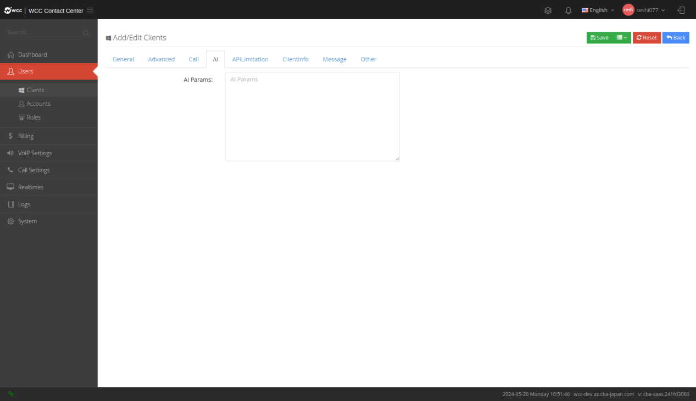
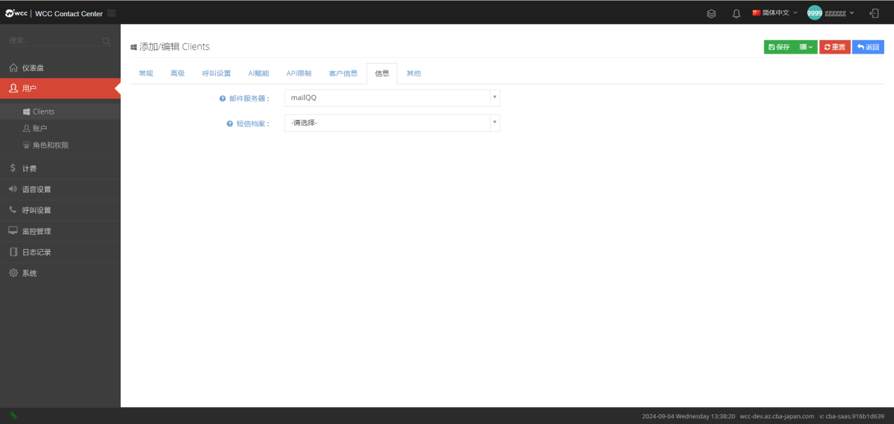
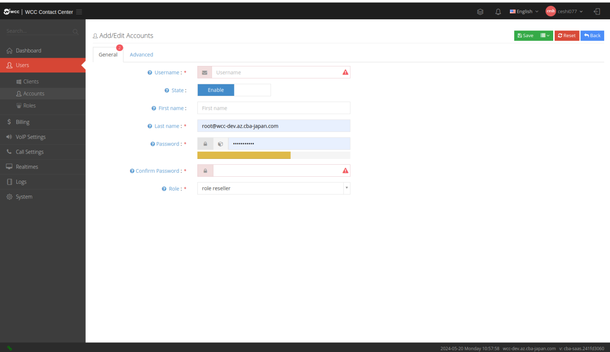
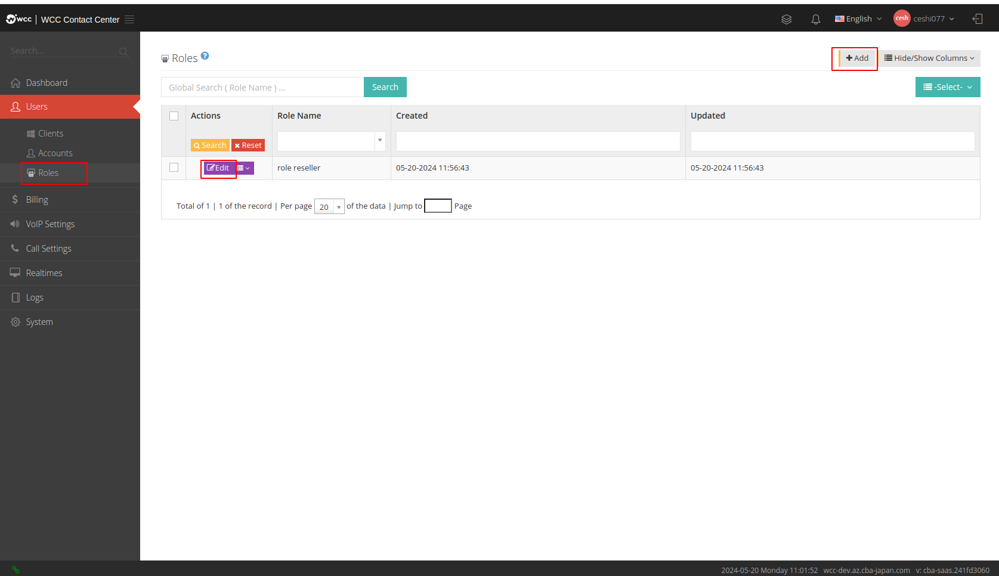

## 1.2 仪表盘介绍

### 1.2.1 I仪表盘概述

WCC 代理商用户界面窗口由三个主要区域组成：（1） 左侧菜单栏、（2）上部状态栏和 （3） 中间工作区。


### 1.2.2 工具栏

#### a. 搜索：

在菜单栏中搜索所有菜单。

#### b. 仪表盘：

代理商级别的仪表盘可以了解到整个代理商的通话情况、活跃坐席、did呼入情况等。

#### c. 用户：

##### Clients：

由代理商用户创建。代理商用户可以在“client”页面上删除/编辑/查看client用户，或以特定client用户的身份登录。经销商用户位于“client”页面上，页面上的列表显示当前经销商创建的client用户。


**单击【添加】进入【常规】设置页面**


-   **域名**: 每个客户端都必须有一个唯一的域，通常使用域名，它可以用于sip 注册、web 登录等，一旦设置了域，就无法再次修改。

-   **客户名称**: 填写一个客户名称，该名称可以随时更改.

-   **用户名**: 请填写这个Client的用户名，Client用户将使用此用户名登陆系统，一旦设定，将不能再修改。

-   **密码**:Client管理员将使用该密码进行系统登录。

-   **确认密码**: 再次确认您的密码，并确保两次密码相同，必填。

-   **名**: 请填写此用户的名字。

-   **姓**: 请填写此用户的姓氏，必填。

-   **状态**:客户端用户的状态可分为正常、禁用和暂停。当客户端被禁用时，登录会提示“帐户不存在或密码不正确”。当帐户被暂停时，登录将提示“该帐户已被禁用，无法登录。请联系管理员”。

-   

**【高级】设置**:


-   **多客户包**: 允许client创建多个客户包，开启该功能时，client页面会出现客户包功能。

-   **时区**: 请选择此client的时区，一旦设置，将不会修改。

<!-- -->

-   **事件类型**:系统可以提供呼叫事件、坐席事件和通话记录三种对接方式，三种可同时启用:

-   **呼叫事件**: 您可以获得简单的事件，例如通话的创建、回答、挂断。

-   **坐席事件**: 您可以接收到一路通话的所有事件，例如座席振铃、座席应答、被叫振铃、被叫方应答，挂断等。

-   **通话记录**: 当通话结束后，系统会将通话记录推送到指定地址.

-   **事件接收地址**: 如果你需要从系统接收事件，请提供一个可用的地址。

-   **隐藏费率**: 您可以设置此client用户是否具有隐藏汇率。

-   **录音设置**: 请选择哪类通话需要被录音。

-   **录音格式**:请选择录音的格式有 MP3 和 WAV 两种类型可供选择.

-   **录音文件格式**:
    你可以自定义录音文件的命名规则，可用的变量包括:

    ```
    %agentNo,%caller,%callee%year,%mon,%day%hour,%min,%sec

    %agentNo: 坐席工号  
    %caller: 主叫号码  
    %callee: 被叫号码  
    %year,%mon,%day,%hour,%min,%sec: 年-月-日-时-分-秒
    ```

-   **IP访问白名单**: 设置一个其他地点的ip，跟当前ip不一致的，此时登录这个client是不能登录的。当IP地址换成当前位置地址时，可登录。

-   **自动部署用户名**: 指坐席使用话机部署模版进行部署，在部署成功后查看配置需要输入的用户名。

-   **自动部署密码**:指坐席使用话机部署模版进行部署，在部署成功后查看配置需要输入的密码。


-   **无可用坐席溢出**：根据组所属的内部线路的状态来确定是否可以来电。如果没有可接受的用户，则不进入此组并转发。
转发目的地设置为'队列设置为 0 且无可用座席时的转发地'。

**【呼叫设置】**:


-   **外呼档案**: 根据需要，你可以为这个client的用户设置外呼档案，外呼档案可以选择多个。

-   **SRTP**: 启用加密语音流，如果client开启了加密，响应注册的话机也需要开启tls模式。

-   **外显号码轮询**: 用户可以为client设置主叫号码的轮询规则，改规则将在设置了多个主叫号码时生效。

-   **外显号码限制**: 请在这里输入改client可以使用的所有主叫号码，如果没有输入，则表示该客户可以选择使用任何主叫号码。

-   

**【AI赋能】设置**:



-   **AI 参数配置**: 联系管理管理员进行配置。

-   **【API 限制】设置**:


-   **短信**:请设置短信调用的最大限制数量，当调用超过限制数，则停止调用。

-   **通知**:请设置通知调用的最大限制数量，当调用超过限制数，则停止调用。

-   **广播**:请设置广播调用的最大限制数量，当调用超过限制数，则停止调用。

-   **点击呼叫**:请设置点击呼叫调用的最大限制数量，当调用超过限制数，则停止调用。

**【客户信息】设置**:


-   **公司名称**: 请填写公司名称。

-   **注册地址**: 请填写注册地址。

-   **联系电话**: 请填写联系电话。

-   **公司网址**: 请填写公司网站。

-   **电子邮件**: 请填写电子邮件。

-   **税号**: 请填写税号。

-   **开户银行**: 请填写开户银行。

-   **账户名称**: 请填写账户名称。

-   **账号**: 请填写账号。

-   **办公地址**: 请填写办公室地址。

**【信息】设置**:



-   **邮件服务器**:
    根据已添加的邮件服务器的名称，选择要作为邮件服务器管理的邮件服务器。

-   **短信档案**:
    请根据已添加的短信档案名称，选择一个短信档案作为配置客户发送短信时的路由。

**【其他】设置**:


-   **禁止坐席web登录**:您可以设置坐席是否可以从网页登录，如果禁止坐席使用web登录，则坐席无法使用账号和密码直接登录，页面会提示“管理员已禁止从web登录”。

-   **账号超时时间**: 登录账号超时时间。 (单位：分钟)

-   **坐席超时时间**: 坐席登录超时时间。 (单位：分钟)

-   **坐席浏览器超时时间**:如果坐席设置了使用浏览器工作，当关闭浏览器后，达到此超时时间时，系统会将坐席签出所有动态签入的坐席组（单位：秒）。

-   **隐藏页面组件**: 隐藏的页面不会在client左侧菜单显示（左侧围默认显示，右侧围隐藏）。.

##### 账户：

账户是用于管理系统的用户，例如添加坐席,查询报表,更新配置等通过为账户配置不同的权限角色,可以实现不同的账户拥有不同的功能权限。


**点击\[添加\] 进入\[常规\] 设置**:



-   **用户名**: 用户将用此用户名进行系统登录。

-   **状态**: 你可以将这个账户临时禁用。

-   **名**: 请输入用户的名字。

-   **姓**:请输入用户的姓氏。

-   **密码**: 用户将用词密码进行系统登录。

-   **确认密码**: 请再次输入密码，确保两次密码相同。

-   **所属角色**:角色用于设置此账户可以访问的页面以及在该页面上拥有的权限。

**【高级 】设置**:


**备注**: 您可以在此处设置有关此帐户的一些注释信息。

##### 角色和权限：

角色用于控制用户拥有的权限。例如设置一个账户拥有查看任务权限，首先添加一个查看任务权限的角色，然后分配此权限角色到某一账户，此账户即可拥有查看任务功能，可以查看任务。角色和权限页面的列表显示的是当前用户和账户新建的权限角色。



**在 \[添加/编辑\] 角色权限中，可以设置 \[常规\] 设置来命名角色。**


**【编辑】**:


-   **名称**: 请为这个权限角色命名。

**【高级】设置**:

控制此角色下用户页面的高级显示权限，以及显示是否由用户自己创建。


**【权限】设置**:

控制具有此角色的用户的页面显示权限。


#### d. 计费：

##### 客户计费：

它是client的计费，创建client会自动生成对应的客户账单，删除client也会删除对应的客户账单。.


**单击 \[编辑\] 执行 \[常规\] 设置。**


-   **ID**: 数据的唯一 ID。

-   **客户名称**: 客户名称是新经销商用户的名称，无法修改。

-   **域名**: 域名是已新增的代理商用户的域名，不可以再修改。

**【计费】设置**:


-   **应缴费用**: 应当缴纳的本期费用。

-   **最大坐席数量**: 允许使用的最大坐席数量。

-   **付款方式**: 选择付款方式预付款或后付款。

-   **信用额度**: 设置可使用的信用额度。

-   **月租**: 设置月租数额。

-   **短信**:能够详细了解本月短信的消费情况、本月剩余时间、手动添加使用的短信数量，并选择SMS 费率。

-   **呼出**:能够了解更多关于本月和本月剩余时间呼出的钱的消耗情况。您可以手动添加套餐分钟数和费率。

-   **实际通话**:当系统拨打至座席电话后，由座席电话回拨给客户，客户接听时即产生费用。

-   **主叫通话**: 由系统拨打到坐席绑定电话的呼叫流程计费情况设置。

**【账单和提醒】设置**:


-   **余额不足提醒**: 设置余额不足后的提醒次数。

-   **提醒方式**: 选择手机号码或者邮箱的提醒方式。

    **账单电子邮件地址**: 填写收到账单的电子邮件地址。

    <span class="mark">在设置的客户页面点击下拉菜单，选择【充值】，可以记录客户的充值金额及交易时间，如有需要，还可以填写备注信息。</span>

    

    

#### e. 语音设置：

##### DID号码：

DID号码指电信运营商提供的能够呼入到系统的电话号码，是外线呼入时的接入号码即被叫号码，是公司对外公布的电话号码，也可以理解成客户拨打的号码。DID在系统中的主要作用是，通过对DID号码的识别，我们可以制作不同的拨入路由，例如直接呼叫一个分机，一个振铃组，进入一个IVR或者一个队列。


**点击【编辑】进入【常规】设置：代理用户（经销商等级）可以编辑/修改【DID名称】和【客户端】。**


-   **ID**: 数据唯一ID。

-   **DID 号码**: 请输入did号码。

-   **DID 名称**: DID 名称用于帮助您在系统中识别 这个号码，如果设置了DID名称，则在统计时使用。

-   **Client**: 将这个did分配给client。

-   **状态**: 当 DID 号码被禁用时，来电将被拒绝。

-   **呼入次数**: 此did号码本月的呼入次数。

-   **呼入分钟数**:此DID号码本月呼入的分钟数。

-   **属性**: 这里将显示 DID号码的归属地信息（在号码归属地菜单中配置）。

-   **最后一次使用日期**: 该号码最后一次拨打时间。

**【高级】设置**:

可以选择国家，填写备注，这些是上一级设置的，代理商级别是不能修改的。.


##### 外显号码：

外显号码即主叫号码，是呼叫客户时的号码。


**单击【编辑】以编辑【外显号码】**


-   **ID**: 数据唯一ID。

-   **外显号码**: 请输入你要添加的外显号码。

-   **供应商**: 你可以为这个外显号码选择一个供应商。

-   **Client**: 你可以为这个外显号码选择一个client。

#### f. 呼叫设置：

##### 话机部署模版：

话机部署模板可以直接对话机设置进行配置，模板内容可以自主添加进行默认配置，在多台话机运用时能够节省更多的时间一键进行部署。


**单击【添加】进入【常规】设置**:


-   **模版名称**: 请填入模版名称。

-   **话机品牌**: 请输入话机型号。

-   **模版内容**: 请填入模版内容。

#### g. 监控管理：

##### 实时监控：

**坐席组坐席**:选择客户端下要监控的坐席组，坐席需要签到坐席组，呼入坐席组才能显示数据。


**坐席组**: 选择需要监控的座席组，即当天有来电且活跃的座席组。


**坐席**:选择要监控的client，并继续选择要监控的坐席，坐席需要签到坐席组才能显示数据


#### h. 日志记录：

**日志记录**:记录系统用户行为为日志。


#### 系统：

##### 后台任务：

后台任务是允许在系统的程序任务，通常他们是耗时的例如导入导出报告。


##### 公司信息：

在此页面您可以查看和编辑系统的公司信息。


### 1.2.3 工具栏

#### a. 后台任务

可以在这里查看后台正在进行的任务，如图：若没有正在进行的任务则显示为零。


#### b. 通知

将显示一些新消息。


#### c. 语言

代理商用户可以从此下拉菜单中选择常见的语言类型。


#### d. 我的信息

包括\[我的档案\]和\[退出\]

\[我的档案\]可编辑代理商用户的资料。

\[退出\]退出当前登录页面。


