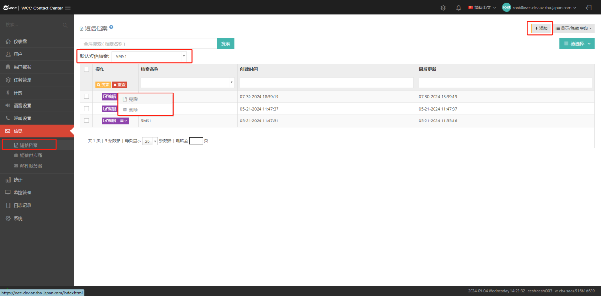
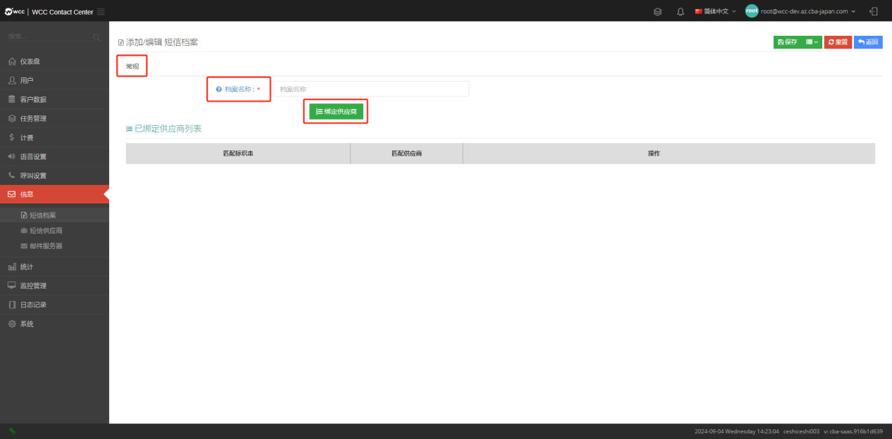
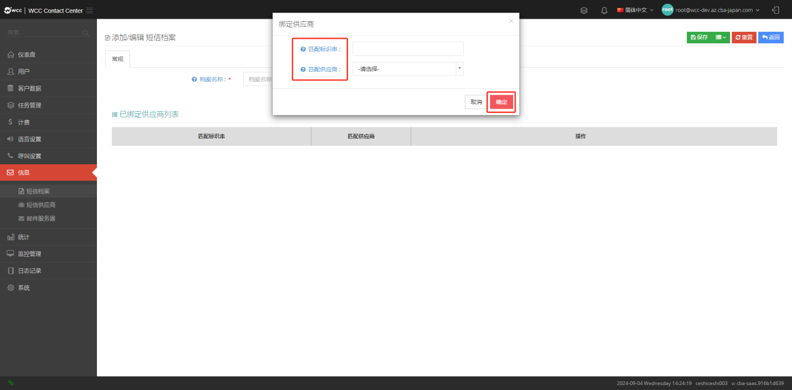
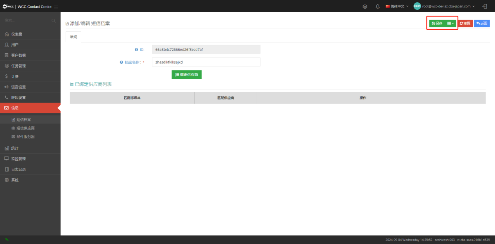
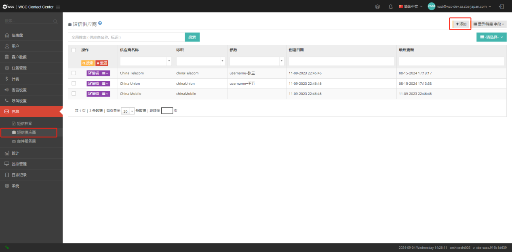
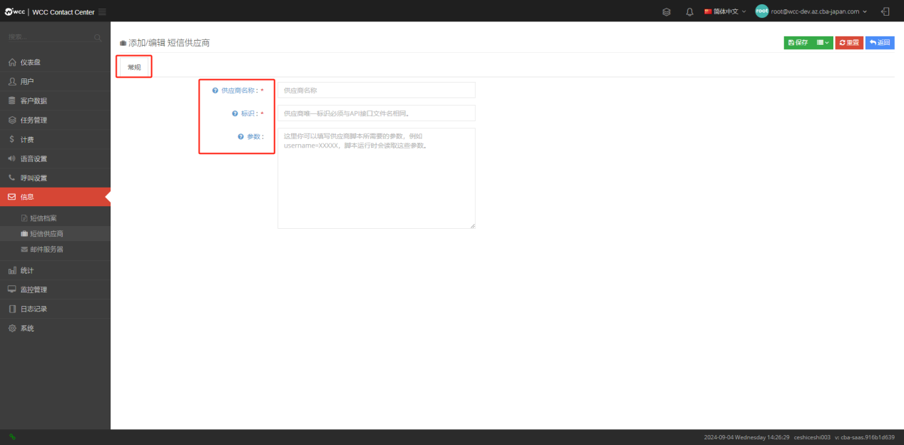

## 1.2 界面介绍 

### 1.2.1 界面介绍

WCC系统根界面窗口主要由三个区域组成：①左侧菜单栏、②上方状态栏、③中间工作区。（如下图所示）


### 菜单栏 

#### a. 仪表盘:

系统用户可以在仪表板上查看统计数据：系统用户可以在仪表板上查看统计数据：外拨/已应答、在线代理、DID入站、入站区域和出站区域。


#### b. 用户: 

##### **代理商:** 

由系统用户建立

选择【添加】，进入【常规】添加代理的设置：（如下图）


-   **<span class="mark">域名:</span>**
    <span class="mark">每个代理用户应拥有唯一的域名，域名一经设置不可修改。域名只能为字母（a-zA-Z）、数字（0-9）、字符（.-）的组合。</span>

-   <span class="mark">**代理商**: 请指定该代理商的姓名，姓名可以随时更改。</span>

-   **<span class="mark">费率:</span>**
    <span class="mark">为代理商设定适用的费率范围。</span>

-   <span class="mark">**用户名**: 用户将使用该用户名登录系统。</span>

-   <span class="mark">**名**: 请填写该代理商用户的名称。</span>

-   <span class="mark">**姓**: 请填写该代理商用户的姓。</span>

-   **<span class="mark">密码:</span>**
    <span class="mark">填写用户登录密码，用户将使用此密码登录系统。</span>

-   <span class="mark">**确认密码:**再次确认密码，确保两次密码相同。</span>

**<span class="mark">【 高级 】 设置:</span>**


-   <span class="mark">**时区**: 请为该代理用户设置时区。设置后不可修改。您可以直接搜索或向下滚动进行选择。</span>

**<span class="mark">\[公司信息\]:</span>**
<span class="mark">公司信息基本编辑（如下图）</span>


-   <span class="mark">**公司名称**: Please fill in the company name of
    this agent user.</span>

-   <span class="mark">**注册地址**: Please fill in the registration
    address of this agent user.</span>

-   **<span class="mark">联系电话:</span>** <span class="mark">Please
    fill in the company contact phone number of this agent user.</span>

-   <span class="mark">**公司网址**: Please fill in the company website
    of this agent user.</span>

-   <span class="mark">**电子邮件**: Please fill in the company</span>
    <span class="mark">email address of this agent user, which defaults
    to the agent user's email address.</span>

-   <span class="mark">**税号**: Please fill in the company tax ID of
    this agent user.</span>

-   <span class="mark">**开户银行:** Please fill in the opening bank of
    this agent user's company.</span>

-   <span class="mark">**账户名称**: Please fill in the company account
    name of this agent user.</span>

-   <span class="mark">**账号**: Please fill in the company account of
    this agent user.</span>

-   <span class="mark">**办公地址**: Please fill in the company office
    address of this agent user.</span>

##### Clients:

<span class="mark">clients 用户是有代理商用户创建。代理商用户和系统用户在client页面可以删除/编辑/查看clients用户，也可以以某-client用户登陆。代理商用户在clients页面，页面列表显示的是当前代理商和当前代理商的账户已新建的Clients用户。系统用户在Cients用户页面，页面列表显示的是系统用户下所有的代理商用户和代理商账户已新建的Clients用户。</span>


##### 账户:

<span class="mark">账户是用于管理系统的用户，例如添加坐席,查询报表,更新配置等通过为账户配置不同的权限角色可以实现不同的账户拥有不同的功能权限</span>:


<span class="mark">选择【添加】并输入【通用】设置：（如下图所示）</span>


-   <span class="mark">**用户名**: 用户将使用该用户名登录系统。</span>

-   <span class="mark">**状态**:您可以选择启用/禁用该帐户。</span>

-   <span class="mark">**名**: 请输入用户的名。</span>

-   <span class="mark">**姓**: 请输入用户的姓。</span>

-   <span class="mark">**密码**: 用户将用此密码进行系统登录。</span>

-   **<span class="mark">确认密码:</span>**请再次输入密码，确保两次密码相同。

-   <span class="mark">**所属角色:**角色用于设置此账户可以访问的页面以及在该页面上拥有的权限。</span>

在【高级】设置中，您可以设置此帐户的备注信息

##### 角色和权限: 

<span class="mark">角色用于控制用户拥有的权限。例如设置一个账户拥有查看任务权限，首先添加一个查看任务权限的角色，然后分配此权限角色到某一账户，此账户即可拥有查看任务功能，可以查看任务。角色和权限页面的列表显示的是当前用户和账户新建的权限角色。</span>


单击【编辑】/【添加】，然后输入【通用】来命名角色：（如下图所示）


<span class="mark">【 高级 】设置:</span>

【权限设置】:


#### c. 客户数据: 

##### 客户标签:

<span class="mark">客户标签管理页面，客户标签用于为客户选择不同的客户标签，方便通过客户标签进行查找客户。在客户标签页面，可以新增/查看/编辑/删除客户标签。</span>


<span class="mark">单击【添加】以进入【常规】设置：（如下图所示）</span>


-   **<span class="mark">标签名称:</span>**
    <span class="mark">请输入客户标签的名称。</span>


##### **数据来源:**

<span class="mark">数据来源是指客户数据的数据来源，导入一次客户数据就会增加一次数据来源，用时间和颜色标记。在数据来源页面，用户可以新增/查看/编辑/删除数据来源</span>


<span class="mark">单击【添加】以进入【常规】设置：（如下图所示）</span>


-   **<span class="mark">来源名称:</span>**
    <span class="mark">请输入数据来源的名称。</span>

-   <span class="mark">**来源颜色**: 请选择客户数据来源的颜色。</span>

**<span class="mark">在【高级】设置中可以设置备注信息（如下图）</span>**


#### d.任务管理：

##### **呼叫结果:**

呼叫结果是坐席呼叫客户后记录的通话结果，用于通话结果的分类。


<span class="mark">选择【添加】，进入【常规】设置：（如下图）</span>


-   <span class="mark">**呼叫结果名称**:
    您可以自定义通话结果，座席完成通话后，可以选择通话结果记录通话结束。</span>

-   <span class="mark">**通话状态**:
    呼叫结果仅在接听电话时才可设置。“无”表示无论通话状态如何，坐席都可以随时使用呼叫结果。</span>

-   <span class="mark">**所属销售漏斗**:
    设置仅在指定销售漏斗下显示的呼叫结果。</span>

-   <span class="mark">**强制预约**:
    必须建立预约，否则无法保存客户，也无法提交联系记录。</span>

#### e. 计费: 

##### 客户计费: 

<span class="mark">客户计费是对代理商的计费。</span>


<span class="mark">单击【编辑】进入【常规】设置：（如下图所示）</span>


-   <span class="mark">**ID: The** unique</span> <span class="mark">ID of the data.</span>

-   <span class="mark">**客户名称**: The customer's name is a newly added agent user name and cannot be modified.</span>

-   <span class="mark">**域名**: The domain name is a newly added agent user domain name and cannot be modified.</span>

【账单】设置：（如下图）


-   **应缴费用:** 应当缴纳的本期费用。

-   **最大坐席数量:** 允许使用的最大坐席数量。

-   **付款方式:** 选择付款方式预付款或后付款。

-   **信用额度:** 设置可使用的信用额度。

-   **月租 :** 设置月租数额。

-   **短信:**
    能够详细了解本月短信的消费情况、本月剩余时间、手动添加使用的短信数量，并选择SMS 费率。

-   **呼出:**能够了解更多关于本月和本月剩余时间呼出的钱的消耗情况。您可以手动添加套餐分钟数和费率。

-   **实际通话:**当系统拨打至座席电话后，由座席电话回拨给客户，客户接听时即产生费用。

-   **主叫通话:** 由系统拨打到坐席绑定电话的呼叫流程计费情况设置。

**【账单和提醒】设置:**


-   **余额不足提醒:** 设置余额不足后的提醒次数。

-   **提醒方式:** 选择手机号码或者邮箱的提醒方式。

    **账单电子邮件地址:** 填写收到账单的电子邮件地址。

<span class="mark">在设置的客户页面点击下拉菜单选择【充值】，记录客户的充值金额及交易时间，如有需要，也可填写备注信息；点击【费用扣减】类似；点击【立即生效】，对客户的账单信息生效（如下图）</span>


##### 费率计划:

费率计划是指按照费用决策要求，具体编制在一定时期(计划期)内实现的费率计划，包括:销售费率和成本费率看。


<span class="mark">选择【添加】，进入【常规】设置：（如下图）</span>


-   <span class="mark">**费率名称:** 请为这个费率命名。</span>

-   **<span class="mark">费率类别:</span>**
    <span class="mark">请选择一个费率类别。</span>

-   <span class="mark">**初始计费**:
    初始计费是在初始时长内，每分钟的费率,相当于起步价，单位是元/分。</span>

-   <span class="mark">**初始计费时长**:
    初始计费时长是接通电话初始时长所计费的时间,相当于起步价对应的里程数，单位是秒。</span>

-   <span class="mark">**费率**:
    初始计费后每分钟的费率，单位是元/分。</span>

-   <span class="mark">**计费周期**:
    计费周期是指过初始时长后多久计费一次，单位是秒。</span>

-   **<span class="mark">费率数目:</span>**
    <span class="mark">编辑所要选择的费率数目。</span>

**【高级 】 设置:**


-   **<span class="mark">时间:</span>**请选择这个费率计划开始执行的时间。

-   <span class="mark">**费率名称**: 请选择一个已添加的费率计划。</span>

#### f. 语音设置: 

##### **中继管理:**

中继是用于将本机的电话网络与其他系统的电话网络连接在一起的线路管理。


<span class="mark">选择【添加】并输入【常规】设置：</span>


-   **<span class="mark">名称:</span>**
    <span class="mark">给中继起个名字，你可以随时改变他。</span>

-   **<span class="mark">协议:</span>** 请选择这个中继的协议类型。

-   **<span class="mark">验证:</span>**
    <span class="mark">请选择这个中继的验证方式.</span>
    <span class="mark">以下步骤根据验证方式不同有所差异，添加管理中继管理接口【验证方式】，系统默认为【IP】（如下图）</span>


-   **<span class="mark">服务器地址:</span>**
    <span class="mark">请输入这个服务器的地址，它可能是一个域或者IP。</span>

-   **<span class="mark">端口:</span>**
    <span class="mark">请输入这个中继的端口号，默认是5060。</span>

-   <span class="mark">**通道限制:**
    通道限制数表示最多有多少外拨电话数，0表示无限制。</span>

-   <span class="mark">**状态**: 根据你的需要你可禁用这个中继。</span>

添加编辑中继管理界面【验证】，然后选择【用户名/密码】（如下图所示）


-   <span class="mark">**注册服务器:** 请选择一个注册服务器。</span>

-   <span class="mark">**启用注册:**
    当验证方式是用户名/密码时，你可以选择是否启用注册，若启用注册需要继续填写注册信息。</span>

-   <span class="mark">**语音编码:**
    当验证方式是用户名/密码验证时，请选择这个中继的语音编码。</span>

-   <span class="mark">**服务器地址:**
    请输入这个服务器的地址，它可能是一个域或者IP 。</span>

-   <span class="mark">**端口:** 请输入这个中继的端口号。</span>

-   <span class="mark">**用户名**:当验证方式是用户名/密码验证时，请输入用户名。</span>

-   <span class="mark">**认证用户名:** 认证这个用户名 。</span>

-   <span class="mark">**密码:**
    当验证方式是用户名/密码验证时，请输入密码。</span>

-   <span class="mark">**通道限制:**
    通道限制数表示最多有多少外拨电话数，0表示无限制。</span>

-   <span class="mark">**状态:** 根据你的需要你可以禁用这个域 。</span>

添加管理中继管理接口【身份验证】，然后选择【O端口网关】（如下图所示）。


-   <span class="mark">**验证域:** 需要验证的域。</span>

-   <span class="mark">**状态:** 根据你的需要你可以禁用这个域 。</span>

在中继管理中，选择【编辑】将显示拨出、失败和未接收到消息（如下图所示）


-   <span class="mark">**已拨:** 已拨打电话总数量。</span>

-   <span class="mark">**失败:** 已拨打电话失败数量。</span>

-   <span class="mark">**未应答:** 已拨打电话未应答数量。</span>

<span class="mark">【高级】设置：（如下图所示）</span>


-   <span class="mark">**绑定呼入到 client:** This trunk can be bound to a client, and all calls from this trunk will be sent to this client.</span>

-   <span class="mark">**中继侧录音增益:**如果为0则表示禁用此功能。</span>

-   <span class="mark">**分机侧录音增益:**
    如果为0则表示禁用此功能。</span>

-   <span class="mark">**中继侧通话增益:**如果为0则表示禁用此功能。</span>

-   <span class="mark">**坐席侧通话增益:**
    如果为0则表示禁用此功能。</span>

-   <span class="mark">**坐席注册超时时间:**
    在启用注册时，您可以输入注册超时。</span>（只有在“【常规】”设置中选择“【用户名/密码】”时才会显示此项目）

-   <span class="mark">**描述:**
    你可以填这个中继的描述信息，进行备注说明。</span>

<span class="mark">【呼出规则】设置：选择【添加呼出规则】进入添加呼出规则页面，通过此中继呼出的电话将使用此呼出规则。【呼入规则】与【呼出规则】类似。（如下图）)</span>


-   <span class="mark">**名称**: 请为这个呼出规则命名。</span>

-   <span class="mark">**匹配规则**:
    设置这个匹配规则，符合此规则的呼叫将执行以下操作。</span>

-   <span class="mark">**替换主叫号码**:
    在这里你可以重新设定主叫号码和主叫号码名称。</span>

-   <span class="mark">**增加主叫号码前缀**:
    系统将为主叫号码增加前缀。对于SIP设备，主叫号码还支持使用主叫名称。</span>

-   <span class="mark">**被叫号码**:
    你可以添加/移除被叫号码前缀或者重置被叫号码。</span>

-   <span class="mark">**转向**: 路由匹配时系统将进行此动作。</span>

<span class="mark">【呼入IP</span> <span class="mark">】设置:</span>


-   <span class="mark">**呼入IP**:
    设置允许接入的IP地址，可以同时添加多个IP地址。</span>


<span class="mark">**费率**: The rate at which fees are paid.</span>
<span class="mark">You can choose between regular rates or rate plans</span>

-   <span class="mark">Common rate: There is no initial duration calculation, and the rate is only calculated based on a per minute billing method.</span>

-   <span class="mark">Rate Plans: Select billing based on the already set rate plan.</span>

##### DID 号码:

DID号码指电信运营商提供的能够呼入到系统的电话号码，是外线呼入时的接入号码即被叫号码，是公司对外公布的电话号码，也可以理解成客户拨打的号码。DID在系统中的主要作用是，通过对DID号码的识别，我们可以制作不同的拨入路由，例如直接呼叫一个分机，一个振铃组，进入一个IVR或者一个队列。


<span class="mark">点击添加添加一个新的中继：</span>


-   <span class="mark">**DID号码**: Please enter a DID number, one per line.</span>

-   <span class="mark">**DID名称**: DID名称用于帮助你在系统中识别该号码，在统计时如果设置了DID名称，则会使用此名称。</span>

-   <span class="mark">**代理商**: 请为这个did号码选择一个代理商。</span>

-   <span class="mark">**状态**: DID号码禁用后, 呼入到当前DID的来电将不可用。</span>

<span class="mark">【 高级设置 】 设置: 您可以选择一个国家并填写注释和说明。</span>


##### 外显号码: 

外显号码即呼叫号码，是用来呼叫客户的号码。页面的外显号码列表显示的是系统用户已添加的外显号码。（如下图所示）
<span class="mark"></span>


**<span class="mark">选择【添加】，进入【常规】设置：（如下图）</span>**


-   **外显号码:** 请输入您要添加的外显号码，每行一个。

-   **供应商:** 你可以为这个外显号码选择一个供应商。

-   **费率计划:** 你可以为这个外显号码选择一个费率计划。

-   **代理商:** 你可以为这个外显号码选择一个代理商。

##### 号码区域信息:

号码区域信息表示的是号码的归属地，系统可以根据号码归属地中的号码前缀来匹配系统的通话号码的所属地。添加归属地完成后，当坐席页面有来电时，会提示来电号码的归属地信息，当坐席联系客户时，客户资料页面会显示号码归属地。面，在该页面可以添加/批量添加/查看/删除/DID号码更新操作。


**<span class="mark">选择【添加】并输入【通用】设置：（如下图所示）</span>**


-   <span class="mark">**操作**:</span>

> <span class="mark">更新：如果表内数据与当前设定的数据有重复，以设定的数据为准，对表进行更新。</span>
>
> <span class="mark">重置：清空表内所有号码区域信息，再将当前设定的数据导入表内.</span>

-   <span class="mark">**数据**: 直接填写数据,或将csv文件拖拽到此区域(文件需使用UTF-8编码)。格式示例：号码(数字)+属性(文本)</span>

#### g. 呼叫设置: 

##### 节点管理:

从节点管理中，可以了解添加节点的设置状态、CPU状态、系统负载、系统运行时间、节点类型和其他系统工作条件。


**<span class="mark">选择【添加】并输入【通用】设置:</span>**

-   **节点类型**: 选择节点类型，分为【普通】和【 Opensips 】。系统默认为【 普通 】

> <span class="mark">当节点类型为普通时：（如下图）</span>
>
> 

-   **节点名称:**
    给这个节点起一个名字便于识别。媒体网关与节点的相应配置需要与该名称一致。

-   **节点 IP:** 请输入astercc服务器的IP地址。

-   **Sip端口:** 节点http端口 默认值为3000。

-   **Node端口:** 客户端webrtc使用的地址。

-   **处理任务:** 是否执行导出任务。

<span class="mark">当节点类型为 opensips 时：（如下图）</span>


-   **节点名称:**
    给这个节点起一个名字便于识别。媒体网关与节点的相应配置需要与该名称一致。

-   **节点 IP:** 请输入astercc服务器的IP地址。

-   **Node端口:** 客户端webrtc使用的地址。

-   **WS**服务器**:** 客户端webrtc使用的地址。

-   **优先级:**
    WS服务器的使用优先级,坐席将优先连接优先级大的ws服务器.数值越大优先级越高.。

-   **Mysql地址:** 填写 Opensips 使用的 MySQL 地址。

-   **Mysql** **端口:** 填写 Opensips 使用的 MySQL 端口。

-   **Mysql** **用户名:**填写 Opensips 使用的 MySQL 用户名。

-   **Mysql** **密码:** 填写 Opensips 使用的 MySQL 密码。

-   **Mysql** **数据库:** 填写 Opensips 使用的 MySQL 数据库。


-   **编辑节点:** 编辑这个节点。

-   **健康检查:** 对节点进行健康检查。

-   **暂停:** 暂停这个节点的使用。

-   **删除节点:** 删除这个节点

##### 呼叫限制次数:

呼叫限制是指号码可以拨打的次数;同时，您可以在 通话限制搜索中搜索受限的电话号码。此设置适用于客户账户下的所有代理。例如，如果设置为每天20次，则在所有客户端中，一天内只能拨打 20 个电话。（如下图所示）
<span class="mark"></span>


**<span class="mark">选择【添加】并进入【通用】设置：（如下图）</span>**


-   **规则:** 你可以在 M 天内呼叫 N 次。

##### 外呼档案: 

外呼档案用于为坐席选择外呼中继线，在一个外呼档案中可以有多个呼出路由，Client可以使用不同的中继呼出基于主叫号码或被叫号码。在呼出路由中，你还可以根据需要转换主叫号码或被叫号码。


**单击【添加】以进入【常规】设置：（如下图所示）**


-   **档案名称:**请为该外呼档案命名。

<span class="mark">设置文件名后，单击“添加外呼路由”以设置出站路由（如下图所示）</span>


-   **路由名称:** 请为该路由命名。

-   **匹配规则:**
    设置匹配规则，满足该规则的调用将执行以下操作。如果设置了多个匹配规则，则需要匹配所有规则。

-   **替换主叫号码:**在这里你可以从新设定主叫号码和主叫号码名称。

-   **被叫号码:** 你可以添加/移除被叫号码前缀，或是重置被叫号码。

-   **转向:**路由匹配时系统将进行此动作。

-   **中继策略:**

    顺序：每个来电从第一个中继开始（始终为 123）

    轮询：第一个来电按中继添加的顺序运行，第二个来电从第一个中继的下一个顺序中继开始，依此类推，第三个呼叫。（第一次是123，第二次是 231，第三次是 312）

    随机：无模式

##### 暂停原因:

暂停原因是坐席置忙时选择的一个暂停原因，在暂停原因页面，系统用户可以添加/查看/编辑/删除暂停原因。


**点击【添加】进入【通用】设置：（如下图）**


-   **暂停原因名称:** 设置暂停原因为其命名。

##### 话机部署模版: 

话机部署模板可以直接对话机设置进行配置，模板内容可以自主添加进行默认配置，在多台话机运用时能够节省更多的时间一键进行部署。


**点击【添加】进入【通用】设置：（如下图）**


-   **模版名称:**请填入模版名称。

-   **话机品牌:** 请输入话机型号。

-   **模版内容:** 输入模板（root或管理员提前准备的模板，不同话机的模板不同）。

#### h. 信息: 

##### 短信档案:

短信档案用于配置客户发送短信时的路由，每个档案中你可以将匹配标识传绑定到短信供应商，当客户发起发送短信的请求时，可以通过使用不同的标识串来选择使用的供应商。



**单击【添加】以进入【常规】设置：（如下图所示）**



-   **短信档案名称:** 请给短信档案命名。

<span class="mark">设置完【文件名】后，点击【绑定供应商】来设置绑定的供应商：（如下图所示）</span>



-   **匹配标识串:** 客户请求中用于选择要发送短信的供应商的标识字符串。

-   **匹配供应商:** 字符串匹配时使用的供应商。

<span class="mark">编辑完【短信文件】后，如下图所示，点击保存（如下图）</span>



##### 短信供应商: 

短信供应商页面用于管理短信供应商，你可以在系统中配置多个供应商，然后在短信档案中配置如何选择这些供应商发短信。



**选择【添加】并进入【通用】设置：（如下图）**



-   **供应商名称:** 请输入短信供应商名称。

-   **标识:**
    每一个供应商都需要一个标识，标识由字母组成。同时你需要在系统里写一个针对此供应商的脚本文件用于调用供应商提供的接口来发送短信。如果想增加新的标识，请联系系统管理员。

-   **参数:**如果你想使用对同一个供应商的多个账号，可以在这里设置向脚本文件传递的参数。

##### 邮件服务器:

邮件服务器页面用于管理电子邮件收发的管理设备。


**选择【添加】并进入【通用】设置：（如下图）**


-   **服务器名称:** 请为这个服务器命名。

-   **服务器类型:** 请选择这个服务器的类型。

-   **域名:** 请输入这个邮件服务器的域名。

-   **端口号:** 请输入这个邮件服务器的端口号。

-   **发信人邮箱:** 请输入这个邮件服务器的发信人邮箱。

-   **使用SMTP** 认证**:** 请确认是否需要使用SMTP认证。

-   **启用** **SSL** **或TLS协议:** 选择一个启动协议。

-   **SMTP** 用户名**:** 若启动SMTP认证，请输入SMTP用户名。

-   **密码:** 请输入SMTP用户名对应的密码。

#### i. 统计: 

**统计报表:**
您可以查看项目详细信息、项目摘要、任务详细信息、任务摘要和成本费率报告。（如下图所示）


#### j. 监控管理: 

**实时监控:**
系统用户可以实时监控呼入/呼出的状态以及座位是否在线（如下图所示）


#### k. 日志记录: 

**日志记录:** 您可以查看所有用户的行为（如下图所示）


#### l. 系统: 

##### 系统偏好:

即系统设置，用户可以根据需要对系统进行常规设置

【 通用 】 设置页面：（如下图）


-   **时区:** 当前使用的时区，默认为东京且无法修改。

-   **语言:** 您可以设置语言。

-   **国家:**你可以设置国家

-   **区号:** 你可以设置区号。

-   **日期格式模式:** 您可以设置日期格式模式。

-   **日期格式:**
    您可以设置日期格式，在日期格式模式下选择精确模式将显示。

-   **时间格式:** 您可以设置时间格式，将显示日期格式模式下的精确模式。

-   **时长格式:** 您可以设置时长的格式。

-   **号码格式:** 你可以设置号码的格式。

-   **称呼格式:** 你可以设置姓名称呼的格式。

-   **账号超时时间:** 账号登录超时时间（单位：分钟）

-   **坐席超时时间:** 坐席登录超时时间（单位：分钟）

-   **坐席浏览器超时时间:**
    如果代理设置为与浏览器一起使用，则当浏览器关闭并达到此超时时间时，系统将检出所有动态签入的代理组（单位：秒）。

【货币】设置页面：（如下图）


-   **货币:** 设置货币。.

-   **货币符号:** 设置货币符号。

-   **货币小数点:** 设置货币小数点

-   **数字分隔符:** 设置数字分隔符。

-   **千位分隔符:** 设置千位分隔符。

【 数据 】 设置页面：（如下图）


-   **导出文件编码:** 设置导出文件编码。

-   **导出单文件最大行数:** 设置导出文件最大行数。

【拨号】设置页面：（如下图）


-   **拨打外线超时:** 外呼振铃时长。

-   **拨打分机超时**:内线振铃超时。

##### 销售漏斗: 

销售漏斗用于标记代理商记录的客户通话状态，默认有三种类型：成功/失败/跟踪，可以根据需要添加/编辑/删除。

销售漏斗的分数代表着坐席的呼叫和联系分数，最终可以根据坐席的总分进行排名，可以在坐席数据页面的排名列表中查看。


**选择【添加】并进入【常规】设置：（如下图）**


-   **名称:**为此销售漏斗命名。

-   **分值:** 请设置这个销售漏斗的分值，分值可体现坐席的工作情况。

-   **状态:** 销售漏斗的状态:

    启用：正常显示

    隐藏：坐席不可见

    关闭：系统不可见

##### 后台任务: 

后台任务是允许在系统的程序任务，通常他们是耗时的例如导入导出报告。


##### 高级:

可以查看和编辑某些系统设置

**\[基本\]设置：（如下图）**


-   **事件类型:**

    系统提供两种事件:通话记录:当呼叫挂断时，系统会将通话记录发布到特定的URL.

    坐席事件:系统将发布所有坐席事件，如响铃，应答，挂断，签入，签出，暂停，取消暂停等

-   **事件接收地址:** 系统会将事件数据发送到此URL。如果您不需要它，请将其留空。

-   **录音设置:** 请设置您需要的录音类型。

-   **录音格式:** 请选择录音格式。

-   **录音文件名格式:**

    你可以自定义录音文件的命名规则，可用的变量包括:

    ```
    %agentNo%caller-%callee%year%mon%day%hour%min%sec

    %agentNo:坐席工号

    %caller:主叫号码

    %callee:被叫号码

    %year,%mon,%day,%hour,%min,%s年-月-日-时-分-秒
    ```

-   **语音识别:** 根据需要是否开启语音识别功能。

-   **语音识别回调地址:**如果已配置，系统会将语音识别结果发送到此 URL。

-   **账号多点登录:** 允许一个帐户多点登录。

**\[录音转移\]设置：（如下图）**


-   **转移路径:** 录音合成后，系统会将文件发送到该地址。

-   **转移策略:** 转移策略是实时的或定时。

##### 公司信息: 

在此页面上，您可以查看和编辑系统的公司信息。（如下图所示）


##### 假期设置 :

根据各国、各民族的风俗和纪念要求，统一指定庆祝、休假休息时间。（如下图所示）


**点击【添加】进入【通用】设置：（如下图）**


-   **假日名称:** 假日名称。

-   **国家:** 国家代码(ISO 3166-1 2位代码)。

-   **日期:** 日期。

### 工具栏

**后台任务:**
您可以在此处查看后台正在进行的任务，如图所示：如果没有正在进行的任务，它们将显示为零。（如下图所示）


**通知**: 将显示一些新消息（如下所示）。


**语言:** Root 用户可以从此下拉菜单中选择通用语言类型（如下所示）


**我的档案**


**包括“我的档案”和“注销”**

**\[我的个人资料\] 允许编辑 root 用户个人资料**

**\[登录\]退出当前登录页面**
