## 1.2 界面介绍 

### 1.2.1 界面整体布局

WCC 系统根界面核心分为三大区域，布局清晰且功能分区明确，便于快速定位操作：

- ①左侧菜单栏：包含系统所有核心功能模块（如仪表盘、用户管理、客户数据等），点击模块可展开子功能列表。

- ②上方状态栏：显示当前登录账号、语言切换、通知消息、后台任务入口及退出按钮，支持快速切换系统语言与查看实时通知。

- ③中间工作区：对应左侧选中功能的操作界面，包含表单填写、数据列表、设置选项等核心交互内容。

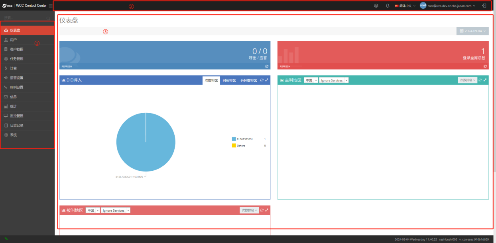

### 1.2.2 核心功能模块详解 

#### a. 仪表盘:

- **核心作用**：系统数据总览中心，快速掌握业务运行状态。

- **关键数据**：显示呼出 / 应答统计、登录坐席总数、DID 呼入数据（次数 / 时长 / 分钟数排名）、主叫 / 被叫地区分布等核心指标。

- **操作提示**：部分数据支持点击刷新（REFRESH）获取实时数据，数据卡片可根据需求调整显示顺序。

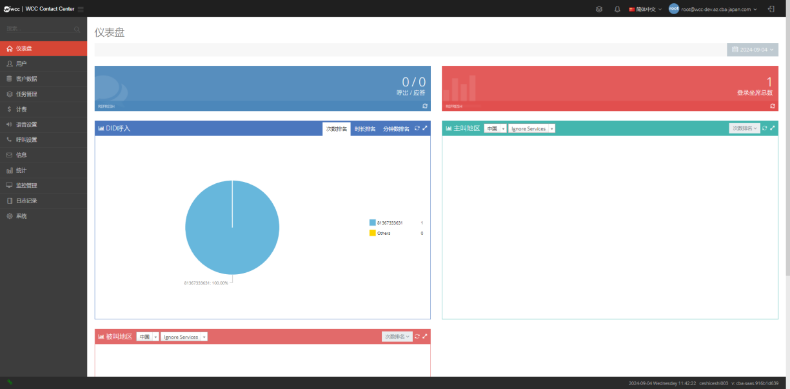

#### b. 用户: 

包含代理商、Clients、账户、角色和权限四大子模块，实现分级用户与权限管控
   
##### 代理商： 

- **功能定位**：管理一级合作代理商，支持添加、编辑、删除操作。

- **添加流程**：

1.点击【添加】，进入【常规】设置，填写必填项（域名、代理商名称、用户名、密码等）。

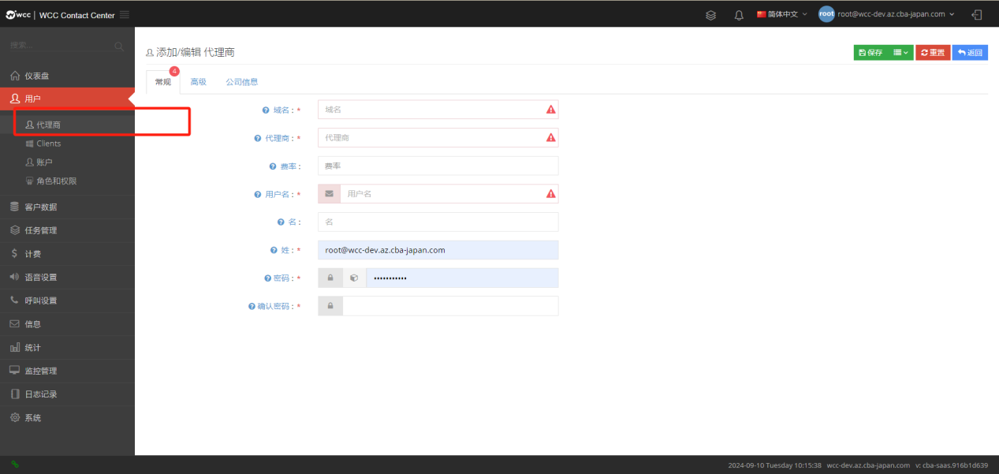

-   **域名**：唯一且不可修改，仅支持字母、数字、“.-” 组合。    

    错误情况示例：  

    ①域名填写重复时，页面会提示“xx域名重复”  

    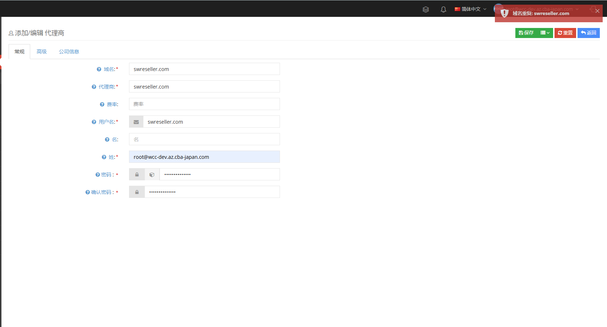  
     
    ②填写中文或特殊字符域名，页面会提示“ 请使用合法域名”   
      
    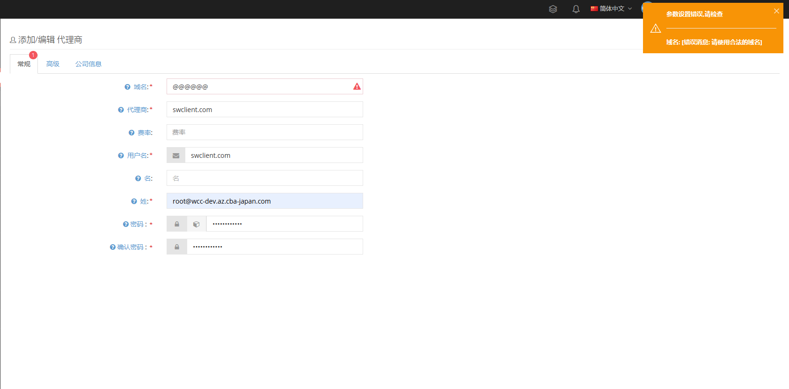  

-  **代理商**: 请指定该代理商的姓名，姓名可以随时更改。

-   **费率**：为代理商设定适用的费率范围。

-   **用户名**: 用户将使用该用户名登录系统。

-   **名**: 请填写该代理商用户的名称。

-   **姓**: 请填写该代理商用户的姓。

-   **密码**：填写用户登录密码，用户将使用此密码登录系统。

-  **确认密码**：密码需二次确认，确保输入一致。

**【 高级 】 设置 :**

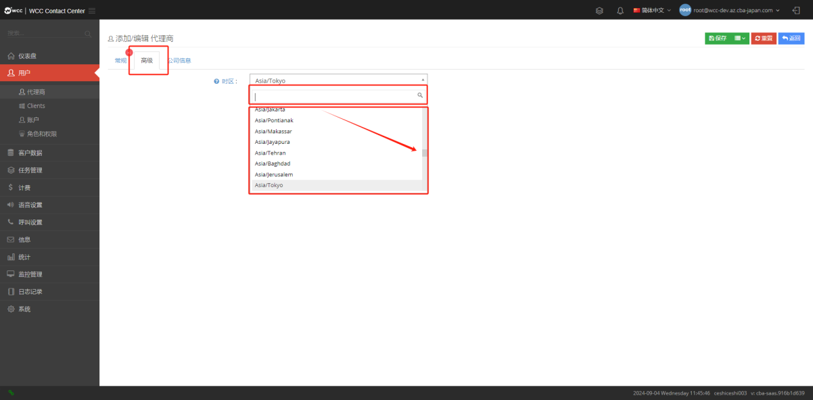

-  **时区**: 时区建议根据代理商所在地区精准配置，设置后不可修改。

**【 公司信息 】:**
公司信息基本编辑（如下图）

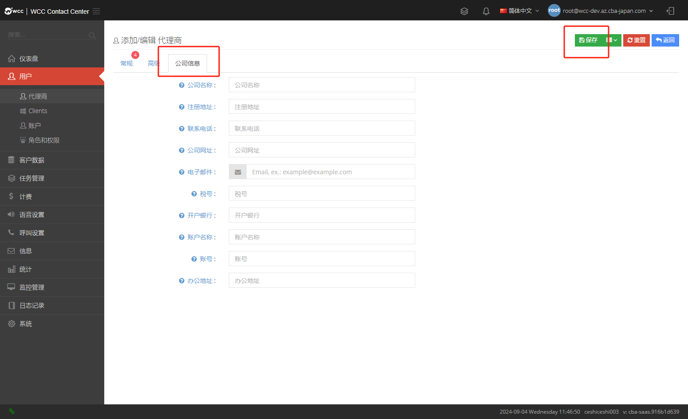

- **公司名称**:请填写这个公司的名字。

- **注册地址**: 请填写这个公司的注册地址。

- **联系电话**：请填写这个公司的联系电话。           

- **公司网址**:请填写这个公司的网址。

- **电子邮件**: 请填写公司的电子邮件地址。

- **税号**:请填写公司的税号。

- **开户银行**： 请填写这个公司的开户银行。

- **账户名称**:请填写这个账户的名称。 

- **账号**: 请填写账号。

- **办公地址**: 请填写办公地址。

##### Clients:

- **创建权限**：由代理商用户创建，系统用户可查看所有代理商名下的 Clients 账号。

- **核心操作**：支持编辑、删除、查看 Clients 信息，可通过域名、客户名称、用户名等关键词全局搜索。

- **列表字段**：包含序号、域名、客户名称、验证串、用户名、创建日期、最后更新等关键信息，支持显示 / 隐藏字段自定义列表。

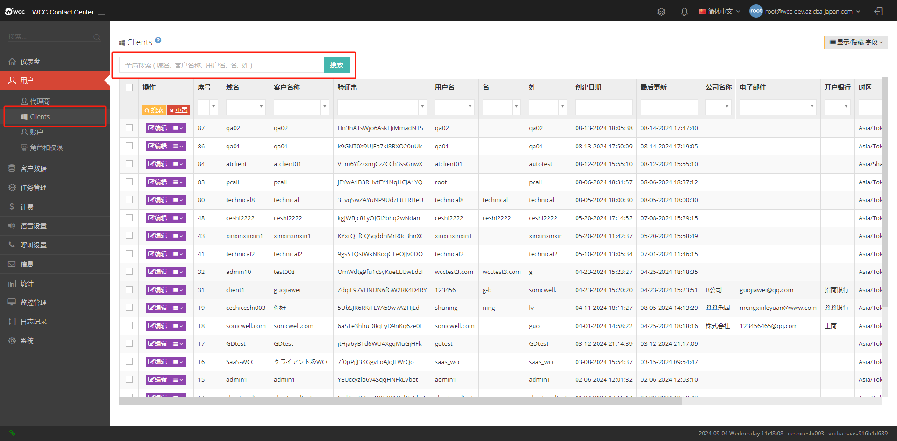

##### 账户:

- **功能作用**:管理系统操作账户，分配不同权限角色以控制功能访问范围。

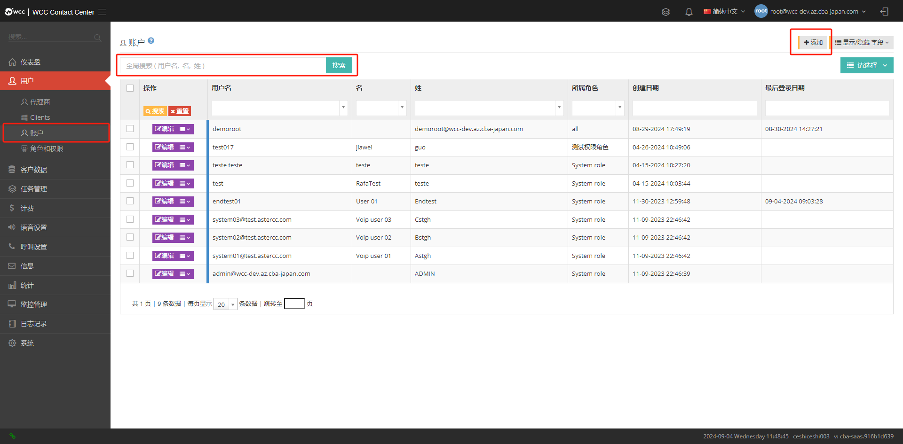

选择【添加】并输入【通用】设置：（如下图所示）

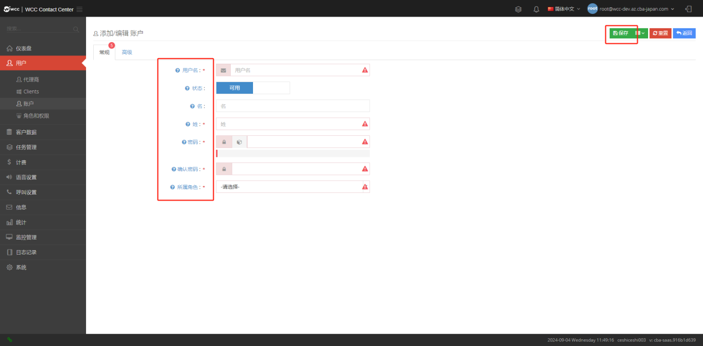

- **用户名**: 用户将使用该用户名登录系统。

- **状态**:您可以选择启用/禁用该帐户。

- **名**: 请输入用户的名。

- **姓**: 请输入用户的姓。

- **密码**: 用户将用此密码进行系统登录。

- **确认密码**：请再次输入密码，确保两次密码相同。

- **所属角色**：根据账户职责选择对应权限角色（如系统角色、测试权限角色等）。

在【高级】设置中，可添加账户备注信息，便于后续管理识别。

##### 角色和权限: 

- **权限逻辑**：通过 “角色创建→权限配置→账户分配” 实现精细化权限管控。

- **权限设计**：勾选对应页面的操作权限（显示、添加、编辑、删除等），支持按模块批量配置。

- **适用场景**：不同部门或岗位的账户分配对应角色，避免越权操作（如财务账户仅分配计费相关权限。

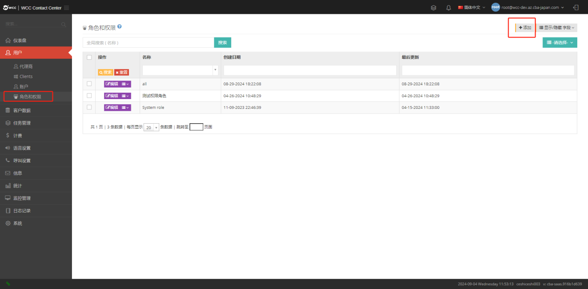

单击【编辑】/【添加】，然后输入【通用】来命名角色：（如下图所示）

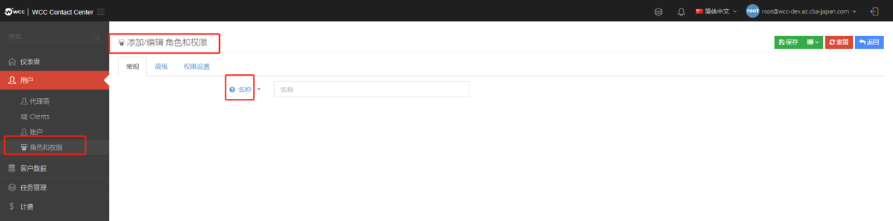

【高级】设置:

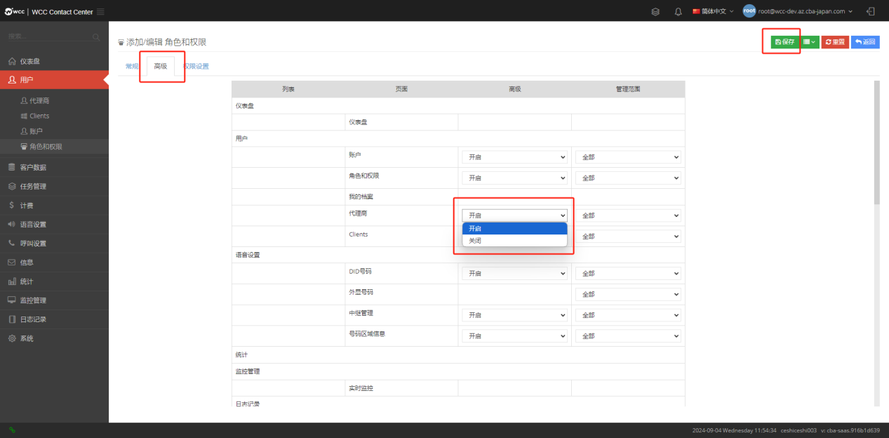

【权限设置】:

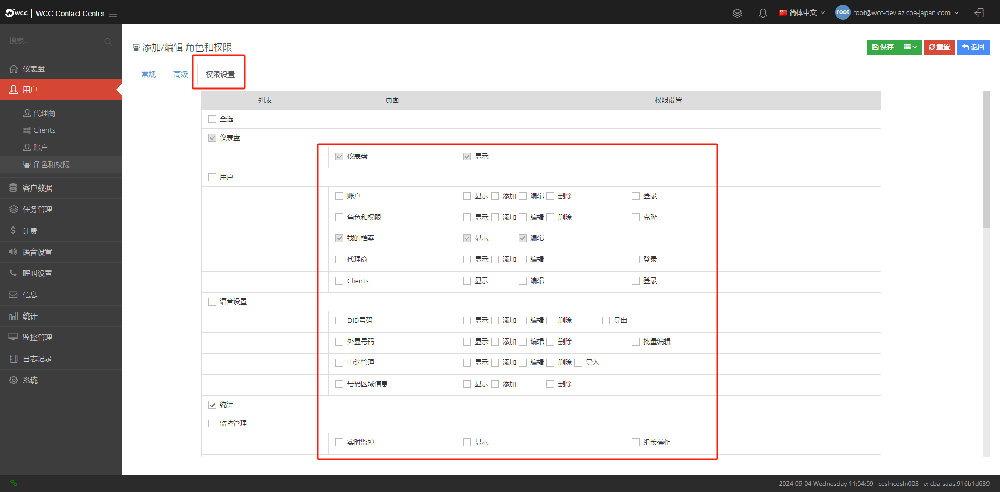

#### c. 客户数据:

包含客户标签、数据来源两大子模块，用于客户信息分类与溯源管理

##### 客户标签:

客户标签的主要功能是为客户添加自定义标签，便于按标签快速筛选查找客户。点击【添加】，输入标签名称，可选填备注信息，支持编辑、删除已有标签。

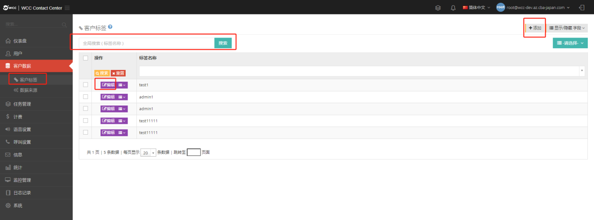

单击【添加】以进入【常规】设置：（如下图所示）

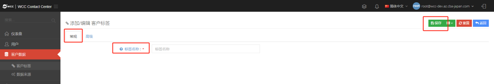

-   **标签名称**：请输入客户标签的名称。

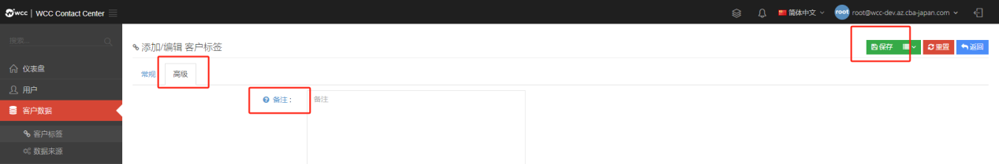

##### 数据来源

数据来源的主要功能是记录客户数据的导入来源，用时间和颜色标记区分，便于数据追溯。

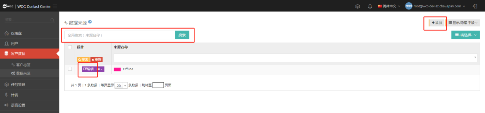

单击【添加】以进入【常规】设置：（如下图所示）

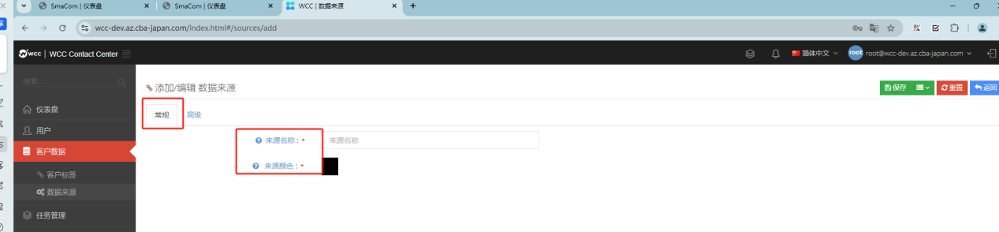

-   **来源名称**：请输入数据来源的名称。

-   **来源颜色**: 请选择客户数据来源的颜色。

**在【高级】设置中可以设置备注信息（如下图）>**

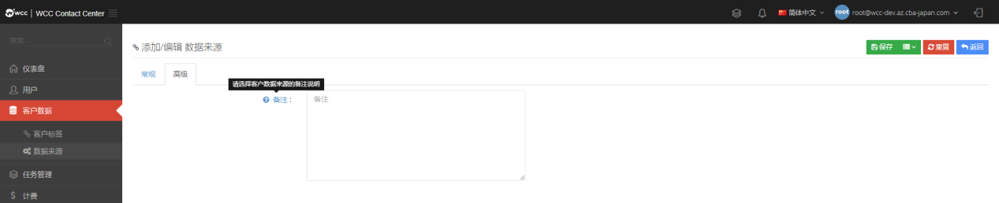

#### d.任务管理：

核心子模块为呼叫结果管理，用于规范坐席通话结果记录

##### 呼叫结果

自定义通话结果分类，关联销售漏斗状态，便于业务数据统计分析。


选择【添加】，进入【常规】设置：（如下图）

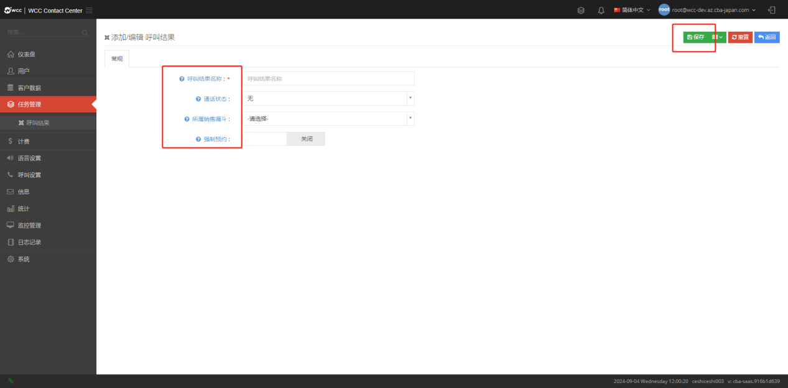

- **呼叫结果名称**:输入呼叫结果名称（如 “已付费”“成功”“未应答” 等）。

- **通话状态**:选择通话状态（应答 / 未应答 / 无）。

- **所属销售漏斗**：销售漏斗（成功 / 失败 / 要追踪）。

- **强制预约**:开启后需建立预约才能保存客户信息与联系记录。

#### e. 计费: 

包含客户计费、费率计划两大子模块，实现费用核算与费率配置

##### 客户计费

管理代理商的计费规则、信用额度、消费统计等财务信息。

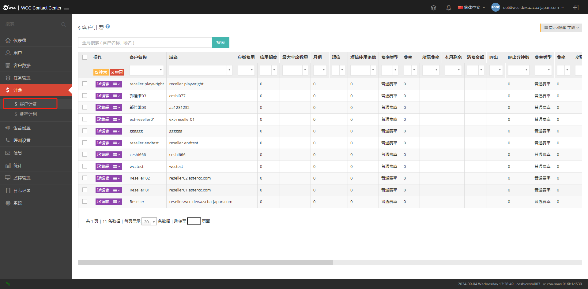

单击【编辑】进入【常规】设置：（如下图所示）

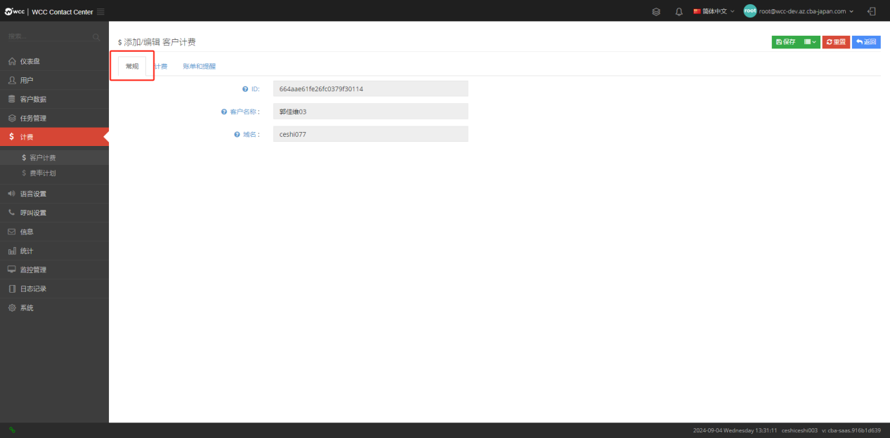

- **ID**： 唯一id。

- **客户名称**: 添加一个客户名称，添加后不能更改。

- **域名**: 添加一个域名，域名保存后不能更改。

【计费】设置：（如下图）

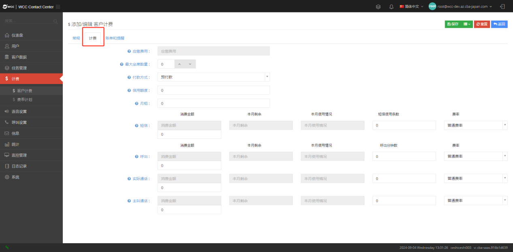

- **应缴费用**： 应当缴纳的本期费用。

- **最大坐席数量**： 允许使用的最大坐席数量。

- **付款方式**： 选择付款方式预付款或后付款。

- **信用额度**： 设置可使用的信用额度。

- **月租**： 设置月租数额。

- **短信**：能够详细了解本月短信的消费情况、本月剩余时间、手动添加使用的短信数量，并选择SMS 费率。

- **呼出**：能够了解更多关于本月和本月剩余时间呼出的钱的消耗情况。您可以手动添加套餐分钟数和费率。

- **实际通话**：当系统拨打至座席电话后，由座席电话回拨给客户，客户接听时即产生费用。

- **主叫通话**： 由系统拨打到坐席绑定电话的呼叫流程计费情况设置。

**【账单和提醒】设置:**


- **余额不足提醒**： 设置余额不足后的提醒次数。

- **提醒方式**： 选择手机号码或者邮箱的提醒方式。

- **账单电子邮件地址**： 填写收到账单的电子邮件地址。

在支持充值、费用扣减操作，填写金额与备注后点击【立即生效】即可更新账单信息。（如下图）

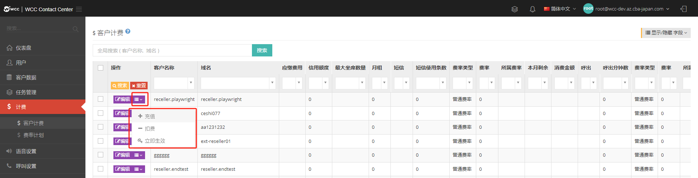

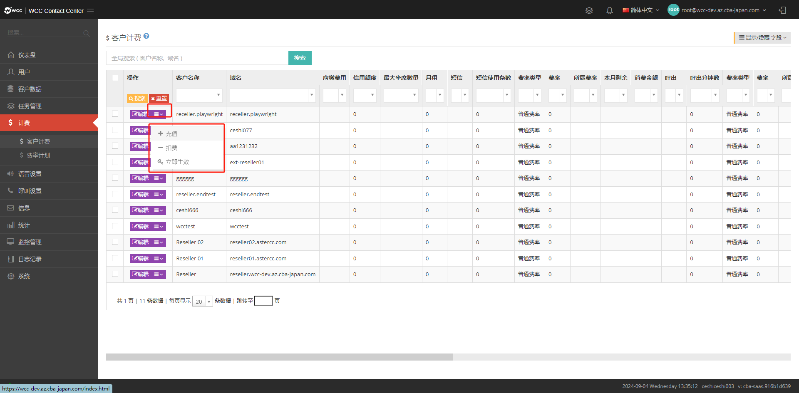

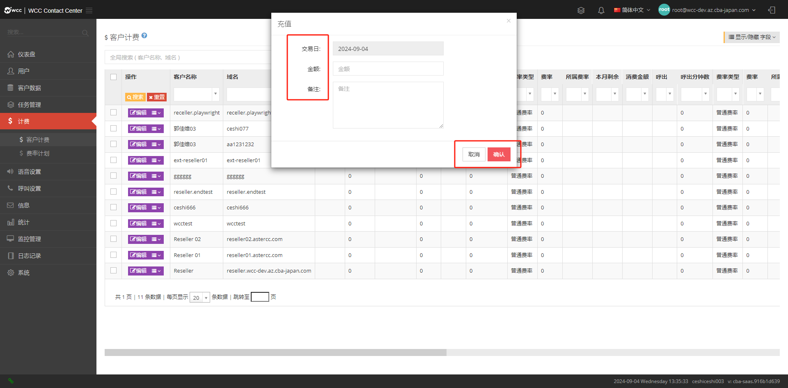

##### 费率计划:

分为销售费率与成本费率，可根据业务场景创建不同计划。

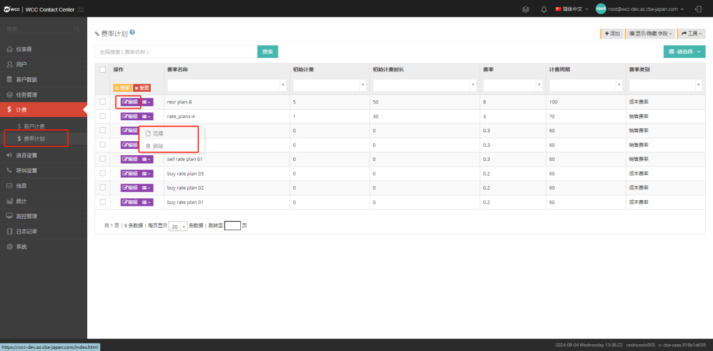

选择【添加】，进入【常规】设置：（如下图）

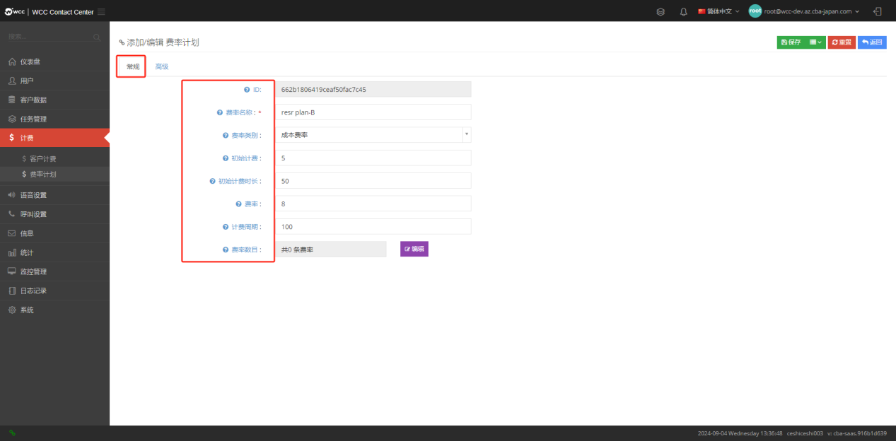

- **费率名称**： 请为这个费率命名。

- **费率类别**：请选择一个费率类别。

- **初始计费**:初始计费是在初始时长内，每分钟的费率,相当于起步价，单位是元/分。

- **初始计费时长**:初始计费相当于 “起步价”，适用于短时长通话计费，单位是秒。

- **费率**:初始计费后每分钟的费率，单位是元/分。

- **计费周期**:计费周期建议根据行业常规设置（如 60 秒 / 次），单位是秒。

- **费率数目**：编辑所要选择的费率数目。

**【 高级 】 设置:**

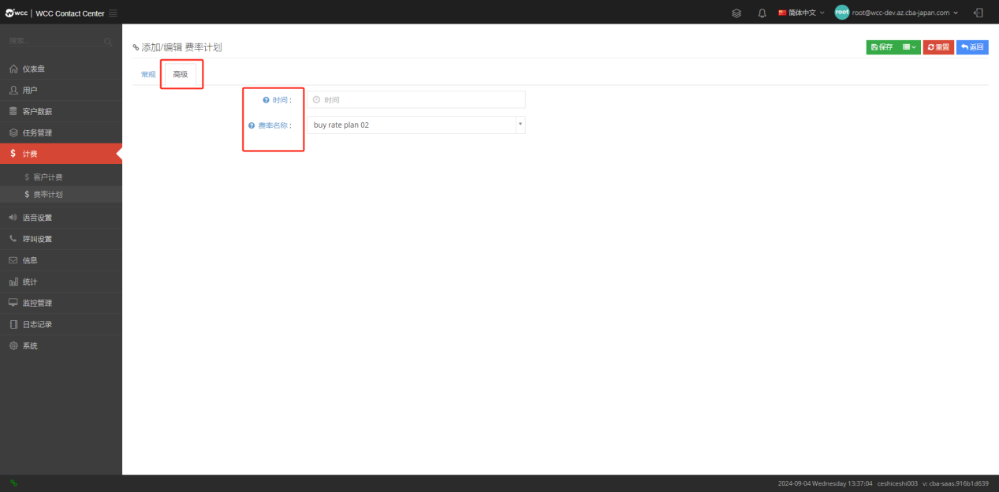

- **时间**：请选择这个费率计划开始执行的时间。

- **费率名称**: 请选择一个已添加的费率计划。

#### f. 语音设置: 

包含中继管理、DID 号码、外显号码、号码区域信息四大子模块，核心配置通话线路与号码资源

##### 中继管理:

连接本机电话网络与外部系统的线路管理，支持 UDP 协议，三种验证方式。

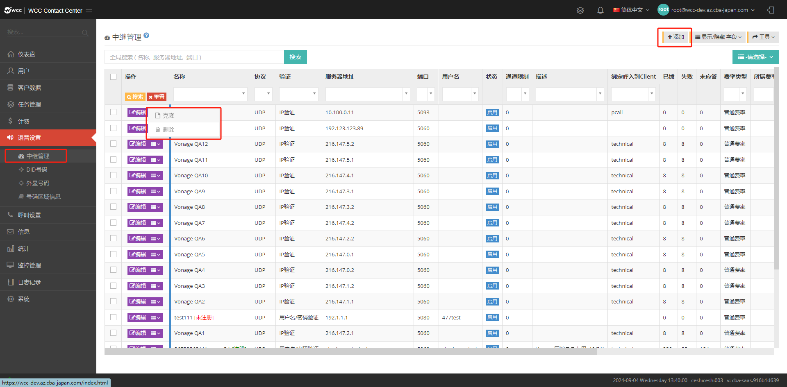

选择【添加】并输入【常规】设置：

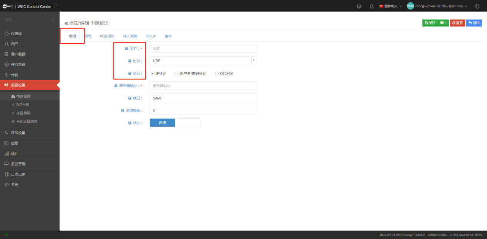

- **名称**：给中继起个名字，你可以随时改变他。

- **协议**：请选择这个中继的协议类型。

- **验证**：请选择这个中继的验证方式.
    以下步骤根据验证方式不同有所差异，添加管理中继管理接口【验证方式】，系统默认为【IP】（仅需填写服务器地址与端口，无需额外认证，如下图）

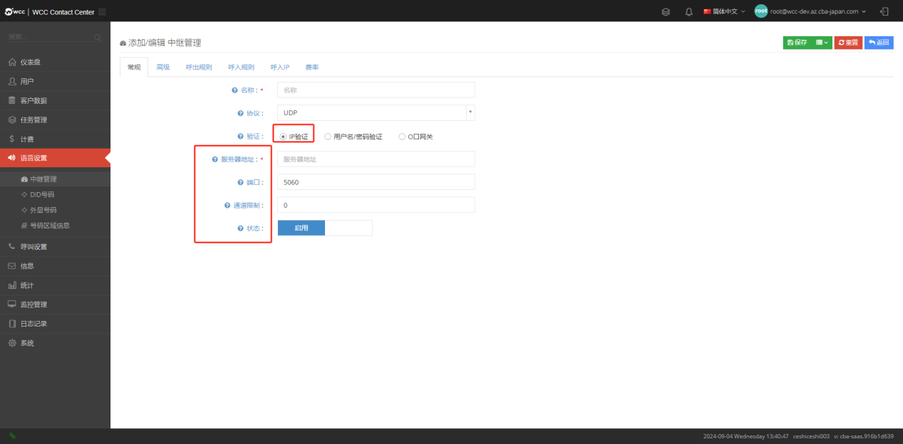

- **服务器地址**：请输入这个服务器的地址，它可能是一个域或者IP。

- **通道限制**：通道限制数表示最多有多少外拨电话数，0表示无限制。

- **状态**: 根据你的需要你可禁用这个中继。

添加编辑中继管理界面【验证】，然后选择【用户名/密码】（需启用注册，填写注册服务器、语音编码、用户名、密码等信息，如下图）

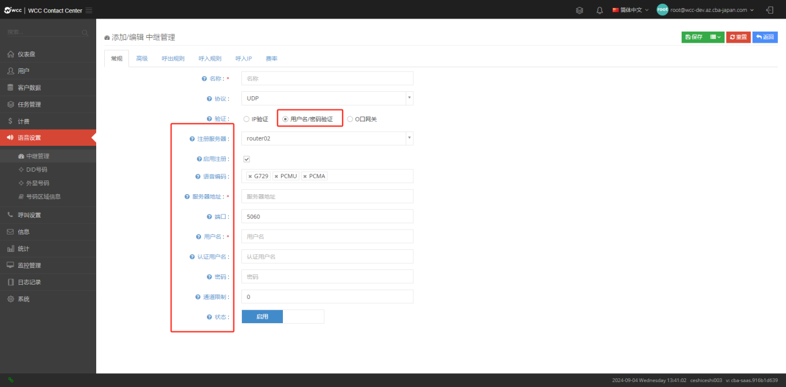

- **注册服务器**： 请选择一个注册服务器。

- **启用注册**： 当验证方式是用户名/密码时，你可以选择是否启用注册，若启用注册需要继续填写注册信息。

- **语音编码**： 当验证方式是用户名/密码验证时，请选择这个中继的语音编码。

- **服务器地址**： 请输入这个服务器的地址，它可能是一个域或者IP。

- **端口**： 请输入这个中继的端口号。

- **用户名**:当验证方式是用户名/密码验证时，请输入用户名。

- **认证用户名**： 认证这个用户名。

- **密码**：当验证方式是用户名/密码验证时，请输入密码。

- **通道限制**：通道限制数表示最多有多少外拨电话数，0表示无限制。

- **状态**： 根据你的需要你可以禁用这个域。

添加管理中继管理接口【身份验证】，然后选择【O端口网关】（需选择验证域，其他字段按需补充，如下图）。

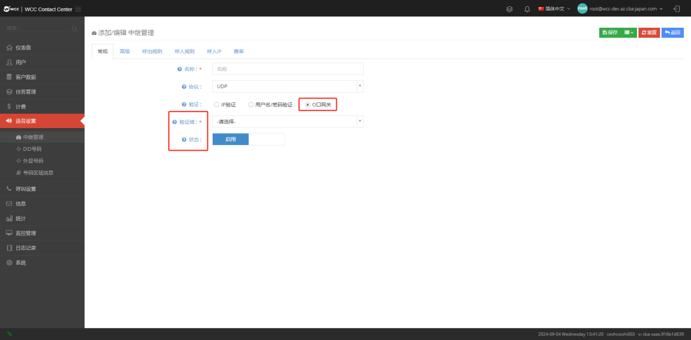

- **验证域**： 需要验证的域。

- **状态**： 根据你的需要你可以禁用这个域 。

在中继管理中，选择【编辑】将显示拨出、失败和未接收到消息（如下图所示）

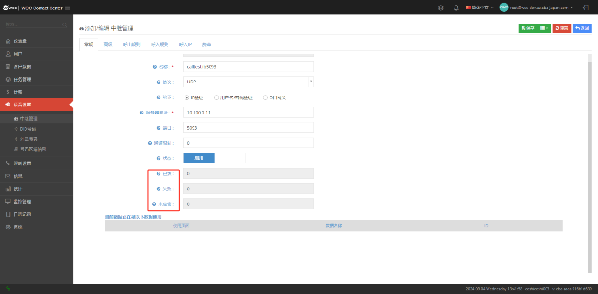

- **已拨**： 已拨打电话总数量。

- **失败**： 已拨打电话失败数量。

- **未应答**： 已拨打电话未应答数量。

【高级】设置：（如下图所示）

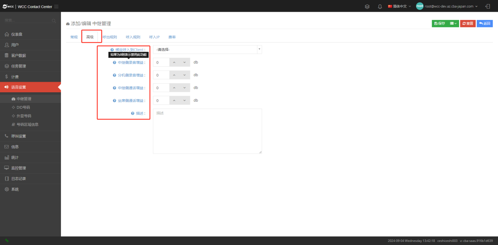

- **绑定呼入到 client**：您可以将此中继线绑定到某个Client，然后来自此中继线的所有呼叫都将发送到此Client。

- **中继侧录音增益**：如果为0则表示禁用此功能。

- **分机侧录音增益**：如果为0则表示禁用此功能。

- **中继侧通话增益**：如果为0则表示禁用此功能。

- **坐席侧通话增益**：如果为0则表示禁用此功能。

- **坐席注册超时时间**：在启用注册时，您可以输入注册超时。（只有在“【常规】”设置中选择“【用户名/密码】”时才会显示此项目）

- **描述**：你可以填这个中继的描述信息，进行备注说明。

【呼出规则】设置：选择【添加呼出规则】进入添加呼出规则页面，通过此中继呼出的电话将使用此呼出规则。【呼入规则】与【呼出规则】类似。（如下图） 


- **名称**: 请为这个呼出规则命名。

- **匹配规则**:设置这个匹配规则，符合此规则的呼叫将执行以下操作。

- **替换主叫号码**:在这里你可以重新设定主叫号码和主叫号码名称。

- **增加主叫号码前缀**:系统将为主叫号码增加前缀。对于SIP设备，主叫号码还支持使用主叫名称。

- **被叫号码**:你可以添加/移除被叫号码前缀或者重置被叫号码。

- **转向**: 路由匹配时系统将进行此动作。

【呼入IP 】设置:

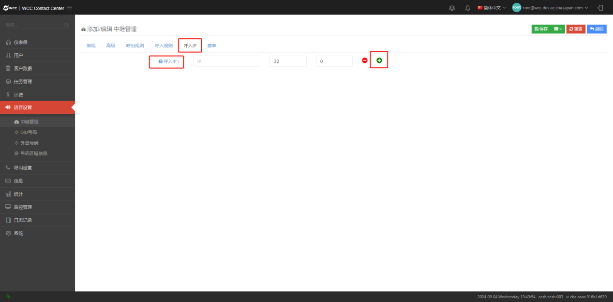

- **呼入IP**:设置允许接入的IP地址，可以同时添加多个IP地址。  
  
  **【补充说明：具体操作】：**  
  
   设置呼入IP相当于设置一个IP白名单。  
     
    例：在saas dev与saas stg两个环境中操作（注：saas stg环境中必须有一个能对接到saas dev环境的中继，以及配置好的外呼档案）  
      
    ①在saas dev-中继设置-呼入IP中设置一个stg-IP，点击保存  

    ②登录一个使用上述中继的client，设置did转向（例：转向到坐席A）  

    ③在saas stg环境中登录坐席B，坐席B呼叫saas dev环境的did号码  

    ④此时坐席A会振铃  

    ⑤如果将 saas dev-中继设置-呼入IP中设置的stg-IP删掉，保存的话  
      
    ⑥此时，坐席B再次呼叫saas dev环境的did号码，通话不会被建立，坐席A也不会振铃。

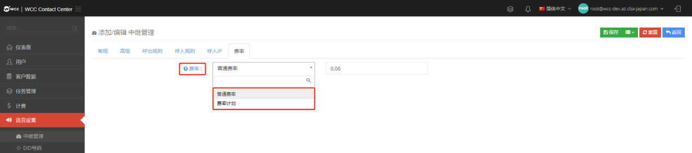

   **费率**: 缴纳费用的比率。 

- 普通费率：没有初始时长计算，只按照每分钟的计费方式计算费率。

- 费率计划：根据已设置好的费率计划选择计费。

##### DID 号码:

电信运营商提供的外线呼入接入号码，可设置不同呼入路由（如转接分机、IVR、队列等）

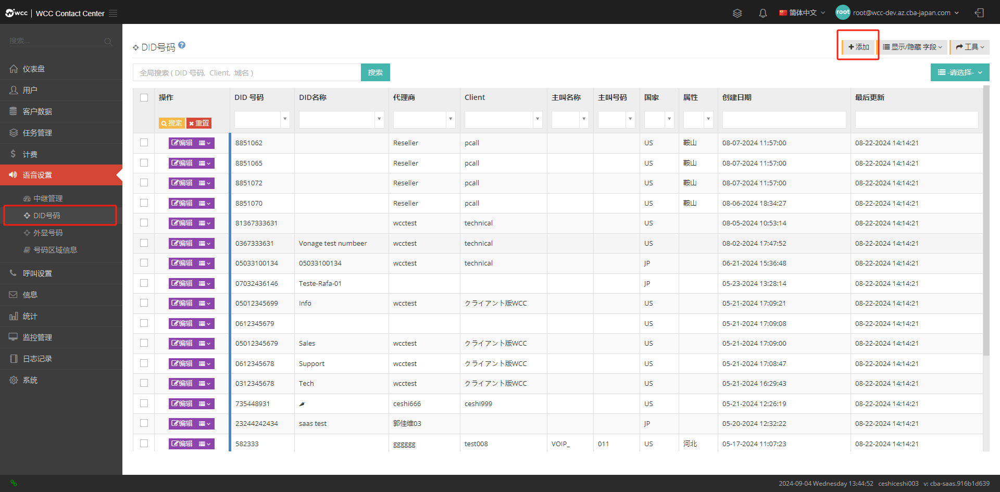

点击添加添加一个新的中继：

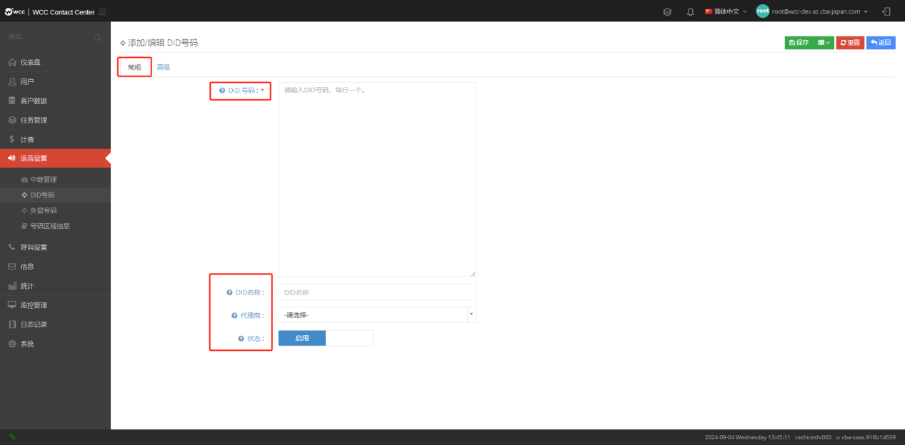

- **DID号码**: 请输入did号码，每行一个。

- **DID名称**: DID名称用于帮助你在系统中识别该号码，在统计时如果设置了DID名称，则会使用此名称。

- **代理商**: 请为这个did号码选择一个代理商。

- **状态**: DID号码禁用后, 呼入到当前DID的来电将不可用。

【 高级设置 】 设置: 您可以选择一个国家并填写注释和说明。


##### 外显号码: 

坐席呼叫客户时显示的号码，支持多供应商与费率计划关联。


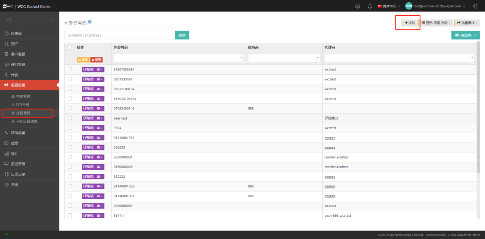

**选择【添加】，进入【常规】设置：（如下图）**

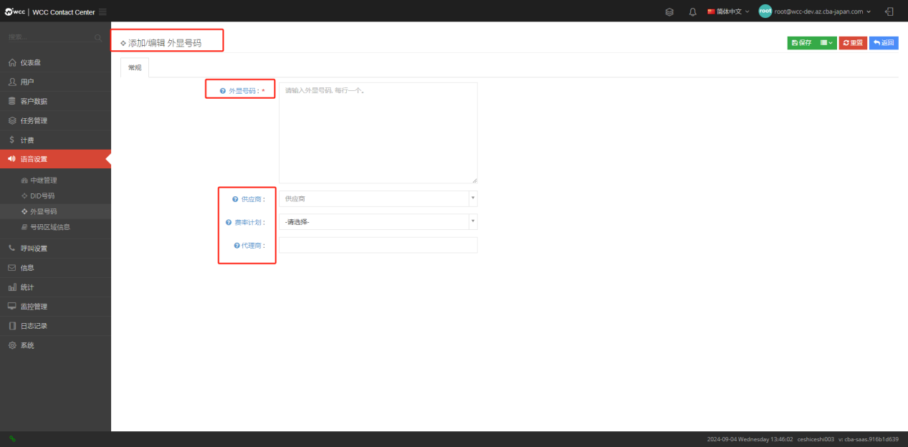

- **外显号码**： 请输入您要添加的外显号码，每行一个。

- **供应商**： 你可以为这个外显号码选择一个供应商。

- **费率计划**： 你可以为这个外显号码选择一个费率计划。

- **代理商**： 你可以为这个外显号码选择一个代理商。

##### 号码区域信息:

配置号码归属地，系统可通过号码前缀匹配 DID 归属地（更新后显示在 DID 页面 “属性” 栏）。

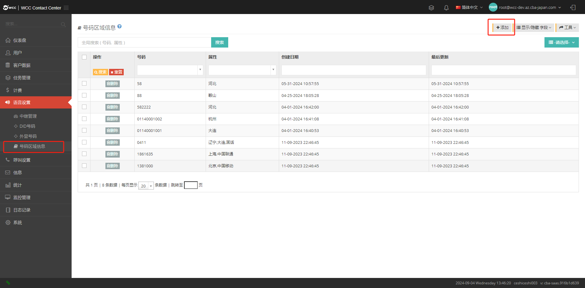

**选择【添加】并输入【通用】设置：（如下图所示）**

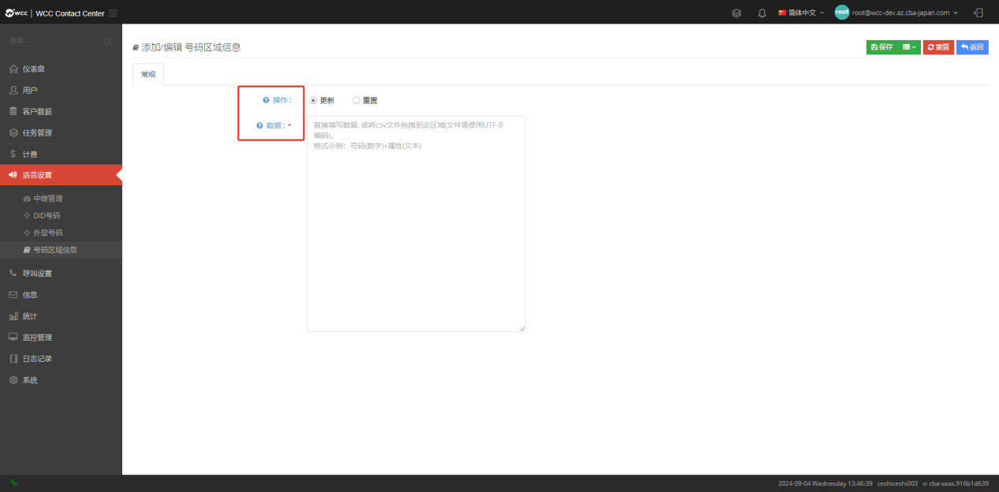

- **操作**:

> 更新：如果表内数据与当前设定的数据有重复，以设定的数据为准，对表进行更新。
>
> 重置：清空表内所有号码区域信息，再将当前设定的数据导入表内.

- **数据**: 直接填写数据,或将csv文件拖拽到此区域(文件需使用UTF-8编码)。格式示例：号码(数字)+属性(文本)

#### g. 呼叫设置: 

涵盖节点管理、呼叫限制次数、外呼档案、暂停原因、话机部署模板五大子模块，优化呼叫流程与设备配置。

##### 节点管理:

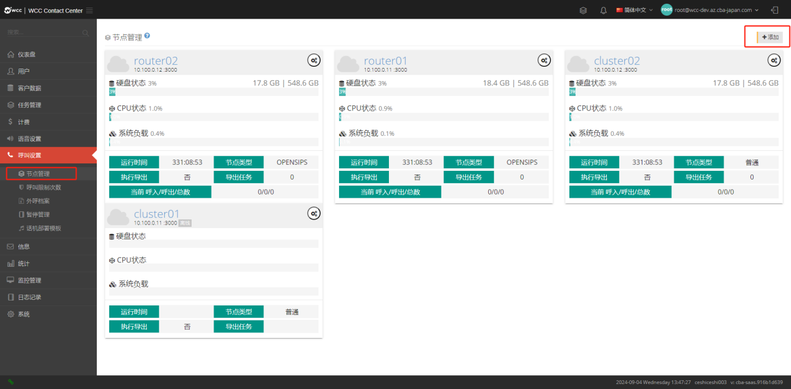

**选择【添加】并输入【通用】设置:**

- **节点类型**: 选择节点类型，分为【普通】和【 Opensips 】。系统默认为【 普通 】

> 当节点类型为普通时：（如下图）
>
> 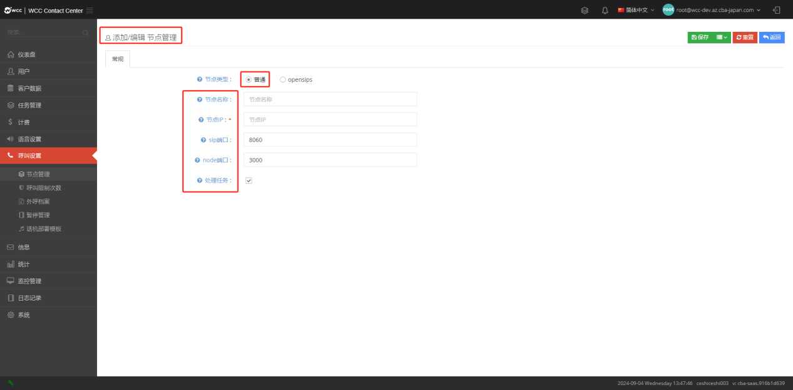

- **节点名称**：给这个节点起一个名字便于识别。媒体网关与节点的相应配置需要与该名称一致。

- **节点 IP**： 请输入astercc服务器的IP地址。

- **Sip端口**： 节点http端口 默认值为3000。

- **Node端口**： 客户端webrtc使用的地址。

- **处理任务**： 是否执行导出任务。

当节点类型为 opensips 时：（如下图）

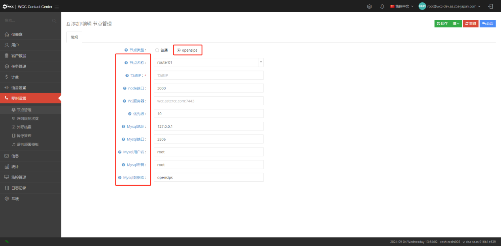

- **节点名称**：给这个节点起一个名字便于识别。媒体网关与节点的相应配置需要与该名称一致。

- **节点 IP**： 请输入astercc服务器的IP地址。

- **Node端口**： 客户端webrtc使用的地址。

- **WS服务器**: 客户端webrtc使用的地址。

- **优先级**：WS服务器的使用优先级,坐席将优先连接优先级大的ws服务器.数值越大优先级越高.。

- **Mysql地址**： 填写 Opensips 使用的 MySQL 地址。

- **Mysql端口**： 填写 Opensips 使用的 MySQL 端口。

- **Mysql用户名**：填写 Opensips 使用的 MySQL 用户名。

- **Mysql密码**： 填写 Opensips 使用的 MySQL 密码。

- **Mysql数据库**： 填写 Opensips 使用的 MySQL 数据库。

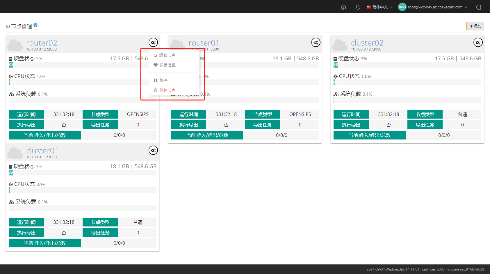

- **编辑节点**： 编辑这个节点。

- **健康检查**： 对节点进行健康检查。

- **暂停**： 暂停这个节点的使用。

- **删除节点**： 删除这个节点

##### 呼叫限制次数:

- **功能作用**：限制特定号码的呼叫频次，适用于防骚扰或合规管控。

- **添加规则**：选择时间周期（如 “天”），设置最大呼叫次数，超出次数后通话将被限制。

- **搜索提示**：支持搜索呼叫限制前的拨号次数，而非被限制的次数，需注意区分搜索逻辑。

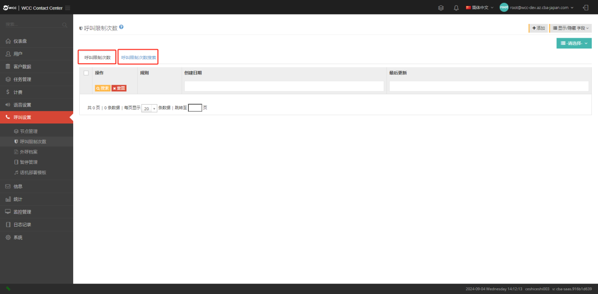

**选择【添加】并进入【通用】设置：（如下图）**

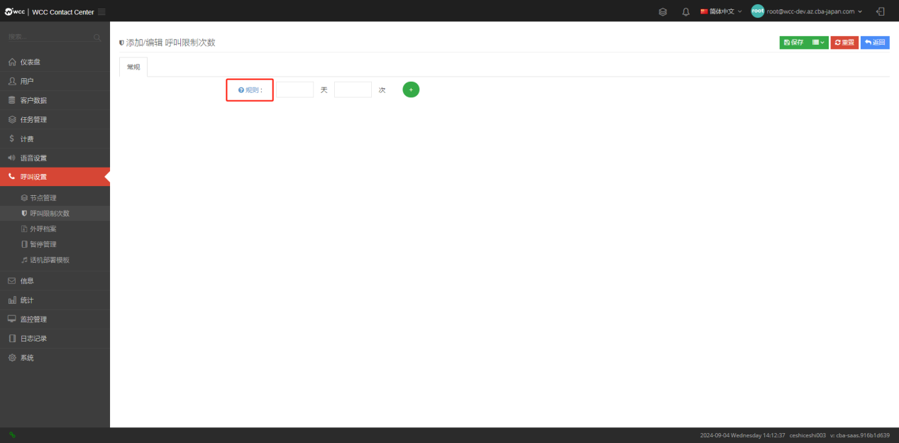

- **规则**： 你可以在 M 天内呼叫 N 次超出设置次数通话会被限制。

##### 外呼档案: 

为坐席配置外呼中继线路，支持多路由按顺序匹配。

默认外呼档案，是指当client没有分配任何外呼档案时外呼所使用的外呼档案。

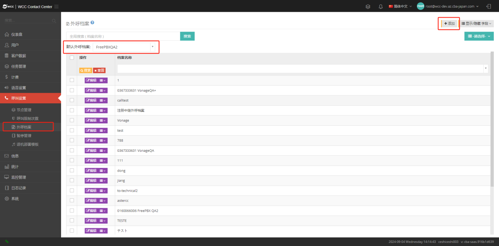

**单击【添加】以进入【常规】设置：（如下图所示）**

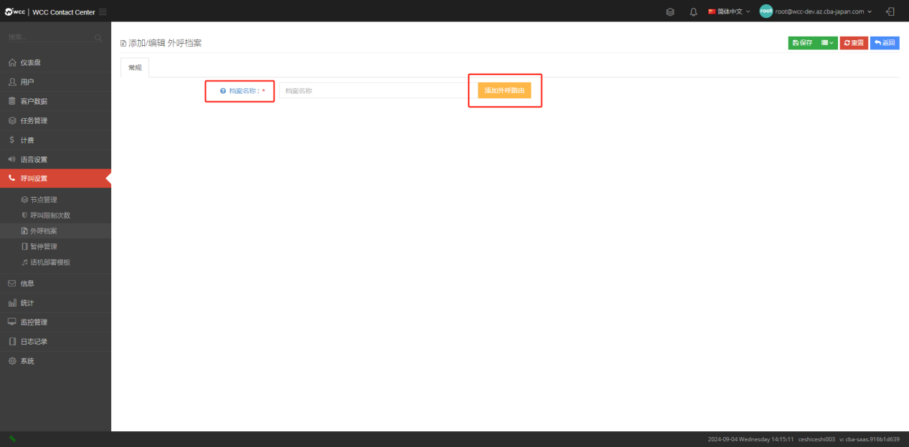

- **档案名称**：请为该外呼档案命名。

- **代理商**：请选择可以使用该外呼档案的代理商。

设置文件名后，单击“添加外呼路由”以设置出站路由（如下图所示）

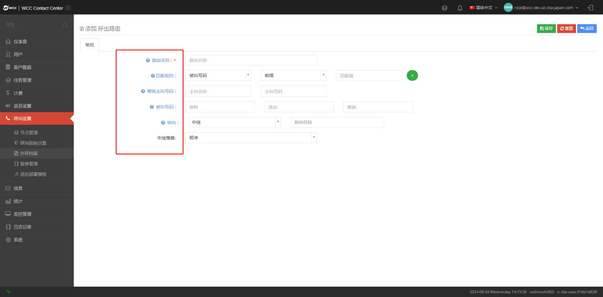

- **路由名称**： 请为该路由命名。

- **匹配规则**：设置匹配规则，满足该规则的调用将执行以下操作。如果设置了多个匹配规则，则需要匹配所有规则。

- **替换主叫号码**：在这里你可以重新设定主叫号码和主叫号码名称。

- **被叫号码**： 如果设置时选择，添加数字，在坐席拨号时就可以省略所添加的数字。如果选择移除数字，则坐席在拨号时就要增加所移除数字进行拨号。如果选择替换，则需要填写另外一个符合匹配过的完整号码。

- **转向**：路由匹配时系统将进行此动作。

- **中继策略**：

    顺序：每个来电从第一个中继开始（始终为 123）

    轮询：第一个来电按中继添加的顺序运行，第二个来电从第一个中继的下一个顺序中继开始，依此类推，第三个呼叫。（第一次是123，第二次是 231，第三次是 312）

    随机：无模式

##### 暂停原因:

坐席置忙时选择暂停原因，便于统计忙时类型，root 级别设置的原因将作为新建 Client 的默认选项。

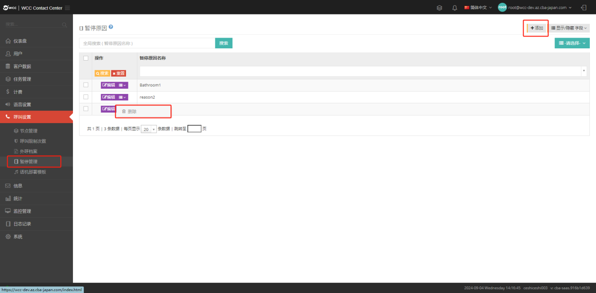

**点击【添加】进入【通用】设置：（如下图）**

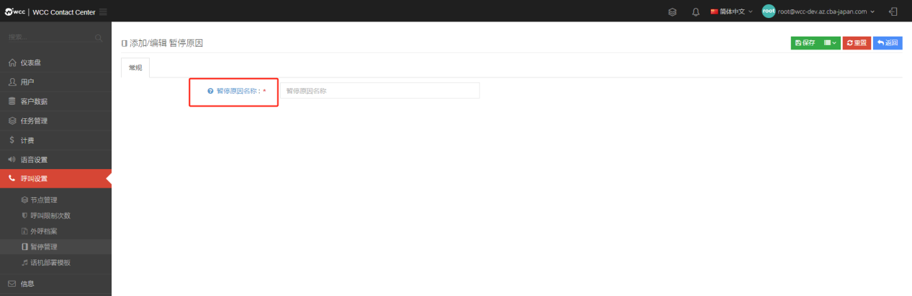

- **暂停原因名称**： 设置暂停原因为其命名。

##### 话机部署模版: 

统一配置多台话机参数，实现一键部署，节省重复配置时间。

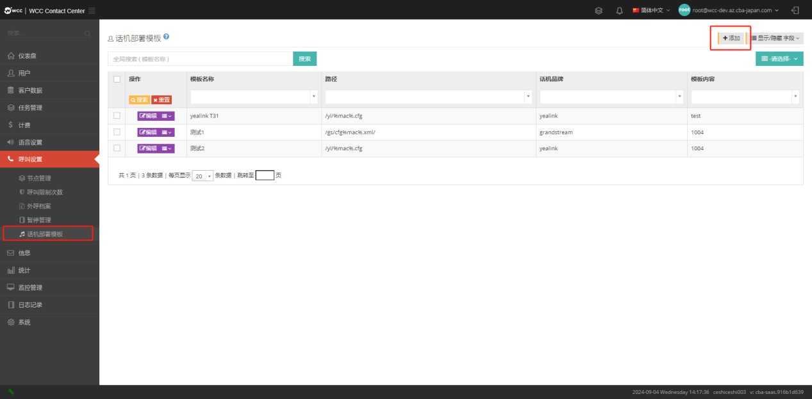

**点击【添加】进入【通用】设置：（如下图）**

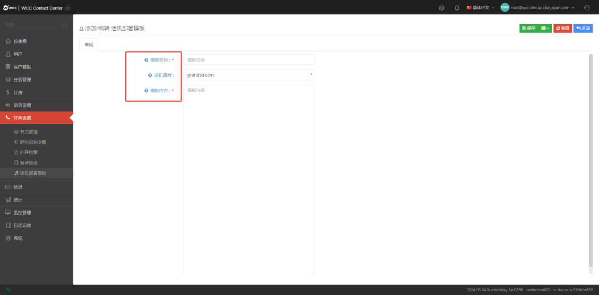

- **模版名称**：请填入模版名称。

- **话机品牌**： 请输入话机型号。

- **模版内容**： 输入模板（root或管理员提前准备的模板，不同话机的模板不同）。

#### h. 信息: 

##### 邮件服务器:

配置邮件收发服务器，支持在 Client 编辑中选择使用。

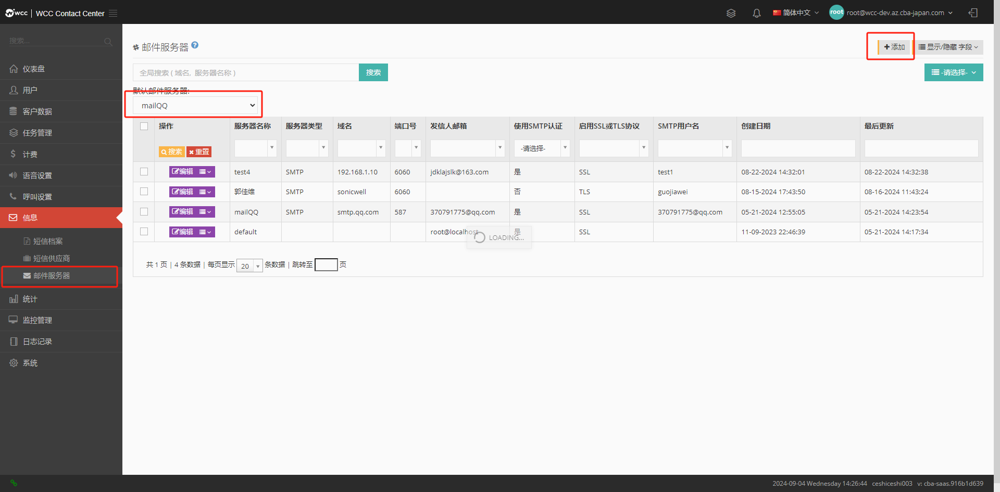

**选择【添加】并进入【通用】设置：（如下图）**

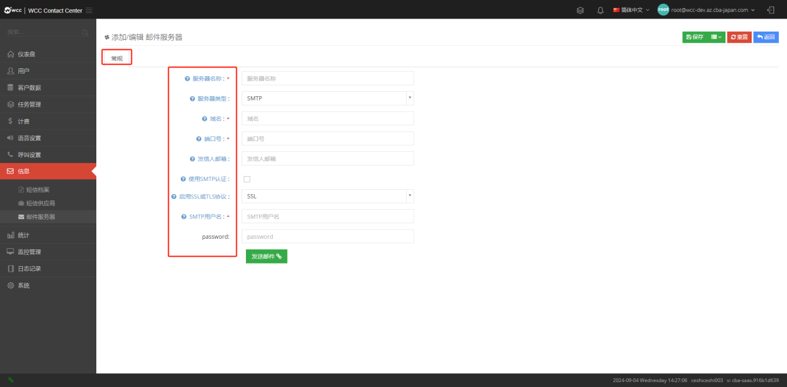

- **服务器名称**： 请为这个服务器命名。

- **服务器类型**： 请选择这个服务器的类型。

- **域名**： 请输入这个邮件服务器的域名。

- **端口**： 请输入这个邮件服务器的端口号。

- **发信人邮箱**： 请输入这个邮件服务器的发信人邮箱。

- **使用SMTP认证**: 请确认是否需要使用SMTP认证。

- **启用SSL或TLS协议**： 选择一个启动协议。

- **SMTP用户名**: 若启动SMTP认证，请输入SMTP用户名。

- **密码**： 请输入SMTP用户名对应的密码。

#### i. 统计: 

**统计报表**：目前 root 级别暂不显示具体报表，如需查看细分数据，可通过子账号或 Clients 账号登录查看对应权限报表。

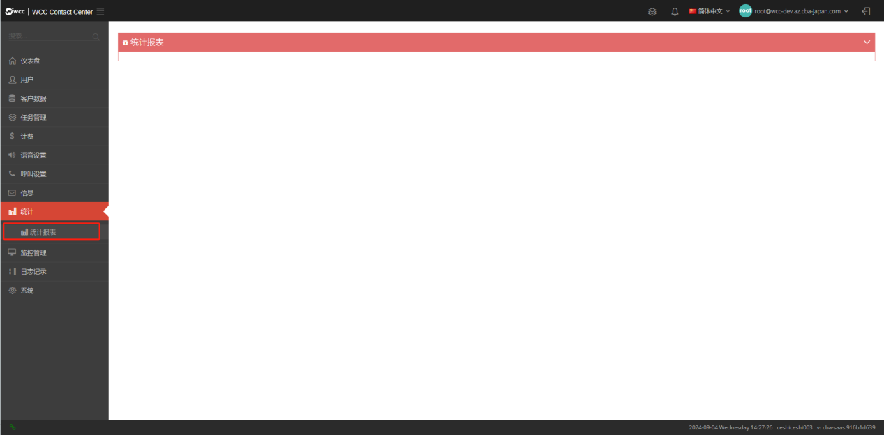

#### j. 监控管理: 

**实时监控**：查看呼入（未通话 / 退话）、呼出（未应答 / 应答）状态，及坐席实时状态（空闲 / 通话 / 暂停 / 送信等），坐席状态总数与占比直观展示。

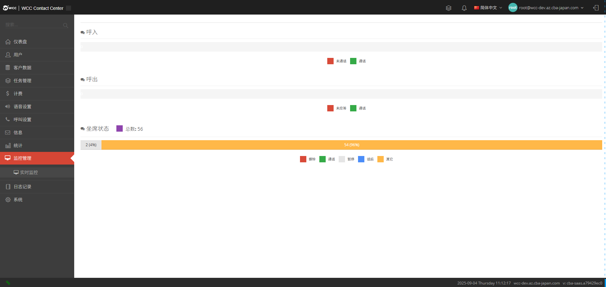

#### k. 日志记录: 

**日志记录**：追溯所有用户的系统操作，便于审计与问题排查。

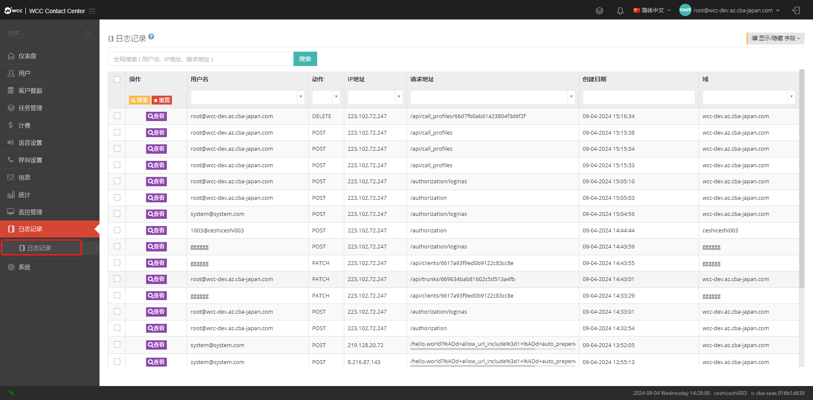

通过全局搜索（用户名、IP 地址、请求地址）快速定位目标日志，点击【查看】可查看请求参数、令牌等详细信息。


#### l. 系统: 

##### 系统偏好:

包含系统偏好、销售漏斗、后台任务、高级设置、公司信息、假期设置六大子模块，配置系统基础参数：

【 通用 】 设置页面：（如下图）

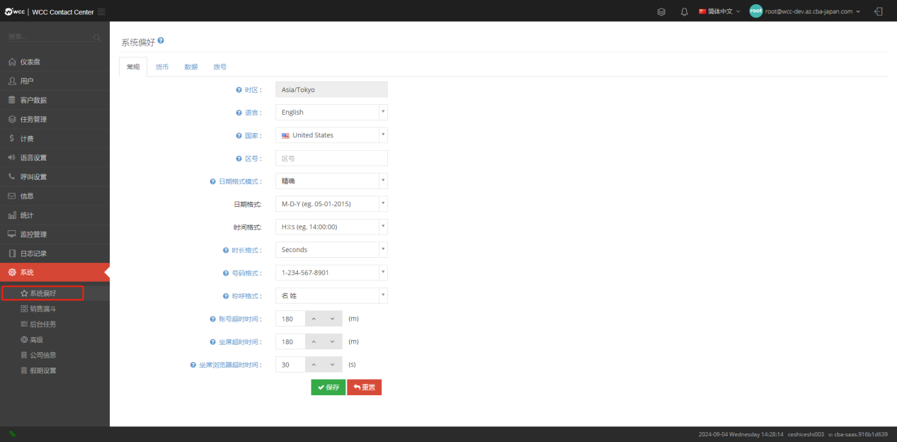

- **时区**： 当前使用的时区，默认为东京且无法修改。

- **语言**： 您可以设置语言。

- **国家**：你可以设置国家

- **区号**： 你可以设置区号。

- **日期格式模式**： 您可以设置日期格式模式。

- **日期格式**：您可以设置日期格式，在日期格式模式下选择精确模式将显示。

- **时间格式**： 您可以设置时间格式，将显示日期格式模式下的精确模式。

- **时长格式**： 您可以设置时长的格式。

- **号码格式**： 你可以设置号码的格式。

- **称呼格式**： 你可以设置姓名称呼的格式。

- **账号超时时间**： 账号登录超时时间（单位：分钟）。

- **坐席超时时间**： 坐席登录超时时间（单位：分钟）。

- **坐席浏览器超时时间**：如果代理设置为与浏览器一起使用，则当浏览器关闭并达到此超时时间时，系统将检出所有动态签入的坐席组（单位：秒）。

【货币】设置页面：（如下图）

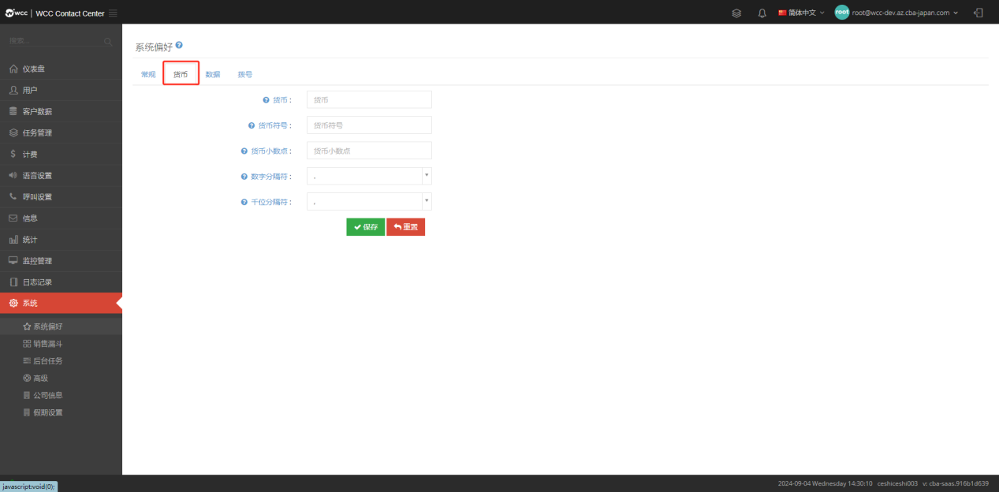

- **货币**： 设置货币。

- **货币符号**： 设置货币符号。

- **货币小数点**： 设置货币小数点

- **数字分隔符**： 设置数字分隔符。

- **千位分隔符**： 设置千位分隔符。

【 数据 】 设置页面：（如下图）

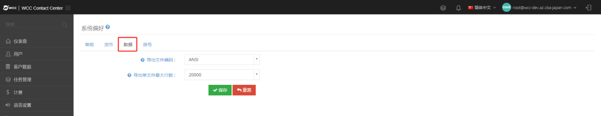

- **导出文件编**： 设置导出文件编码。

- **导出单文件最大行数**： 设置导出文件最大行数。

【拨号】设置页面：（如下图）

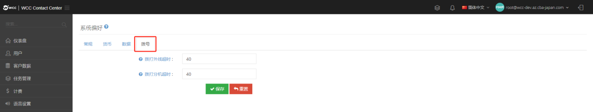

- **拨打外线超时**： 外呼振铃时长。

- **拨打分机超时**:内线振铃超时。

##### 销售漏斗: 

- **功能定位**：标记客户通话状态，关联坐席绩效评分。

- **默认类型**：成功（分值 5）、失败（分值 - 5）、要追踪（分值 0），支持自定义添加新类型。

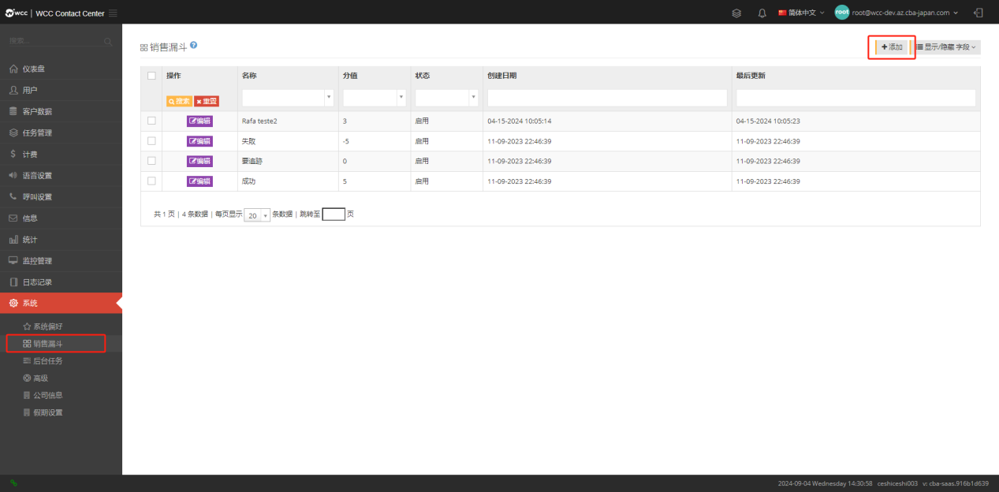

**选择【添加】并进入【常规】设置：（如下图）**

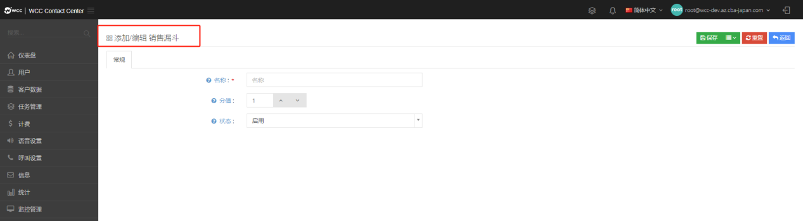

- **名称**：为此销售漏斗命名。

- **分值**： 请设置这个销售漏斗的分值，分值可体现坐席的工作情况。

- **状态**： 销售漏斗的状态:

    启用：正常显示

    隐藏：坐席不可见

    关闭：系统不可见

##### 后台任务: 

状态栏后台任务入口，可查看导入导出、数据同步等耗时任务的进度（状态、成功数、失败数），通过任务编号、文件名称全局搜索目标任务，便于跟踪大文件导出 / 导入进度。

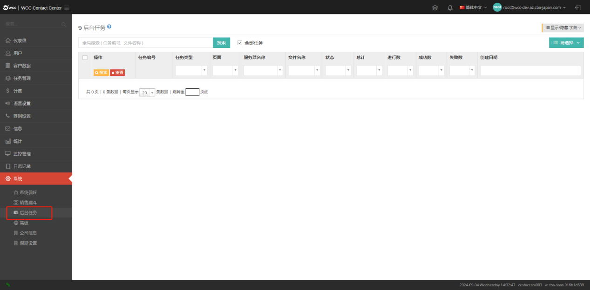

##### 高级:

可以查看和编辑某些系统设置。

**【基本】设置：（如下图）**

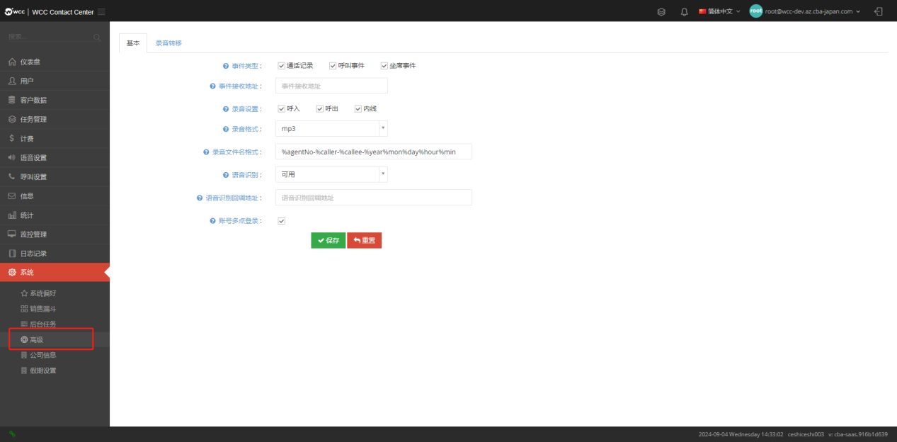

- **事件类型**;

    系统提供两种事件:通话记录:当呼叫挂断时，系统会将通话记录发布到特定的URL。

    坐席事件:系统将发布所有坐席事件，如响铃，应答，挂断，签入，签出，暂停，取消暂停等

- **事件接收地址**: 系统会将事件数据发送到此URL。如果您不需要它，请将其留空。

- **录音设置**: 请设置您需要的录音类型。

- **录音格式**: 请选择录音格式。

- **录音文件名格式**:你可以自定义录音文件的命名规则，可用的变量包括:

    ```
    %agentNo%caller-%callee%year%mon%day%hour%min%sec

    %agentNo:坐席工号

    %caller:主叫号码

    %callee:被叫号码

    %year,%mon,%day,%hour,%min,%s年-月-日-时-分-秒
    ```

- **语音识别**: 根据需要是否开启语音识别功能。

- **语音识别回调地址**:如果已配置，系统会将语音识别结果发送到此 URL。

- **账号多点登录**: 允许一个帐户多点登录。

**【录音转移】设置：（如下图）**

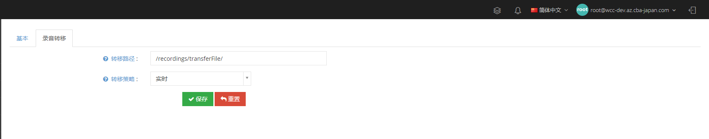

- **转移路径**: 录音合成后，系统会将文件发送到该地址。

- **转移策略**: 转移策略是实时的或定时。

##### 公司信息: 

在此页面上，您可以查看和编辑系统的公司信息。（如下图所示）

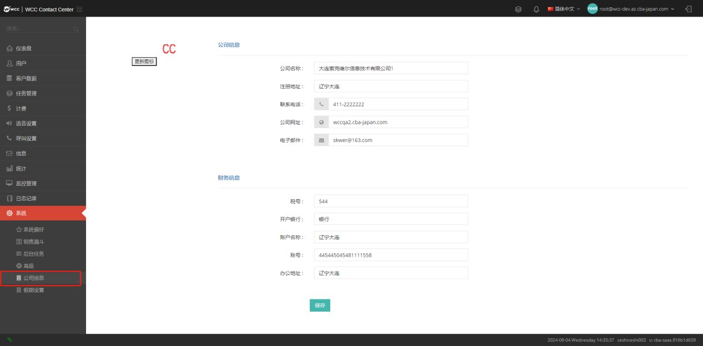

##### 假期设置 :

配置系统节假日，适配各国风俗与休假安排。（如下图所示）

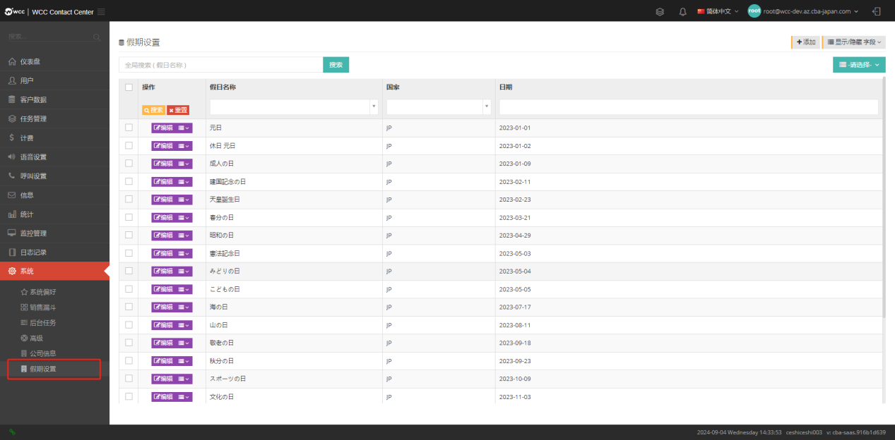

**点击【添加】进入【通用】设置：（如下图）**

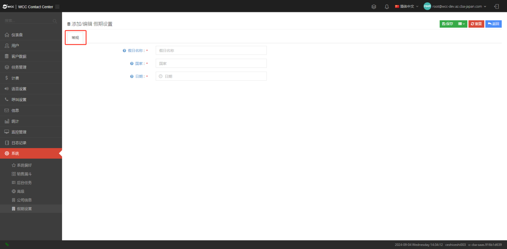

- **假日名称**: 假日名称。

- **国家**: 国家代码(ISO 3166-1 2位代码)。

- **日期**: 日期。

### 工具栏

**后台任务**:您可以在此处查看后台正在进行的任务，如图所示：如果没有正在进行的任务，它们将显示为零。（如下图所示）

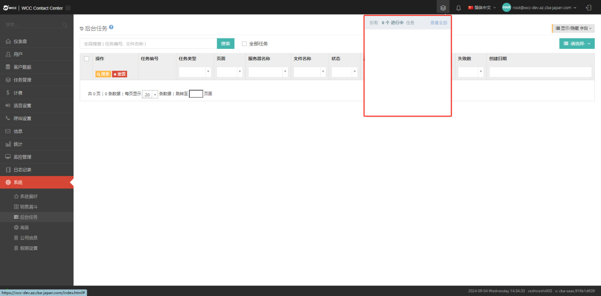

**通知**: 将显示一些新消息（如下所示）。


**语言**: Root 用户可以从此下拉菜单中选择通用语言类型（如下所示）

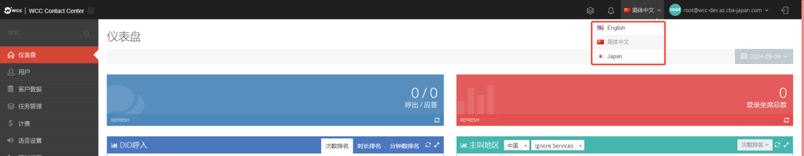

**我的档案**：编辑当前登录用户的个人信息，支持修改密码。

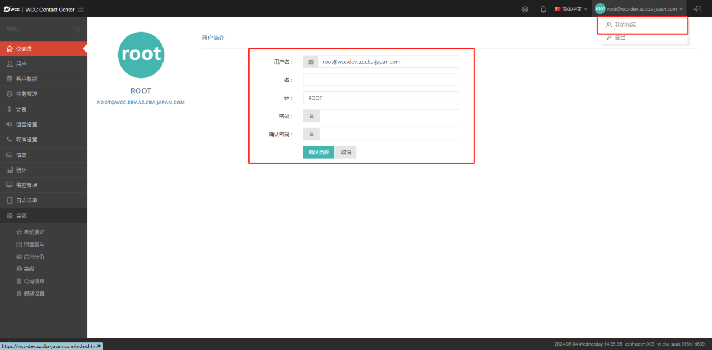

**包括“我的档案”和“注销”**

**\[我的个人资料\] 允许编辑 root 用户个人资料**

**\[登录\]退出当前登录页面**

### 注意事项

① 必填项标识：所有带 “*” 的字段为必填项，未填写将无法保存配置，需重点关注。

② 不可修改字段：域名、客户名称、节点 IP 等部分字段设置后不可修改，配置时需仔细核对。

③ 密码安全：所有账号密码需二次确认，建议定期更换，避免使用简单密码（如 123456）。

④ 数据导入：批量导入数据（如号码区域信息、客户数据）时，需确保文件为 UTF-8 编码，格式符合要求（如号码 + 属性）。


⑤ 权限管控：分配角色权限时需遵循 “最小权限原则”，避免不必要的权限开放导致数据安全风险。