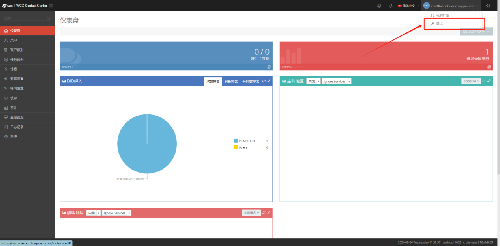

## 1.1WCC 登录

### 1.访问登录页面

打开任意主流浏览器（推荐 Chrome 90+、Edge 88+ 版本），在地址栏输入系统网址，按下 Enter 键，即可进入 WCC 系统登录页面。

### 2.填写登录信息

- **账号**：使用预先配置的专属账号（格式参考：工号 @客户名称，具体以管理员告知为准）

- **密码**：输入管理员预设的初始密码（首次登录建议立即修改，提升账号安全性）

### 3.完成登录

- 输入信息后，若为个人信任设备（如办公电脑），可勾选【记住我】，浏览器将自动保存账号密码，方便下次快速登录。

- 确认账号密码无误后，点击【登录】按钮，即可成功进入系统。

（如下图所示）

### 4.登出

- 登录系统后，找到页面顶部状态栏的下拉菜单（含当前登录账号相关标识）。

- 在下拉菜单中选择【退出】（登出）选项，弹出确认窗口后点击【确认】。

- 系统将自动清除当前登录状态，页面跳转回 WCC 登录页面，完成退出。

### 5.注意事项

### 6.安全提示：

- 公共设备（如共享电脑）请勿勾选【记住我】，防止账号信息泄露。

- 初始密码仅用于首次登录，登录后请及时通过系统设置修改为高强度密码（建议包含字母、数字及特殊符号）。

- 异常处理：若输入账号密码后无法登录，可检查网址是否正确、浏览器版本是否适配，或联系管理员核实账号状态及密码有效性。